# 密码劫持——密码挖掘如何变成罪恶的旅程？

> 原文：<https://medium.com/coinmonks/cryptojacking-journey-of-how-cryptomining-turned-evil-910ba2276b0c?source=collection_archive---------3----------------------->

这篇文章讨论了自 Monero (XMR)成立以来一直在上升的不同的**暗色调的密码挖掘**。以下是以下内容的索引:-

1.  介绍加密挖掘和加密劫持
2.  Coinhive 的奇怪案例
3.  挖掘脚本在运行
4.  热门矿工——一瞥
5.  案例研究:Chminer — 3 合 1 采矿机设置
6.  将矿工纳入沉默的大鼠
7.  臭名昭著的秘密采矿运动
8.  一些地下的黑幕
9.  诈骗评估

这篇文章追踪了一段时间内革命许可服务转变为不光彩行为的过程，这通常被称为密码劫持。

## 介绍加密挖掘和加密劫持

随着加密货币越来越受欢迎(可能是在推特之后)，加密采矿正在以天文数字的速度推进。许多国家支持的 APT 威胁行为者开始推动各种加密活动，以便悄悄地获利。这包括臭名昭著的密码开采战役，如**胜利之门**、**柠檬鸭**等等


但是，密码挖掘和密码劫持略有不同。

**密码挖掘**:在用户允许的情况下，在用户电脑上进行挖掘的行为。这包括几个场景，如**浏览器挖掘**、**拥有专用加密场**等。

**密码劫持**:可被定义为通过利用用户/访问者的计算能力来获取参与者的利润，从而对用户/访问者的计算机进行未经授权的挖掘。这包括**密码挖掘活动**，其中密码挖掘者与其他恶意程序(如 RAT 或任何恶意软件)秘密捆绑在一起，一旦在受害者的 PC 上执行就会触发相同的程序，**鱼叉式网络钓鱼电子邮件** ( **逐矿驱动**)，它将受害者重定向到自动对用户执行恶意 Javascript 的挖掘中心， **BTC 裁剪程序**，它用攻击者的 BTC 地址替换受害者的 BTC 地址，**将被攻击的网站武器化**

**注** : *在 GitHub 这样的代码共享网站上，有无数关于密码矿工的项目正在各种黑客活动中被武器化。*

让我们回到没有起源恶意意图的加密挖掘早期，这可以追溯到 CoinHive 诞生的 2017 年初。

## Coinhive 的奇怪案例

CoinHive 是一个基于浏览器的挖掘者，他最初引入了 T2 挖掘脚本，可以作为在管理员网站上放置广告的替代方案。这利用了访问者的 CPU 处理能力来挖掘 Monero(XMR)。这是由于简单的加密挖掘算法， **CryptoNight** 在 CPU/GPU 架构上挖掘效率很高。

> 1.到 2017 年秋天，CoinHive 席卷了互联网，大多数网站都开始采用它，因为它比订阅广告包更具适应性，这使得用户在登陆目标页面时感到沮丧。
> 
> 2.据报道，大约有 **30K 个网站**在 2017 年运行 CoinHive 脚本(根据 PublicWWW)。
> 
> 3.当 CoinHive 开始出现在每个网站上并开始利用用户的 CPU 能力时，CoinHive 的合法性受到了质疑，这导致了一个名为“ **AuthedMine** 的新脚本，该脚本在密码挖掘开始之前要求用户的许可。但这并不那么受欢迎，因为网民更关注 CoinHive 的贪婪挖掘，这使它变成了密码劫持。
> 
> 4.由于 CoinHive 默认在挖掘 Monero (XMR)使用**CryptoNight**Cryptomining 算法(当时)，XMR 在 2019 年放弃了对 CryptoNight 的支持，采用了 **RandomX** 算法，最终**结束了 CoinHive 程序**。这种切换通常被称为分叉。
> 
> 5.采用 RandomX 背后的原因是:**它抵制 ASIC 挖矿**(而 ASIC 矿商开始采用 CryptoNight)，更倾向于 CPU/GPU 挖矿，挖矿利润更大。
> 
> **6。注意** :- **ASIC 抵抗算法**在采矿场景中发挥着关键作用**防止采矿集中化**因为任何集团/公司都可以购买大量 ASIC 矿工来采矿并拥有哈希能力(用于开采加密硬币)。
> 
> 7.因此，CoinHive 的使用率在稳步下降。据统计，2019 年 11 月只有 **7K 站点在运行 CoinHive，也就是说**截至 2021 年**再次下降到< 2K 站点。**

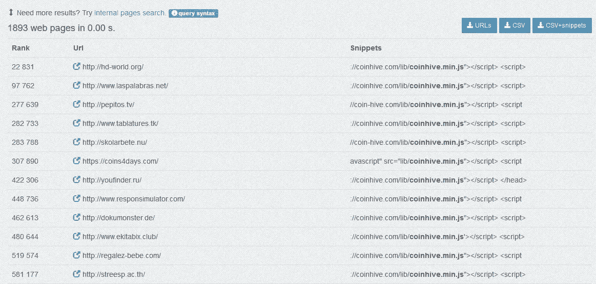

**CoinHive Presence: PublicWWW**

进一步分析发现 **Mikrotik HttpProxy** 使用的 Coinhive 脚本**数量最多，共 12K 个网站**。

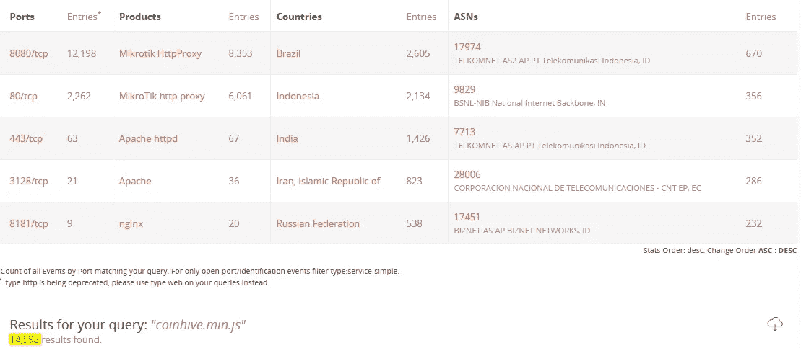

**14K Websites still runs CoinHive without knowing the project had been shelved**

## **正在运行的挖掘脚本**

> 1.由于 CoinHive 脚本很容易被任何人通过**代码检查**或外部代码搜索跟踪，它成为恶意用户在用户不知情的情况下感染用户的路障。
> 
> 2.支持挖掘的脚本在其代码中有常见的术语，如“ **throttle** ”、“ **start miner** ”、“ **var miner** ”，这些术语很容易被发现。
> 
> 3.威胁参与者开始转向提供代码混淆支持的挖掘脚本来隐藏挖掘活动。
> 
> 4.攻击者还利用“ **throttle** ”命令来限制受害者的 CPU 使用率，使其不被检测到(因为 100%的 CPU 使用率会在冻结后通知用户)。

以下是一些流行的挖掘脚本

```
cryptoloot.pro/lib/crlt.js
cryptoloot.pro/lib/crlt.js
statdynamic.com/lib/crypta.js
minero.cc/lib/minero.min.js
webminepool.com/lib/base.js
CryptoLoot.Anonymous
hashing.win/46B8.js
load.jsecoin.com
*/perfekt/perfekt.js
*/tkefrep/tkefrep.js
enaure.co/javas.js
lasimakiz.xyzz/sadig6.js
uvuvwe.bid/jo/jo/miner_compressed/webmr.js
```

它还包括几个 JS 矿工(网站)，如 **WebDollar、CoinIMP、CryptoLoot、JSECoin、**等。随着时间的推移，挖掘脚本失去了它的魅力(除了少数)，变得容易被各种具有深度检查的密码劫持检测模型检测到。

现在，让我们来关注活跃在工作环境中的几个声名狼藉的矿工。

## **热门矿工——一瞥**

**XMRIG** :它是针对 Monero 的开源矿工，于 2017 年 5 月发布。这是 XMR 挖掘最稳定的版本，因为它也支持最新的密码挖掘算法 **RandomX** 。这就是为什么今天大多数恶意软件挖掘者将 XMRig 打包在他们的模块中，因为它支持 CPU/GPU 挖掘(不像 CoinHive)。

**CCMiner** :这是一个针对 CUDA 兼容的 NVIDIA GPU 处理器的开源项目，于 2015 年问世。它还与两种 Windows & Linux 架构交叉兼容。由于它是一个支持 ASIC 和 CPU 的多硬币矿工，它取决于用户选择在目标机器上挖掘什么。

**CGMiner** :是一个用于比特币的 FPGA 和 ASIC Miner，用 c 语言编写，是最古老的工具之一(2011 年)，至今仍在采矿业使用。CGMiner 与 Windows、Linux 和 OS X 交叉兼容。这也被威胁者恶意用于向受害者提供键盘记录程序。这同样被用于**鹰眼键盘记录程序**。

**CNRig**:2018 年推出专门针对 Linux 的高性能 CryptoNight CPU 挖矿机。让 CNRig 从其他矿工中脱颖而出的是**自动更新**和**向后兼容**。2018 年，MalwareBytes 发现，针对客户端浏览器的混淆的 CoinHive 快捷链接正在从位于荷兰的地址***【5.45.79.15/monero/cnrig】****提供相同的服务。*

*有各种矿工，如**矿工-C，XMR_Stak，BTT 矿工**用于合法/非法目的。有些人很早就退休了，而有些人则通过改变挖掘算法来保持在挖掘生态系统中的优势地位。*

## ***案例研究:Chminer — 3 合 1 采矿机设置***

*在 Deep Web 上冲浪时，我碰巧看到一个名为 **CHMiner** 的矿工，这在市场上相对较新，因为在 VT 或其他沙盒环境(ATTOW)中没有记录活动散列。*

*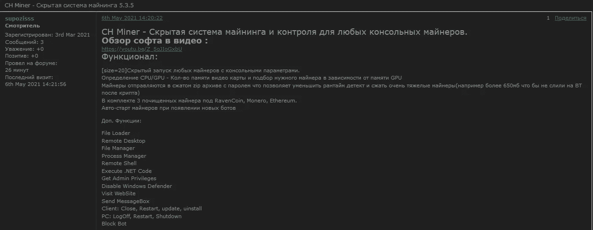*

***CHMiner Advertised on a Russian Forum***

*从帖子中可以明显看出，该演员(使用在俄罗斯网络中无处不在的 handle“**supoziss**”从 2021 年 5 月 6 日开始为该工具做广告。循迹而行，**相同的帖子可以在不同的俄罗斯论坛上找到，时间戳相同**。*

*由于所有的内容都是俄语，很奇怪看到一个**世界语**单词作为他/她的句柄，意思是“**假设**”。快速搜索解决了不确定性。*

*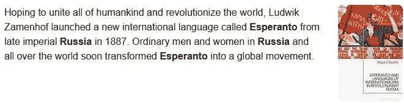*

***Esperanto is an Artificial Auxiliary Language that originated in Russia***

*按照链接，导航到一个俄罗斯托管服务提供商，CHMiner 托管于此:-*

***ispcloud.online/chminer/***

*除了上述位置之外，该文件还在各种文件托管服务上流通，如 **Mega、GoFile、**等。还发现该演员在论坛上正式宣布之前，维持了一个 [YouTube 频道](https://www.youtube.com/channel/UCmO-HhoLAmQEQ_KuGkyySFg/about)(4 月 6 日加入)和一个[电报频道](https://t.me/chminer)，在那里该工具被直接分享(4 月 20 日创建)。*

*让我们深入研究文件内容:-*

*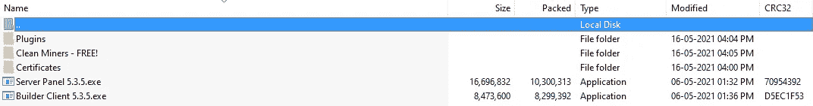*

***File List***

*它由 3 个文件夹和 2 个可执行文件组成，分别是 Builder(用于新机器人)和 Panel(用于远程检查采矿活动)。我们将把注意力转移到名为“干净的矿工——免费的！”的文件夹上*

*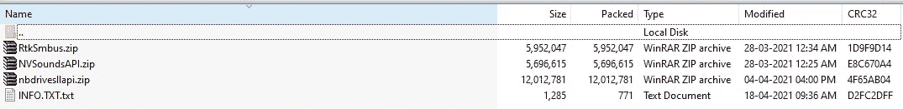*

***File List 2***

*在打开 INFO 文本文件时，发现列出的 3 个档案文件是 3 种不同加密货币的矿工，即:Monero (XMR)、Ether (ETH)和 Raven Coin (RVN)，它们是受密码保护的可执行文件。*

****注*** *:可以看到文件编译的时间戳，可以追溯到 2021 年 3 月，也就是最初打包的时候。**

*令人惊讶的是，该工具还支持渡鸦币(虽然有渡鸦矿工，但不占优势)。*

*让我们来看看关于乌鸦硬币的一些事实:-*

**

***RAVEN | Credits: Ana Rabana (ArtStation)***

> *渡鸦币确实也支持 CPU/GPU 挖矿和**严格对抗 ASIC/FPGA** ，因此其 ASIC 抗。*
> 
> *它使用 **KawPoW** 密码挖掘算法，这是一个工作证明，有利于 CPU 挖掘。*

*在检查矿工文件时，发现所列矿工是使用特定矿池的热门矿工，例如:-*

> ***XMRig**:Monero(pool . hash vault . pro)
> **凤凰矿工**:以太(eth-eu2.nanopool.org:9999)
> **nb Miner**:渡鸦(rvn-eu1.nanopool.org)*

***注**:所列矿工都是合法的，有官方支持，但出于恶意目的使用他们是与创作者没有关系的。在这里，演员已经**重新标记了相同的包装以及面板和配置**，攻击者可以利用受害者 PC 上的隐藏挖掘。此外，参与者使用的**文件名是合法的进程**,可以诱使受害者在不知道后果的情况下运行可执行文件。*

***XMRig Miner** 伪装成“ **RtkSmbus** ”，这是一款英特尔芯片组图形驱动软件。 **Raven Miner** 显示为“ **nbdrivesllapi** ”，而官方名称为 **NB Miner** ，增加一个“ **drive** 关键字可能会给新鲜感的眼睛增加一个信任因子。同样的，**以太矿工**凤凰显示为“ **NVSoundsAPI** ”，这里可以假设演员为了大众而变相的示意 NV 为 **NVidia** 。*

*解开文件后，在沙盒环境中检查相同的文件，并发现以下结果:-*

> *1.所有 3 个文件的大小都超过了 **700MB+** ，压缩为 5MB 存档文件(Actor 使用了 WinRAR 等良好的压缩程序)
> 2。 [XMRig](https://tria.ge/210522-2vqk3qm2cx) 被评为 7/10 潜在恶意
> 3。NBMiner 的时钟是 8/10
> 4。凤凰矿工被评为 1/10*

****注*** *:您可以通过上面列出的超链接查看文件的分流报告，以便更好地理解。**

*现在，为了追踪参与者，我们留下了一些载体，如网站 Whois，可以通过以下方式获得:-*

*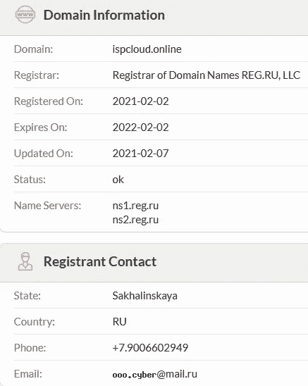*

***WHOIS Record***

*从记录来看，很明显，行为人(嫌疑人)最近购买了域名(因为文件打包是在 2021 年 3 月完成的，时间线相对更容易确定)。*

*州是**萨哈林州**而不是**萨哈林斯喀彻温**，至于在哪里“**斯卡娅**”被用作俄国主要地方的后缀。还有一个因素属于同一国家，即电话号码。*

*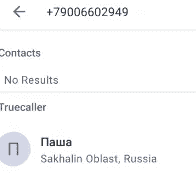*

***TrueCaller Search***

*名字可以翻译成“**帕夏**”，意为“**小**”，是来自**俄罗斯**的常见名字。*

*追踪演员的另一个显著证据是通过在矿工中发现的“ **INFO** ”文本文件。如果你还记得我的文章，我提到了受密码保护的矿工。*

***一般来说，存在使用在线假名作为通过黑暗网络论坛共享的攻击性文件的密码的做法。**在这里，演员使用了“ **password666** ”作为 **NBMiner** 的密码。当我们绘制相同的地图时，会弹出各种配置文件，如 Cracked Forum、Reddit 等。*此处未链接，因为链接演员的置信度较低。**

*让我们暂时结束这篇文章的结尾，因为这篇文章会偏离主题。*

## ***将矿工纳入沉默大鼠***

*随着密码矿工因抗 ASIC 算法而变得流行，它引起了公众的极大关注，包括从 APT 威胁团体到黑暗网络骗子的威胁参与者。此外，由埃隆·马斯克(Elon Musk)等秘密名人创造的积极氛围是采矿业的附加因素。*

*因此，许多攻击性工具开发人员开始将密码挖掘作为默认模块整合到他们的犯罪软件工具包中。*

*地下市场上一些流行的产品是:-*

***王牌鼠***

*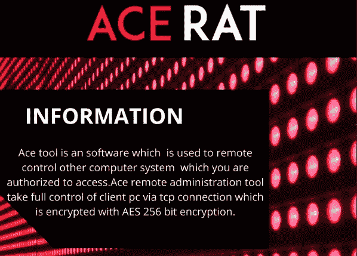*

***Site Offering***

*该 RAT 支持多种功能，如键盘记录、USB 扩展、屏幕捕捉、挖掘比特币、DOGE 和莱特币(BTC、Doge、LTC)。开发者还将即将到来的对 XMR 的支持通知到工具中。*

***MURA1N 鼠***

*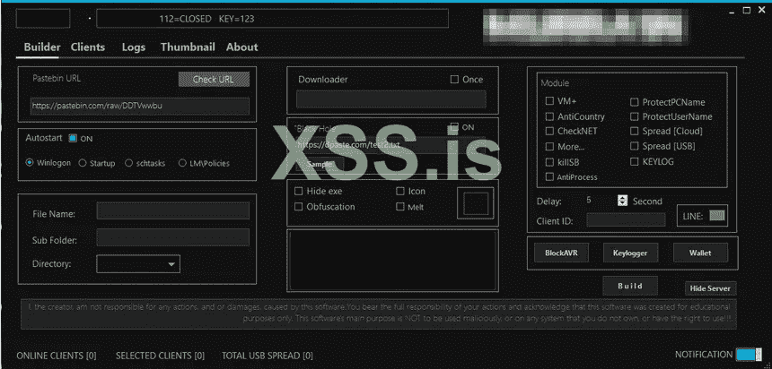*

***Site Offering***

*这只老鼠于 2021 年 4 月开始出现在俄罗斯网络论坛上。它包括各种模块，如反病毒规避，加密窃取，分布式拒绝服务，XMR 矿工，BTC 抓取，键盘记录器，加密钱包支持等。*

***毒素矿工***

*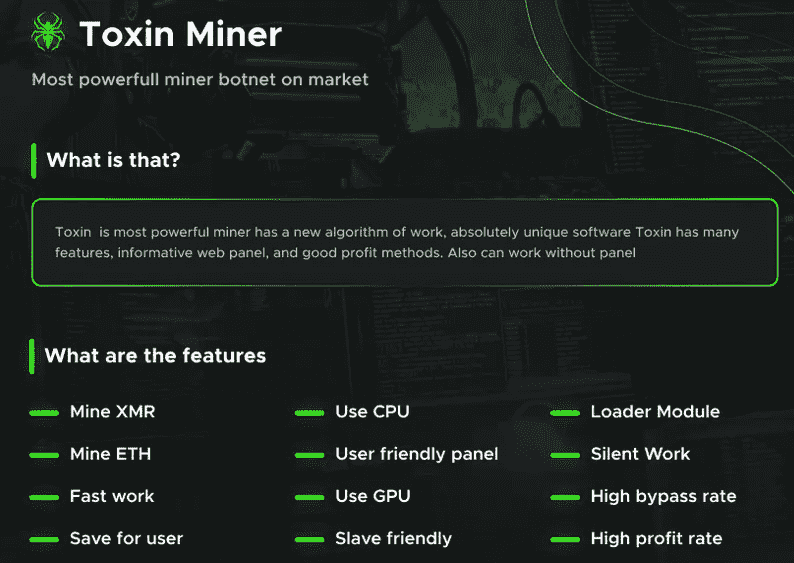*

***Site Offering***

*这是一款 **Monero** 和 **Ether** 的专用矿工，自 2021 年 4 月开始在一个热门论坛上做广告。*

*更多的攻击性应用频繁出现在不同的网络领域。*

****事实*** *:-有专门的裁剪程序专门针对安装在受害者机器上的加密钱包，用攻击者的钱包地址替换它们的钱包地址来劫持它们。**

## ***臭名昭著的秘密采矿战役***

*随着加密货币的兴起。XMR 的 CPU 采矿)，许多隐形战役开始集中在采矿 Monero。他们中的一些人获得了巨额利润(与#机器人成正比)。*

*让我们来看看一些著名的密码挖掘活动:-*

```
***Campaign Name**: Lemon Duck (Python)
**Year**: December 2018
**Target**: Sharepoint, Exchange, IIS, Linux
**Target Nation**: China, Asia
**Infection Method**: Fileless Powershell Commands
**Exploit (if any**): CVE-2017-0144 (SMB Vuln), RDP BruteForce, EternalBlue, BlueKeep, ProxyLogon
**Victim Count**: Unknown**Campaign Name**: VictoryGate 
**Year**: May 2019
**Target**: Windows
**Target Nation**: Peru, LATAM
**Infection Method**: AutoIT Scripts, DLL Injection, USB Spread
**Exploit (if any)**: No
**Victim Count**: 35K+**Campaign Name**: Smominru (Hexmen, Mykings)
**Year**: May 2017
**Target**: Windows, MS SQL, Telnet 
**Target Nation**: Russia, India, Brazil, Taiwan, US (Global)
**Infection Method**: RAT
**Exploit (if any)**: EternalBlue, RDP Brute Force
**Victim Count**: 526,000+**Campaign Name**: Beapy (C)
**Year**: January 2019
**Target**: Windows, Apache Struts, Tomcat, Oracle WebLogic 
**Target Nation**: Asia 
**Infection Method**: Phishing (Excel)
**Exploit (if any)**: CVE-2017-5638, CVE-2017-12615, CVE-2017-10271, DOUBLEPULSAR, ETERNALBLUE, Powershell Command Invoke
**Victim Count**: Unknown**Campaign Name**: Lucifer
**Year**: May 2020
**Target**: MS SQL, Windows, Linux, Rejetto HTTP File Server, Jenkins, Oracle Weblogic, Drupal, Apache Struts, Laravel
**Target Nation**: Global  
**Infection Method**: DDoS
**Exploit (if any)**: CVE-2019-9081, ETERNALBLUE, ETERNALROMANCE, DOUBLEPULSAR, BruteForce
**Victim Count**: Unknown**Campaign Name**: PGMiner
**Year**: December 2020
**Target**: PostgreSQL
**Target Nation**: Global  
**Infection Method**: Fileless Execution, RCE
**Exploit (if any**): CVE-2019-9193
**Victim Count**: Unknown*
```

*有许多僵尸网络挖掘者没有被包括在内，而那些仍未被发现的人从僵尸军队中获取最大利润。*

*如果你仔细观察，由于高成功率，最近一段时间有一大批威胁行动者团体转向加密劫持。一些值得注意的团体是:-*

> *1.TeamTNT
> 2。8220 帮
> 3。不法之徒
> 4。铋(Susp。越南)
> 5。洛克(中国)
> 6。柏查集团(中国)
> 7。Tor2Mine*

*在接下来的几天里，随着更多的小说团体加入这一行列，这个数字将会激增。*

***据 BE Search 称，XMR Miner 在以下领域被广泛使用***

***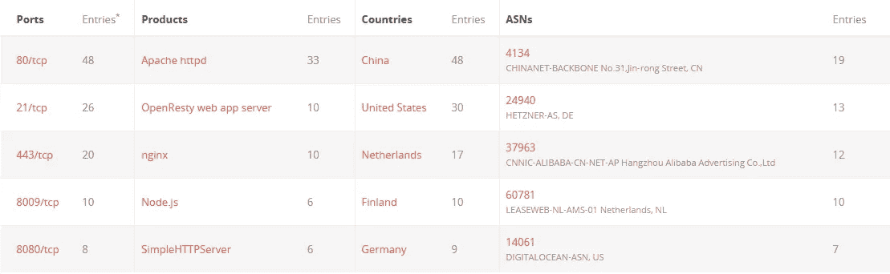***

*****XMR Mining Setups*****

*****注**:很明显**中国**在 XMR Miner(因为大部分矿池位于中国)和比特币挖矿(acc。到[剑桥大学分析](https://cbeci.org/mining_map))。可以假设，美国、荷兰、芬兰和德国可能是无声采矿者的一部分(未经同意/用户知情)，尽管在选定的国家中只有少数采矿池，因为加密采矿主要集中在亚洲。***

## *****一些地下黑幕*****

1.  ***根据攻击性用户的说法，使用 Miner 的 ExploitKit 会更有利可图(连锁反应从剥削开始)***
2.  ***老鼠不建议与矿工，因为它几乎没有利润***
3.  ***合法流程正被用于密码挖掘，如 **svchst*****
4.  ***端口 14433 和 14444 通常用于采矿***
5.  ***Monero 僵尸网络使用的主要池有 **Nanopool** 和 **MineXMR*****
6.  ***Crypter 和 Miner 一起用于 FUD (AV 闪避)***
7.  ***来自中国的 Nanopool 鼓励任何采矿(合法和非法)***
8.  ***Actor 向 miner 添加互斥体并压缩文件以避免 AV 泄漏***
9.  ***supportxmr.com 禁止僵尸网络活动(超过 100 个)***
10.  ***与其他池不同，加入 Nanopool 不需要密码(默认情况下)***
11.  ***演员使用。NET 混淆器，以减少签名检测***
12.  ***默认情况下，大多数 RAT 程序都将 XMRig 打包:
    **xmr-eu1.nanopool.org:14444
    pool.minexmr.com:5555*****
13.  ***如果计算机有 Nvidia 或 AMD 卡和 CPU，miner 会自动使用 GPU***
14.  ***SCADA 等生产中使用的无声矿工被公之于众的案例***
15.  ***来自中国的 C3pool 也大多用于恶意目的，因为它没有被禁止***

*****骗局评估*****

1.  ***找挖掘算法，如果不适合 CPU/GPU，那么很可能是骗局***
2.  ***不要接受任何不可信的电子邮件附件***
3.  ***始终修补关键漏洞(如果您是 IT 管理员)***
4.  ***有合法的云矿工，但不要相信新手平台。有一些情况下，用户的资金被锁定，网站经历了退出骗局***
5.  ***不要相信名人对特定加密货币的认可。总是做你的研究。***

***今天，大多数的密码矿工经常被一些反病毒软件厂商标记为可疑/恶意的，尽管这是合法的。**因此，我们需要分析行为指标(IOB)而不是 IOC(因为我们需要知道在任何生产服务器中运行密码挖掘背后的真正议程)。*****

*****注意** : *密码挖掘中还有一些领域，如* ***电话挖掘、池分配、区域优势挖掘、龙头站点挖掘、云挖掘*** *g 等，我们在本文中不讨论。****

*****哈希(CHMiner)*****

```
***37644F03F0862D3F5B73019071C9F1D1B6E4171702F0D646A24C30B7CD9AD8D5 (ZIPPED — CHMINER)
B498F57E0DB74F18600DF9FEB4AC8B283D6A7F16DDE880CD68B9C9D72D6520CE (SERVER PANEL 5.3.5)
F616BB5891B1B369AF7144A3122E1FC095030B6F58A8EB1AB98126FD26FF430A (BUILDER CLIENT 5.3.3)
7D50D59B28E84FD0AAAC052801D31E75C3AD82E920EA122DE527D4D10CE6DDDC (RTKSMBUS.ZIP)
EEF3B83C1EB7FF9C4416A780FD3884ED42B8DE47BFF8D1815765C7DB4400FDCE (RtkSmbus)
FE5337B1F7E9CD9B8FD8D42FA6E820805B0AA06F38D0A6E497DA953815EC2832 (nbdrivesllapi zipped)
51F084C32E4AC5D30BEFC4F56C14315DBCE4671B462046BD68F5299D30D8CC2F (nbdrivesllapi)
29152F713E9807761CAEF57844685463CF8598D5BC3F044C0CDAF04F6EB5EDE7 (NVSoundsAPI Zipped)
F5CD0A6E3ABC218ED5537B192E7DAE074413598C4BA19991B5C50297F8E0CC5F (NVSoundsAPI)***
```

> ***在 Twitter[上关注我，了解有趣的 DarkWeb/InfoSec 简短发现！；-)](https://twitter.com/RakeshKrish12/)***
> 
> ***注意:- *这篇文章纯属个人研究，未经作者同意，不得在任何地方使用/发表。****