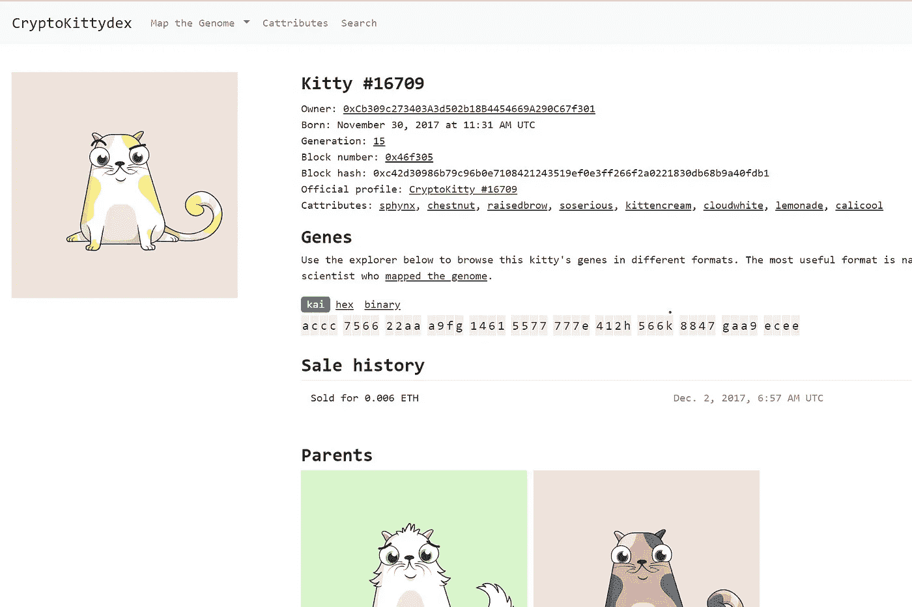

# Cryptokitties 挑战我们的艺术思维模式

> 原文：<https://medium.com/coinmonks/cryptokitties-challenges-our-mental-models-of-art-6db58df87879?source=collection_archive---------4----------------------->

在 20 世纪之前，当电视和互联网还不存在的时候，观看艺术不是一件简单的事情。由于没有脸书或类似的作品，美国艺术家和他们的欧洲前辈通过让他们的作品在艺术学院举办的精英展览和画廊中被接受和展示来获得认可。自 17 世纪以来，这些具有高度排他性成员资格的学院对西欧的艺术教学、展览和品味产生了历史性的影响。因此，他们有能力成就或毁灭艺术家。

Paris Salon in 1890 — imagine if these people could determine what Youtube videos were show-able today. Image from wikipedia.com.

到 20 世纪初，美国艺术家开始质疑这些现有的权力结构，向内寻求开辟自己的道路。纽约独立艺术家协会(Society of Independent Artists)等团体开始挑战传统的法国沙龙式展览，声称他们会接受任何展出的艺术品。正是在这种情况下，1917 年，一位 30 岁的法裔美国艺术家马塞尔·杜尚决定完成当时最史诗般的巨魔工作之一(当然是在推特出现之前)。杜尚以笔名“R. Mutt”提交了一个名为“喷泉”的陶瓷小便池，将在该协会的开幕展上展出。

但即使对当时的先锋派艺术家来说，这也是对传统“艺术”思维模式的一次冲击，传统思维模式认为只有艺术家的直接努力才能赋予作品价值。该协会的董事会成员拒绝在展览中展出它，但随后引发了一场关于什么可以被视为艺术的辩论——在这个案例中，一个大规模制造的小便池贴上了一个假艺术家的签名。

Installation view of Marcel Duchamp’s *Fountain,* 1917\. Photo by James Broad, via Flickr

杜尚和他的朋友们经营的艺术杂志《盲人》1917 年 5 月号有如下的描述:

> 马特先生是否亲手制作了喷泉并不重要。他选择了它。他拿了一篇普通的生活文章，把它放在新的标题和观点下，这样它的有用意义就消失了——为这个对象创造了一种新的思想。

在此之后,“喷泉”挑战了传统的艺术观念，以及为品味和“真正的”艺术概念设定界限的权威人物的角色。这不是第一次发生这样的战斗，因为像克洛德·莫内和印象派运动这样的艺术家面临着他们那个时代的艺术沙龙的严厉批评。然而，杜尚通过展示[【现成的】](https://www.moma.org/learn/moma_learning/themes/dada/marcel-duchamp-and-the-readymade)艺术，日常生活中的物品，让艺术家唤起不同的视角，实现了一些相当独特的东西。他挑衅性地将味觉的力量从它的前身中提取出来，让旁观者来为她或他自己做出决定。艺术可以源于一个独特的概念而不是一个独特的对象的想法是激进的，即使是在今天。

Left: Duchamp’s “In Advance of the Broken Arm” (1964) — can art be concepts over objects? Right: Monet’s “*Impression, soleil levant”* (1872) — can art be visual impressions over realism? Images from wikipedia.com.

最初的“喷泉”被当作垃圾扔掉，但后来杜尚授权复制，这样就有十多个不同的“喷泉”在世界各地的各种着名艺术博物馆展出，包括巴黎的蓬皮杜艺术中心。具有讽刺意味的是，有些作品的估价已经远远超过了 100 万美元，围绕这件作品的对话从未结束。在 2006 年 2 月《乡村之声》的一篇文章中，杰里·萨尔茨[反思道:](https://www.villagevoice.com/2006/02/21/idol-thoughts/)

> 杜尚的工作依赖于信念的飞跃:新的思想结构可以基于世界上已经存在的事物而形成。

这些新的思想结构通过强调空间关系和艺术背景而不是物理对象，影响了当代艺术。当然，今天人们走进现代艺术博物馆并带着“我的孩子能做到”的想法离开并不罕见。但更重要的是，杜尚推动了艺术家在常规之外表达自己的极限，同时允许人们对什么是艺术或不是艺术得出自己的结论。

Tom Marioni’s *The Act of Drinking Beer with Friends is the Highest Form of Art (1970). Empty Pacifico bottles are stacked on a shelf memorializing the artist’s night out with friends, creating an “artifact of existence”. Marioni’s work has evolved into recurring performance art and art space. Image from Hammer Museum.*

# 隐猫的起源

这让我想到了 Cryptokitties.co 的，它在 3 月份宣布了由安德森·霍洛维茨和联合广场风险投资公司牵头的一轮 1200 万美元的融资。Cryptokitties 是一个分布式应用程序或 dApp，运行在一个称为以太坊的开放区块链协议上，以太坊是一个存储和支持底层交易的分布式计算引擎。在 Cryptokitties 网站上，用户和小猫爱好者可以收集、购买、出售和“繁殖”数字小猫，每只小猫都有不同的遗传属性，这些属性由小猫的父母和随机性(使用该网站的算法)决定。DNA 作为代码。

更重要的是，Cryptokitties.co 依赖于基于 ERC-721 标准的令牌化模型。在不太专业的情况下，这意味着每个 cryptokitty 都由一个“不可替代”的数字令牌来表示，或者换句话说，每个数字 kitty 都是独一无二的。此外，由于 cryptokitty 交易发生在以太坊区块链协议上，而不是网站上，任何人都可以查询区块链来证明每只数字小猫的所有权。这些关键的功能使 Cryptokitties.co 成为区块链早期的成功故事之一，获得了大量的用户，并导致自 2017 年 11 月以来超过[2300 万美元](https://kittysales.co/)的小猫销售额，其中一些小猫的销售额超过了【T10 万美元(或> 200 乙醚)。

Each cryptokitty is unique and ownership can be tracked via the blockchain

在此之前，互联网上的任何图像都可以很容易地被复制，无论是通过截图还是 ctrl+c 命令，都无法与原始副本区分开来。通过这种方式，网络上的数字摄影和艺术品在很大程度上被淡化或贬值，特别是在社交媒体(如 Instagram)兴起的情况下，将它们降级为更低、更没有经济价值的艺术形式。尽管伪造问题在有形艺术领域也持续存在，但熟练的伪造需要专业知识(米开朗基罗伪造的艺术)，而检测成本高昂，甚至可能需要技术。

Han Van Meegeren was a prolific Dutch forger of art notable for selling his works for millions of dollars. Image from Life Magazine.

但请注意，伪造的艺术品主要不是因为人眼的视觉差异而令人不快(除非伪造很明显)。事实上，已经有一些著名的伪造艺术品通过了数百万美元的拍卖，而且今天很可能有尚未被确认的伪造艺术品被展示和出售。

艺术品收藏家真正觊觎的是所有权的**——在艺术界被称为 [*出处*](https://en.wikipedia.org/wiki/Provenance) 的品质——这提高了艺术品的金融价值。如果艺术品被可信的第三方确认为真正的独一无二或限量生产，买家会更加看重它，而很少寻求经验验证。**

**区块链的创新之处在于，它能够通过全球分布式计算能力(或矿工)网络支持的共识机制，将出处注入令牌——不需要单独的可信第三方。此外，存储代币所有权、真实性和唯一性的交易数据主要保存在以太坊的分散分类账中，而不是保存在 dApp 中。这种分离也意味着当 Cryptokitties.co 及其开发者关闭时，特定 cryptokitty 的所有权和唯一性仍然可以通过以太坊确认。想象一下，如果像《第二人生》或《魔兽世界》这样的电脑游戏中的数字物品的所有权即使在游戏的服务器关闭和开发者退出时仍然存在。**

****

**In blockchain, value/data is captured at the distributed protocol layer rather than the application layer. In our example, Cryptokitties.co is an application layer while Ethereum is the underlying protocol layer where “provenance” sits. This contrasts with current models like Facebook where user data sits in the centralized application layer. Image from Joel Monegro’s Fat Protocols: [http://www.usv.com/blog/fat-protocols](http://www.usv.com/blog/fat-protocols))**

**各种各样的开发商和公司已经在致力于将区块链应用到实物艺术品上，以追踪所有权、真实性和唯一性。但是对于数字艺术来说，一些更具革命性的东西可能正在发生。区块链协议提供了颠倒杜尚现成概念的能力。杜尚证明了艺术家可以将大量可复制的物品重新定位为独特的艺术，而区块链允许艺术家确保他们的作品是独特的，即使它们是大量可复制的。**

**虽然每个人都同意 cryptokitties 比艺术品更具收藏价值(除非你认为口袋妖怪卡片是艺术品)，但 Cryptokitties.co 是一个开放的区块链生态系统如何扩展艺术等其他数字资产的活生生的案例。例如，许多其他网站已经创建，在以太坊区块链层内利用 cryptokitties . co 的开源代码和出处数据。这包括查看或交换 cryptokitty 的新市场，cryptokitty 基因组指数，甚至允许 crypto kitty 所有者与他们的 kitty 赛跑的简单游戏。**

****

**CryptoKittydex.com allows users to peruse kitty attributes, underlying “genetic” qualities of cats, and their progeny based on data from Cryptokitties.co and Ethereum**

****

**OpenSea.io is a third party site that offers a decentralized marketplace for Cryptokitties including different filtering mechanisms**

****

**Kittyrace.com is a simple racing game that pits cryptokitty owners against each other based on some element of randomness and each cryptokitty’s genetic attributes**

# ****数字艺术的未来****

**Cryptokitties.co 也不是没有问题。其背后的公司 Axiom Zen 将面临可扩展性、对以太坊的依赖(区块链协议的问题可能会影响 Cryptokitties)，甚至围绕[所有权](/@gmcmullen/do-you-really-own-your-cryptokitties-d2731d3491a9)的性质(是代码还是小猫的图像)的问题。**

**与此同时，曾经难以想象的想法将成为可能——可以在互联网上通过艺术家、类型和价格分类追踪的数字艺术；包含来自世界各地不同所有者的艺术作品的数字博物馆，可以被策划或定制；链接到您购买的数字艺术作品的相框；买家直接向艺术家支付报酬。对数字艺术出处的改进将促使更多的艺术家进入这一领域，开辟将出现的新经济和数字艺术形式(例如，结合增强和虚拟现实技术)。一个名为 [Dada.nyc](https://dada.nyc/artgallery) 的网站已经在 2017 年 10 月创建了一个利用以太坊协议的分散市场，使得独特的数字绘画可供出售。**

****

**Dada.nyc allows purchase of digital drawings that are tracked over the Ethereum protocol. This drawing includes information on the scarcity of the work.**

**有些创新不会在一夜之间发生，这需要我们的艺术思维模式发生转变，就像杜尚挑战我们以不同的方式看待事物一样。然而，随着我们(或我们的孩子)对数字艺术概念的发展，新的有趣的想法将会出现。例如，高度珍贵和稀缺的艺术品将处于有史以来最具流动性的状态。当梵高或毕加索的下一个数字版本可以在互联网上轻松买卖时，会发生什么？艺术的价值在这样的环境下是如何转移的？它是否加速了艺术品的商品化？**

**在杜尚成衣诞生 100 周年之际，[《审美》杂志](http://www.aestheticamagazine.com/is-the-readymade-still-revolutionary/)探究了其中的一些概念，并采访了休斯顿当代艺术博物馆馆长迪安·达德科。数字领域中的艺术:**

> **这场讨论的本质是艺术品作为一种货币化物品的角色:它的商品化既令人恐惧又充满阴谋，但正如达德科所言，这是一种交流，艺术品可以非常经济地交流，用简单的方式接触到大量的人。艺术市场只是传播艺术的一种方式，尽管它以资本主义的方式运作，但它仍然服务于它的目的:为更多的大众提供一个传播艺术的渠道**

**也许如果杜尚还活着，他会向 cryptokitties 眨眨眼，点点头。**