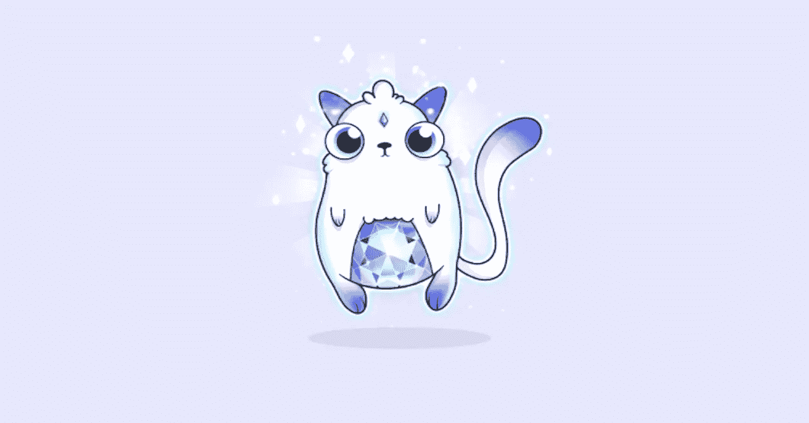

# 隐猫

> 原文：<https://medium.com/coinmonks/cryptokitties-e6989b3778c0?source=collection_archive---------10----------------------->

这些小猫代表了第一个流行的区块链游戏。去年 11 月下旬发布，他们是基于以太坊区块链。该游戏的开发者 Axiom Zen 旨在为他们认为的“加密收藏品”创造一个新的市场，利用区块链上提供的安全性来跟踪货币以外的东西的所有权。

> “我认为人们被这个想法吸引是因为它是互联网。因为互联网爱猫”，说 ***【麦克·弗拉维尔，CryptoKitties 的首席创意官】*** 。“我们说我们有猫，你觉得呢？我们让它变得非常有趣。我们把它做得很可爱。我们让它成为人们分享他们对加密事物的热情的一个很好的方式。”

玩家收集并繁殖虚拟的密码猫。每只猫都有一套独特的“属性”，没有两只猫是完全一样的。小猫的一些特征使它们更适合收集和繁殖。一旦购买，小猫将属于买方，直到他们决定出售它。

这是一个非常受欢迎的简单概念。第一个月，就有超过 18 万只猫被买卖。事实上，数量如此之多，以至于它阻塞了以太坊网络，阻止了其他与 kitty 无关的交易。它的流行似乎源于密码投资者渴望找到测试使用网络进行交易的方法。

玩家用他们的以太，通过一个智能合同，购买一只猫，作为交换，获得一只特定猫的专属所有权。每只小猫都有独特的 256 位基因组和独特的编号。小猫的 DNA 决定了它们的特征，如冷却时间(猫繁殖需要多长时间)、胡须、皮毛颜色、眼睛形状、眼睛颜色和背景颜色。不同的“属性”会影响他们后代的外表和“行为”，因为他们会遗传给后代。这些特征会影响小猫的价值。一些最稀有的“属性”在市场上卖到了最高的价格。

例如，这只 CryptoKitty 最后的售价为 246 以太，在出售时评估为 11.4 万美元左右。CryptoKitty 总共交易了 40，000 多份乙醚，价值约 2，400 万美元。虽然一只猫咪的中值价格要低得多，但 12 只 cryptokitties 已经卖出了超过 10 万美元的价格。游戏的创作者保留每笔交易的 3.75%。

【https://kittysales.herokuapp.com/ 

由于 CryptoKitty 游戏存在于区块链，其他开发者可以自由地在 CryptoKitty 基础游戏之外开发其他游戏。比如一款名为 KittyRace 的 CryptoKitty 赛车游戏。在这个游戏中，每个玩家通过在以太中支付少量入场费来让他们的 CryptoKitty 进入比赛。每只小猫的“属性”都会影响它在比赛中的表现。获胜的小猫得到汇集的以太，减去一小笔交易费，这笔交易费归提供运行游戏的计算资源的以太坊矿工所有。

上个月，宣布 CryptoKitties 获得了风险投资家 1200 万美元的资金，以帮助游戏从其母公司剥离。目前还没有宣布该公司计划如何处理这些投资，但据推测，他们计划扩展到不仅仅是小猫，以建立加密收藏品，并增加加密局外人的可访问性。

资源和更多信息:

 [## CryptoKitties |收集和繁殖数码猫！

### 在世界上第一个区块链游戏中收集和交易密码猫。繁殖你最稀有的猫来创造…

www.cryptokitties.co](https://www.cryptokitties.co/)  [## CryptoKitties 从投资者那里赢得了 1200 万美元，包括早期脸书信徒安德里森…

### Union Square Ventures 和 Andreessen Horowitz 在比特币和加密游戏 CryptoKitties 上投资了 1200 万美元。

fortune.com](http://fortune.com/2018/03/20/cryptokitties-andreessen-horowitz-cryptocurrency-ethereum/)  [## CryptoKitties，解释道...通常

### 旧金山——乔·巴特拉姆(Joe Buttram)是一名前综合格斗家和初创公司保安，他转向了加密货币…

www.nytimes.com](https://www.nytimes.com/2017/12/28/style/cryptokitties-want-a-blockchain-snuggle.html)  [## 密码猫-维基百科

### CryptoKitties 是一款基于区块链的虚拟游戏，由 Axiom Zen 开发，允许玩家购买、收集、繁殖…

en.wikipedia.org](https://en.wikipedia.org/wiki/CryptoKitties)  [## 区块链以太坊上的密码猫正在争夺奖金

### CrypoKitties 游戏在去年 12 月席卷了以太坊世界，急切的玩家买卖着可爱的…

qz.com](https://qz.com/1239486/cryptokitties-are-racing-for-prize-money-on-the-ethereum-blockchain/)  [## CryptoKitties 从 Andreessen Horowitz 和 Union Square Ventures 筹集了 1200 万美元

### CryptoKitties 是一款虚拟的可收藏的小猫游戏，已经获得了 1200 万美元的资金，并且…

techcrunch.com](https://techcrunch.com/2018/03/20/cryptokitties-raises-12m-from-andreessen-horowitz-and-union-square-ventures/)