# 密码朋克:创造历史的 NFT

> 原文：<https://medium.com/coinmonks/cryptopunks-nfts-that-made-history-52e00259152a?source=collection_archive---------2----------------------->

## crypto punk 由幼虫实验室开发，是首批基于以太坊的不可替代令牌之一，初始固定供应 10，000 个独特的 crypto punk。

## crypto 朋克是首批基于以太坊的[不可替代代币](https://en.wikipedia.org/wiki/Non-fungible_token)之一。这些是通过算法生成的独特的 24×24 像素大小的数字艺术作品。只有一万个独特的密码朋克。大多数朋克是人类角色，也就是说，6039 个是男性，3840 个是女性。一些特殊的类别，如僵尸(88)，猿(24)，和外国人(9)也存在。每个朋克都有自己的页面，包含关于其特性、所有者、可用性状态和交易历史的详细信息。

[CryptoPunks](https://www.larvalabs.com/cryptopunks) 于 2017 年 6 月推出，由美国工作室[幼虫实验室](https://larvalabs.com/)开发。该项目由两名加拿大软件开发人员领导，分别是马特·霍尔和约翰·沃特金森。

密码朋克的供应是固定的。密码朋克的数量绝对不能超过 10000。这些小混混原本是免费分发的，很快被[以太坊](https://ethereum.org/en/)钱包用户认领。

每个朋克都不一样。他们都有不同的特点，如肤色、发型、配饰等。使得它们彼此完全不同。其中一些具有极其罕见的属性。一对编号为 7804 和 3100 的外星人是迄今为止最贵的小混混。用户可以通过市场购买这些朋克。你可以查看并出价购买可以出售的朋克。人们可以在他们的本地系统中复制图像文件，但它可以在以太坊区块链上由一个人正式拥有。

**特性**

朋克是根据各种特征分类的。在每个分类中，您还可以在该部分找到以下关于朋克的详细信息:

*   朋克总人数
*   可用朋克的数量
*   平均销售价格
*   最低价格
*   参考示例

**朋克类型**

所有的 10，000 个小混混被分成 5 类:

*   [男(6039)](https://www.larvalabs.com/cryptopunks/search?query=%22Male%22)
*   [女(3840)](https://www.larvalabs.com/cryptopunks/search?query=%22Female%22)
*   [僵尸(88)](https://www.larvalabs.com/cryptopunks/search?query=%22Zombie%22)
*   [猿(24)](https://www.larvalabs.com/cryptopunks/search?query=%22Ape%22)
*   [外星人(9)](https://www.larvalabs.com/cryptopunks/search?query=%22Alien%22)

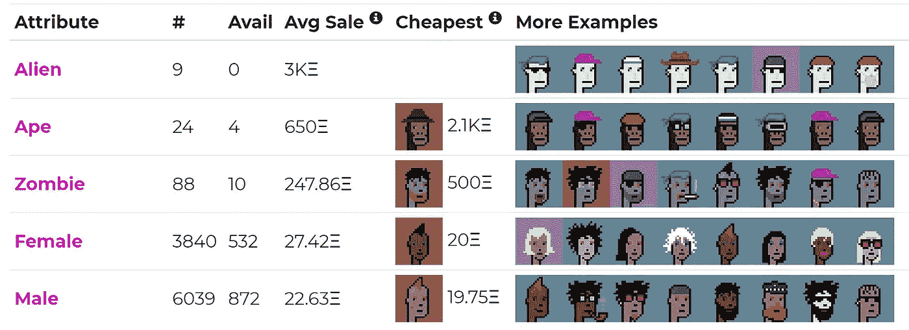

**属性**

朋克也根据属性进行分类。属性在让这些朋克变得独一无二方面起着至关重要的作用。这些不同属性类型的大量排列和组合有助于创建独特的数字项目。

下面的屏幕截图中列出了一些属性示例。

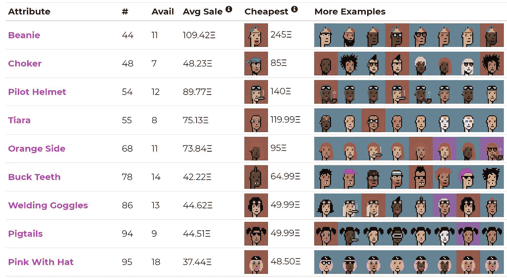

**属性计数**

朋克可以拥有 0 个或多个属性。下面是包含 0 个或更多(最多 7 个)属性的朋克列表。

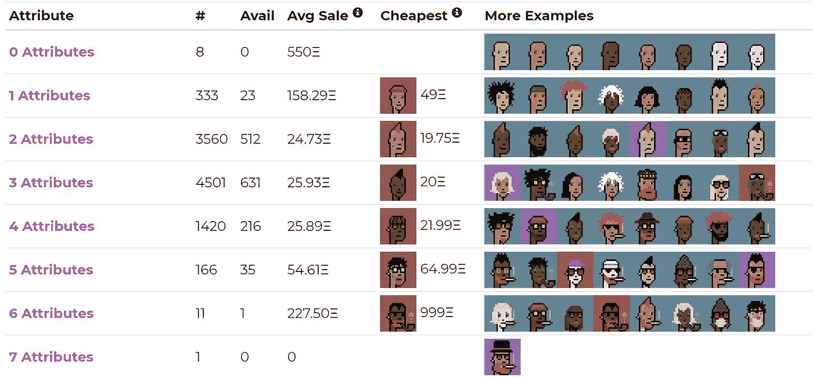

**使用指南**

要探索和购买这些朋克，请访问他们的网站。

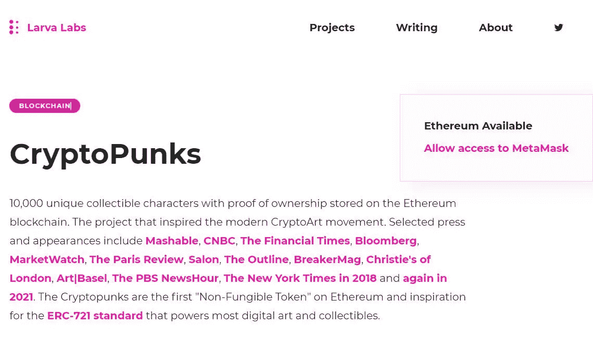

正如我们提到的[crypto punk](https://www.altcoinbuzz.io/cryptocurrency-news/product-release/christies-to-auction-nine-rare-cryptopunks-nfts/)是基于以太坊的 NFT，所以要访问这些 NFT 和平台，用户需要连接他们的以太坊( [MetaMask](https://metamask.io/) )钱包。

连接您的[元掩码](https://www.altcoinbuzz.io/bitcoin-and-crypto-guide/metamask-tips-and-tricks-you-can-use/)钱包。

在主页中，您可以获得最近交易的完整详情，可供出售的朋克，[包装朋克](https://wrappedpunks.com/)(将加密朋克转换为 [ERC721](https://eips.ethereum.org/EIPS/eip-721) )，整体统计等。

如果你打算购买一些朋克，那么滚动 CryptoPunks 主页，搜索选项**出售**。

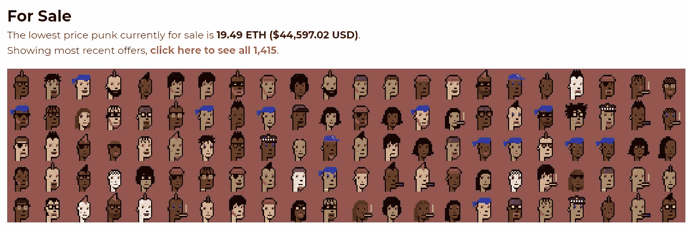

从上面的截图可以看出，目前该平台有 1413 件商品在售。点击超链接查看所有出售商品的详细信息。

一旦你点击它，它会把你重定向到一个页面，在那里你可以选择你想要的商品并下订单。

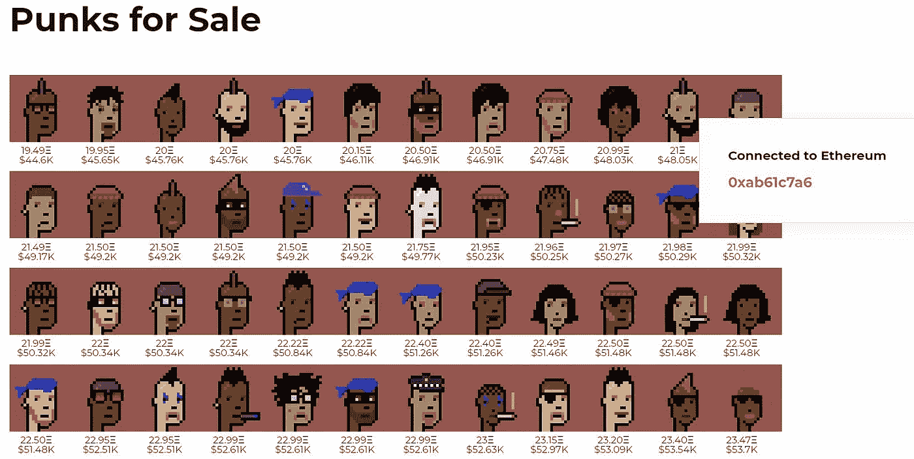

选择你想要的朋克。我们随机选择了[隐朋克#4951](https://www.larvalabs.com/cryptopunks/details/4951) 。

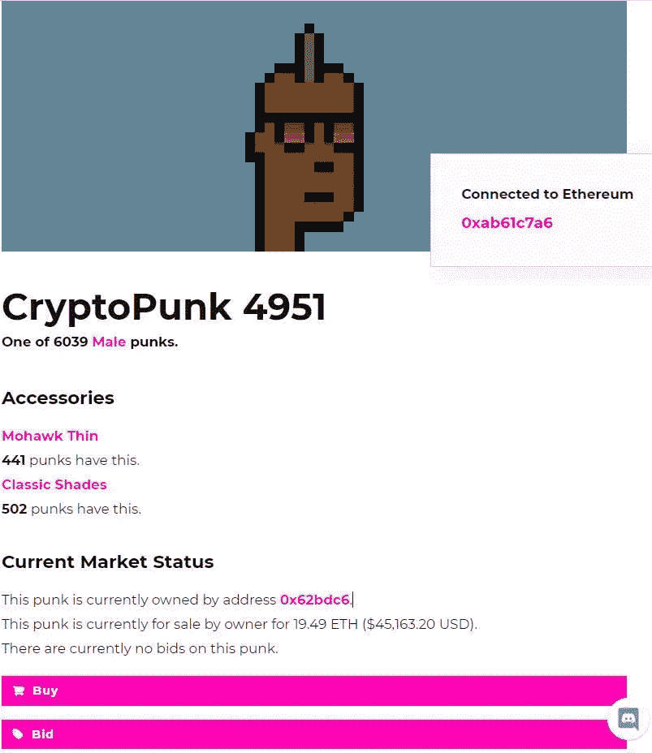

该页面列出了特定 NFT 的特征、其当前所有者及其全部交易历史。

感兴趣的用户可以在这里执行两个活动。如果他们愿意支付所有者设定的报价，他们可以购买 NFT，也可以出价购买。

如果你想出价，你可以点击**出价**按钮并输入你的金额。

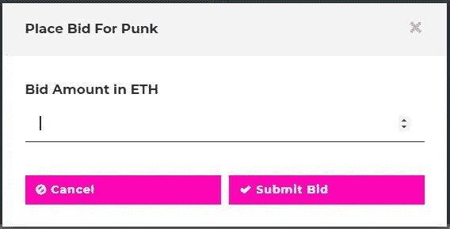

购买朋克，可以直接点击**购买**按钮，然后确认 MetaMask 交易。

小混混的价格很高。你的账户里应该有足够的 ETH 来支付[油费](https://www.altcoinbuzz.io/cryptocurrency-news/blockchain-technology/ethereum-becomes-a-pain-in-the-gas-as-layer-2-demand-surges/)和资产成本，否则钱包会抛出资金不足的错误信息。

**近期销量第一**

你可以查一下这些 NFT 的销量排行榜。它按美元价值的顺序列出了朋克。

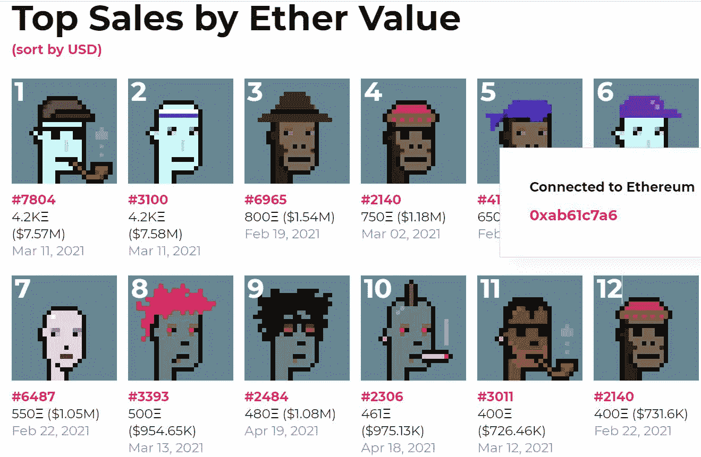

在写这篇文章的时候，一个物品编号为 [#3100](https://www.larvalabs.com/cryptopunks/details/3100) 的密码朋克在 2021 年 3 月 11 日以 4.2K ETH(当时价格为 758 万美元)的价格售出。

2021 年 3 月 11 日，编号为 [#7804](https://www.larvalabs.com/cryptopunks/details/7804) 的物品以 4.2K ETH(当时价格为 757 万美元)的售价位居第二。这两个小混混都属于异类。

**平台统计**

现在让我们来看看该平台的总体统计数据，并找出它是如何主导目前的 NFT 市场的。

你可以查看列出 NFT 市场用户和交易量的 Dapp 网站。

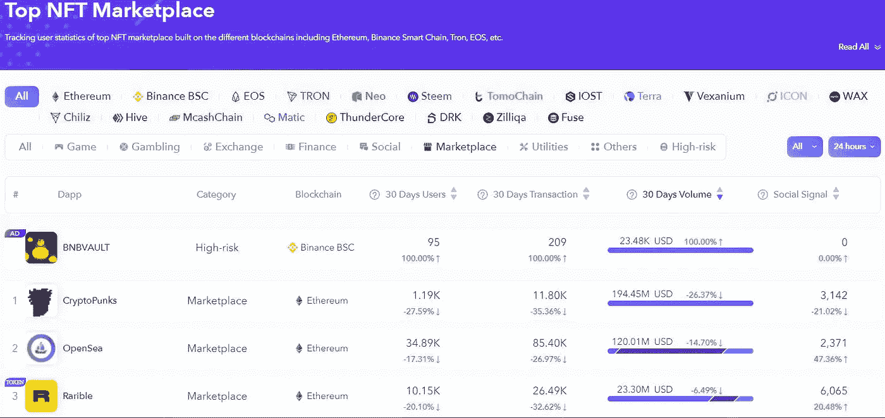

报告显示，CryptoPunks 目前排名第二，月交易额为 1.9445 亿美元。尽管与上个月的交易期相比已经下跌了 26.37%。

如果我们看看以太坊 NFT 市场的规模，CryptoPunks 占据了 69.4%的市场份额，占据了重要地位，其估值为 5417 万美元，目前 NFT 的总交易量为 7802 万美元。

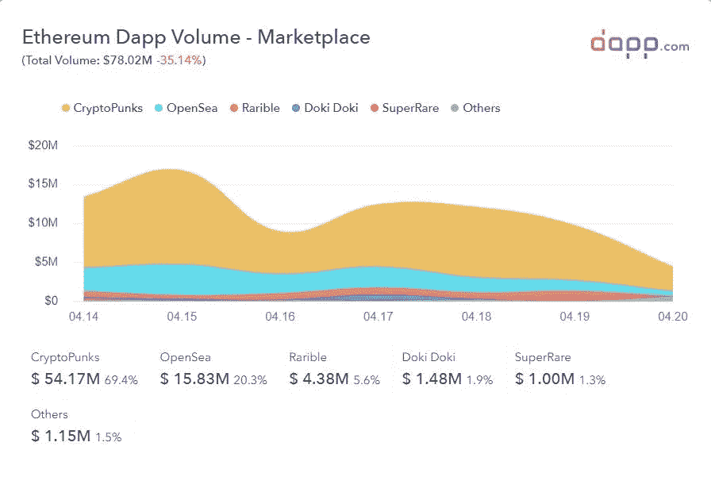

**重要提示:**请注意，这些数据是在撰写本文时获得的。由于 NFT 市场相当不稳定且不断变化，这些数字在以后可能不会保持不变。

**社交场合**

[网站](https://www.larvalabs.com/cryptopunkss)

[推特](https://twitter.com/larvalabs)

[不和](https://discord.com/invite/tQp4pSE)

**结论**

NFT 市场发展非常迅速。我们已经看到用户对 NFTs 的强烈倾向，原因是它为创建者提供了所有权。最近，NFT 的一件名为[:前 5000 天](https://en.wikipedia.org/wiki/Everydays:_the_First_5000_Days)的作品在 2021 年佳士得以 6930 万美元的天价售出，引起了全世界的关注，该作品由一位名为[迈克·温克尔曼](https://en.wikipedia.org/wiki/Mike_Winkelmann)(专业称为 Beeple)的数字艺术家创作。这是 NFT 艺术品的最高价格。然而，没有这样的估价系统可以计算任何 NFT 的价格，因此，NFT 的确切货币价值无法准确预测。这完全取决于买方的意愿，他愿意为一个项目支付多少钱。密码朋克，作为第一个有固定供应和唯一性的同类，在以太坊的非功能性交易历史上占有重要地位。

**资源:** [Dapp 中型博客](/dapp-com/how-to-buy-a-cryptopunks-678f425b98d3)

**阅读更多:** [如何获取。您以太坊地址的 ETH 域](/coinmonks/how-to-get-eth-domain-for-your-ethereum-address-b28013b61efe)

***注:*** *本帖首发* [*这里*](https://www.altcoinbuzz.io/bitcoin-and-crypto-guide/cryptopunks-nfts-that-made-history/) *上*[***altcoinbuzz . io***](http://www.altcoinbuzz.io/)*。*

**通过我的推荐加入**

[Crypto.com](https://binance.com/en/register?ref=E8PCD3AF)——[币安](https://platinum.crypto.com/r/sut3pd9bzn)

**跟我来**

**👉** [推特](https://twitter.com/rumadas123)

**👉**[**Linkedin**](https://www.linkedin.com/in/ruma-das-a1439320/)

> **加入 [Coinmonks Telegram group](https://t.me/joinchat/uiLERCQL1fQ5ZjA1) ，了解加密交易和投资**

## **另外，阅读**

*   **最好的[密码交易机器人](/coinmonks/crypto-trading-bot-c2ffce8acb2a) | [电网交易机器人](https://blog.coincodecap.com/grid-trading)**
*   **[加密复制交易平台](/coinmonks/top-10-crypto-copy-trading-platforms-for-beginners-d0c37c7d698c) | [如何在 WazirX 上购买比特币](/coinmonks/buy-bitcoin-on-wazirx-2d12b7989af1)**
*   **[CoinLoan 点评](/coinmonks/coinloan-review-18128b9badc4)|[Crypto.com 点评](/coinmonks/crypto-com-review-f143dca1f74c) | [火币保证金交易](/coinmonks/huobi-margin-trading-b3b06cdc1519)**
*   **[尤霍德勒 vs 科恩洛 vs 霍德诺特](/coinmonks/youhodler-vs-coinloan-vs-hodlnaut-b1050acde55a) | [Cryptohopper vs 哈斯博特](https://blog.coincodecap.com/cryptohopper-vs-haasbot)**
*   **[杠杆代币](/coinmonks/leveraged-token-3f5257808b22) | [最佳密码交易所](/coinmonks/crypto-exchange-dd2f9d6f3769) | [Paxful 点评](/coinmonks/paxful-review-4daf2354ab70)**
*   **[加密套利](/coinmonks/crypto-arbitrage-guide-how-to-make-money-as-a-beginner-62bfe5c868f6)指南| [如何做空比特币](/coinmonks/how-to-short-bitcoin-568a2d0b4ae5) | [1xBit 回顾](https://blog.coincodecap.com/1xbit-review)**
*   **[如何在印度购买比特币？](/coinmonks/buy-bitcoin-in-india-feb50ddfef94) | [WazirX 评论](/coinmonks/wazirx-review-5c811b074f5b) | [BitMEX 评论](https://blog.coincodecap.com/bitmex-review)**
*   **[印度比特币交易所](/coinmonks/bitcoin-exchange-in-india-7f1fe79715c9) | [比特币储蓄账户](/coinmonks/bitcoin-savings-account-e65b13f92451)**
*   **[币安收费](/coinmonks/binance-fees-8588ec17965) | [Botcrypto 审查](/coinmonks/botcrypto-review-2021-build-your-own-trading-bot-coincodecap-6b8332d736c7) | [Hotbit 审查](/coinmonks/hotbit-review-cd5bec41dafb) | [KuCoin 审查](https://blog.coincodecap.com/kucoin-review)**
*   **[我的加密副本交易经历](/coinmonks/my-experience-with-crypto-copy-trading-d6feb2ce3ac5) | [AAX 交易所评论](/coinmonks/aax-exchange-review-2021-67c5ea09330c)**
*   **[Bybit 融资融券交易](/coinmonks/bybit-margin-trading-e5071676244e) | [币安融资融券交易](/coinmonks/binance-margin-trading-c9eb5e9d2116) | [Overbit 审核](/coinmonks/overbit-review-9446ed4f2188)**
*   **[加密货币储蓄账户](/coinmonks/cryptocurrency-savings-accounts-be3bc0feffbf) | [YoBit 审查](/coinmonks/yobit-review-175464162c62) | [Bitbns 审查](/coinmonks/bitbns-review-38256a07e161)**
*   **[Botsfolio vs nap bots vs Mudrex](/coinmonks/botsfolio-vs-napbots-vs-mudrex-c81344970c02)|[gate . io 交流回顾](/coinmonks/gate-io-exchange-review-61bf87b7078f)**
*   **[最佳比特币保证金交易](/coinmonks/bitcoin-margin-trading-exchange-bcbfcbf7b8e3) | [萝莉点评](/coinmonks/lolli-review-e6ddc7895ad8) | [比特币保证金交易](https://blog.coincodecap.com/bityard-margin-trading)**
*   **[创造并出售你的第一个 NFT](https://blog.coincodecap.com/create-nft) | [本地比特币评论](/coinmonks/localbitcoins-review-6cc001c6ed56)**
*   **[加密保证金交易交易所](/coinmonks/crypto-margin-trading-exchanges-428b1f7ad108) | [赚取比特币](/coinmonks/earn-bitcoin-6e8bd3c592d9) | [Mudrex 投资](https://blog.coincodecap.com/mudrex-invest-review-the-best-way-to-invest-in-crypto)**
*   **[如何在印度购买以太坊？](https://blog.coincodecap.com/buy-ethereum-in-india) | [如何在币安购买比特币](https://blog.coincodecap.com/buy-bitcoin-binance)**
*   **[顶级付费加密货币和区块链课程](https://blog.coincodecap.com/blockchain-courses) | [币安评论](/coinmonks/binance-review-ee10d3bf3b6e)**
*   **[MXC 交易所评论](/coinmonks/mxc-exchange-review-3af0ec1cba8c) | [Pionex vs 币安](https://blog.coincodecap.com/pionex-vs-binance) | [Pionex 套利机器人](https://blog.coincodecap.com/pionex-arbitrage-bot)**
*   **[在美国如何使用 BitMEX？](https://blog.coincodecap.com/use-bitmex-in-usa) | [BitMEX 评论](https://blog.coincodecap.com/bitmex-review)**