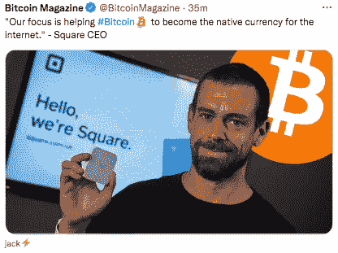

# 密码革命#12

> 原文：<https://medium.com/coinmonks/cryptorevolution-12-a913e3b83eb3?source=collection_archive---------9----------------------->

## 思考很难，这也是大多数人判断的原因。—荣格

亲爱的朋友和订户:

这是德国美丽的一天，树叶变成了美丽的金黄色。这是我最喜欢的季节之一——没有理由抱怨吧？

德国有句谚语:

"曼·坎恩·伊梅尔·克拉根"意思是“一个人总是可以抱怨的——”

现在，我要抱怨佛罗里达州正在进行的克雷曼对赖特案件的死一般的沉默。

**你不想知道中本聪是谁吗？**

你知道吗，比特币社区，*总的来说，*讨厌克雷格·史蒂夫·赖特？

听着——我不在乎你喜不喜欢克雷格·史蒂夫·赖特…

这个视频概述了未来，重要的是方向——我们在这里不谈论里程碑和概念，我们在谈论比特币必须采取的方向。

> 你知道他们已经在区块链上做了千兆字节的交易吗？

是啊，你可能不知道，是吗？

[**观看本视频:**](https://www.youtube.com/watch?v=wGw6rBv7nlc&t=28634s)

**亮点:**

*   [什么是商品？](https://youtu.be/wGw6rBv7nlc?t=28049)
*   [**比特币应该发展成什么样**](https://youtu.be/wGw6rBv7nlc?t=28634)
*   [比特币账本是不可变的吗？](https://youtu.be/wGw6rBv7nlc?t=28674)
*   *“对于所有认为比特币不能被查封的人来说，基本上是‘游戏结束’……{！}*
*   [股权证明(PoS)始终是一种“担保”](https://youtu.be/wGw6rBv7nlc?t=29081)
*   乔治·吉尔德
*   [比特币就是这个金钱丑闻的解决方案！](https://youtu.be/wGw6rBv7nlc?t=31042)

# 金钱就是时间就是信息:

重点是:我希望你为即将到来的事情做好准备，

..我认为这就是即将到来的事情，(顺便说一下，这就是这篇时事通讯的重点)

因为…

> *如果，只是如果，这个克雷格·赖特纨绔子弟* [*竟然是中本聪？*](https://twitter.com/cryptorebel_SV/status/1458469448252370948?s=20)

**向前移动……**

杰克·多西[“全押”比特币:](https://twitter.com/BitcoinMagazine/status/1458050490432958468?s=20)

你知道杰克·多西是一只奇怪的野兽…

他表现得像一个禅宗大师，好像他完全支持为没有银行账户的人提供银行服务，**帮助人们，**让比特币成为互联网货币…

但是他转过身来，**禁止人们使用 [cash 应用程序和 Twitter，嗯，听听这里。](https://podcasts.google.com/feed/aHR0cHM6Ly93d3cud2hhdGJpdGNvaW5kaWQuY29tL3BvZGNhc3Q_Zm9ybWF0PVJTUw/episode/NTk2NDFhMjhmZjdjNTA5OWMxMmE1ZWRhOjVhMTgzMGQyZjk2MTlhZmE2YWYzOGYxODo2MThiZjM5MzczMGEwYzVhM2IzMDM5YmM?sa=X&ved=0CAgQuIEEahcKEwjgu-T7lZP0AhUAAAAAHQAAAAAQLA)**

# 跟上潮流！

许多政客都加入了比特币的行列——然而，看起来他们只是把它当作一个流行语:

看看迈阿密的市长:他们不再使用比特币，而是开始使用他们自己的“城市币”,人们可以在其中“投资”,收益归城市所有…

所以，就像在 ICO 中一样，他们用它来筹集资金。

怎么了？！

# 我已经看到了社交媒体的未来

您知道吗，中国大多数社交媒体平台都没有广告。

是的，没错，他们没有广告！

他们很久以前就想出了微支付模式:

**用户居然付费才能上平台！**

现在让我们暂时忘记我们正在谈论中国的社交平台，忘记他们正在利用这些平台来对付他们自己的公民；关键是中国人想出了**“无广告模式”**，答案是**微支付。**

微支付是社交媒体的未来。

**进入 Bitclout.com。**

Bitclout 很像没有广告的 Twitter，但不仅仅是 Twitter，它要多得多…

你看很久以前，硅谷和魔鬼做了一笔**交易。**

他们不知道如何利用他们的平台赚钱。

于是魔鬼来了，说:“那么广告呢？而你要做的就是把你的用户数据给我！"

好吧，马克·舒格山(德语:扎克伯格)和其他白痴说:

> “当然啦！你可以拥有我的用户数据！所有人！—毕竟他们签了 ToS，同意他们的数据就是我的数据。”

因此，非常非常奇怪和讽刺的是，在所有国家中，中国会想出微支付的解决方案。

但是 Bitclout 不仅仅是区块链上的 Twitter

当你加入 Bitclout **时，你会得到你自己的硬币！**

你甚至可以在 Bitclout 上铸造 NFT！

事实上，这是最容易制造 NFT 的平台！

我还没有铸造过 NFT，[但是在这里查看我的简介:](https://bitclout.com/posts/a953abb11f8032bbe8c4404ed732aacc2187da1bc84e07d8bbe366ed2d726bde?feedTab=Global&tab=posts)

如果你想[买一枚埃里克森硬币](https://bitclout.com/posts/a953abb11f8032bbe8c4404ed732aacc2187da1bc84e07d8bbe366ed2d726bde?feedTab=Global&tab=posts)——非常感谢，我非常感激！

(趁现在还便宜，赶紧买吧！)

钻石:当你真的喜欢某人的帖子时，你可以给他们钻石，这不是很酷吗？

你注意到什么了吗？

**没有广告！**

# 价格行为

**为什么我们仍然“早”——拉乌尔·保罗**

[**最大痛苦理论**](https://youtu.be/tUvb-yUK5Os)

关于以太坊:“我的猜测是，我们可能会遭遇抛售，然后再次撕裂，因为这是最痛苦的路径。”

“……数字资产网络正在增长，用户数量以每年 113 人的速度增长，是互联网速度的两倍**这是人类有史以来最快的技术采用速度**没错，所以你一定是个傻瓜才会赔钱……

“…因此，承担风险，承担你能够承担的风险， ***不要利用它，*** 让它运行，你会在运行中发现它。”

# 本周最佳帖子

如何看待[大重置？](https://twitter.com/LucJohner/status/1457775766251335686?s=20)

# 最佳教程

普雷斯顿·皮什(Preston Pysh)写的一张很棒的单页纸，非常适合初学者！

创建你自己的区块链——太酷了！

这比你想象的要容易，[按照这个非常酷又简单的教程来做就行了。](https://coingeek.com/create-your-own-pocket-sized-blockchain-in-javascript/)

# 查尔斯·霍金森说[亚当回来了是中本聪:](https://www.youtube.com/watch?v=lFw-3wynj-o&feature=youtu.be)

*   Adam Back 创建了 HashCash
*   他认识哈尔·芬尼
*   [笔法“证明”了它](https://www.usenix.org/system/files/conference/usenixsecurity15/sec15-paper-caliskan-islam.pdf)

—

我的朋友们，这就是本周的全部内容，

祝你周末愉快，

再见了

Bitclout！

[孙耀威](https://bitclout.com/u/EricZ?feedTab=Global&tab=posts)

附言

在推特或 [Bitclout 上关注我，我会关注你:-)](https://bitclout.com/u/EricZ?feedTab=Global&tab=posts)

**P.P.S .你声称你的免费副本** [**死简单比特币追踪器了吗？**](https://kingcrypto.substack.com/p/cryptorevolution-7)

> 加入 Coinmonks [电报频道](https://t.me/coincodecap)和 [Youtube 频道](https://www.youtube.com/c/coinmonks/videos)了解加密交易和投资

## 也阅读

 [## 最佳加密交易所| 2021 年十大加密货币交易所

### 编辑描述

blog.coincodecap.com](https://blog.coincodecap.com/crypto-exchange)  [## 2021 年 10 大最佳加密贷款平台| CoinCodeCap

### 编辑描述

blog.coincodecap.com](https://blog.coincodecap.com/crypto-lending)  [## 2021 年最佳免费加密交易机器人

### 2021 年币安、比特币基地、库币和其他密码交易所的最佳密码交易机器人。四进制，位间隙…

medium.com](/coinmonks/crypto-trading-bot-c2ffce8acb2a)  [## 最佳 4 个加密交易信号电报通道

### 这是乏味的找到正确的加密交易信号提供商。因此，在本文中，我们将讨论最好的…

medium.com](/coinmonks/best-crypto-signals-telegram-5785cdbc4b2b)  [## BlockFi 评论 2021:利弊和利率| CoinCodeCap

### 编辑描述

blog.coincodecap.com](https://blog.coincodecap.com/blockfi-review)  [## 如何在印度购买比特币？2021 年购买比特币的 7 款最佳应用[手机版]

### 如何使用移动应用程序购买比特币印度

medium.com](/coinmonks/buy-bitcoin-in-india-feb50ddfef94)  [## 加密税务软件——五大最佳比特币税务计算器[2021]

### 不管你是刚接触加密还是已经在这个领域呆了一段时间，你都需要交税。

medium.com](/coinmonks/best-crypto-tax-tool-for-my-money-72d4b430816b)  [## 存储比特币的最佳加密硬件钱包[2021] | CoinCodeCap

### 编辑描述

blog.coincodecap.com](https://blog.coincodecap.com/best-hardware-wallet-bitcoin)  [## Pionex 评论 2021 |免费加密交易机器人和交换

### Pionex 是为交易自动化提供工具的后起之秀。Pionex 上提供了 9 个加密交易机器人…

medium.com](/coinmonks/pionex-review-exchange-with-crypto-trading-bot-1e459d0191ea)