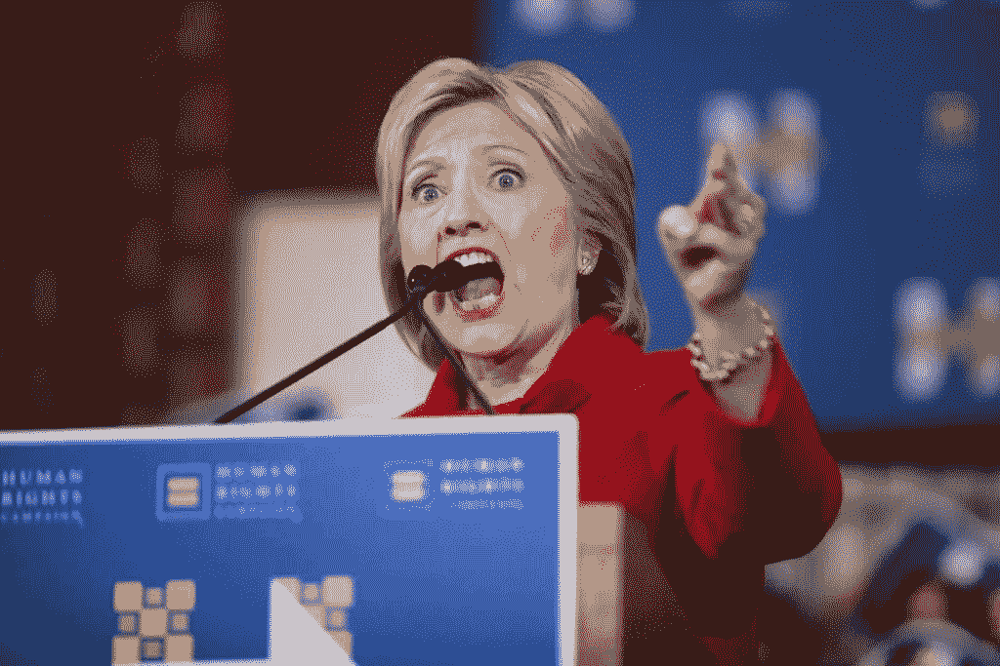
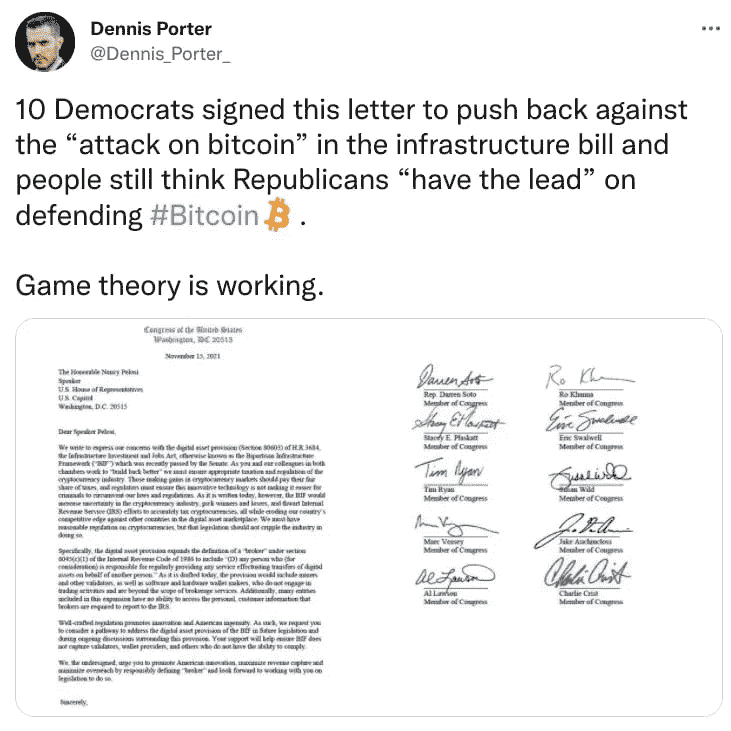
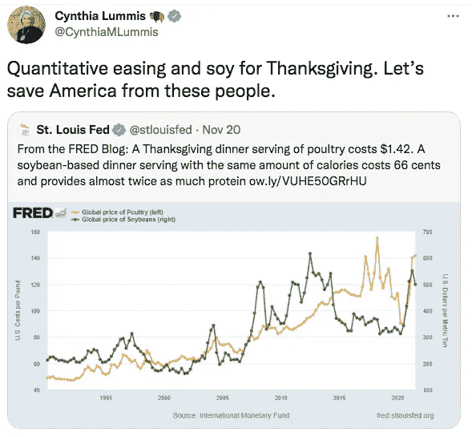
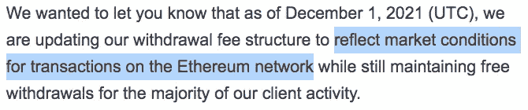
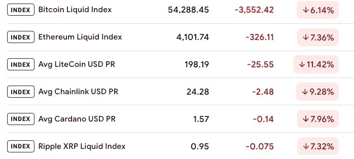
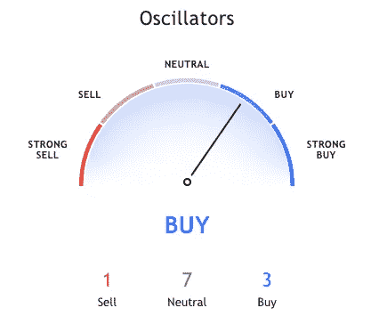
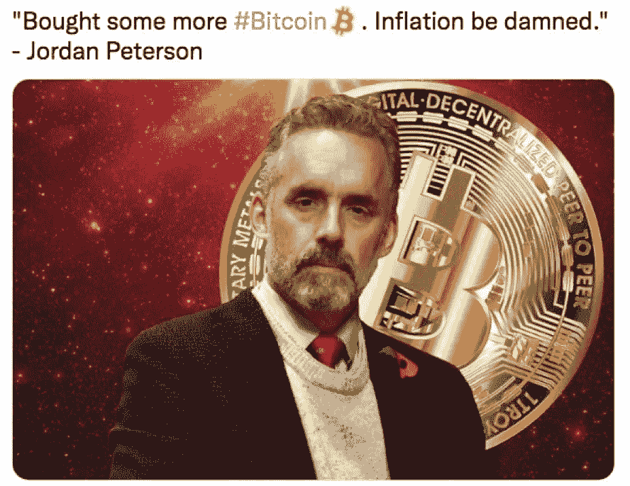

# 密码革命#14

> 原文：<https://medium.com/coinmonks/cryptorevolution-14-150216a5015c?source=collection_archive---------10----------------------->

## 能源不是零和游戏

没有悲观主义者发现过星星的秘密，或者航行到一个未知的地方，或者为人类精神打开一扇新的大门。—海伦·凯勒

亲爱的朋友和订户:

我希望你有一个美好的感恩节:-)

你知道建造金门大桥在 T2 是不可能的吗？

至少他们是这样告诉想要建造它的工程师和建筑师的。

**但是他们没有考虑到约瑟夫·史特劳斯——梦想家建筑师。**

他梦想建造一座比金门大桥长两倍的大桥，他还为此制定了计划。

当有人投标建造一座从旧金山到马林的桥梁时，他欣然接受，并说:

> "我可以用 1700 万美元建造那座桥！"

后来，加利福尼亚州筹集了 3100 万美元。

约瑟夫·施特劳斯不仅按时建成了那座桥，而且还在预算之内。

约瑟夫·施特劳斯这样的人后来怎么样了？

**自 2009 年以来一直在进行的一个项目叫做比特币:-)**

现在它越来越有吸引力，巨大的吸引力——希拉里·克林顿就是不能闭嘴。

在孤注一掷地寻求相关性的过程中，这位女王死灵法师正在国有媒体频道巡回演出，并“提供”她的观点。

> [“比特币可能‘破坏货币’和国家稳定！什么！”](https://bitcoinmagazine.com/culture/hillary-clinton-fears-bitcoin-will-undermine-dollar-as-world-reserve-currency)

但是，就像一部优秀的《星球大战》电影一样——好人总是有的。

另一位卢克·天行者，现在是我最喜欢的参议员，辛西娅·卢米斯，[本周发布了最史诗般的推文:](https://twitter.com/CynthiaMLummis/status/1462485320637812743?s=20)

**埃隆·马斯克是白痴还是天才，或者两者兼而有之？**

你知道，就在我想喜欢埃隆·马斯克的时候，他去做了一些蠢事。

埃隆·马斯克称币安的狗粮问题为“黑幕”。他表示，他是代表其他 Dogecoin 持有者提出这个问题的。

哦，多么贤惠的伊隆。

你知道，如果不是几个月前他的比特币“泵和转储”，我会称赞他，当时他在 Twitter 上泵比特币，然后突然之间，他不再接受比特币作为特斯拉斯的支付方式，因为“比特币浪费电力”，真是个混蛋！

这是怎么回事？

这叫做“定步调和引导”

[其实是劝导 101:](https://www.befreud.com/2017/07/learn-5-most-effective-persuasion.html)

1.说服某人的第一步是“控制”他们:你向他们表明你是站在他们一边的。在你获得他们的信任后，你就可以。)重定向它们:

> 埃隆·马斯克发推文#1:“我们现在接受比特币支付特斯拉汽车。”
> 
> *追随者:“耶！他是我们这边的！看到他有多酷了吗？！跟我一样！”*
> 
> *埃隆马斯克推特#2:* [*“特斯拉已经暂停使用比特币购买车辆。”*](https://twitter.com/elonmusk/status/1392602041025843203?ref_src=twsrc%5Etfw%7Ctwcamp%5Etweetembed%7Ctwterm%5E1392602041025843203%7Ctwgr%5E%7Ctwcon%5Es1_c10&ref_url=https%3A%2F%2Fwww.bbc.com%2Fnews%2Fbusiness-57096305)
> 
> *追随者:“嗯？”*

这不是巧合，这只是说服 101，像斯科特·亚当斯这样的专业说服者一点也不惊讶。

所以，是的，埃隆·马斯克操纵了**(即被泼妇掌掴)**他的追随者，因为他认为比特币浪费电。

膝盖痉挛的情绪反应怎么样？埃隆是一个真正的马克思主义者！

**因为能源不是零和游戏。**

你知道实际上有一种叫做废能的东西吗？你知道中国能源过剩吗？

而且你知道很多比特币挖矿都是用多余的电完成的吗？

当谈到这个荒谬的马克思主义环境论点时，所有这些都被忽略了。

我们应该断然拒绝所有这些荒谬的马克思主义论点

—因为都归结为马克思主义！

> *是的，马克思主义。*
> 
> 马克思主义假定零和游戏。

那就是:能量是有限的，**和*你配不上那股能量。***

你看到这是怎么回事了吗？

“比特币浪费能量”和说比特币不配拥有能量是一回事。

还有什么浪费能源的？

商场里那些 24 小时运行的自动扶梯怎么样？世界上所有的水上公园怎么样，每分钟泵出数百万加仑的水*，*为了什么？成千上万的游戏玩家在电子游戏上“浪费”电能，这是为了什么？

你看到这里发生了什么吗？这是马克思主义的论点！让一个人和另一个人竞争——阶级斗争！

这是马克思主义的基石，这就是为什么我们应该断然拒绝所有这些关于碳足迹和“比特币浪费电力”的荒谬论点。

如果你想让我解释这一点，只要回答一个响亮的“是”就行了，我会的。 ( [留个评论](https://kingcrypto.substack.com/p/cryptorevolution-14/comments))

但是我尽量把每篇简讯控制在 2000 字以内，所以我现在就把它留在这里:

*一个深情的* *消息给埃隆马斯克:* [*这就是我对你的硅谷的看法——马克思主义:*](https://geni.us/lifeaftergoogle)

# 更多比特币新闻

**萨尔瓦多宣布建立比特币城市——没有税收！**

萨尔瓦多总统 Nayib Bukele 宣布了他的“比特币城市”计划。一个没有收入，资本收益，工资或财产税的加密卫城！他提议唯一的税是 10%的销售税！

**听起来像天堂？在这里阅读更多:**

利:https://coingape.com/el-salvador-announces-bitcoin-city

魂斗罗:[https://coingeek.com/el-salvador-Bitcoin-city](https://coingeek.com/el-salvador-bitcoin-city-treat-it-like-a-capital-crime/)

# 以太坊有什么问题？

**TLDR:交易成本高**

> 以太坊交易的平均成本是 70 到 100 美元！

这对任何区块链来说都太过分了。

如果我想给你寄 5 美元，那就要 70 美元？！

谁会用这样的区块链呢？

平心而论，每个区块链都存在这个问题。

跳泳池的人太多会怎么样？

现在以太坊的开发者们试图通过**改变为股权证明来解决这个问题。**但是，好像不管用，兑换费还在涨啊涨。

以太坊开发者“做点什么”的时间越来越少了。

BlockFi 这样的大平台被迫改变收费结构:

**因此，随着天然气费用的上涨，ETH 面临着巨大的** [**结垢问题……**](https://news.bitcoin.com/ethereum-vs-avax-social-media-battles-rage-as-l1-fees-keep-rising/)

> “以太坊文化深受创始人困境之苦。每个人都已经太富有了，以至于不记得他们最初打算做什么。”—朱苏
> 
> “以太坊是否是一种安全手段已经不重要了，因为无论如何，只有那些有能力使用它的人才被认可。”——瑞安·塞尔基斯

然而，用户的“非技术”世界似乎并不在乎。

OpenSeas 是世界上最大的 NFT 市场，使用以太坊区块链…哦，等等…

当区块链的汽油费上涨时，公海平台的造币费也会上涨。

**问题:**

> *为什么铸造一个 NFT 要花费*任何东西*？*

**其他平台根本没有任何费用(或者是 OpenSeas 费用的零头)。**

当 NFT 出售的时候，海洋石油公司从中提成…所以…

是什么阻止用户转向更便宜更好的平台？

还有其他技术更好、更便宜、更容易制造的平台，但鲜为人知:

*   [Bitclout.com](https://bitclout.com/)
*   [Twetch.app](https://twetch.app/)
*   [RelayX.com](https://relayx.com/)

# NFTs

**这是一件大事——法院能阻止代币吗？**

TLDR；是的。

有人想到要制作一个**“JRR 令牌”**……他们使用了《霍比特人》和 JRR·托尔金的所有商标。

结果是——有人不高兴了！

仅仅因为一个作者死于 77 年前，并不意味着你可以对他的“东西”为所欲为。

JRR 的遗产公司迅速向法院提出侵犯版权的诉讼——事实证明，他们确实关心他的知识产权。

[***“JRR Token 的推特账号和 YouTube 频道和网站已经被删除。”***](https://cointelegraph.com/news/you-shall-not-pass-tolkien-estate-blocks-the-lord-of-the-rings-jrr-token) ***轰！游戏结束！***

# 机构收养

澳大利亚醒了吗？

在一系列美国政客纷纷加入比特币热潮后，澳大利亚参议员简·休姆也加入进来:

> “这是一种赢得人心的资产类别，但除此之外，不管你个人怎么想，这是一种不会很快消失的技术。”

# 价格行为

**点击这里查看凯茜·伍德的** [**对当前比特币价格的看法。**](https://twitter.com/APompliano/status/1463505718993108996?s=20)

有趣的是:当被问及是否会买入或卖出时——她不能给出提示——所以她说“我更看好而不是看跌”。如果她真的给了小费，可能会受到公司太多的批评。

**我推荐** [**交易观点**](https://www.tradingview.com/symbols/BTCUSD/) **最好的图表，不仅是对币，对股票也是如此。**

图表中有一个很酷的部分叫做[技术——他们展示了](https://www.tradingview.com/symbols/BTCUSD/technicals/)并解释了不同的方法。

**记住:**说到这个东西，我完全同意斯科特·亚当斯的观点:

> "所有这些价格预测都只是占星术加图表."—斯科特·亚当斯

**底线:** [**如果你需要为交易计时，你不是在投资**](https://twitter.com/drew_macmartin/status/1463566322961375247?s=20)

# 拜登任命鲍威尔

拜登总统任命杰罗姆·鲍威尔为下一任美联储主席。

**这与加密价格有什么关系？**

嗯:杰罗姆·鲍威尔已经明确表示，他希望监管稳定的硬币，他正在制定 CBDC(！[如《密码革命#5》中所见)](https://kingcrypto.substack.com/p/cryptorevolution-5)

但与此同时，他不会禁止比特币，也不会支持全面禁止加密货币。由于杰罗姆不是“反加密”型的，这种 [***可能会在 12 月引发一波牛市。***](https://www.youtube.com/watch?v=jyfvNDKhfBw&t=15s) *强调“可能”！*

# 本周最佳帖子

乔丹·彼得森在一条史诗般的推特上发表了他的观点！

而且，他刚刚与《比特币标准》的作者[Saifedean Ammous 博士**一起做了一个**非常令人兴奋的**播客，一定要看！**](https://www.youtube.com/watch?v=FXvQcuIb5rU)

这就是本周我亲爱的 HODL。

小心那些剩下的火鸡！

真诚地

埃里克

**另外，你有没有申请免费的** [**死亡简单比特币追踪器？**](https://kingcrypto.substack.com/p/cryptorevolution-7)

> 加入 Coinmonks [电报频道](https://t.me/coincodecap)和 [Youtube 频道](https://www.youtube.com/c/coinmonks/videos)了解加密交易和投资

## 另外，阅读

*   [加拿大最好的加密交易机器人](https://blog.coincodecap.com/5-best-crypto-trading-bots-in-canada) | [赌注加密](https://blog.coincodecap.com/staking-crypto)
*   [如何在印度购买比特币？](/coinmonks/buy-bitcoin-in-india-feb50ddfef94) | [WazirX 评论](/coinmonks/wazirx-review-5c811b074f5b)
*   [最佳网上赌场](https://blog.coincodecap.com/best-online-casinos) | [硬件钱包](/coinmonks/hardware-wallets-dfa1211730c6)
*   [如何在 WazirX 上购买柴犬(SHIB)币？](https://blog.coincodecap.com/buy-shiba-wazirx)
*   [比特币主根](https://blog.coincodecap.com/bitcoin-taproot) | [排名前 6 的比特币信用卡](/coinmonks/bitcoin-credit-card-bc8ab6f377c6)
*   [有哪些交易信号？](https://blog.coincodecap.com/trading-signal) | [Bitstamp vs 比特币基地](https://blog.coincodecap.com/bitstamp-coinbase) | [买索拉纳](https://blog.coincodecap.com/buy-solana)
*   [ProfitFarmers 回顾](https://blog.coincodecap.com/profitfarmers-review) | [如何使用 Cornix Trading Bot](https://blog.coincodecap.com/cornix-trading-bot)
*   [MXC 交易所评论](/coinmonks/mxc-exchange-review-3af0ec1cba8c) | [Pionex vs 币安](https://blog.coincodecap.com/pionex-vs-binance) | [Pionex 套利机器人](https://blog.coincodecap.com/pionex-arbitrage-bot)
*   [我的密码交易经验](/coinmonks/my-experience-with-crypto-copy-trading-d6feb2ce3ac5) | [比特币基地评论](/coinmonks/coinbase-review-6ef4e0f56064)
*   [CoinFLEX 评论](https://blog.coincodecap.com/coinflex-review) | [AEX 交易所评论](https://blog.coincodecap.com/aex-exchange-review) | [UPbit 评论](https://blog.coincodecap.com/upbit-review)
*   [AscendEx 保证金交易](https://blog.coincodecap.com/ascendex-margin-trading) | [Bitfinex 赌注](https://blog.coincodecap.com/bitfinex-staking) | [bitFlyer 评论](https://blog.coincodecap.com/bitflyer-review)
*   [麻雀交换评论](https://blog.coincodecap.com/sparrow-exchange-review) | [纳什交换评论](https://blog.coincodecap.com/nash-exchange-review)
*   [比特币基地跑马圈地](https://blog.coincodecap.com/coinbase-staking) | [Hotbit 评论](/coinmonks/hotbit-review-cd5bec41dafb) | [KuCoin 评论](https://blog.coincodecap.com/kucoin-review)
*   [最佳加密交易信号电报](/coinmonks/best-crypto-signals-telegram-5785cdbc4b2b) | [MoonXBT 评论](/coinmonks/moonxbt-review-6e4ab26d037)
*   [Coinswitch 俱吠罗评论](/coinmonks/coinswitch-kuber-review-1a8dc5c7a739) | [电网交易机器人](https://blog.coincodecap.com/grid-trading) | [比特币基地收费](/coinmonks/coinbase-fees-831e77d4f2c5)
*   [Bitget 评论](https://blog.coincodecap.com/bitget-review)|[Gemini vs block fi](https://blog.coincodecap.com/gemini-vs-blockfi)|[OKEx 期货交易](https://blog.coincodecap.com/okex-futures-trading)
*   [OKEx vs KuCoin](https://blog.coincodecap.com/okex-kucoin) | [摄氏替代品](https://blog.coincodecap.com/celsius-alternatives) | [如何购买 VeChain](https://blog.coincodecap.com/buy-vechain)