# 密码革命#15

> 原文：<https://medium.com/coinmonks/cryptorevolution-15-48034bf774bd?source=collection_archive---------11----------------------->

## 所有的国家都死得一样

亲爱的朋友和订户:

十二月即将来临！ *(* [*)提示瓦格纳音乐！*](https://youtu.be/zSC-nv3V_iM?t=1088)

*今天在送儿子去学校之前，我不得不刮掉挡风玻璃上的冰。*

*季节的变化提醒了我我们的死亡。*

**叹息*…*

*你知道所有的国家都是一样的死法吗？*

*不，不，这不是对埃德加·爱伦·坡和哥特式恐怖的迷恋，尽管这本身就很酷:-)。*

*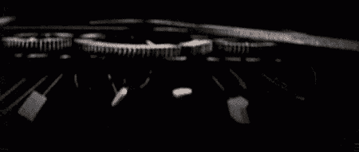*

*…这是一个不可否认的事实——所有的国家都死得一样。*

> ***而且是从钱开始的，或者更好的说法是:最好由钱来体现。***

*让我们举一个超级原型的例子，回到过去，[回到古罗马:](https://threadreaderapp.com/thread/1418927516904009738.html)*

**

*你知道，很久以前钱不属于国家。*

*在美国，我们有所谓的政教分离。*

> *几千年来，金钱和国家的分离是默认的。*

***挑战:***

*问问你的哥们，爸爸，妈妈，等等。"*钱应该属于国家吗？"**

**观察他们的反应——这真的会很有趣！**

****金银在很长一段时间里是默认的货币，它们确实*不*属于国家。****

**事实上，当民族国家没收了所有的钱，并且发行他们自己的，人民可以拒绝他们。)事情是这样的:**

**在古罗马，他们(国家)开始锉掉硬币本身的微小碎片。**

**硬币边缘的这些锯齿不是给盲人用的，不，不，不:硬币边缘的这些锯齿是为了让同样大小的硬币金/银含量更少。**

**当他们锉得太多的时候，他们会用一种看起来类似的更便宜的金属来代替贵金属…**

****例如:****

*   **[公元 60 年时，一枚 4 克重的硬币由 95%的银组成](https://twitter.com/drew_macmartin/status/1418927541008715795?s=20)。**
*   **到公元 110 年，85%是银**
*   **到了公元 170 年——75%是白银**
*   **到公元 211 年，60%是白银**
*   **到了公元 270 年——5%的银**

**此后不久，用青铜铸造了硬币。**

**通货膨胀是货币贬值时购买力的直接反映:**

**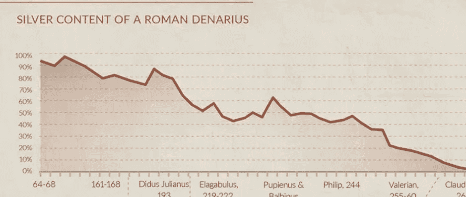**

**这样罗马政府就可以少发行 1 个单位的金银，明白了吗？**

> **只不过是老版的“量化宽松”，或者通货膨胀，或者印钞！**

**在美国，同样的事情发生了*，就在我们这个时代之前:***

**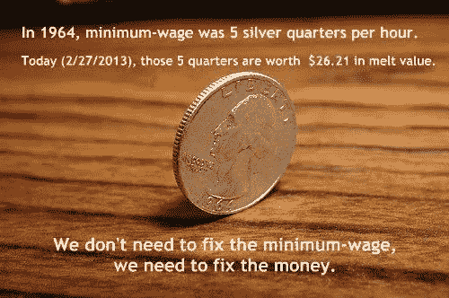**

**问题是，一旦你开始行动，就不可能停下来。**

**政府是一个无法离开赌桌的赌徒**

**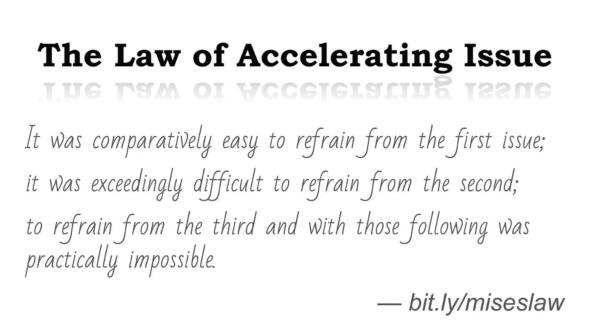**

**由此产生的*实际*货币价值(以美元计)[就像一个死亡螺旋:](https://twitter.com/therationalroot/status/1464595608417628168)**

**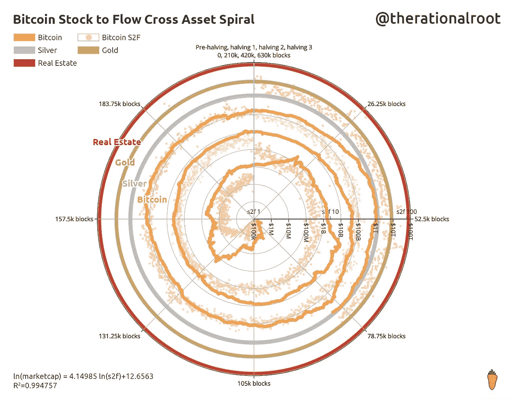**

**图上的点是以美元计算的比特币。**

**你可以从两方面解读，要么从中间往外=比特币价值相对于美元的上升。**

**或者从圆周向内=美元 vs 比特币的价值，即美元的**死亡螺旋！****

**这里有另一个例子来说明这一点:**

**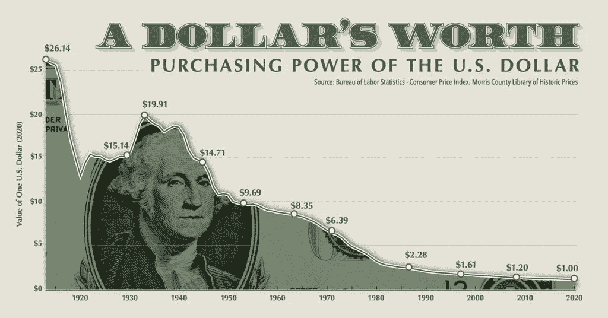**

**同样是 BTC 对美元:**

**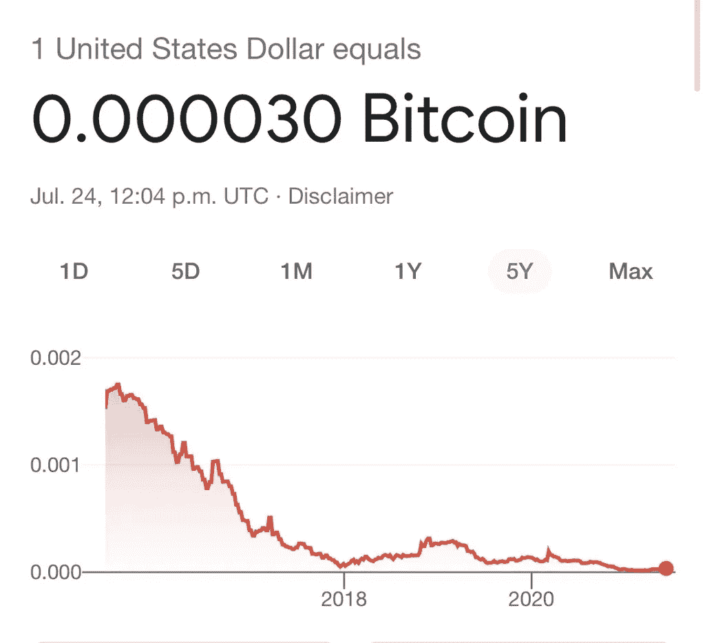**

**我想真正把这一点讲清楚。我们今天经历的通货膨胀是我们的政府让我们的货币贬值的结果！所以…**

****如果这个周末你只能做一件事，那就认真看看这个视频:****

****最喜欢的名言:****

**20 年前，我在阿根廷的一家银行里有 100 万美元。它是以美元计价的。比索对美元的汇率是 1 比 1。**

***阿根廷政府给银行发了一份备忘录；强行将每个人的美元兑换成比索，然后强行将 1 美元兑换 10 比索。***

**第二天早上醒来，我有了十万美元。**

**我以前一天有一百万美元。**

**一夜之间，在没有法律和军队的情况下，他们通过一份传真偷走了全国所有人 90%的货币。**

**现在把这个国家每个人的财产都拿走有多难？**

**有了比特币，你不得不逮捕 6000 万人，让他们在监狱里苦熬 90 天。**

**你如何逮捕 6000 万人——让他们在监狱里汗流浃背 90 天？**

***好像难了十亿倍，所以* ***比特币是产权恰当理解。*****

> **“当然，这是你生活的基础，对吗？用钢建造在花岗岩上。**所以比特币是加密钢。”迈克尔·塞勒****

**[丹·赫尔德也非常简洁地框定了:](https://twitter.com/danheld/status/1466442323580104715?s=20)**

**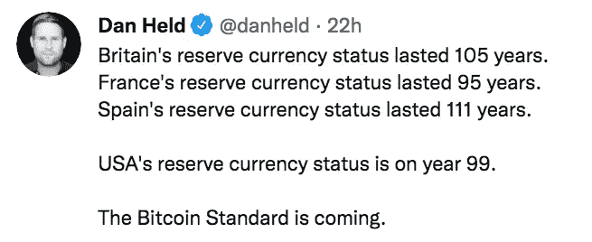**

****你的动作超级简单:****

**为了保护你的财富，现在最简单的办法就是把你的美元兑换成比特币。**

****继续前进……****

# **比特币**

**[叉子！叉子！谁想要叉子？](https://twitter.com/RomainBsv/status/1466013059583983619?s=20)**

**这是一个关于比特币分叉的很棒的图形:**

**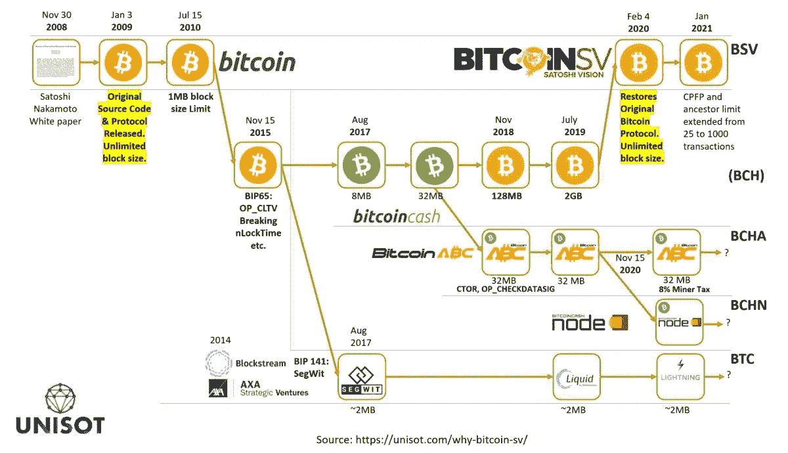**

**友情提示:每次区块链分叉时，你都会得到两枚硬币。是的——双倍的钱！**

# **价格行为**

**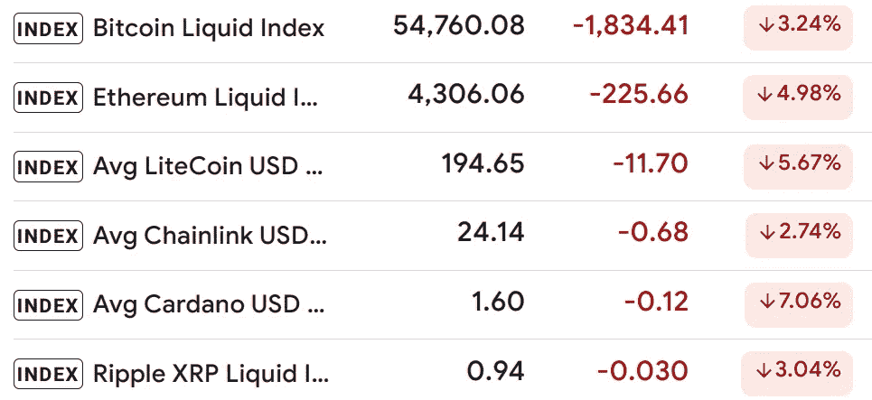**

**介绍我的新交易策略:[巴特·辛普森曲线！这是最新最有效的型号！](https://twitter.com/DaanCrypto/status/1465077737916358658?s=20)**

**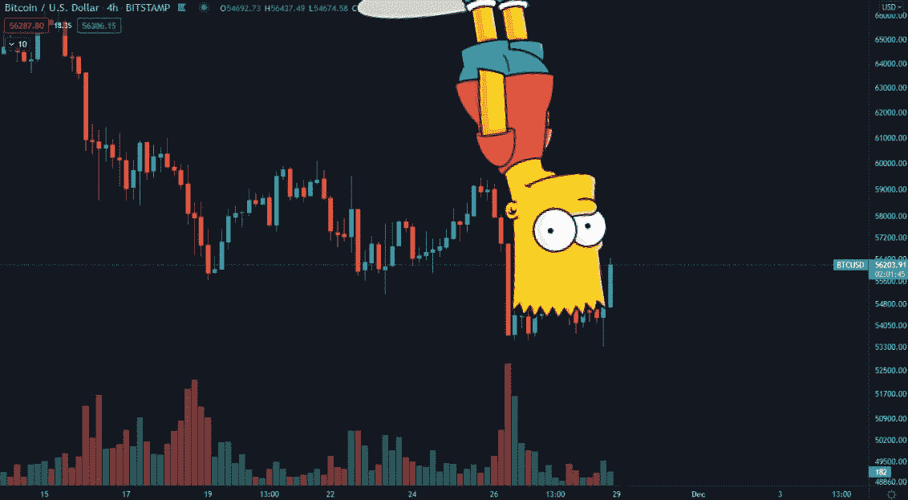**

# **本周最佳帖子**

**#1 —这是一个很棒的周末活动！[看看这个有良知的公民对抗社会主义的视频！](https://twitter.com/LukeMikic21/status/1466323028917174288?s=20)**

**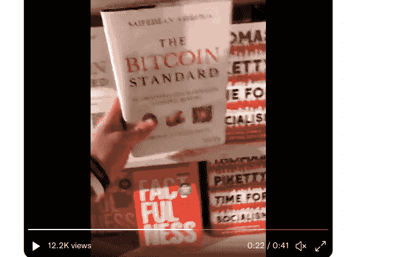**

**# 2——甘道夫扮演中本聪！[看这部电影时，我被我的杰克+可乐噎住了！必看！](https://twitter.com/TheGuySwann/status/1465335003257188362?s=20)**

**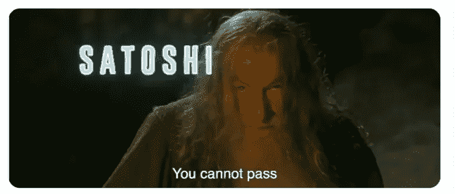**

# **深潜**

**这是一个很棒的深潜，有很多视觉效果！想了解萨尔瓦多[火山债券和比特币城市吗？看这个！](https://threadreaderapp.com/thread/1466304476155760640.html)**

**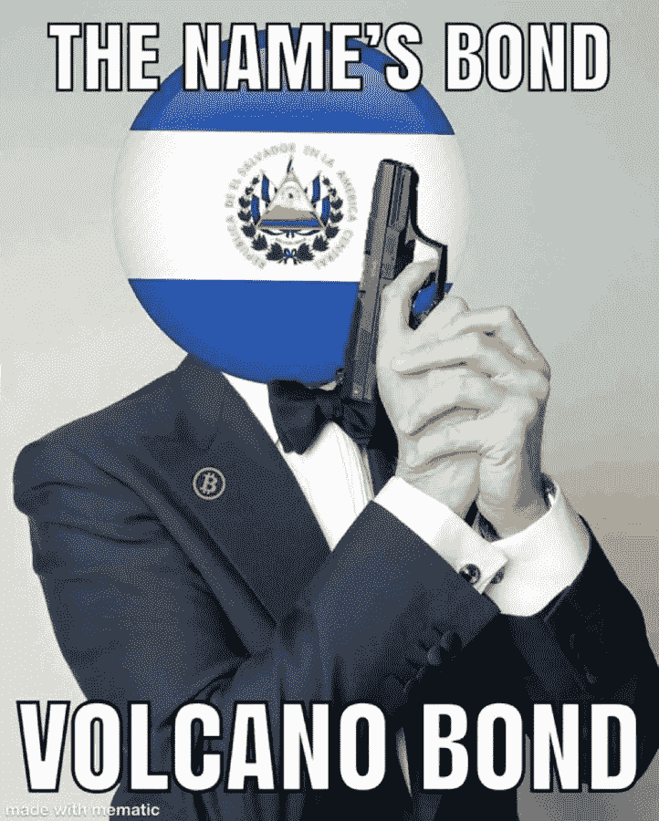**

**这就是这个星期我亲爱的结束美联储。**

****记住:保护你的财富最简单的方法，就是购买比特币！****

**真诚地**

**埃里克**

****附:你有没有申请免费的** [**死亡简单比特币追踪器？**](https://kingcrypto.substack.com/p/cryptorevolution-7)**

> **加入 Coinmonks [电报频道](https://t.me/coincodecap)和 [Youtube 频道](https://www.youtube.com/c/coinmonks/videos)了解加密交易和投资**

## **另外，阅读**

*   **[10 本关于加密的最佳书籍](https://blog.coincodecap.com/best-crypto-books) | [英国 5 个最佳加密机器人](https://blog.coincodecap.com/uk-trading-bots)**
*   **[ko only 回顾](https://blog.coincodecap.com/koinly-review) | [Binaryx 回顾](https://blog.coincodecap.com/binaryx-review)|[Hodlnaut vs CakeDefi](https://blog.coincodecap.com/hodlnaut-vs-cakedefi-vs-celsius)**
*   **[40 个最佳电报频道](https://blog.coincodecap.com/best-telegram-channels) | [1xBit 回顾](https://blog.coincodecap.com/1xbit-review)**
*   **[如何在印度购买以太坊？](https://blog.coincodecap.com/buy-ethereum-in-india) | [如何在币安购买比特币](https://blog.coincodecap.com/buy-bitcoin-binance)**
*   **[在美国如何使用 BitMEX？](https://blog.coincodecap.com/use-bitmex-in-usa) | [BitMEX 回顾](https://blog.coincodecap.com/bitmex-review) | [买索拉纳](https://blog.coincodecap.com/buy-solana)**
*   **[德国最佳加密交易所](https://blog.coincodecap.com/crypto-exchanges-in-germany) | [Arbitrum:第二层解决方案](https://blog.coincodecap.com/arbitrum)**
*   **[支持卡审核](https://blog.coincodecap.com/uphold-card-review) | [信任钱包 vs 元掩码](https://blog.coincodecap.com/trust-wallet-vs-metamask)**
*   **[Exness 点评](https://blog.coincodecap.com/exness-review)|[moon xbt Vs bit get Vs Bingbon](https://blog.coincodecap.com/bingbon-vs-bitget-vs-moonxbt)**
*   **[如何开始通过加密贷款赚取被动收入](https://blog.coincodecap.com/passive-income-crypto-lending)**
*   **[Coldcard 评论](https://blog.coincodecap.com/coldcard-review) | [BOXtradEX 评论](https://blog.coincodecap.com/boxtradex-review)|[uni swap 指南](https://blog.coincodecap.com/uniswap)**
*   **[比特币基地 vs 瓦济克斯](https://blog.coincodecap.com/coinbase-vs-wazirx) | [比特鲁点评](https://blog.coincodecap.com/bitrue-review) | [波洛涅克斯 vs 比特鲁](https://blog.coincodecap.com/poloniex-vs-bittrex)**
*   **[阿联酋 5 大最佳加密交易所](https://blog.coincodecap.com/best-crypto-exchanges-in-uae) | [SimpleSwap 评论](https://blog.coincodecap.com/simpleswap-review)**