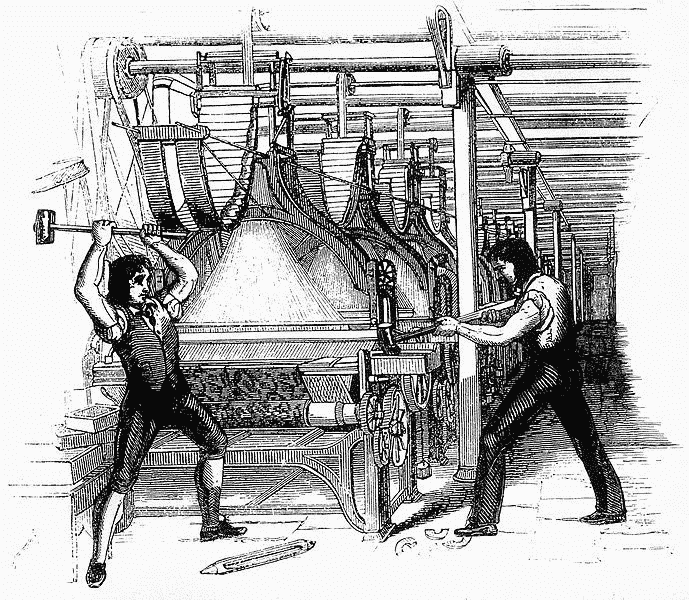

# 密码革命#3

> 原文：<https://medium.com/coinmonks/cryptorevolution-3-c115f8c41451?source=collection_archive---------12----------------------->

## 多米诺骨牌正在倒下！

欢迎我的朋友们，来到革命的另一天！

事实证明，这一周的确非常具有革命性…

又一张多米诺骨牌倒下了！

但首先，引用一位智者的话:

> “所有政府都面临一个反复出现的问题:权力吸引病态人格。不是权力导致腐败，而是权力对易腐败的人有吸引力。”——弗兰克·赫伯特

**关于那些多米诺骨牌**——[现在乌克兰接受比特币了！](https://cointelegraph.com/news/ukraine-passes-legislation-to-recognize-and-regulate-crypto)

> 9 月 8 日，乌克兰议会通过了“关于虚拟资产”的法律草案，首次在法律上承认该国的加密货币。

**下一个会是谁？**

俄罗斯这样的大玩家？美国？中国？——或者另一个小国，比如巴拿马、伯利兹等。？

# 比特币

是时候发表另一份宣言了。《比特币》杂志简洁地捕捉到了这种情绪。这也是我 2013 年投身革命的原因之一。他们直截了当地说:

> “政府这个寄生虫，榨取你的价值和辛勤劳动，通过比特币治愈。”

**底线:**比特币会保护你的财富免受政府的侵害。非常值得一读！

# 预测:

**正如在[上一次密码革命中](https://kingcrypto.substack.com/p/cryptorevolution-2)**预测的那样，“美国将在未来 5-10 年内发行联邦币”，现在欧盟也在赶时髦:

欧洲央行正式开始调查数字欧元…

> “欧洲中央银行(ECB)总裁克里斯蒂娜·拉加德在上周接受世界经济论坛创始人兼执行主席克劳斯·施瓦布的采访时，谈到了央行数字货币(CBDCs)，尤其是数字欧元。”

所以我必须更新预测:

[欧盟和美国将在未来 5-10 年内发行联邦币！](https://news.bitcoin.com/ecb-officially-starts-to-investigate-digital-euro-development-begin-2-years/)

**展望未来:**我必须再次重申；这些国家和政府参与者并不是为了你的利益而研究数字货币*。这完全是为了他们的利益，因为他们正在意识到这样一个事实，即他们发行的数字硬币将堵塞所有的税收漏洞，并有效地结束逃税行为(即对于那些拿小时工资的小人物来说)！*

# *规章制度*

*斯蒂芬·西格尔和金·卡戴珊有什么共同点？*

**

***他们都因为“抽密码”而陷入了水深火热之中！***

> *“……她最近被要求通过‘加入以太坊 Max 社区’让她的 2.5 亿 Instagram 粉丝投机加密令牌，这可能是历史上受众人数最多的一次金融推广。”*

*然而，这一次不是美国证交会，而是英国的 FCA(与证交会一样，但在英国。)*

> *“……很明显，立法者需要考虑三个问题:*

1.  **首先是如何让数字代币更难被用于金融犯罪。**
2.  **第二是如何支持有益的创新，**
3.  *第三是消费者可以在多大程度上自由购买不受监管的纯粹投机性代币，并为自己的购买决定负责。”*

*然而，有趣的是，我们的英国朋友正在扭转这一局面——他们想要维护“对整个技术的信任……”！*

> *“与此同时，在我看来，在两种情况下，监管机构应该有权采取行动，减少纯粹投机性令牌对消费者的潜在伤害，尤其是确保对整个技术的信任不会被这个领域的不良行为者破坏。”*

*[我觉得很合理…？](https://news.bitcoin.com/kim-kardashian-uk-regulator-pumping-crypto-token-could-harm-investors/)*

***友情提醒:***

*如果你是一个名人——注意你说的关于密码的话！*

***[**拜登的基建法案的问题:**](https://thedefiant.io/infrastructure-bill-to-pass/)***

> ***“因为作为加密货币经纪人的新定义将在[拜登总统的 10 亿美元基础设施计划中通过”](https://www.jdsupra.com/legalnews/senate-passes-infrastructure-bill-4809896/)***

***问题的很大一部分在于美国已经将加密货币定义为一种证券，这意味着它将受到 SEC 的监管。***

***其他国家都把比特币和加密货币定义为货币，即货币。***

# ***NFTs/社交代币***

*****我不明白** —你为什么不能直接点击鼠标右键，然后保存一个 NFT 呢？***

***只是一个. jpeg 文件，对吗？***

***这里只看到[一个有趣的答案。](https://metaversal.banklesshq.com/p/why-right-click-savers-flunk-nfts)***

***英语中有三个词让我们的大脑陷入一个循环:***

*   ***价值***
*   ***质量***
*   ***自由意志***

***这三个词永远不会有一个“公认”的定义。他们天生是哲学的。***

***尽管如此，上面的文章还是对它进行了猛烈的抨击，并解释了“符号价值”——一个由 20 世纪法国哲学家让·波德里亚引入的概念。***

# ***赌博***

***如果你想了解更多关于 [Crypto 如何影响赌博业的信息，请阅读这篇文章。](https://www.gameindustry.com/news-industry-happenings/cryptocurrency-impact-on-the-gambling-industry/)***

******

*****如果你想了解[加密游戏(GameFi)如何成为新的赚钱方式，请阅读此文](https://www.financialexpress.com/money/how-crypto-gaming-gamefi-is-emerging-as-the-new-way-to-make-money/2326958/)**！***

# ***挑战***

***比特币基地想加入目前由区块链主导的 DeFi 游戏。***

***他们想在他们的平台上提供加密贷款。这个程序叫做“借”( *—哇！—那是创造性的，不是吗？！)****

***然而，美国证券交易委员会对此有异议，并向法院起诉比特币基地！***

***更糟糕的是，证券交易委员会正在展示他们的联邦力量，没有定义比特币基地据称已经违反的法律。***

***这是最糟糕的政府。***

# ***风险投资***

***你听说过“元宇宙”吗？***

***如果你读过流行书籍[“预备玩家一”](https://geni.us/jbiA2M)那么你已经有了很好的理解，并且…***

***脸书想要建造它！***

> ***“元宇宙最好理解为计算和交互从你口袋里的设备到虚拟模拟的转变。”—马修·鲍尔***

***点击这里查看采访的其余部分。***

# ***机构收养***

***准备好迎接雪崩吧！正如上周的密码革命一样，我们看到了机构采用的图表:***

******

***上图:红线代表机构对比特币的投资——仅通过一个平台:LMAX。***

***其他线是“零售”平台，像你我这样的小家伙可以购买+交易加密货币。***

***随着机构购买越来越多的比特币，价格只有一种走向…***

*****麦当劳是机构吗？在圣萨尔瓦多的麦当劳里，你可以用比特币支付。*****

***刚刚走进圣萨尔瓦多的一家麦当劳，想看看我能否用比特币支付早餐，满心期待被告知不可以。但你瞧，他们打印了一张带有二维码的票，带我去了一个有闪电发票的网页，现在我正在享受我的传统德萨尤诺！https://t.co/NYCkMNbv7U***

# ***替代硬币***

*****英国 FCA** 对[111 家密码公司发出警告。](https://www.altcoinspeculation.com/cryptocurrency-regulation/fca-warns-towards-111-unregistered-crypto-corporations.html)***

***英国对加密货币的采用现在正在飙升，特别是因为 PayPal 现在已经在其英国平台上提供比特币。***

*****查看这个**每日播客和 YouTube 频道，了解关于未来替代硬币的[详细信息。](https://www.youtube.com/watch?v=jQUZfzpdiOI)***

***我本人并不太喜欢 altcoin。***

***为什么？因为当几年前比特币进入 BTC 和 BCH 时，我意识到如果我把所有的钱都放在比特币上，我会过得更好。***

***事实上，这是我每次交易前都会问自己的问题:***

> *****“如果我用这笔钱买比特币，而不是花在这个 _coin 上呢？”*****

***几乎在每一种情况下，答案都是比特币产生了更好的回报。***

***当然，除非你能预见未来，知道下一个“弹出”的是哪枚硬币。***

***[但那是轮盘赌。](https://geni.us/intelinvest)***

# ***价格行为***

******

***[来源](https://www.google.com/finance/)***

*****什么是“流动指数”？*****

> ***“BNC 开发了比特币流动性指数(BLX ),以满足市场对单一、可靠和公平的比特币美元价格的要求——基于真实世界的交易活动。该指数旨在报告流动性可以进入或退出比特币头寸的市场价格。BLX 从交易量和质量最高的交易所获取了全面的全球流动性样本。” [—来源](https://bravenewcoin.com/enterprise-solutions/indices-program/blx)***

***为什么以太坊现在是“最伟大的交易”？***

***看看这篇对拉乌尔·保罗的采访，拉乌尔是几年前[在比特币上“全押”的大胆家伙之一，](https://shows.banklesshq.com/p/80-ethereum-is-the-greatest-trade)***

> *****免责声明:*****
> 
> ***我和这份简讯都没有声称给任何投资/投机建议！***

*****我的看法:**投资和投机/赌博是有区别的。***

***投资者买入长线。赌徒们整天看着他们的笔记本电脑，等待一个“跳进去或跳出来”的点。***

***投资者很放松，看着他们的财富增长，而赌徒总是想知道为什么他们一直输钱。***

***投机者/赌徒，又名“日交易者”，通常在他们没钱的时候到达他们的起点，他们站在一座高楼的顶端，俯视下面的街道，思考他们错在哪里…***

*****我的推荐:**在你购买任何东西，加密货币、股票、债券等之前，先阅读一下[、本杰明·格拉哈姆的《聪明的投资者》。](https://geni.us/intelinvest)***

*****和，** [**看这个**可以更好的理解比特币发行的动态:](https://twitter.com/ccFOUND_Global/status/1433825173124177925?s=20)***

******************

***[(来源)](https://twitter.com/ccFOUND_Global/status/1433825173124177925?s=20)***

# ***本周最佳推文***

***罗伯特·布里德洛夫@布里德洛夫 22***

***到 2034 年社保将无法支付福利。与疫情相关的压力给项目带来了巨大的压力。印刷现金和提高税收不是解决办法，但少量#比特币分配可能是。https://t.co/1UVaR6q7AL***

# ***知识/BTC 101***

***你知道你的比特币不在钱包里吗？***

***不，事实上，他们“生活”在区块链，从来没有离开它。***

***你的比特币钱包只是区块链的接口——就像你的网络浏览器是互联网的接口一样。***

***点击这里查看我为你制作的视频！***

# ***本周假消息***

> ***“谁控制了框架，谁就赢了……”——匿名***

***本周，在萨尔瓦多雷采用比特币的好消息传出后，当然，当权者一定会把它说成是坏事！***

****“如果萨尔瓦多的 Chivo 比特币钱包获得牵引力，西联可能损失 4 亿美元”****

***和***

****“Chivo 钱包可能伤害速汇金和西联汇款等汇款巨头”****

***和***

****“…如果人们大规模采用比特币，”有可能“西联汇款和速汇金将每年损失 4 亿美元的汇款佣金。”****

*****真相是什么？*****

***事实是…全世界数十亿人将通过不使用像西联这样的公司和被敲高交易费来省钱。***

****事实是……一旦更多的人加入加密革命西联汇款，速汇金就会* ***倒闭！******

***再也不需要这些昂贵的送钱公司了。***

***这就是比特币和基于区块链的技术的全部意义！***

***所以实际上，合适的框架是:西联汇款和速汇金正在扮演勒德派:***

******

> ***[“卢德派](https://en.wikipedia.org/wiki/Luddite)是 19 世纪英国纺织工人的一个秘密宣誓组织，是一个通过抗议破坏纺织机械的激进派别。他们抗议制造商以他们所谓的“欺诈和欺骗的方式”使用机器来规避标准的劳工惯例。***

***说够了…***

*****你呢？*****

***接下来哪个国家会采用加密技术？***

> ***加入 Coinmonks [电报频道](https://t.me/coincodecap)和 [Youtube 频道](https://www.youtube.com/c/coinmonks/videos)了解加密交易和投资***

## ***也阅读***

*** [## 最佳加密交易所| 2021 年十大加密货币交易所

### 编辑描述

blog.coincodecap.com](https://blog.coincodecap.com/crypto-exchange)  [## 2021 年 10 大最佳加密贷款平台| CoinCodeCap

### 编辑描述

blog.coincodecap.com](https://blog.coincodecap.com/crypto-lending)  [## 2021 年最佳免费加密交易机器人

### 2021 年币安、比特币基地、库币和其他密码交易所的最佳密码交易机器人。四进制，位间隙…

medium.com](/coinmonks/crypto-trading-bot-c2ffce8acb2a)  [## 最佳 4 个加密交易信号电报通道

### 这是乏味的找到正确的加密交易信号提供商。因此，在本文中，我们将讨论最好的…

medium.com](/coinmonks/best-crypto-signals-telegram-5785cdbc4b2b)  [## BlockFi 评论 2021:利弊和利率| CoinCodeCap

### 编辑描述

blog.coincodecap.com](https://blog.coincodecap.com/blockfi-review)  [## 如何在印度购买比特币？2021 年购买比特币的 7 款最佳应用[手机版]

### 如何使用移动应用程序购买比特币印度

medium.com](/coinmonks/buy-bitcoin-in-india-feb50ddfef94)  [## 加密税务软件——五大最佳比特币税务计算器[2021]

### 不管你是刚接触加密还是已经在这个领域呆了一段时间，你都需要交税。

medium.com](/coinmonks/best-crypto-tax-tool-for-my-money-72d4b430816b)  [## 存储比特币的最佳加密硬件钱包[2021] | CoinCodeCap

### 编辑描述

blog.coincodecap.com](https://blog.coincodecap.com/best-hardware-wallet-bitcoin)  [## Pionex 评论 2021 |免费加密交易机器人和交换

### Pionex 是为交易自动化提供工具的后起之秀。Pionex 上提供了 9 个加密交易机器人…

medium.com](/coinmonks/pionex-review-exchange-with-crypto-trading-bot-1e459d0191ea)***