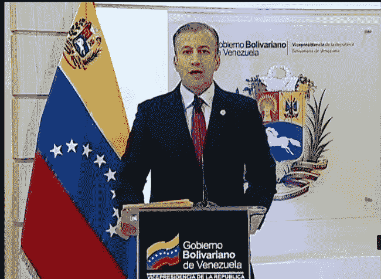
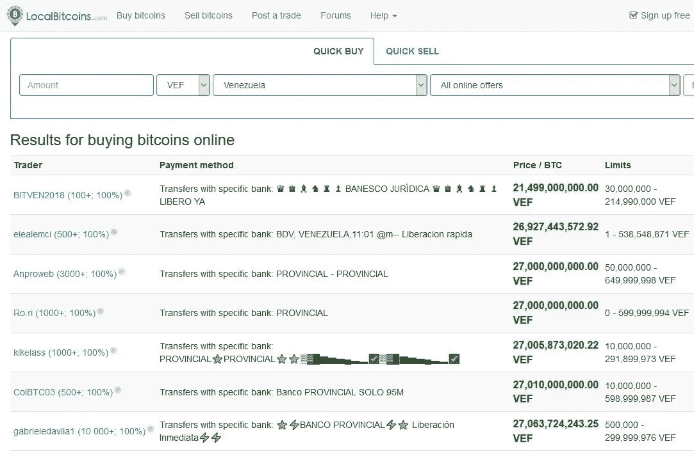
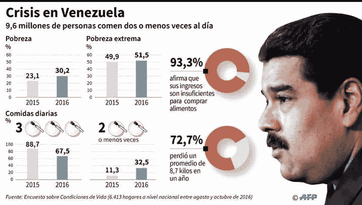

# Cryptos 将拯救委内瑞拉

> 原文：<https://medium.com/coinmonks/cryptos-are-going-to-save-venezuela-215b552a0c06?source=collection_archive---------6----------------------->

不完全是。我来自哥伦比亚(委内瑞拉的邻国),最近我听到了很多关于密码爱好者如何使用密码来拯救委内瑞拉的故事。当人们想要帮助时，这是高尚的，但在委内瑞拉的情况下，我看到许多想法不会导致任何结果。

[https://youtu.be/XCXyUSOroOs](https://youtu.be/XCXyUSOroOs)

# 故事

**在委内瑞拉争取自由:Crypto 如何帮助 Héctor 的家人购买食物** ( [Bitcoinmagazine](https://bitcoinmagazine.com/articles/fighting-freedom-venezuela-how-crypto-helped-h%C3%A9ctors-family-buy-food/) ，2018 年 7 月 6 日)，“2018 年 7 月 1 日，Héctor*收到 0.5 纳米。这笔交易对委内瑞拉人来说是第一次，他得到这笔交易要感谢他的一位同胞的捐赠。对一些人来说，大约 1.80 美元的金额可能无关紧要。但对赫克托来说，这是天赐良机，因为他的国家的本币几乎一文不值。

**又一种加密货币进入委内瑞拉** ( [Bitcoinmagazine](https://bitcoinmagazine.com/articles/another-cryptocurrency-makes-inroads-venezuela/) ，2018 年 7 月 23 日)，“Dash 在 Cryptobuyer 上的交易流量不仅限于市场投机。相反，dash 被委内瑞拉的供应商和商人广泛采用。Valenzuela 告诉比特币杂志，该国约有 522 家国内店主接受 dash。Discover Dash 网站是这些商店的目录。加拉加斯的 Calvin Klein 和 Polo 现在接受 Dash！”

**一项向委内瑞拉发送数百万比特币的计划正在推进** ( [Coindesk](https://www.coindesk.com/plan-send-millions-bitcoin-venezuela-taking-shape/) ，2018 年 6 月 29 日)，“惠勒和克雷纳也在寻求与人权基金会和联合国建立合作伙伴关系。他们甚至一直在与经济学家交谈，以了解在一个经济受损的国家推出一种新的在线货币可能会产生哪些意想不到的后果。但即使他们建立了这些联系，他们也渴望让应用程序运行起来，以测试这个概念。然后，这一切都是为了获得资金，购买将空投给委内瑞拉人的比特币。”

政府会支持我们的。我从两个团体那里听说，他们目前正在与委内瑞拉政府中的关键人物会谈，目的是让政府支持他们。两个团体都表示，他们进行了很好的讨论，政府将支持他们。这是我的观点:这永远不会发生。你真的相信一个不关心自己人民的政府会有兴趣支持你吗？在无人问津的臭名昭著的 PETRO 失败后？此外，不要忘记美国政府不会大力支持帮助委内瑞拉政府的想法。

# 现实 1:一个比特币价值超过 22 万美元

由于委内瑞拉的高通货膨胀率，市场对美元有很高的需求。然而，委内瑞拉官方获取美元的渠道有限，这导致了(非官方)黑市汇率比官方汇率高出 20 多倍。这意味着如果你遵守法律，一个比特币不会值 9000 美元，而是 18 万美元。一个比特币相当于 18 万美元。 [Localbitcoins](https://localbitcoins.com/instant-bitcoins/?action=buy&country_code=VE&amount=&currency=VEF&place_country=VE&online_provider=ALL_ONLINE&find-offers=Search) 举例来说，提供的比特币起价为 225，180 美元(以官方汇率为准)。

【2018 年 6 月 15 日委内瑞拉副总统塔雷克·埃尔·艾萨米(Tareck El Aissami)表示:“委内瑞拉政府已经开始监控委内瑞拉公民的银行账户，以进行与加密货币相关的交易。被发现以政府认为“[破坏国家货币](https://youtu.be/XCXyUSOroOs)”的价格进行加密交易的账户将受到“严厉惩罚”。这一新阶段于上周启动，重点是他们所谓的“黄金走私者”，即从小矿工手中购买密码和黄金，然后在国外出售的委内瑞拉人。该国副总统塔雷克·埃尔·艾萨米(Tareck El Aissami)宣布，该行动“发现这些黑手党扭曲了美元价格”，并补充说，“他们通过加密货币市场转移，冲击委内瑞拉的货币体系。"

该行动进一步针对通过加密货币进行的资本外逃。El Aissami 解释说，政府将开始监控与加密相关的交易的银行账户，并将起诉那些“以投机价格”进行交易的人。我们发现的所有与操纵有关的账户都将受到严厉的惩罚,(那些负有责任的人)将接受司法审判。

# 现实 2:贫困

超过 90%的委内瑞拉人生活贫困。2018 年，绝对贫困(由世界银行定义:收入低于 1.90 美元)攀升至 62%。如果卡尔文·克莱恩接受 DASH，而至少 90%以上的人都无法接触到这些产品，那该多好啊。旨在帮助委内瑞拉人的解决方案和想法不应该关注 1%的人，而应该关注 90%吃不饱饭的人。

# 解决方案？

帮助委内瑞拉最富有的 1%的人(那些有钱买电脑、会说英语、通常去美国旅行没有困难的人)很容易。另一方面，帮助穷人是非常困难的。在一个被古巴人渗透的社会主义国家，一切都由政府控制和监管。只有他们和人民有能力显著改变事情。

我认为帮助绝大多数委内瑞拉人的最成功的方法是让那些逃离该国的人去哥伦比亚。到目前为止，官方统计有 80 万人越过[边境，而且每月还有 5 万人越过边境。](https://cnnespanol.cnn.com/2018/07/18/venezolanos-colombia-cifras-migracion/)

哥伦比亚人支持这种移民，因为不久前(当哥伦比亚人自己有问题时)，许多哥伦比亚人逃到委内瑞拉。哥伦比亚人仍然感谢委内瑞拉给了他们一个新家。他们也视委内瑞拉人为他们的“兄弟姐妹”。

现在居住在哥伦比亚的委内瑞拉人正在给他们在委内瑞拉的家人寄去食物和钱。汇款时，家庭可以使用更好的汇率(仅比黑市汇率低 20%左右)。那么为什么不帮助在哥伦比亚的委内瑞拉人呢？