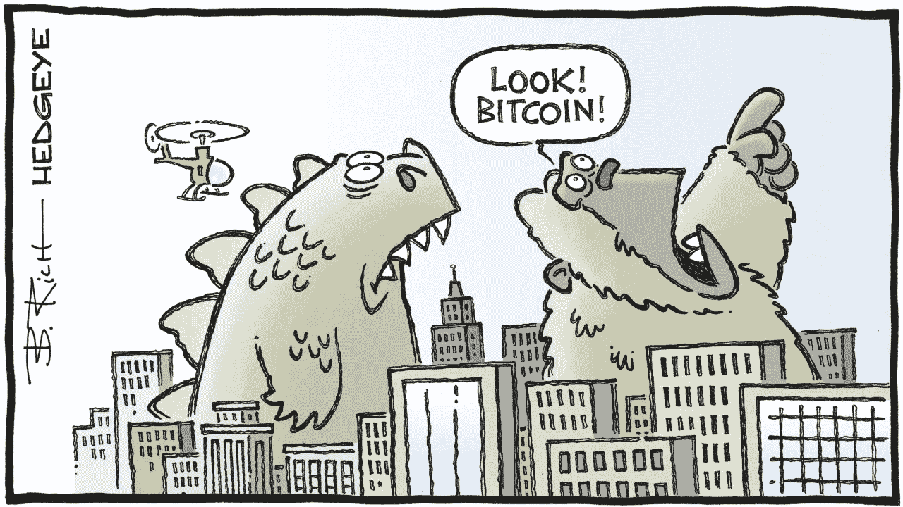
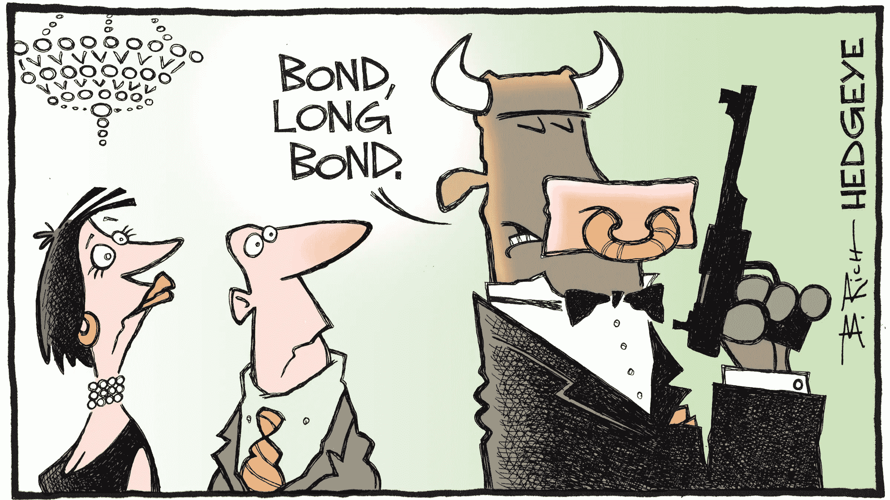

# cryptos——这个问题有多神秘(投资还是不投资？？？)

> 原文：<https://medium.com/coinmonks/cryptos-how-cryptic-to-invest-or-not-to-invest-is-the-question-1b048290fe00?source=collection_archive---------3----------------------->

嘿，伙计们，很高兴回到这里讨论密码之谜。在前一篇博文中，我们讨论了一点区块链技术的发明历史，以及它对我们的数字未来会有什么影响。这项技术的第一次实现是在**比特币**中。你很有可能知道比特币，但不知道区块链，这是理所当然的…..为什么一个普通人应该知道，制造一台电视机或一架飞机涉及哪些技术。他们可能很高兴使用这些现代奇迹，这使他们的生活变得更有趣，比特币或任何其他加密货币也是如此。但是，问题是，正是这种质量使它们防篡改或防操纵，也使其不受监管，不受政府控制。这是好是坏？？？将取决于你居住的国家。因此，在决定投资之前，让我们更详细地研究一下这些问题。

我一直坚持认为，如果任何创造财富的手段是合法的，对我来说，它是受欢迎的。然而，我很高兴地说，我已经在与我的朋友讨论的基础上对它进行了调整，“**如果它是道德和合法的，它对我来说是受欢迎的**怎么如此模糊的密码可能，我看不出他们有任何道德问题。是的，它们可能被用于资助不道德的交易，如毒品、贩卖人口 T12 枪支和恐怖主义，但对任何其他资产类别也是如此，如金钱、黄金、钻石等。因此，在我看来，道德是勾选的。

下一个问题……是不是**合法**？？？？这确实是一个很难回答的问题。如果你上周一直在关注金融新闻，你会知道密码交易所 **CoinSwitch** 成为今年第 30 只**独角兽**。为了方便我的新读者，独角兽是指估值超过 10 亿美元的初创公司。CoinSwitch [上周从硅谷顶级基金安德森·霍洛维茨和比特币基地风险投资公司筹集了 2.6 亿美元。这使其估值增加了近四倍，达到 19 亿美元，成为最新的独角兽。有了这个消息，它的用户群也在一天之内从 1000 万增加到 1100 万。即使我们不知道在不久的将来会发生什么，由一家可信和知名的企业进行的 2.6 亿美元的大型投资肯定会给倡导加密货币的人带来希望。](https://www.moneycontrol.com/news/business/startup/coinswitch-kuber-turns-unicorn-raises-260-million-from-coinbase-ventures-a16z-7549871.html)

到目前为止，印度政府还不确定如何处理或合法化密码交易。2018 年，印度储备银行禁止使用密码，直到 2020 年最高法院撤销了禁令。随着 RBI 2018 年的禁令，印度银行也不鼓励和不允许与加密交易所进行交易，因为他们认为他们不受最高法院管辖，但要对 RBI 负责。这种情况一直持续到最近，当时 RBI 发布了一项澄清，称最高法院裁决后，银行不能禁止其客户投资 Cryptos，然而，这取决于投资者是否投资 Cryptos。目前，没有明确的法律禁止或允许密码交易。但在某种意义上，随着最高法院的裁决，密码也获得了与黄金、白银、谷物或原油等商品、房地产或任何其他可交易商品相同的地位。在这些情况下，没有人告诉你必须投资，同时也没有人告诉你不要投资。现在，投资者可以决定将这些作为创造财富的手段。那有什么不同呢？？？？？？？现在用 crypto 交易不是很安全吗？？？？？

在我看来，cryptos 是为了在没有政府干预的情况下促进在线支付而创建的，cryptos 无法被跟踪、监控或控制的固有能力让任何政府都感到不安。在现代银行或金融体系中，只有政府或中央银行有权创造被认可为法定货币的货币。因此，这一领域的任何竞争都可能是动荡的。政府担心不受控制地使用密码可能会使整个现代金融系统崩溃，因为这将使商业交易无法追踪，因此人们可能会利用这一点来避税，这将导致政府手中用于福利计划和日常支出的资金越来越少。与此同时，这也可以刺激平行经济，为各种非法活动提供便利。

虽然有许多措施，如详细的 KYC(了解你的客户)，类似于共同基金投资，正在通过 CoinSwitch 等交易交易所实施。但是，在秘密投资者的愿望和政府控制他们的愿望之间仍然存在巨大的差距。直到加密团体采取一些具体措施来规范交易以使其更加透明，或者政府颁布指导方针以通过交易所或银行使这些交易更加负责，否则将会出现不稳定的平静，这种平静将经常被基于投机的加密价格的飙升打破。

现在最棘手的部分……我该怎么办？？？？等待政府的澄清，这可能需要很长时间，错过了公共汽车，或者采取一个信念的飞跃，失去了我的钱？？？？？？？最有趣的是，没有人能替你做这个决定，但我们肯定可以为它制定一些指导方针……还记得我们在之前的博客文章中讨论过的**贪婪——恐惧临界点**…这可能是一个很好的工具来衡量你对这个未经测试的市场的胃口。在 1 到 9 的范围内，0 代表绝对恐惧，0 代表贪婪，10 代表绝对贪婪，0 代表恐惧，衡量一下你的贪婪和恐惧……如果分数小于 4，远离 cryptos，如果分数在 4.5 到 7.5 之间，开始适度冒险，如果分数大于 8 …不要再向你的父母要钱了，开始挣钱吧。哈..哈…哈。

如果你是一个**保守型的人**，只对 FDs、邮局存款、养老基金或者有限的共同基金感兴趣，**我的建议是远离 cryptos** 。对 cryptos 的投资将像坐过山车一样…..几天之内，你的投资可能会翻倍，但在一两个交易日内，你总会有损失 20%至 30%的风险。

如果你是一个中等风险承担者，愿意投资共同基金，但只要有赚钱的合理机会，也会投资股票，那么在这些未经考验的领域，最好采取谨慎而有分寸的步骤。为此，把你总投资的 1%到 2 %放在一边，直到你掌握了窍门。

最后，即使你天生喜欢冒险，也要向自己承诺，你不会孤注一掷。我建议不要超过总投资组合的 2%到 5%。只有具备该领域的知识和足够的风险敞口，这一比例才能翻倍，在任何情况下，都不应超过整个投资组合的 10%。

好吧……密码可能没那么糟糕，也许政府也意识到了这一点。尼加拉瓜政府最近的承认给了密码爱好者很大的希望。我确信，即使是印度政府也意识到了区块链技术的潜力，这可能是为什么它没有完全禁止加密的原因。但是，我们如何投资呢……我的 Demat 账户够用吗，还是我必须申请其他地方的账户……选择哪个密码交换，最后哪个密码是我的获胜马？？？我相信你现在一定对这些感到疑惑。因此，让我们在下一个帖子中讨论这些…..下星期

感谢你们在通往财务自由的旅途中一直以来的支持。请继续将这些帖子分享给你所爱的人，以传播金融知识。另外，请不要忘记像一样**并在离开前点击**跟随**按钮。**

> 加入 Coinmonks [电报频道](https://t.me/coincodecap)和 [Youtube 频道](https://www.youtube.com/c/coinmonks/videos)了解加密交易和投资

## 另外，阅读

*   [Botsfolio vs nap bots vs Mudrex](/coinmonks/botsfolio-vs-napbots-vs-mudrex-c81344970c02)|[gate . io 交流回顾](/coinmonks/gate-io-exchange-review-61bf87b7078f)
*   [CoinFLEX 评论](https://blog.coincodecap.com/coinflex-review) | [AEX 交易所评论](https://blog.coincodecap.com/aex-exchange-review) | [UPbit 评论](https://blog.coincodecap.com/upbit-review)
*   [AscendEx 保证金交易](https://blog.coincodecap.com/ascendex-margin-trading) | [Bitfinex 赌注](https://blog.coincodecap.com/bitfinex-staking) | [bitFlyer 审核](https://blog.coincodecap.com/bitflyer-review)
*   [Bitget 评论](https://blog.coincodecap.com/bitget-review) | [双子星 vs BlockFi](https://blog.coincodecap.com/gemini-vs-blockfi) | [OKEx 期货交易](https://blog.coincodecap.com/okex-futures-trading)
*   [AscendEx Staking](https://blog.coincodecap.com/ascendex-staking)|[Bot Ocean Review](https://blog.coincodecap.com/bot-ocean-review)|[最佳比特币钱包](https://blog.coincodecap.com/bitcoin-wallets-india)
*   [霍比审核](https://blog.coincodecap.com/huobi-review) | [OKEx 保证金交易](https://blog.coincodecap.com/okex-margin-trading) | [期货交易](https://blog.coincodecap.com/futures-trading)
*   [麻雀交换评论](https://blog.coincodecap.com/sparrow-exchange-review) | [纳什交换评论](https://blog.coincodecap.com/nash-exchange-review)
*   [美国最佳加密交易机器人](https://blog.coincodecap.com/crypto-trading-bots-in-the-us) | [经常性回顾](https://blog.coincodecap.com/changelly-review)
*   [在印度利用加密套利赚取被动收入](https://blog.coincodecap.com/crypto-arbitrage-in-india)
*   [Godex.io 审核](/coinmonks/godex-io-review-7366086519fb) | [邀请审核](/coinmonks/invity-review-70f3030c0502) | [BitForex 审核](https://blog.coincodecap.com/bitforex-review)
*   [最佳比特币保证金交易](/coinmonks/bitcoin-margin-trading-exchange-bcbfcbf7b8e3) | [萝莉点评](/coinmonks/lolli-review-e6ddc7895ad8) | [比特币保证金交易](https://blog.coincodecap.com/bityard-margin-trading)
*   创造并出售你的第一个 NFT | [密码交易机器人](https://blog.coincodecap.com/best-crypto-trading-bots)