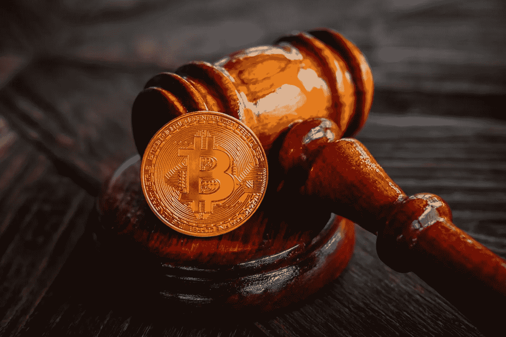

# Crypto 的新障碍:实现一个梦想需要多少个组织？

> 原文：<https://medium.com/coinmonks/cryptos-new-hurdles-how-many-organizations-does-it-take-to-bring-down-a-dream-276c0dddc24?source=collection_archive---------4----------------------->

## **看起来我写了很多关于 crypto 的麻烦，但是你需要消息灵通**

Image courtesy of [Canva](https://canva.com)

现在对 crypto 来说有太多好消息了。然而，如果你允许我扫兴的话，我想分享另一种消息。

让我说清楚。我不希望**让**写坏消息。但我确实想帮你。作为好朋友的一部分就是诚实。这意味着分享好消息和坏消息。

尽管我们前进的道路会很艰难，但我们会坚持下去。

为什么？

我们是战士。

在比特币生命的早期，“大到不能倒”的机构将神奇的互联网货币视为一种新奇事物，硅谷的一些地下室书呆子因为无聊而在玩它。甚至就在两年前，有些人(凯文·奥利里、彼得·希夫和他的儿子摩根大通，而不是杰米·戴蒙，以及其他许多人)称比特币和加密为神奇的东西。

哦，他们现在唱的是一首不同的歌。就连彼得·希夫也不得不吃些乌鸦。然而，杰米·戴蒙(Jamie Dimon)仍在惠普总部的大厅里走来走去，试图找到洗手间。与此同时，沃伦·巴菲特仍然不会改变他对加密的立场，可能是因为他在试图弄清楚查理·芒格到底在做什么，当中国正在他们的房地产肚子里咕咕叫的时候，他把他投资组合的 20%投资到阿里巴巴。

我的意思是，如果习主席能命令阿里巴巴为了公共利益交出 150 亿美元，那么我必须给马云写一封发自内心的电子邮件。我马上回来。

反正比特币不是富加兹。它是真实的，意味着平民的自由。只有一个问题:贵族们不接受。自从克林顿政府通过磕头打开闸门，允许商业银行和投资银行合并，以便他们能够在十年后掠夺房地产市场以来，很明显，“我们和他们”正在玩不同的游戏。一个是生存，一个是吸血。

而比特币让“吃货”以为可以为所欲为，建立美好生活。好吧，没门，伙计。这个周末的血宴你已经迟到了，快上车吃这个菠萝吧。与此同时，他们(清洁和清洗)将“照顾”这个密码问题。

毫不退缩地，拥有比天体物理学家的字典还多的首字母缩写的央行和非政府组织，正在发起一场只能是监管攻击的行动，这种攻击的性质如此模糊，却又有所收敛。就像一条大蟒蛇绕着你的脖子跟你握手。

尽管如此，他们用尽全力也无法粉碎一个想法。加密是一个想法。这是一个非常好的想法，以至于私人银行都想参与其中，包括智能链和区块链支付系统。这是两个恶霸在操场上打架的甜蜜交响曲。我们所需要做的就是聪明点，在他们互相扯开对方的衣服的时候采取行动。

然而，如果你不知道在操场上该注意谁，这些都不重要。找出一些恶霸，减少你交出午餐钱的机会。我将在下面列出其中的两个缩写，因为如果我把它们都列出来的话，要花很长时间。这是因为每当有人有了一个想法，他们需要一个非政府组织，因为独立思考是愚蠢的，对不对。

让我们得到它。

如果你点击这个链接并订阅 Medium，我会得到一点现金。

# 什么是 PWG？

大家好，欢迎来到大家最喜欢的游戏节目:**总统金融市场工作小组。**我是你的主持人。虽然我的名字不重要，但你可能想知道我们的评委。因此，下面列出了它们。每个人都冷淡而轻蔑地欢迎，

*   **财政部长珍妮特·耶伦。珍妮特喜欢想办法对尚不存在的事件征税([未实现收益](https://www.swfinstitute.org/news/89077/u-s-president-biden-unveils-unrealized-capital-gains-tax-for-billionaires))。此外，她是逃税的大力支持者…我是说逃税的反对者。是的，我在对你摇手指，读者。你为什么要逃税，嗯？我的意思是，我们都知道普通公民犯下的猖獗的税务欺诈。你没有顾忌吗？这些政客正在挨饿。我很抱歉。我说到哪了？哦，是的，珍妮特也为 G7 基本上同意对所有小女孩和男孩征收 15%的最低公司税而鼓掌。简而言之，珍妮特不喜欢你对财富和独立的可怜尝试。所以，躺下来，让她把你从加密货币手中拯救出来。**
*   美联储体系理事会主席 Jerome H. Powell。这家伙在派对上很有趣。你知道，他拿着钱枪。Brrrrrrr。看，当通货膨胀率[上升到 11 月份的 6.2%](https://www.usinflationcalculator.com/inflation/current-inflation-rates/) ，杰罗姆仍然喜欢购买我们的债券。虽然平心而论，他说他的[打算削减](https://theticker.org/5290/business/fed-announces-tapering-purchases-as-economy-starts-recovering/)。我是说，这是一种嗜好，杰罗姆。承认这一点也没关系。我们在这里支持你。然而，当你每个月从一个负债累累的国家购买 1200 亿美元的债券时，这个国家的债务已经超过了“d”，飙升到“b”，然后直接跌入“t”，你对此并不介意。你要么是来错了地方，要么是亚历克斯·琼斯第一次吐出奶嘴时试图警告我们的某个全球经济计划的关键人物。不管怎样，杰罗姆采取行动的速度和乔治·R·R·马丁写不死冬季精灵的速度差不多。所以，扣好扣子。在滞胀中，这将是一段颠簸的时速 5 英里的旅程。
*   **美国证券交易委员会主席加里·詹斯勒。加里是海绵宝宝的老朋友和宠物…等等。加里在麻省理工学院教人们加密货币和区块链。后来，他来到美国证券交易委员会工作，在那里，他采纳了《孙子兵法》的最佳建议[知己知彼。在他的](https://www.scienceofstrategy.org/main/content/know-enemy)[宣战](https://www.coindesk.com/policy/2021/10/06/genslers-crypto-testimony-6-key-takeaways/)中，加里说，“他拥有他需要的一切”去战斗……我的意思是，不管有没有国会，都要监管加密。你看，加里有大男孩裤，他在这里证明你不需要国会来阻止世界上最大的反乌托邦的普通公民的财富。他已经搞定了。好吧，好吧，制定一些法规也许是个好主意。但当你的政府用火箭筒攻击大黄蜂时，“一些监管”听起来就像你很软弱，没有完全致力于独裁主义，你这个懒鬼。**
*   商品期货交易委员会代理主席罗斯丁·贝南。我想分享一个关于两个不能友好相处的同事的故事。你看，加里想规范加密。但是[罗斯汀](https://www.coindesk.com/policy/2021/10/27/cftc-should-be-cryptos-primary-cop-acting-chair-says/)也是如此。嗯，他们就是不能在这个问题上达成君子协定。我的意思是，所有这些人都想“参与”crypto，这很好。我和读者们都知道你们的感受。然而，我的蜘蛛侠感觉告诉我，罗斯汀成为 crypto“主要警察”的想法并不意味着保护和服务。而是惩罚和奴役。哦，顺便说一句，他喜欢权力扩张。以至于，当他在餐桌上时，他[会要求再来一份](https://markets.businessinsider.com/news/currencies/cftc-crypto-regulator-rostin-benham-gary-gensler-sec-2021-10#:~:text=%22I%20think%20it%27s%20important%20for%20this%20committee%20to%20reconsider%20and%20consider%20expanding%20authority%20for%20the%20CFTC%2C%22%20he%20said%2C%20noting%20that%20of%20the%20more%20than%20%242%20trillion%20crypto%20industry%2C%20nearly%2060%25%20were%20commodities.)。

好了，这是我们的评委。他们只是为了你的安全着想，因为你太笨了，连自己都照顾不好。或者，他们想控制你生活的方方面面，因为在他们看来，他们能比你更好地规划你的生活。我不确定是哪一个。也许两者都有。毕竟，你是暴民，而他们拥有更有分寸的感受力，完全不是被人类的贪婪所驱使。

那么，**PWG**除了为哪个派别将管理你的生活而争吵之外还做了什么？嗯，它们是在 1987 年黑色星期一之后出现的，当时道琼斯指数在一天之内下跌了 22%。因此，政府解决一个问题的反应自然是制造另一个问题。所以，他们制造了 PWG。他们的目的是确保坏事不会发生在美国的好人身上。你知道，就像 2008 年的房地产泡沫。关于他们是否有责任阻止某些事件导致市场崩溃，也存在争议。比如说，一个疫情。然而，没有证据证明这些说法。所以，暂时保密。明白了吗？

嗯，太可怕了。但是不用担心。还有更多。

如果你点击这个链接并订阅 Medium，我会得到一点现金。

# 什么是 FATF？

FATF 听起来像最后一个 Windows 文件系统**比尔·盖茨**在他跑去非洲治疗疟疾之前试图把它塞进世界的喉咙，他还没有这样做，因为慈善事业是亿万富翁用他们最好的 Zoidberg 声音说，“看，我在帮忙。”他们从来没有解决过他们处理的任何问题。

**FATF 代表金融行动特别工作组。**所以，封锁大门，加倍守卫城墙，因为当我们的政府从正面进攻的时候，我们将会看到他们的剑的尖端直接指向我们的耳洞。

G7 在 1989 年成立了 FATF 来打击洗钱。它被称为“政府间组织”，但我不记得要求他们。因此，在我发现自己作为利益相关者的邀请函被放错地方后，我将不得不在下一次达沃斯世界经济论坛上提出我的抱怨。

我知道你在座位上坐立不安想认识 FATF 的成员。所以，让我们去独裁镇吧。

*   哈哈，你以为我又要出一个项目符号列表了。嗯，我也是，直到我看到会员、联系会员和观察员的列表。我这里留个[链接](https://www.fatf-gafi.org/about/membersandobservers/)。我相信用他们网站上的这句话来概括会更好。

FATF 目前由 37 个成员司法管辖区和两个区域组织组成，代表了全球最主要的金融中心— FATF 网站。

你听到了吗？大多数主要的金融中心是指中央银行和其他与金融市场监管相关的组织。这将包括美国证券交易委员会，CFTC，以及 ABC 和 123…看，他们都是相连的。这是一个疯狂的重叠，多余的，看似荒谬的网络，相同的人跨越不同的组织，为了一个目的:通过代理控制金钱和你。

顺便说一下，其中一个观察员是世界银行。我只是说说。

无论如何，FATF 对加密货币法规提出了“建议”，以确保其符合反洗钱/CTF 政策。我以前也说过，但是对加密进行一些监管是好的。而且，真相通常位于完全控制和完全无政府状态的中间某处。嗯，对于一个管理系统来说也是一样的。把它想象成普通美国人之间的社会契约。我们几乎都同意以礼相待。是的，有糟糕的演员。但他们是局外人。或者受利益集团驱使的煽动者。我们其余的人会用我们的方式驱逐坏演员。我们可以为我们的钱做同样的事情。我们现在长大了，准备接受挫折。

我引用建议是因为它们确实会送到政策制定者的办公桌上，并可能成为现实。

唉…你知道，有时候我觉得我应该加入**格伦·贝克**的黄金储备掩体，因为所有这些咆哮听起来太疯狂了。但都是真的。这些组织是真实的，运营它们的人已经阐明了他们对加密货币的意图。

他们不完全控制，也不喜欢。所以，我只想让你做好准备，根据需要采取正确的行动来重新配置任何资产。所以，你不会被抓。

# 好吧，谢谢你的坏消息。我们该怎么办？

有这么多的组织从这么多的角度来看加密。如果这是一部电影，它会被认为是**成人娱乐**。领导这些庞然大物的人制定我们必须遵守的法律和政策，否则我们就要穿上橙色的连身衣(在我住的地方，他们是橙色的)。除非你准备好驾驶 X 翼星际战斗机加入起义军对抗帝国，否则你必须调动你的资产。

哪些资产将被转移到哪里的细节将在很大程度上取决于新闻中发生的事情。以上两个群体我给出了一些见解，是针对稳定的 coins。尤其是 USDT。然而，他们的语言是如此广泛，它可能会影响所有稳定的硬币和一般加密。因此，我对此事的想法是这样的。

分散是对抗集中攻击的最强有力的防御手段。

考虑一下动能战与金融战的类比。当美国有一个结构清晰的敌人时，我们就能够宣告历史上的胜利。但是当敌人不是集中的时候，你会得到越南和反恐战争。80 年代的前苏联和阿富汗也是如此。他们永远无法真正打败敌人，因为没有傀儡。

所以，看看你的投资组合。你的资产有多分散？并非所有的密码都是平等的。一些比另一些更集中，而且程度不同。尽管集中化有好处，但它也是造成 2008 年崩盘的问题。这是 Satoshi 在创造比特币时的观点。

此外，游说团体和一些政客中也有加密倡导者。他们可能会减轻法规对加密的影响。

关键在于，政府可以挤压一个中央集权的组织，但对于比特币这样模糊的机制就没那么容易了。

# 结论

据说，即使我们平均地重新分配世界上所有的钱，在几年内，大部分钱最终还是会回到少数人手中。

我倾向于同意，因为我们是等级动物。我们中的一些人会把权力交给那些我们认为会照顾我们最大利益的人。然而，我们中的一些人想要塑造我们的未来。

我们准备失败。我们需要失败，因为这是最好的学习方式。但是如果我们有一个像政府这样的中介来保护我们，我们最终会得到一个所有人都有彼得潘综合症的社会。相信我，那不是你想去的地方。

因此，由于不可避免的政府机构，无论是地方性的还是全球性的，将试图控制我们的生活，我们必须保持警惕，寻找调整我们生活的方法，包括我们如何投资来应对这种威胁。

因此，经常调整你的投资组合，定期关注金融新闻。我将发布一个我认为有用的新闻来源列表，包括文字和视频。

**视频:**

*   [铸币局](https://www.youtube.com/channel/UCqK_GSMbpiV8spgD3ZGloSw)
*   [沃斯币](https://www.youtube.com/c/VoskCoin)
*   [CryptoCasey](https://www.youtube.com/c/CryptoCasey)
*   [斯多葛派金融](https://www.youtube.com/c/StoicFinance)
*   [99 个比特币](https://www.youtube.com/c/Bitcoinwithpaypal)

**正文:**

*   [隐薯](https://cryptopotato.com/)
*   [硬币电报](https://cointelegraph.com/)
*   [Altcoin Buzz](https://www.altcoinbuzz.io/)
*   [加密名单](https://cryptoslate.com/)
*   [每日 Hodl](https://dailyhodl.com/)

最后，有一次一个朋友告诉我，“输掉比赛的唯一方法就是退出比赛。”

所以不要退出。保持坚强。

如果你点击这个链接并订阅 Medium，我会得到一点现金。

> 加入 Coinmonks [电报频道](https://t.me/coincodecap)和 [Youtube 频道](https://www.youtube.com/c/coinmonks/videos)了解加密交易和投资

## 也阅读

 [## 最佳加密交易所| 2021 年十大加密货币交易所

### 编辑描述

blog.coincodecap.com](https://blog.coincodecap.com/crypto-exchange)  [## 2021 年 10 大最佳加密贷款平台| CoinCodeCap

### 编辑描述

blog.coincodecap.com](https://blog.coincodecap.com/crypto-lending)  [## 2021 年最佳免费加密交易机器人

### 2021 年币安、比特币基地、库币和其他密码交易所的最佳密码交易机器人。四进制，位间隙…

medium.com](/coinmonks/crypto-trading-bot-c2ffce8acb2a)  [## 最佳 4 个加密交易信号电报通道

### 这是乏味的找到正确的加密交易信号提供商。因此，在本文中，我们将讨论最好的…

medium.com](/coinmonks/best-crypto-signals-telegram-5785cdbc4b2b)  [## 5 个最佳社交交易平台[2021] | CoinCodeCap

### 编辑描述

blog.coincodecap.com](https://blog.coincodecap.com/best-social-trading-platforms)  [## BlockFi 评论 2021:利弊和利率| CoinCodeCap

### 编辑描述

blog.coincodecap.com](https://blog.coincodecap.com/blockfi-review)  [## 如何在印度购买比特币？2021 年购买比特币的 7 款最佳应用[手机版]

### 如何使用移动应用程序购买比特币印度

medium.com](/coinmonks/buy-bitcoin-in-india-feb50ddfef94)  [## 加密税务软件——五大最佳比特币税务计算器[2021]

### 不管你是刚接触加密还是已经在这个领域呆了一段时间，你都需要交税。

medium.com](/coinmonks/best-crypto-tax-tool-for-my-money-72d4b430816b)  [## 存储比特币的最佳加密硬件钱包[2021] | CoinCodeCap

### 编辑描述

blog.coincodecap.com](https://blog.coincodecap.com/best-hardware-wallet-bitcoin)  [## Pionex 评论 2021 |免费加密交易机器人和交换

### Pionex 是为交易自动化提供工具的后起之秀。Pionex 上提供了 9 个加密交易机器人…

medium.com](/coinmonks/pionex-review-exchange-with-crypto-trading-bot-1e459d0191ea)