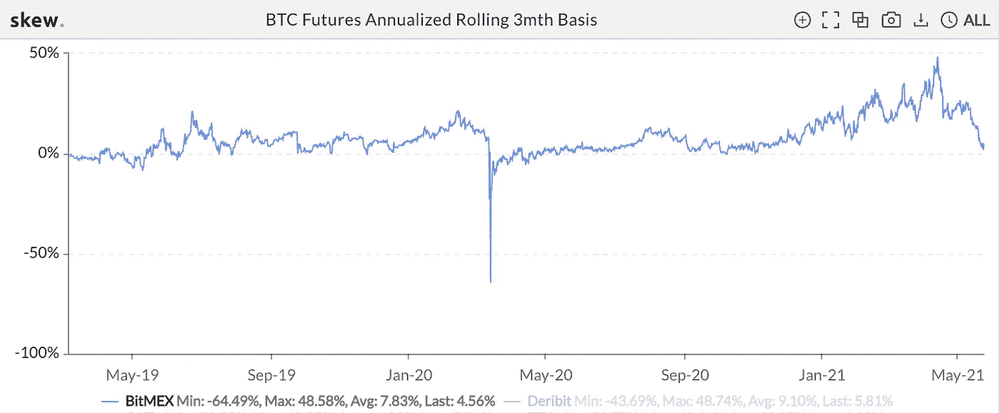
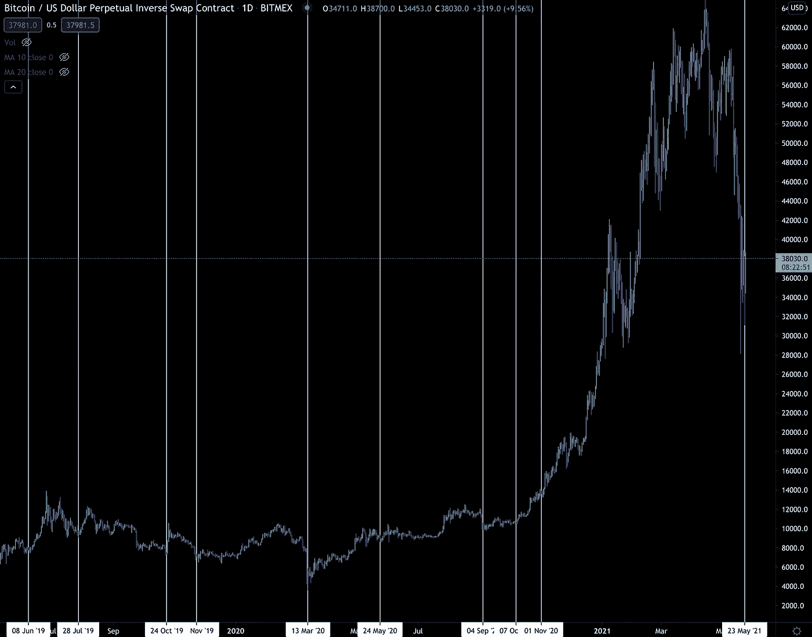
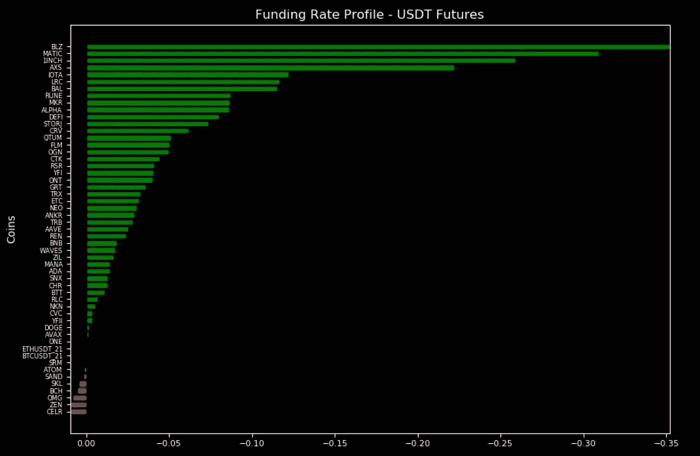
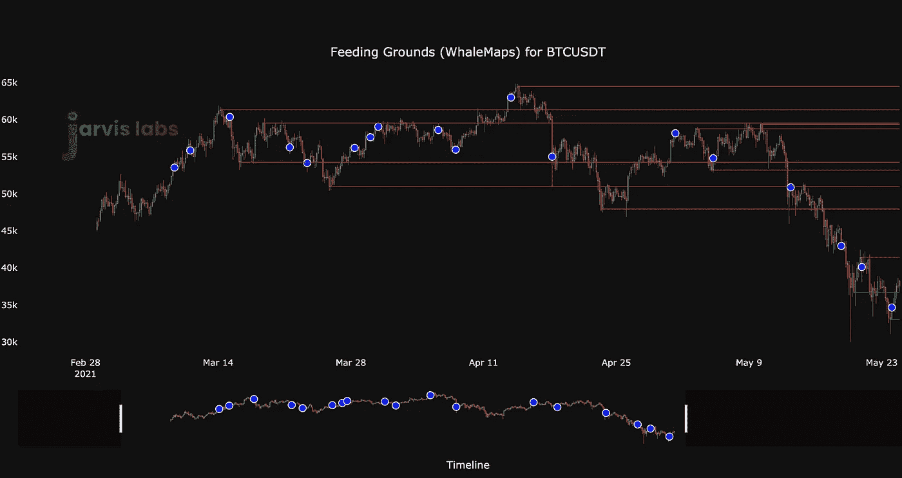

# 密码是无人区

> 原文：<https://medium.com/coinmonks/cryptos-no-man-s-land-d4427c176122?source=collection_archive---------3----------------------->

首先是不好的。

那就更糟了。

然后在你意识到之前，它在考验你的信念。

这可能是许多人上周经历比特币和加密货币市场的方式。

首先，我们遇到了所有人似乎都称之为埃隆抛售的情况，这很糟糕。

然后，当我们坐在一个支持水平，进来了中国 FUD。那更糟。

然后在你意识到之前，一根棒球棒被打在了 altcoins 的膝盖上。

纯种 ETH 看到了 60%的理发从其高点。LINK 做的更好一点，看到了 70%以上。然后是超级巨星 ENJ……从最近的峰值下跌了 80%。

这些是被抹去的大面值硬币。

这比我们预想的糟糕情况还要糟糕。

在流血事件中，一条又一条的推特询问底部是否已经到来。这是最糟糕的吗？和许多其他非常相似的。

但这里重要的是，你认为加密货币是合法资产的想法和信念是否达到了历史最低点？你的胃里有没有一个大坑，让你无法忍受，于是你关上电脑或手机，说"去它的，我受够了。"

虽然大约有 40-50 名客户(他们是旁观者)提出了类似的问题，但我猜你们中的许多人都有非常相似的想法和经历。

对我个人来说，在我的第一次大抛售中，我也有过同样的想法和感受。当时感觉我是唯一一个在加密方面运气不好的人…

我想说的是，如果你没有被抛售套牢，那么你加入 crypto 的时间不会超过几天。

所以不要那么消极。继续磨。

现在，让我们来看看一些更乐观的事情，来帮助我们把头放直，抬起下巴。

在下面的图表中，我们有比特币在 Bitmex 的年度滚动基础。

滚动基准的计算方法是采用比特币的当前现货价格，并将其与期货合约进行比较。然后按年计算。

如果三个月后的合约交易价格比现货价格溢价 2.5%，那么它将在下面的三个月基差图上显示为年化 10%左右。

看下面的图表，我们可以看到溢价很少低于 1%，这是在 5 月 23 日短暂发生的。

认识到这一点很重要，所以花点时间看看它有多少次接近 0%…

如果我们将 Bitmex 的基差跌至 1%以下的时间与价格图表进行比较(注意，使用 Bitmex 是因为它有最长的历史，甚至自美国司法部发行以来仍然相关)，这就是我们得到的结果。

这看起来很有希望找到底部。这又回到了为什么我们如此频繁地使用融资利率。因为就在人们认为加密即将走到尽头，被扔进柴房的时候，它又反弹了。

这就是为什么我们在 dip 期间在 Coindesk 发表了[评论。在现货溢价时期，即期货合约的交易价格低于现货价格时，这可以被视为一个买入机会。](https://t.co/ToSZh7f6zW?amp=1)

> “我们发现现货溢价往往更能预示反转或买入机会，尤其是在牛市中。”

现在，虽然底部可能在，也可能不在，但我们可以说现在仍然是现货入场的好时机，但不一定要在期货市场做多。

这是因为对于期货市场，我们想要一个更好的市场走向的指示。风险越大，要求越准确。现在，我们正看着决定底部是否在…

为了帮助我们决定答案是否是肯定的，我们需要看涨的交易。

不幸的是，我们还没有得到它们。尽管 USDC 价值约 60 亿英镑，但看跌交易仍未平息。

虽然我们上周晚些时候与你分享的分形已经到来并过去，但它预测的下跌并没有发生，我们仍然没有信心说我们是否认为会形成更低的低点。

现在我们正在无人区飞行。

在我们的脑海中，现在有几个潜在的场景。我会把它们放在这里。

首先…

快速的 V 型下跌可以吸引更多的空头进入市场。新添加的燃料以 USDC 的形式被用来购买蘸，我们得到挤压。

这主要是由于资金利率。

看下面的简介。我们看到许多绿色的栅栏。这意味着那些持有空头头寸的人正在支付那些持有多头头寸的人。这并不常见，往往预示着反转可能即将到来——原因类似于我们之前谈到的 3 个月基差达到 0%。

第二种情况…

我们得到一个缓慢的底部雕刻，重新回到低点。你也可以认为这是一个巩固阶段。市场上充斥着超过四个月的比特币供应量。这意味着市场可能需要一段时间才能站稳脚跟。

在链上交易方面，这种分割可能会使我们停留在我们最后感兴趣的领域之下。看看下面的 Whalemap 图，你可以看到 42，000 美元和 40，000 美元的价位是下一个阻力，而 33，000 美元是我们的新支撑。

然后在 2020 年 12 月底的周收盘价略低于 33 美元，很明显这个价格支撑是有意义的。

这就是为什么如果这是我们在接下来的几周内闲逛并创造一个底部的范围，我不会感到惊讶。

事实上，这只是那种邀请头部和肩部图表被创建的事情。

由于市场中的这种不确定性(即头肩讨论),价格几乎能够悄无声息地回到 50k 美元以上。

但是，这可能需要一些时间。

与此同时，仍然存在不确定性。

看跌交易继续。我们有两个感兴趣的价格点:42，000 美元/40，000 美元和 33，000 美元。随着融资利率向一个方向倾斜，如果我们再次遭遇强劲下跌，就会引发短期紧缩，未来可能会出现一些波动。

所以我们才正式进入了无人区。

我们继续等待确定性。

你的脉搏在加密，

本·莉莉

附注——上周，我们正式提高了 Jarvis AI 的订阅费用和咨询费用。这是为了避免稀释阿尔法，也是为了保持我们对最早订户的承诺。有任何问题，请务必给我们发电报留言。