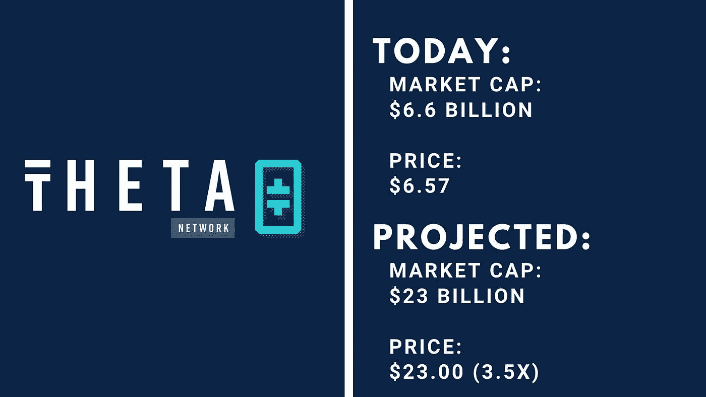
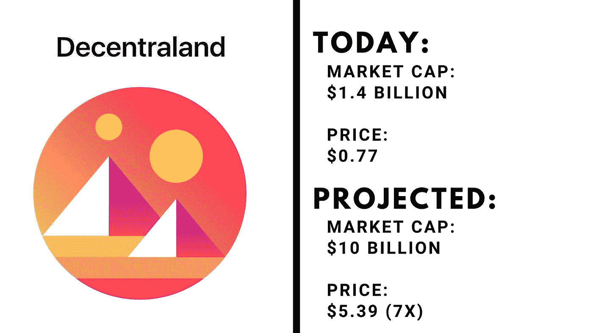
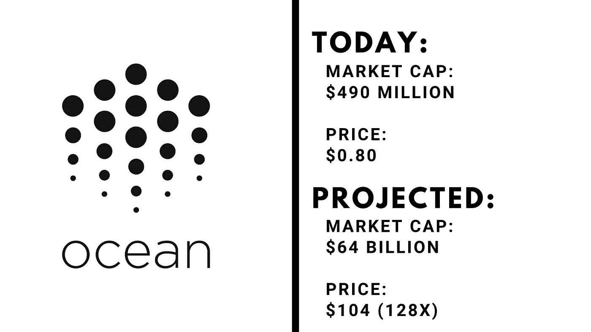
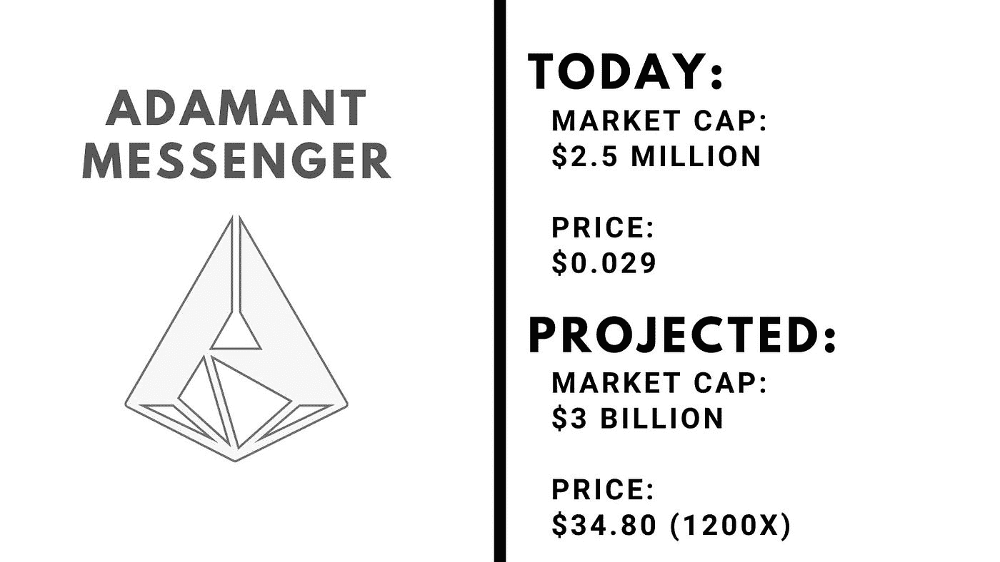

# Crypto 的万亿美元机会:可能接管脸书的替代硬币

> 原文：<https://medium.com/coinmonks/cryptos-trillion-dollar-opportunity-the-altcoins-that-could-take-over-facebook-662b2c8eb500?source=collection_archive---------8----------------------->

> 我的内容只有一小部分发表在媒体上。如果你想获得所有加密实用主义者的 altcoin 报告和投资分析，请在此免费注册简讯。

## **集权的缺陷**

脸书周一的停电不仅仅是一个不便:这是一个中央集权组织失败的证明。区块链技术准备通过去中心化解决这些问题，一次解决一个问题。

本周，我考察了四个位于区块链的项目(它们都是你可以投资的另类投资品)，它们与脸书生态系统的某些部分存在竞争。

**披露:**这不是投资建议，我也没有做我通常在投资替代硬币时会做的尽职调查。这只是从理论上看区块链/cryptos 如何具有竞争力，并提供相对于集中式组织的巨大优势。

截至发稿时，我不拥有这些加密货币。按照市值从大到小排列。

**1。**[**θ网络($THETA** )](https://coinmarketcap.com/currencies/theta/)

**竞争对手:**脸书直播，Instagram 直播

**问题解决:**

Theta 是一种加密技术，允许用户和创作者上传和流式传输内容，而不依赖于集中服务。它解决了与监管相关的问题，流媒体问题，并为创作者/广播公司创建了一个更公平的经济模式。

**潜在市场:**:500 亿美元

直播视频的全球市场规模约为每年 500 亿美元。网飞和亚马逊 Prime Video 代表了传统媒体和本土直播流媒体之间的扩张机会，这个空间正在迅速增长。

**价格预测/上涨空间:**:230 亿美元市值/每股 23 美元

Twitch 的年收入约为 23 亿美元，其他流媒体提供商的价格销售比约为 10。如果 Theta 发展到像 Twitch 今天这样大，它将代表其当前市值的 3.5 倍回报。

该公司由 YouTube 联合创始人陈士骏创建，拥有庞大的直播合作伙伴(如世界扑克巡回赛)，因此它甚至可以与更传统的广播公司竞争。

**区块链的好处:**

Theta 为集中式视频流面临的经济和计算问题提供了解决方案。在技术方面，通过共享带宽的分散流式传输允许更高质量和更快的流式传输。用户观看流媒体(从而有助于共享网络带宽)会获得一个名为 TFuel 的令牌，允许您购买订阅、给流媒体小费和购买商品。

**障碍:**

Theta 不仅在挑战脸书和 Instagram live，还在挑战流媒体平台(亚马逊和 Twitch，谷歌和 Youtube)以及康卡斯特和 ESPN 等传统媒体播放器。没有一个组织会不战而降。

​

**2。** [**【分散(法力)**](https://coinmarketcap.com/currencies/decentraland/)

**竞争对手:** Oculus VR

**问题已解决:**

脸书的虚拟现实公司 Oculus 已经试图通过扎克伯格的“元宇宙”来集中和控制数字空间

但是网络空间应该归用户所有。我们没有理由不能作为个人共同拥有和管理“数字房地产”,以创建有利于用户的社区，而不是集中的企业。

**潜在市场:**:120 亿美元

目前，虚拟现实市场的规模约为 120 亿美元，但这绝对是一个机会渺茫的机会。这个空间可能会受到赢家通吃的网络影响，如果这项技术起飞，它可能是我们未来互动的基础。

**价格预测/上涨:**:100 亿美元/每枚代币 5.39 美元

如果该行业按照预测，到 2028 年扩大到 700 亿美元，15%的市场份额将使分散土地的价值约为 100 亿美元，代表 7 倍的回报。

**区块链的好处:**

建立在以太坊的背后，所有权是去中心化的关键。该平台以 NFT 风格的可穿戴设备和可购买的名字为特色，他们虚拟世界中的土地正在出售。治理也是关键:该协议由一个 DAO(分散自治组织)监督，该组织假设保护分散土地的所有者和使用者，而不是最大化其背后公司的利润潜力。

**障碍:**

虽然开源、可共享的数字虚拟世界的概念对投资者来说非常有吸引力，但那些使用分散土地的人对其可行性有一些疑问。从对创始人的批评到缓慢的加载时间和糟糕的图形，分散的土地为争取市场主导地位进行了一场艰苦的战斗。也许其他基于虚拟现实的“数字房地产”最终会胜出。

**3。** [**【海洋协议($海洋)**](https://coinmarketcap.com/currencies/ocean-protocol/)

竞争对手:脸书

**问题解决:**

"如果你不为产品付费，那么你就是产品."

得益于用户的信息，脸书是大数据领域的重要参与者。数十亿像你和我一样的人自愿放弃他们的数据以免费使用其产品，而脸书拥有并出售我们的数据，丝毫不考虑隐私、道德或安全。

**潜在市场:**640 亿美元

由于脸书是一家多方面的公司，很难提取其市值中有多大比例来自数据，有多大价值来自广告平台，以及有多大价值存在于其他地方。今天的大数据市场价值 640 亿美元，因此我们将使用这个数字作为近似值。

**价格预测/上涨空间:**:每枚代币 640 亿美元/104 美元

全球大数据市场将按计划呈指数级增长，到 2026 年市场规模将达到约 2400 亿美元。640 亿美元相当于其中的四分之一，128 倍用于海洋议定书。

**区块链的好处:**

Ocean 使用区块链重新调整围绕数据的激励机制，为大型数据集创建市场，并将隐私和使用权归还给个人。

海洋生态系统将数据集和服务包装成 ERC20(基于以太坊的)令牌。然后，这些令牌可以自己拥有和管理，也可以跨使用现有加密基础设施的交易所、平台甚至 DeFi 平台使用。

**障碍:**

许多科技和股票分析师喜欢大型科技公司，因为它们有能力建立“数据护城河”:海量数据集提供的洞察力和价值本身就是一种竞争优势。脸书在海洋协议方面领先大约 15 年，这是一个巨大的准入壁垒。

​

**4。** [**【宁折不弯的使者】**](https://coinmarketcap.com/currencies/adamant-messenger/)

竞争对手:Whatsapp/Facebook Messenger

**问题已解决:**

Adamant Messenger 生态系统是一个匿名的、加密的、私有的点对点消息服务，包含现有的 iOs、iPhone、Android、Web 等应用程序。

**潜在市场:**【2000 多亿美元】

Whatsapp 是以每用户 55 美元的价格，以 190 亿美元收购的。现在，它的年收入为 50-100 亿美元，价值可能在 850-2000 亿美元之间。Telegram 价值约 50 亿美元，拥有 5 亿用户。全球信息市场是巨大的:如果你包括电话公司和其他公司的信息功能，它可能超过一万亿美元。只要占领一小部分市场，这个项目就会取得巨大的成功。

**价格预测/上涨:**:每枚代币 30 亿美元/34.8 美元

由于摩擦性的变动成本，很难打入基于网络的市场:只有当其他人使用这个平台时，它才有价值。但是，如果你能开始创造网络效应，它可能会起飞。这是我看过的最小的项目，所以也是最不确定的(尽管所有这些项目都有相当大的风险。)

我们将 Telegram 的保守估值作为 30 亿美元的对比。这将代表 1200 倍，也许值得一赌。

**区块链的好处:**

简而言之，好处就是去中心化:你拥有你的数据的所有权，使用和注册都是匿名的，完全是私有的。

**障碍:**

目前，令牌发送信息的成本为 0 . 001 ADM，但成本相当低:每条信息大约 0 . 001 ADM。这可以让你花一美元发送大约 34000 条信息。对于隐私和安全来说，这是一个很小的代价，但我认为这是主流采用的一个很大的障碍，因为 Telegram、WhatsApp 和 Signal 等服务都是免费的。

为了广泛采用，我认为免费提供消息服务是有意义的，而验证文档签名和 P2P 支付(这两个功能已经存在)可以收取少量费用。

**加密货币的万亿美元机会。**

看着这些硬币，我们发现区块链不仅仅是一匹只会一招的小马。该技术使我们能够围绕所有权、治理、集中化和隐私重写规则。

上述加密货币在与脸书的竞争中可能会成功，也可能不会成功，但有一点是肯定的:加密货币和高增长的替代货币将比我们的金融系统改变更多。

> 加入 Coinmonks [电报频道](https://t.me/coincodecap)和 [Youtube 频道](https://www.youtube.com/c/coinmonks/videos)了解加密交易和投资

*   [加拿大最佳加密交易机器人](https://blog.coincodecap.com/5-best-crypto-trading-bots-in-canada) | [Bybit vs 币安](https://blog.coincodecap.com/bybit-binance-moonxbt)
*   [火币的加密交易信号](https://blog.coincodecap.com/huobi-crypto-trading-signals) | [Swapzone 审查](/coinmonks/swapzone-review-crypto-exchange-data-aggregator-e0ad78e55ed7)
*   最佳[密码交易机器人](https://blog.coincodecap.com/best-crypto-trading-bots) | [购买索拉纳](https://blog.coincodecap.com/buy-solana) | [矩阵导出评论](https://blog.coincodecap.com/matrixport-review)
*   [Coldcard 评论](https://blog.coincodecap.com/coldcard-review) | [BOXtradEX 评论](https://blog.coincodecap.com/boxtradex-review)|[uni swap 指南](https://blog.coincodecap.com/uniswap)
*   [阿联酋 5 大最佳加密交易所](https://blog.coincodecap.com/best-crypto-exchanges-in-uae) | [SimpleSwap 评论](https://blog.coincodecap.com/simpleswap-review)
*   购买 Dogecoin 的 7 种最佳方式 | [ZebPay 评论](https://blog.coincodecap.com/zebpay-review)
*   [最佳期货交易信号](https://blog.coincodecap.com/futures-trading-signals) | [流动性交易所评论](https://blog.coincodecap.com/liquid-exchange-review)
*   [3 商业评论](/coinmonks/3commas-review-an-excellent-crypto-trading-bot-2020-1313a58bec92) | [Pionex 评论](https://blog.coincodecap.com/pionex-review-exchange-with-crypto-trading-bot) | [Coinrule 评论](/coinmonks/coinrule-review-2021-a-beginner-friendly-crypto-trading-bot-daf0504848ba)
*   [莱杰 vs n rave](/coinmonks/ledger-vs-ngrave-zero-7e40f0c1d694)|[莱杰 nano s vs x](/coinmonks/ledger-nano-s-vs-x-battery-hardware-price-storage-59a6663fe3b0) | [币安评论](/coinmonks/binance-review-ee10d3bf3b6e)