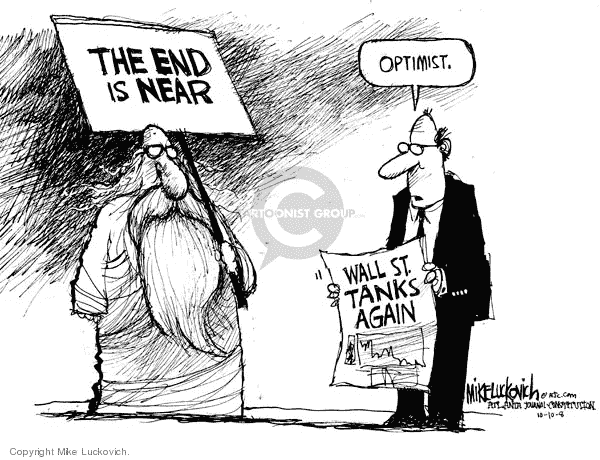

# cryptos——你的钱该相信谁

> 原文：<https://medium.com/coinmonks/cryptos-who-to-trust-with-your-money-5e1b5305e3d4?source=collection_archive---------11----------------------->

嘿，伙计们，我回来了，因为我答应在我们就投资 cryptos 做出明智的决定之前，再多讨论一点 Cryptos。如果你还记得，在之前的两篇博客中，我们讨论了名为区块链的新技术，以及它的第一个应用比特币。我们还讨论了它是一种虚拟货币，没有基础资产，如黄金支持，目前除了储存财富外，它在现实生活中的用途非常有限，如果以任何国家的法定货币(纸币)形式保存，只会因政府和中央银行不受控制地印刷纸币而随时间贬值。而另一方面，比特币，特别是更多这样的密码，通过设计在数量上是有限的，因此理论上它的需求在一段时间内可能会增加，而供应保持不变。我们还从道德和法律的角度研究了加密投资，并得出结论，虽然加密投资肯定不涉及道德问题，但由于加密的本质使其不可改变和不受控制，世界上大多数政府都不愿意给予其法定货币的地位。这意味着在可预见的未来，政府货币如₹、美元、€、、、等很可能成为金融系统的主体，而加密货币可能共存以满足财富存储的需要。

这是否是一个安全的选择？？？？我最初的直觉告诉我当然不会……..但正如大多数高风险投资一样……..这也能带来极高的回报，肯定会吸引许多像你我这样的投资者。然后，我们在之前的博客中讨论的最后一点是……如果我们决定投资 it，我们应该采取什么策略，为了这个答案，我们必须独自进行一些自我反省，看看我们对冒险的偏好是什么，以及在下巴上挨一拳时我们能承受多少损失。简单地说，这意味着，不要把一切都押在密码上，即使你是其中一个信徒。根据对风险的了解和偏好来限制你的风险敞口，当然在任何情况下都不要超过你投资组合的 10%。

现在这个问题，你已经等了一个星期了。作为一匹获胜的马应该选择哪种密码，作为一只疯狗应该避免哪种密码？请首先在谷歌上搜索一下，全球有多少密码在活跃地交易？？？？？？？？？剧透警报！！！！！！！！答案可能会阻止你们中的许多人投资这一资产类别……..我敢肯定，谷歌搜索一定没有提供任何明确的答案，相反，它可能会抛出不同网站引用的不同数据。但是，它确实把我带到了我最喜欢的网站上。[CoinMarketCap.com](http://CoinMarketCap.com)’。根据这个网站，在我写这篇博客的时候，有 6598 个密码被交易。自 2009 年以来，在相对较短的时间内，这是一个地狱很多的密码，不是吗？？？？？？？？随之而来的问题自然是……所有这些货币能否在如此激烈的竞争中生存下来，不仅是它们之间的竞争，也包括每天推出的新密码？？？？这也很容易猜到…当然不是…这确实应该给我们灌输一些纪律和谨慎。请永远记住 **OneCoin** 和它的创始人 **Ruja Ignatova** 彗星般的成功故事，他们在 2014 年宣称它是比特币杀手。OneCoin 拥有一切，一大群狂热的追随者，稳定货币的承诺，加密钱包，这甚至声称是实用的，可以在社区内使用 **OneCoin** 进行购买。然后在 2017 年，在收集了超过 40 亿美元的投资后，她突然消失了，迫使她的所有投资者失去了所有的财富。

好吧…那么，我们能做些什么来确保我们不会陷入类似 OneCoin 的陷阱。让我们看看，作为一个投资者，我们在投资股票市场时能做些什么来最小化我们的风险…

步骤 1 — **年份** —由于 cryptos 的想法不再是一个新奇的事物，因此检查年份及其自推出以来的增长可能会有所帮助。虽然新的货币可能更便宜，但它们肯定有更高的折叠或被操纵的风险。如果你被较新的加密技术所吸引，并且仍然想要管理你的风险，那么唯一的解决方案仍然是更深入地挖掘它的白皮书，并且自己看看你是否确信这个想法。对于像我这样不太好学的人来说，只需选择一个已经存在一段时间的密码，谷歌或 youtube 将揭示关于它的每一个值得知道的细节。

第二步— **市值** —在我看来，仅这一项就能满足超过 50%的风险管理。市值越高，它就越有可能保持稳定，抵御未来的不安全感。Cryptos 是一种较新的投资资产类别，关于理想的市场资本总额，专业建议之间仍然存在很大的差异。我个人会推荐，如果选择市值超过 10 亿美元的 cryptos，就像在股市投资大盘股一样。这些将提供较小的波动性以及一些超级聪明的个人或组织的杜平风险。对于新手来说，我强烈建议将自己限制在 [CoinMarketCap](http://CoinMarketCap.com) 的第一页，上面列出了市值最高的 100 种密码。

第三步— **供给 vs 需求** —根据白皮书及其哲学，有各种类型的硬币。比特币上限为 2100 万，数量有限，无论需求增加多少，其供应都将保持冻结。因此，对于财富存储，这在其他密码中排名很高。然而，这有一个最高的交易费用。另一方面，有许多密码受到每年可以添加多少新硬币的限制。它们提供合理的较低交易费用，同时仍然保持有利的供求比率，使它们成为一个有吸引力的投资选择。

步骤 4 — **在存储(硬币)vs 实用程序 vs 安全加密**之间做出选择—简而言之，**存储令牌**通常被称为**硬币**可以被想象为物理硬币。本质上，这些可以用来储存财富或支付产品或服务。虽然公用事业代币仅限于购买发行公司的产品和服务，但这些与硬币非常相似的代币可以兑换成实际的实物货币。例如，优步代币是一种公用事业代币，可用于从优步预订出租车，但如果你想用它购买特斯拉汽车，你必须用实物货币或比特币等硬币进行兑换。这一类别中的最后一个是安全令牌，这是对母加密公司的一种投资形式。这可以被认为是一个数字化的份额，并会给你几乎类似的权利，如投票权和利润分成。您将决定从所有密码中的哪一个类别中选择您的潜在投资。对于初学者来说，从硬币或实用代币开始可能更安全，只有在获得足够的这一领域的知识后才能进入安全领域。

第五步——多样化你的加密投资组合——就像股票市场一样，永远不要把所有的鸡蛋放在一个篮子里。我建议把你的钱分成五等份，投资于你选择的五个最好的潜在密码。不时监控这些情况，并在需要时进行调整。

第六步——**低买高卖**——我的最后一条建议也是来自于股票市场的经验，但它更适用于加密债券，因为它们具有波动性。不管你对某个特定的密码有多感兴趣，看看它的价格图表，使用拐点线(支持-阻力理论)。在高点买入，然后看着它暴跌，这当然不是一件有趣的事情。有耐心，宜早不宜迟，它至少会下降一个拐点线，评估它的动能，然后要么等待价格触及更低的拐点线，要么以上升的动能投资。

第七步——**有耐心**——再一次，不要因为所选密码的高波动性而焦虑，要有耐心，即使你想卖出退出，也要在高位退出。作为一个广泛的指导方针，就像海洋中的潮汐一样，大多数密码在三个月的时间内一高一低。对于少数更不稳定的公司，这个时间可能会缩短到两周。因此，要有耐心，如果你对你的投资进展不满意，在做出任何决定之前，至少给它一个周期的时间来执行。

哦……这当然是比较长的帖子之一，我们还没有讨论如何选择密码交换来开始我们在这个领域的旅程。因此，朋友们下周将与您见面，讨论加密交换以及一些推荐的加密，以开始我们的投资。

请像和**一样**与你所有爱的人分享**这篇文章，并且请不要忘记点击**跟随**按钮，如果还没有这样做的话。**

> 加入 Coinmonks [电报频道](https://t.me/coincodecap)和 [Youtube 频道](https://www.youtube.com/c/coinmonks/videos)了解加密交易和投资

## 另外，阅读

*   [投资印度的最佳加密软件](https://blog.coincodecap.com/best-crypto-to-invest-in-india-in-2021) | [WazirX P2P](https://blog.coincodecap.com/wazirx-p2p)
*   7 个最佳零费用加密交易平台
*   [去中心化交易所](https://blog.coincodecap.com/what-are-decentralized-exchanges)|[Bitbns FIP](https://blog.coincodecap.com/bitbns-fip)|[Bingbon 评论](https://blog.coincodecap.com/bingbon-review)
*   [用信用卡购买密码的 10 个最佳地点](https://blog.coincodecap.com/buy-crypto-with-credit-card)
*   [加拿大最佳加密交易机器人](https://blog.coincodecap.com/5-best-crypto-trading-bots-in-canada) | [Bybit vs 币安](https://blog.coincodecap.com/bybit-binance-moonxbt)
*   [火币加密交易信号](https://blog.coincodecap.com/huobi-crypto-trading-signals) | [Swapzone 审查](/coinmonks/swapzone-review-crypto-exchange-data-aggregator-e0ad78e55ed7)
*   最佳[密码交易机器人](https://blog.coincodecap.com/best-crypto-trading-bots) | [购买索拉纳](https://blog.coincodecap.com/buy-solana) | [矩阵导出评论](https://blog.coincodecap.com/matrixport-review)
*   [Coldcard 评论](https://blog.coincodecap.com/coldcard-review) | [BOXtradEX 评论](https://blog.coincodecap.com/boxtradex-review)|[uni swap 指南](https://blog.coincodecap.com/uniswap)
*   [阿联酋 5 大最佳加密交易所](https://blog.coincodecap.com/best-crypto-exchanges-in-uae) | [SimpleSwap 评论](https://blog.coincodecap.com/simpleswap-review)
*   [购买 Dogecoin 的 7 种最佳方式](https://blog.coincodecap.com/ways-to-buy-dogecoin) | [ZebPay 评论](https://blog.coincodecap.com/zebpay-review)
*   [最佳期货交易信号](https://blog.coincodecap.com/futures-trading-signals) | [流动性交易所评论](https://blog.coincodecap.com/liquid-exchange-review)
*   [3 商业评论](/coinmonks/3commas-review-an-excellent-crypto-trading-bot-2020-1313a58bec92) | [Pionex 评论](https://blog.coincodecap.com/pionex-review-exchange-with-crypto-trading-bot) | [Coinrule 评论](/coinmonks/coinrule-review-2021-a-beginner-friendly-crypto-trading-bot-daf0504848ba)
*   [莱杰 vs n rave](/coinmonks/ledger-vs-ngrave-zero-7e40f0c1d694)|[莱杰 nano s vs x](/coinmonks/ledger-nano-s-vs-x-battery-hardware-price-storage-59a6663fe3b0) | [币安评论](/coinmonks/binance-review-ee10d3bf3b6e)