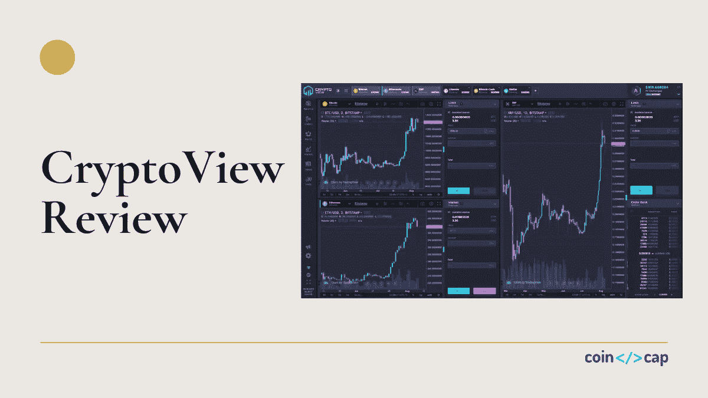
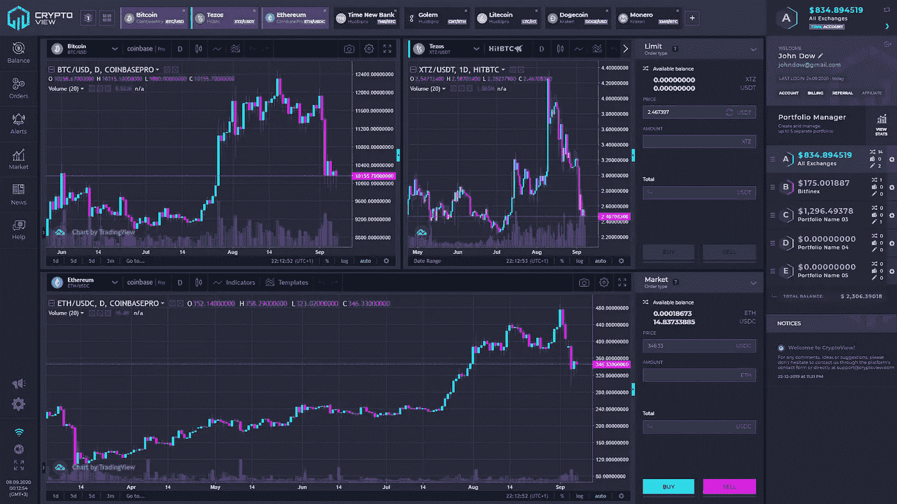
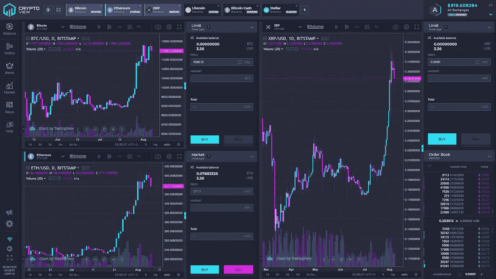
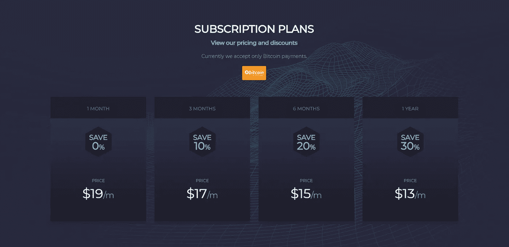

# CryptoView review 2021 |一体化免费加密投资组合管理器

> 原文：<https://medium.com/coinmonks/cryptoview-review-ebec409f780f?source=collection_archive---------1----------------------->

随着加密交换提供商数量的增加，交易不再简单和省时。对于大多数交易者来说，众多的交易界面、对不同投资组合的监控、或与市场动态保持同步已经被证明是麻烦、缓慢和乏味的。

在本文中，我们将回顾 [**CryptoView**](https://www.cryptoview.com/) ，这是一个一体化的加密货币投资组合管理系统，它通过在单个用户界面中收集所有加密相关数据来缓解上述问题。

在多个交易所注册的加密交易员肯定知道切换标签、管理到期交易以及跟踪各种交易界面的问题。

此外，通过不同的交易账户、钱包提供商和冷钱包监控加密资金可能会令人不愉快且复杂。对于活跃的密码交易员和基金经理来说，这个问题尤其突出。

# 摘要

*   CryptoView 使用户能够将外汇余额、交易历史、当前开立的订单和外部钱包余额同步到单个功能组合中。
*   该平台为其用户提供了一个一体化的界面，有助于实现更顺畅、更快速、更高效的交易和投资组合管理。
*   简单的注册和入职
*   加密的 API 密钥连接
*   通过双因素身份验证、SSL 和 DoS 保护增强安全性

# CryptoView 是如何工作的？

[CryptoView](https://blog.coincodecap.com/go/cryptoview) 为其用户提供了一个一体化的界面，提供了更顺畅、更快速、更高效的投资组合管理。该平台实际上是市场上最好的加密货币投资组合跟踪器,既适合初学者，也适合有经验的加密交易员，甚至是经验丰富的基金经理。

[CryptoView](https://blog.coincodecap.com/go/cryptoview) 的核心机制包括多交易所投资组合管理工具，结合大量[加密交易工具](/coinmonks/essential-cryptocurrency-trading-tools-for-2018-beyond-2df05f0f63b1)。

例如，该平台支持不同的加密交换选项、深入的投资组合分析、多源新闻聚合器、加密事件时间表以及允许完全定制的卓越界面。

CryptoView 不仅仅是一个数字货币投资组合跟踪器，而是一个完全可定制的平台，支持大多数领先的加密交易平台上的交易。

# 无缝入职

[CryptoView 的注册](https://blog.coincodecap.com/go/cryptoview)流程极其简化，只需点击几下就能在平台上注册。此外，用户还可以免费试用 30 天。试用对于习惯 CryptoView 的所有功能和布局，以及探索该平台上可用的大量工具非常有用。

# 特征

完成注册后，用户必须将他们的交易所和钱包账户与[加密货币投资组合管理软件](/coinmonks/the-best-free-cryptocurrency-portfolio-trackers-in-2019-cbb9a2013e3f)连接。

# 投资组合跟踪

[CryptoView](https://blog.coincodecap.com/go/cryptoview) 利用与世界领先交易所的 API 连接进行运营。API 机制允许与第三方用户账户和[加密钱包](https://blog.coincodecap.com/tag/crypto-wallet)进行即时数据同步。

该平台使用户能够将外汇余额、交易历史、当前未结订单和外部钱包余额同步到单个功能组合中。

如果由于某种原因，用户难以将 API 连接到交易所或钱包，CryptoView 已经为每个支持的交易所开发了 API 密钥生成和集成的分步指南。一旦连接完成，[投资组合管理平台](/coinmonks/the-best-free-cryptocurrency-portfolio-trackers-in-2019-cbb9a2013e3f)将自动开始跟踪和存储投资组合数据。

目前，CryptoView 支持各种加密交易所，如币安、Bitfinex、Bitstamp、Bittrex、BitMex、比特币基地、CoinbasePro、CoinEx、HitBtc、OKeX、Huobi、北海巨妖、KuCoin、Poloniex 和 Cex.io

**CryptoView 一体化解决方案的核心是加密货币投资组合跟踪器**。跟踪器提供了所有 API 连接的加密交换和钱包的加密资产的详细列表。此外，该软件提供了关于当前价格、不同时间段(12 小时、24 小时、7 天和 30 天)的价格变化的附加信息，以及每项资产的 7 天趋势线。

您可能还会对以下内容感兴趣:

*   [加密 API 审查 2020 | 30%折扣优惠券代码](https://blog.coincodecap.com/crypto-apis-review)
*   [2020 年加密投资者指南](https://blog.coincodecap.com/investors-guide-to-crypto)
*   [Shrimpy 评论—社交投资组合管理的加密交易机器人](https://blog.coincodecap.com/shrimpy-crypto-trading-bot-review)
*   crypto hopper vs 3 commas vs Shrimpy——你困惑了吗？

# 分析学

CryptoView 的另一个功能是投资组合分析选项卡。该软件为 24 小时内的加密资产金额和汇率创建详细的每日“快照”。原始数据然后被转换成可定制的直方图，跟踪给定投资组合的整体表现。

用户还能够堆叠多个投资组合并比较它们的表现，所有这些都在一个标签中完成。该平台支持几个饼图选项，显示投资组合中的资产分布，或每个投资组合在管理组合中的权重。

CryptoView 最好的特性之一是集成了 TradingView 的实时多图表选项。该集成为用户提供了超过 **85 个技术指标**，以及超过 **75 个绘图工具**和图表选项，增强了用户体验。

多图表适用于新手和经验丰富的交易者，以及基金经理，因为它使他们能够灵活地计划和执行交易，同时依靠交易可视化 中的 [**领导者之一。**](/coinmonks/what-are-the-best-charting-platforms-for-cryptocurrency-trading-85aade584d80)

用户可以在一个屏幕上切换 27 种多图表布局，以及同时监控多达 9 个图表。

[CryptoView](https://blog.coincodecap.com/go/cryptoview) 还支持多达五个屏幕模板，可以存储这些模板，以便在多屏幕或不同屏幕比例的配置之间快速轻松地切换。例如，如果一个交易者在两三个屏幕上操作，他可以存储他的布局，只需点击一下就可以调出。此外，该平台结合了侧部件、可折叠交易面板和高度定制，使 CryptoView 成为交易员、基金经理和加密分析师的最佳加密投资组合跟踪器之一。

# 高级交易和交易工具

交易者可以使用 CryptoView 的订单簿，以及市场深度指标、最新交易和完整的交易历史。还支持“止损”和“止损”等高级交易订单，这将由于价格突然波动而导致资金损失的可能性降至最低。

为了补充交易， [CryptoView](https://blog.coincodecap.com/go/cryptoview) 还启用了“填充指示器”,该指示器根据给定交易所的订单簿显示有多少订单可以立即执行。

该平台还支持**高级警报功能**，交易者可以将其用作任何交易对中价格变化、百分比变化或其他事件的指示器。用户将通过短信或电子邮件得到通知。

另一方面，基金经理可以从 CryptoView 强大的基金管理功能中受益，这些功能是为管理多个投资组合的个人或公司量身定制的。

用户可以同时创建、监控和管理多达五个投资组合，只需点击一下鼠标即可在它们之间切换。每个投资组合都可以通过一个特殊的“仅供查看”链接单独共享，以供客户审查和监控。该链接包括所有资产余额和绩效直方图的详细列表。

# 安全可靠地交易

CryptoView 不管理用户资金的转移和提取。为了降低风险，此类操作只能在交换接口上进行。此外，CryptoView 需要 API 密钥许可才能访问个人数据，如余额和交易历史。该平台使用企业级安全性，包括 SSL 加密连接、API 密钥加密、双因素身份验证和 DoS 保护。CryptoView 还能够在发现任何非法活动时冻结账户。

# 定价

为了完全控制大量的功能， [CryptoView 开发了一种基于订阅的模式](https://www.cryptoview.com/#pricing)，根据用户选择的时间段，价格从每月 13 美元到 19 美元不等。如果用户选择年度订阅，CryptoView 提供 30%的价格折扣。加密货币工具不会对无缝加密旅程施加任何交易量限制或其他限制。

[CryptoView](https://blog.coincodecap.com/go/cryptoview) 还为用户提供了两种盈利奖励机制——一种[会员计划](https://www.cryptoview.com/affiliate/)和一种[推荐计划](https://www.cryptoview.com/referral/)。该联盟计划为每个通过 30 天试用期并购买任何订阅计划的用户提供 20 美元的比特币。在试用期结束后，推荐计划为每个成功加入 CryptoView 的客户提供两个月的免费服务。

# CryptoView 利弊

## 优点:

*   将各种 exchange 数据无缝集成到一个投资组合中
*   所有信息都在一个浏览器选项卡中可见
*   超过 85 种技术指标和 75 种绘图工具
*   对所有主要交易所的 API 支持
*   增强的安全性
*   完全可定制的布局

## 缺点:

*   不能直接通过 CryptoView 存款/取款

# 结论

随着加密世界的不断发展，新手加密交易员和经验丰富的交易专业人士越来越需要像 [CryptoView](https://blog.coincodecap.com/go/cryptoview) 这样的一体化解决方案，他们需要简化他们在多个交易所的交易体验。基金经理也可以从使用 CryptoView 中受益，因为该平台拥有监控和管理客户加密投资组合所需的所有工具。

请在下面的评论区告诉我们你对 CryptoView 评论的看法。

# 常见问题

**问:什么是 API 交易？**

**A.** API 是“应用编程接口”的首字母缩写。API 支持不同软件产品之间的通信和交互。简单地说，API 是一个信使，它进行请求处理，告诉系统用户想要做什么，然后将系统的响应返回给用户。

交易 API 使用户能够与各种加密交换帐户进行远程交互，并从 CryptoView 帐户管理它们。更具体地说，它允许用户同步数据和执行交易指令。

CryptoView 的 API 连接对于新手交易者和拥有多个交易所账户的交易者都很有用，因为所有的操作和数据都是在同一个系统和界面中完成的。

现在所有主要的加密交易所都向他们的客户群提供交易 API。

**问:CryptoView 收取任何费用吗？**

**A.** CryptoView 不收取任何额外的交易费用和/或佣金，除了每月订阅费。

**问:CryptoView 是否存储用户资金？**

**A.** CryptoView 从不存储用户的资金。所有资金都安全地存放在用户的 exchange 账户和钱包中。该平台不提供资金提取、转账或存款的功能支持。

**问:免费试用包括哪些内容？**

**答** CryptoView 向所有希望尝试该服务的用户提供 30 天免费试用，包括付费版本的所有功能，没有任何限制。

# CryptoView 替代方案

*   [**Shrimpy**](https://blog.coincodecap.com/go/shrimpy)—Shrimpy 是一个社交投资组合管理和加密交易平台，为您的个人加密投资服务。该应用程序侧重于长期策略自动化、投资组合跟踪以及从社交项目中的其他交易者处复制策略。此外，请阅读我们的[新闻评论](https://blog.coincodecap.com/shrimpy-crypto-trading-bot-review)。

## 另外，阅读

*   最好的[密码交易机器人](/coinmonks/crypto-trading-bot-c2ffce8acb2a)
*   [密码本交易平台](/coinmonks/top-10-crypto-copy-trading-platforms-for-beginners-d0c37c7d698c)
*   最好的[加密税务软件](/coinmonks/best-crypto-tax-tool-for-my-money-72d4b430816b)
*   [最佳加密交易平台](/coinmonks/the-best-crypto-trading-platforms-in-2020-the-definitive-guide-updated-c72f8b874555)
*   最佳[密码借贷平台](/coinmonks/top-5-crypto-lending-platforms-in-2020-that-you-need-to-know-a1b675cec3fa)
*   [最佳区块链分析工具](https://bitquery.io/blog/best-blockchain-analysis-tools-and-software)
*   [加密套利](/coinmonks/crypto-arbitrage-guide-how-to-make-money-as-a-beginner-62bfe5c868f6)指南:新手如何赚钱
*   最佳[加密制图工具](/coinmonks/what-are-the-best-charting-platforms-for-cryptocurrency-trading-85aade584d80)
*   [莱杰 vs 特雷佐](/coinmonks/ledger-vs-trezor-best-hardware-wallet-to-secure-cryptocurrency-22c7a3fd391e)
*   了解比特币的[最佳书籍有哪些？](/coinmonks/what-are-the-best-books-to-learn-bitcoin-409aeb9aff4b)
*   [3 商业评论](/coinmonks/3commas-review-an-excellent-crypto-trading-bot-2020-1313a58bec92)
*   [AAX 交易所评论](/coinmonks/aax-exchange-review-2021-67c5ea09330c) |推荐代码、交易费用、利弊
*   [Deribit 审查](/coinmonks/deribit-review-options-fees-apis-and-testnet-2ca16c4bbdb2) |选项、费用、API 和 Testnet
*   [FTX 密码交易所评论](/coinmonks/ftx-crypto-exchange-review-53664ac1198f)
*   [n 零审核](/coinmonks/ngrave-zero-review-c465cf8307fc)
*   [Bybit 交换审查](/coinmonks/bybit-exchange-review-dbd570019b71)
*   [3Commas vs Cryptohopper](/coinmonks/cryptohopper-vs-3commas-vs-shrimpy-a2c16095b8fe)
*   最好的比特币[硬件钱包](/coinmonks/the-best-cryptocurrency-hardware-wallets-of-2020-e28b1c124069?source=friends_link&sk=324dd9ff8556ab578d71e7ad7658ad7c)
*   最佳 [monero 钱包](https://blog.coincodecap.com/best-monero-wallets)
*   [莱杰 nano s vs x](https://blog.coincodecap.com/ledger-nano-s-vs-x)
*   [bits gap vs 3 commas vs quad ency](https://blog.coincodecap.com/bitsgap-3commas-quadency)
*   [莱杰纳米 S vs 特雷佐 one vs 特雷佐 T vs 莱杰纳米 X](https://blog.coincodecap.com/ledger-nano-s-vs-trezor-one-ledger-nano-x-trezor-t)
*   [block fi vs Celsius](/coinmonks/blockfi-vs-celsius-vs-hodlnaut-8a1cc8c26630)vs Hodlnaut
*   [Bitsgap 评论](/coinmonks/bitsgap-review-a-crypto-trading-bot-that-makes-easy-money-a5d88a336df2)——一个轻松赚钱的加密交易机器人
*   为专业人士设计的加密交易机器人
*   [PrimeXBT 审查](/coinmonks/primexbt-review-88e0815be858) |杠杆交易、费用和交易
*   [埃利帕尔泰坦评论](/coinmonks/ellipal-titan-review-85e9071dd029)
*   [SecuX Stone 评论](https://blog.coincodecap.com/secux-stone-hardware-wallet-review)
*   [BlockFi 评论](/coinmonks/blockfi-review-53096053c097) |从您的密码中赚取高达 8.6%的利息

*原载于 2020 年 10 月 16 日*[*https://blog.coincodecap.com*](https://blog.coincodecap.com/cryptoview-review)*。*