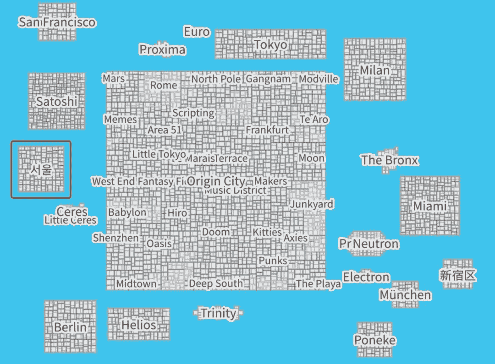
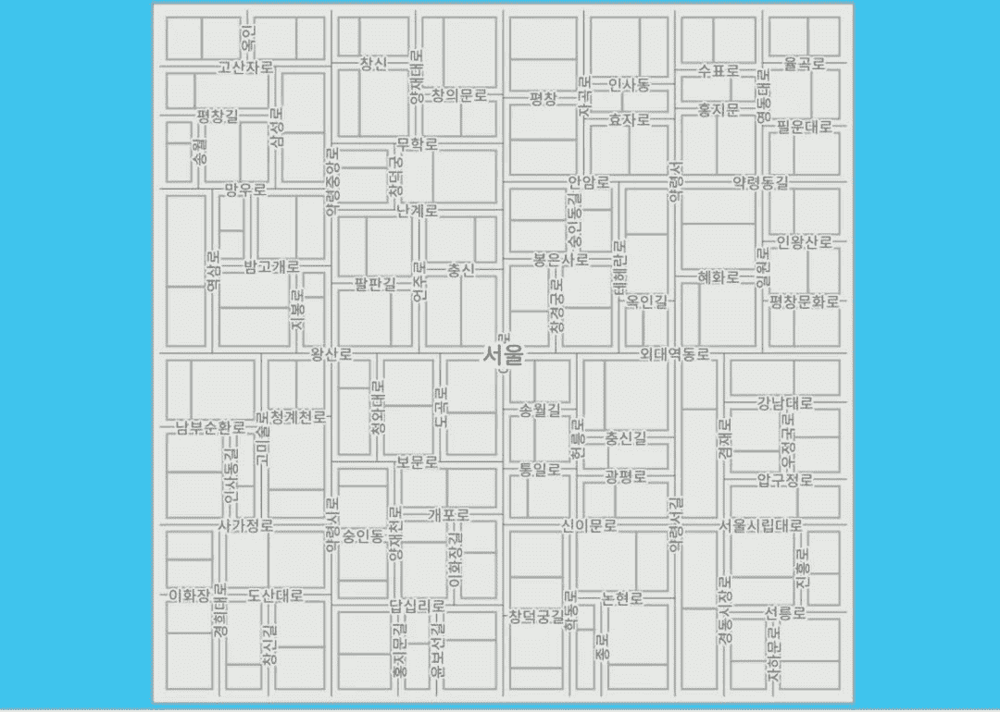
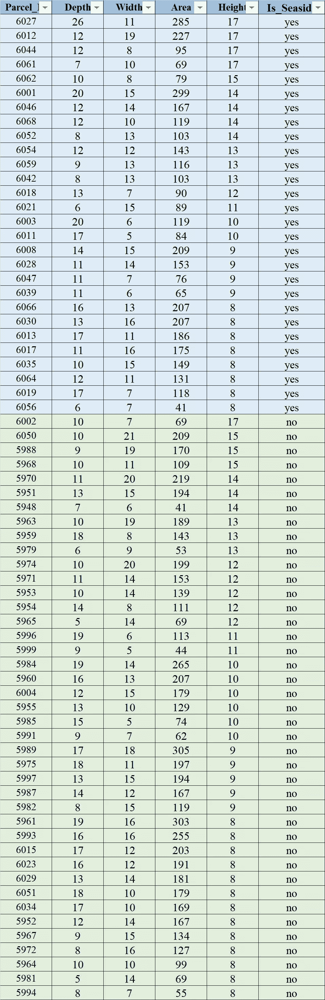
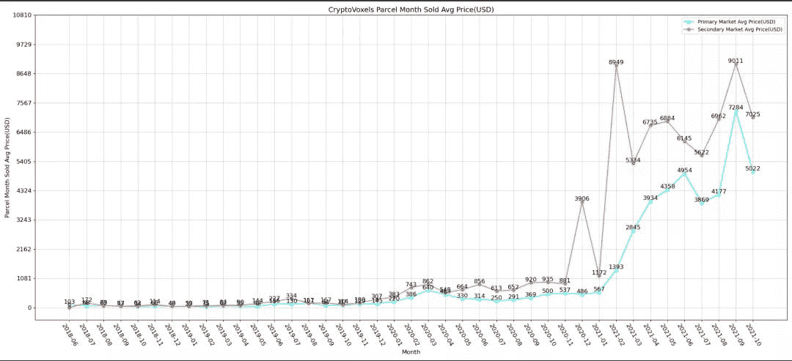
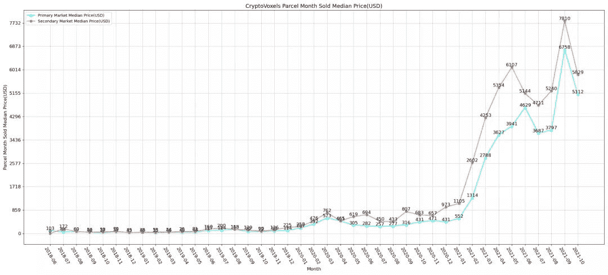

# 隐体素 2021.10.13 包裹薄荷突发新闻

> 原文：<https://medium.com/coinmonks/cryptovoxels-2021-10-13-parcel-mint-breaking-news-264d8c998b32?source=collection_archive---------9----------------------->

作者:DawnXue( [@dawnx666](https://twitter.com/dawnx666) )

今天서울岛一共铸造了 **69 个**包裹，其中 **28 个是海边**，占本次铸造包裹总数的 **41%** 。

Figure 1: The full picture of CV

Figure 2: The full picture of 서울

以下是今日的铸币包裹分类:

***温馨提示:已按高度和面积降序排列。***

Figure 3: CV today’s mint parcel details

附录:

CV 月平均交易价格(美元)

Figure 4: CV monthly average transaction price (USD)

CV 的月交易价格中位数(美元)

Figure 5: CV monthly average transaction price (USD)

> 加入 Coinmonks [电报频道](https://t.me/coincodecap)和 [Youtube 频道](https://www.youtube.com/c/coinmonks/videos)了解加密交易和投资

## 另外，阅读

*   [币安 vs 比特邮票](https://blog.coincodecap.com/binance-vs-bitstamp) | [比特熊猫 vs 比特币基地 vs Coinsbit](https://blog.coincodecap.com/bitpanda-coinbase-coinsbit)
*   [如何购买 Ripple (XRP)](https://blog.coincodecap.com/buy-ripple-india) | [非洲最好的加密交易所](https://blog.coincodecap.com/crypto-exchange-africa)
*   [非洲最佳加密交易所](https://blog.coincodecap.com/crypto-exchange-africa) | [晤交易所评论](https://blog.coincodecap.com/hoo-exchange-review)
*   [eToro vs robin hood](https://blog.coincodecap.com/etoro-robinhood)|[MoonXBT vs by bit vs Bityard](https://blog.coincodecap.com/bybit-bityard-moonxbt)
*   [有哪些交易信号？](https://blog.coincodecap.com/trading-signal) | [比特斯坦普 vs 比特币基地](https://blog.coincodecap.com/bitstamp-coinbase)
*   [南非的加密交易所](https://blog.coincodecap.com/crypto-exchanges-in-south-africa) | [BitMEX 加密信号](https://blog.coincodecap.com/bitmex-crypto-signals)
*   [MoonXBT 副本交易](https://blog.coincodecap.com/moonxbt-copy-trading) | [阿联酋的加密钱包](https://blog.coincodecap.com/crypto-wallets-in-uae)
*   [雷米塔诺评论](https://blog.coincodecap.com/remitano-review)|[1 英寸协议指南](https://blog.coincodecap.com/1inch)