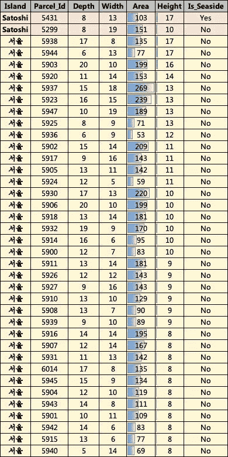
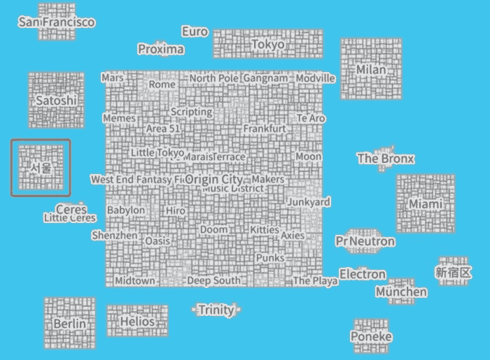
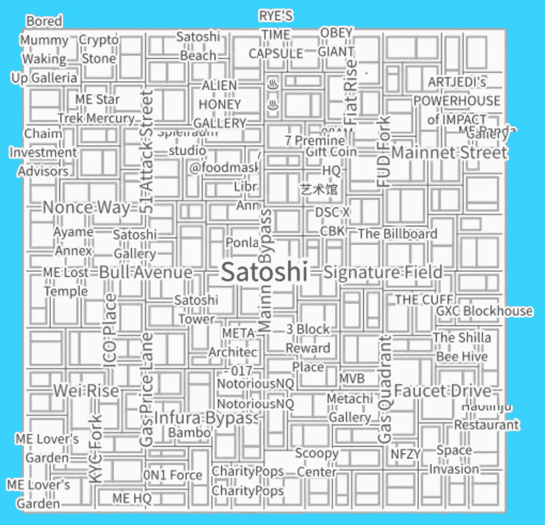
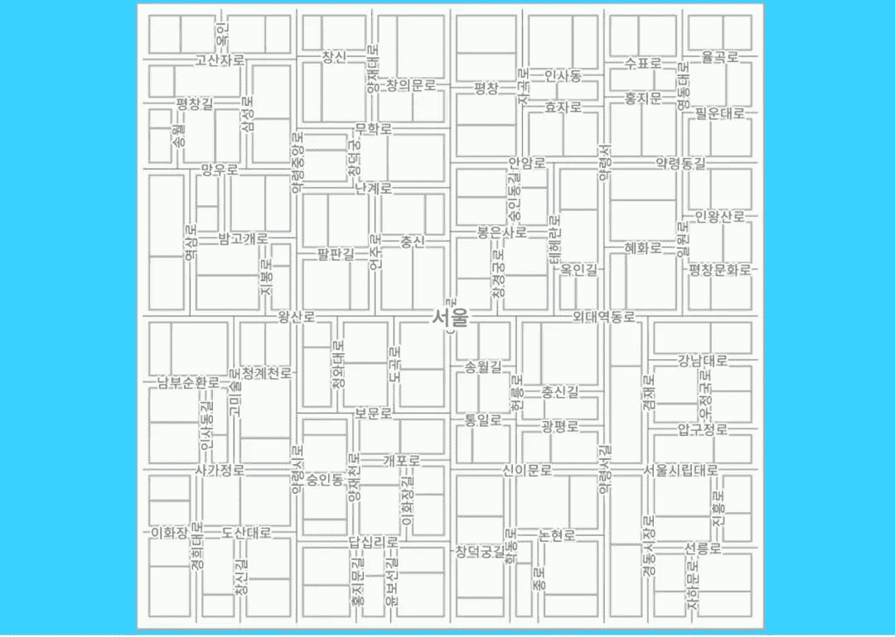
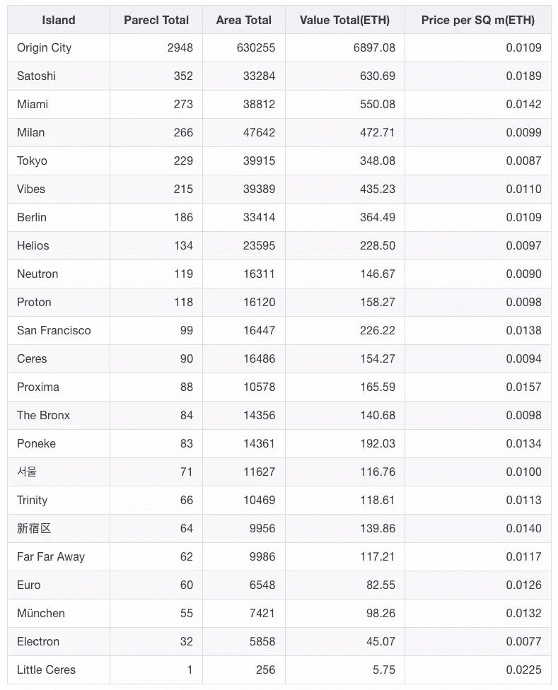
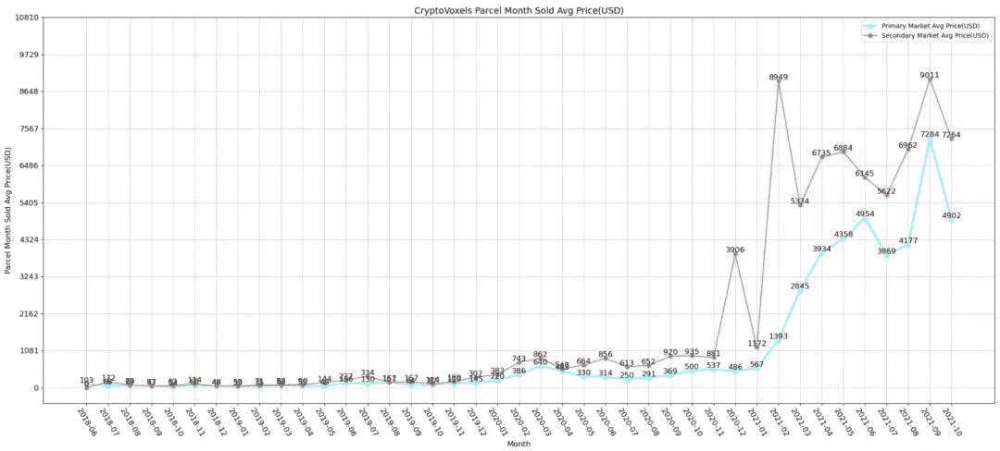
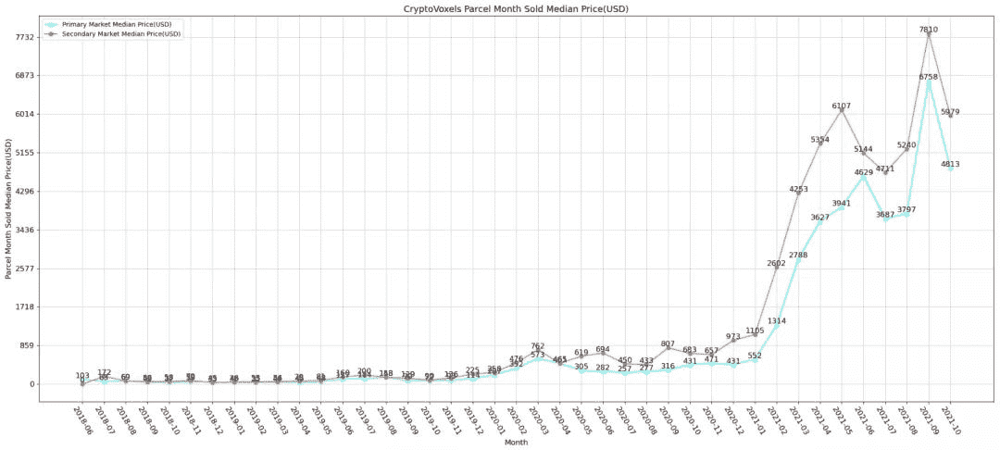
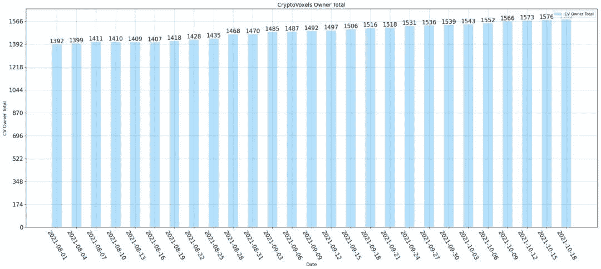
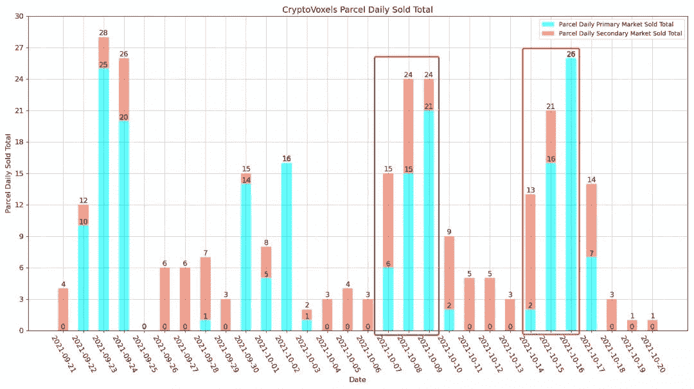
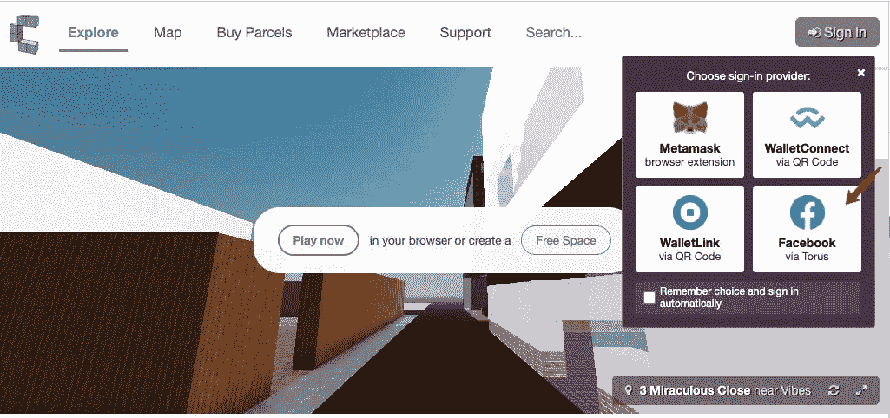

# 隐体素 2021.10.20 包裹薄荷突发新闻

> 原文：<https://medium.com/coinmonks/cryptovoxels-2021-10-20-parcel-mint-breaking-news-57fe1dfd0196?source=collection_archive---------8----------------------->

作者:DawnXue( [@dawnx666](https://twitter.com/dawnx666) )

今天在**佐藤**岛和 **서울** 岛一共铸造了 **38 个包裹**，其中 1 个**是海边的。**

以下是今日的铸币包裹分类:

***温馨提示:已按高度和面积降序排列。***

Figure 1: CV today’s mint parcel details

Figure 2: The full picture of CV

Figure 3: The full picture of Satoshi

Figure 4: The full picture of 서울

附录:

1.  每个岛屿上 CV 地块的平均交易价格(ETH ):

Figure 5: Average transaction price(ETH) of CV parcel on each island

2.CV 月平均交易价格(美元)

Figure 6: CV monthly average transaction price (USD)

3.CV 的月交易价格中位数(美元)

Figure 7: median monthly transaction price of CV (USD)

4.过去两个月，简历所有者总数增加了 165 人

Figure 8: CV Owner Total

5.CV 新包裹"**次日交易价格**

2021.10.07 **60** 铸造的包裹，2021.10.09 **42** 在一级市场销售的包裹(百分比 70%)。

铸造 2021.10.13 **69** 包裹，在一级市场销售 2021.10.16 **44** 包裹(百分比 63.8%)。

Figure 9: CV Parcel Daily Sold Total

6.CV 支持通过脸书登录

Figure 10: [https://www.cryptovoxels.com/](https://www.cryptovoxels.com/)

特色:

1.  [现在&元宇宙隐体素的未来](/coinmonks/present-future-of-cryptovoxels-metaverse-a4ed94f6b309)
2.  隐体素元宇宙的每个人都在做什么？
3.  [关于隐体素中的包裹价格，我们知道些什么？](/coinmonks/what-we-know-about-parcel-prices-in-cryptovoxels-fb93dc22896d)

数据来源: [**隐体素分析**](https://www.k1ic.com/cvb-zh.html)

> 加入 Coinmonks [电报频道](https://t.me/coincodecap)和 [Youtube 频道](https://www.youtube.com/c/coinmonks/videos)了解加密交易和投资

## 也阅读

 [## 最佳加密交易所| 2021 年十大加密货币交易所

### ICON _ PLACEHOLDEREstimated 预计阅读时间:28 分钟加密货币交易所的加密交易需要知识…

blog.coincodecap.com](https://blog.coincodecap.com/crypto-exchange)  [## 2021 年 10 大最佳加密贷款平台| CoinCodeCap

### 当谈到加密货币贷款时，大量因素等同于良好的收入状况。此外，借款的一部分…

blog.coincodecap.com](https://blog.coincodecap.com/crypto-lending)  [## 2021 年最佳免费加密交易机器人

### 2021 年币安、比特币基地、库币和其他密码交易所的最佳密码交易机器人。四进制，位间隙…

medium.com](/coinmonks/crypto-trading-bot-c2ffce8acb2a)  [## 最佳 4 个加密交易信号电报通道

### 这是乏味的找到正确的加密交易信号提供商。因此，在本文中，我们将讨论最好的…

medium.com](/coinmonks/best-crypto-signals-telegram-5785cdbc4b2b)  [## BlockFi 评论 2021:利弊和利率| CoinCodeCap

### 今天，我们提出了一个全面的 BlockFi 评论，这是一个成立于 2017 年的加密贷款平台，拥有其…

blog.coincodecap.com](https://blog.coincodecap.com/blockfi-review)  [## 如何在印度购买比特币？2021 年购买比特币的 7 款最佳应用[手机版]

### 如何使用移动应用程序购买比特币印度

medium.com](/coinmonks/buy-bitcoin-in-india-feb50ddfef94)  [## 加密税务软件——五大最佳比特币税务计算器[2021]

### 不管你是刚接触加密还是已经在这个领域呆了一段时间，你都需要交税。

medium.com](/coinmonks/best-crypto-tax-tool-for-my-money-72d4b430816b)  [## 存储比特币的最佳加密硬件钱包[2021] | CoinCodeCap

### 保管您的数字资产很容易，但找到正确的存储方式却是一项繁琐的任务。在线钱包有一个风险…

blog.coincodecap.com](https://blog.coincodecap.com/best-hardware-wallet-bitcoin)