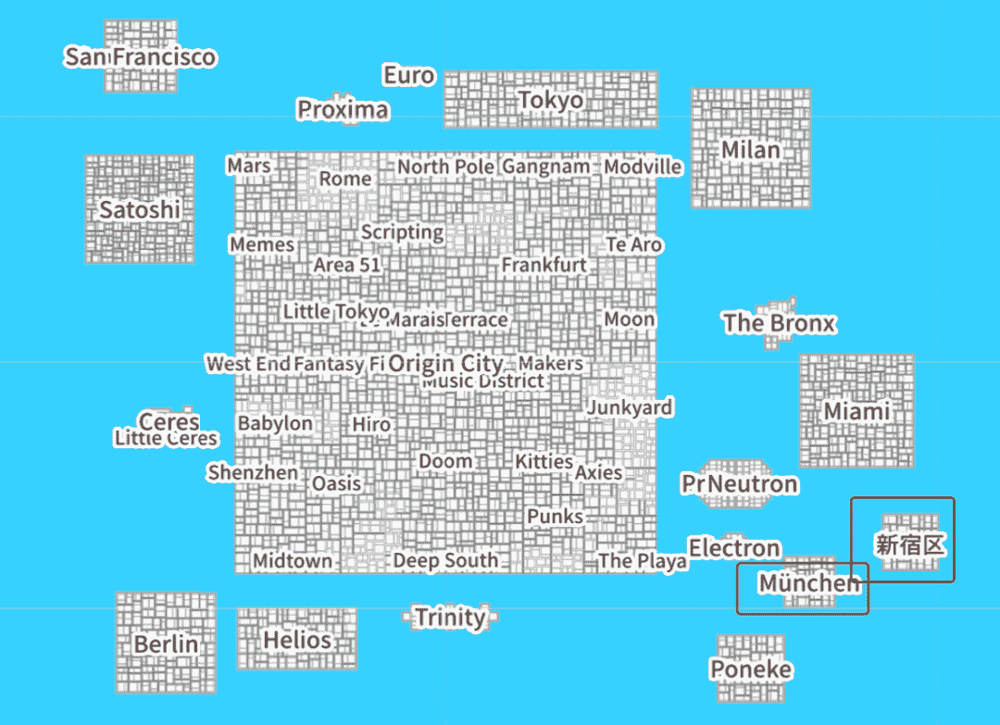
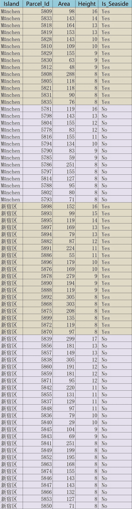
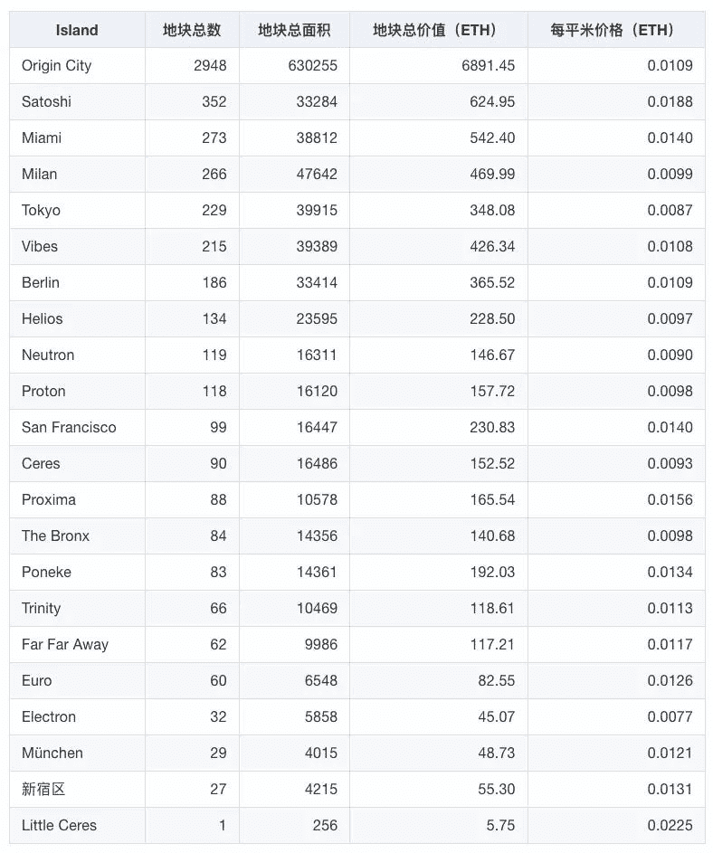
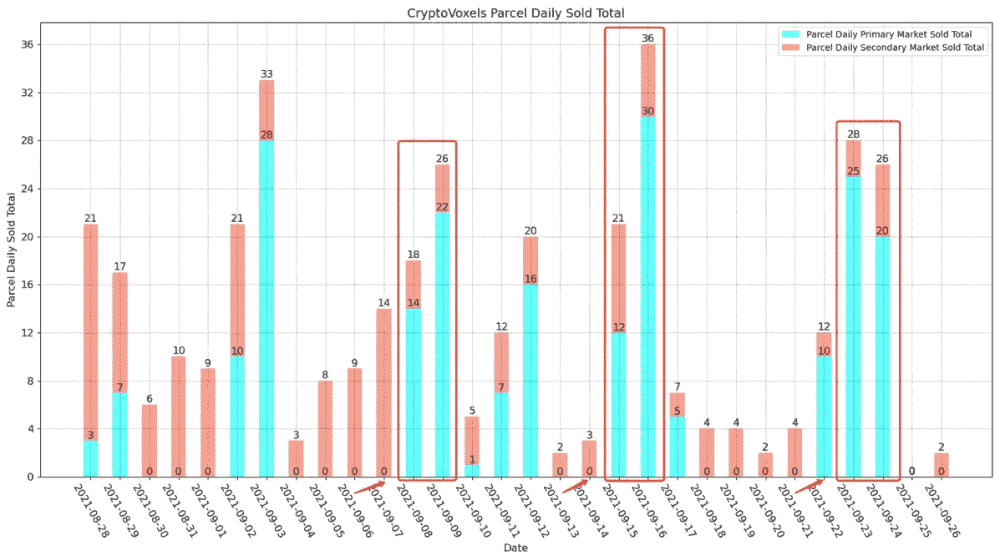
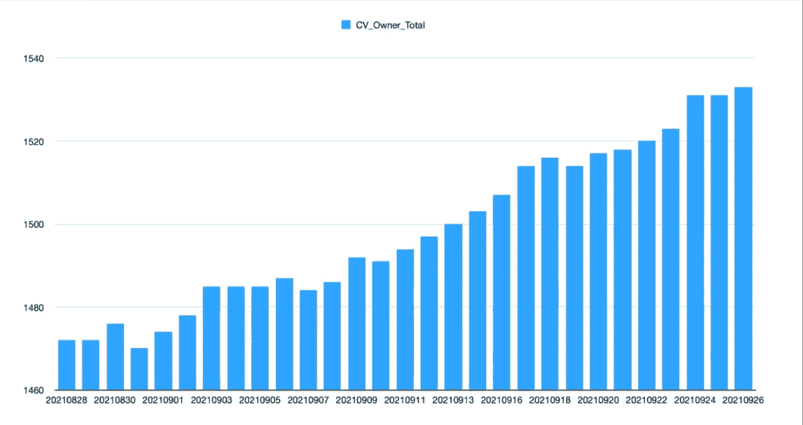
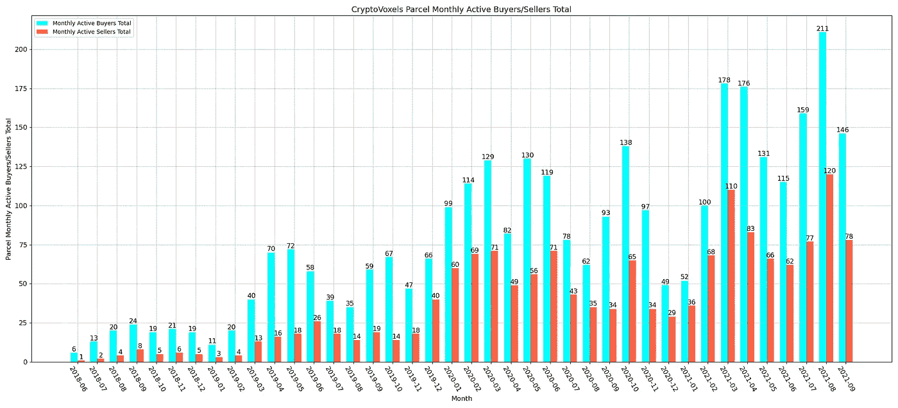
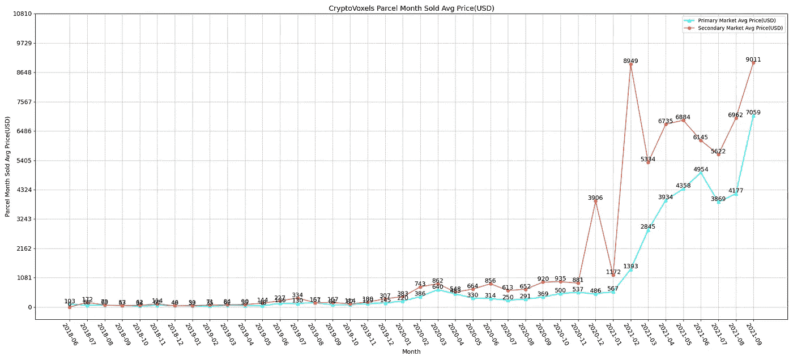
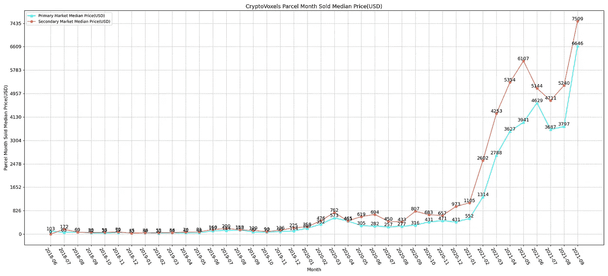

# 隐体素 2021.9.29 包裹薄荷突发新闻

> 原文：<https://medium.com/coinmonks/cryptovoxels-2021-9-29-parcel-mint-breaking-news-22fb26ad7879?source=collection_archive---------6----------------------->

作者:DawnXue( [@dawnx666](https://twitter.com/dawnx666) )

CV was minted today on the islands of **München** and **新宿区** in **72** parcels, of which **33 parcels are seaside**, accounting for 46% of the total number of parcels minted this time.

Figure 1: The full picture of CV

以下是今日的铸币包裹分类:

***温馨提示:已按高度和面积降序排列。***

Figure 2: CV today’s mint parcel details

每个岛屿的平均价格(ETH ):

Figure 3: Average price of CV islands (ETH)

附录:

1.  CV 的**9 月新 parecl 上架的次日成交率**高达 **80%** 。

Figure 4: 30-day transaction overview

2.CV **近 30 天新增 61 位业主** (1472 → 1533)，增幅 4%。

Figure 5: CV daily total number of owners

Figure 6:CV monthly active buyers/seller total

3.CV 月地块成交均价和成交中间价**继续上涨**。

Figure 7: Average transaction price of CV parcel (USD)

Figure 8: Median price of CV price (USD)

数据来源: [**隐体素分析**](https://www.k1ic.com/cvb-zh.html)

> 加入 Coinmonks [电报频道](https://t.me/coincodecap)和 [Youtube 频道](https://www.youtube.com/c/coinmonks/videos)了解加密交易和投资

## 另外，阅读

*   [尤霍德勒 vs 考尼洛 vs 霍德诺特](/coinmonks/youhodler-vs-coinloan-vs-hodlnaut-b1050acde55a) | [Cryptohopper vs 哈斯博特](https://blog.coincodecap.com/cryptohopper-vs-haasbot)
*   [如何匿名购买比特币](https://blog.coincodecap.com/buy-bitcoin-anonymously) | [比特币现金钱包](https://blog.coincodecap.com/bitcoin-cash-wallets)
*   [币安 vs FTX](https://blog.coincodecap.com/binance-vs-ftx) | [最佳(SOL)索拉纳钱包](https://blog.coincodecap.com/solana-wallets)
*   [如何在 Uniswap 上交换加密？](https://blog.coincodecap.com/swap-crypto-on-uniswap)
*   [币安 vs 北海巨妖](https://blog.coincodecap.com/binance-vs-kraken) | [美元成本平均交易机器人](https://blog.coincodecap.com/pionex-dca-bot)
*   [新加坡十大最佳加密交易所](https://blog.coincodecap.com/crypto-exchange-in-singapore) | [购买 AXS](https://blog.coincodecap.com/buy-axs-token)
*   [投资印度的最佳密码](https://blog.coincodecap.com/best-crypto-to-invest-in-india-in-2021) | [HitBTC 评论](/coinmonks/hitbtc-review-c5143c5d53c2)
*   [加拿大最好的加密交易机器人](https://blog.coincodecap.com/5-best-crypto-trading-bots-in-canada) | [赌注加密](https://blog.coincodecap.com/staking-crypto)
*   [如何在印度购买比特币？](/coinmonks/buy-bitcoin-in-india-feb50ddfef94) | [WazirX 评论](/coinmonks/wazirx-review-5c811b074f5b)
*   [比特币主根](https://blog.coincodecap.com/bitcoin-taproot) | [Bitso 评论](https://blog.coincodecap.com/bitso-review) | [排名前 6 的比特币信用卡](/coinmonks/bitcoin-credit-card-bc8ab6f377c6)
*   [最佳免费加密信号](https://blog.coincodecap.com/free-crypto-signals) | [YoBit 评论](/coinmonks/yobit-review-175464162c62) | [Bitbns 评论](/coinmonks/bitbns-review-38256a07e161)
*   [huo bi 的加密交易信号](https://blog.coincodecap.com/huobi-crypto-trading-signals) | [BitMEX 评论](https://blog.coincodecap.com/bitmex-review)