# 隐体素月度总结 2021–2009

> 原文：<https://medium.com/coinmonks/cryptovoxels-monthly-summary-2021-09-e50a390a0fd7?source=collection_archive---------9----------------------->

作者:[元卡特](https://twitter.com/Metacat007) [将郎](https://twitter.com/FinanceYF3)

**概述**(数据截止时间 2021 年 9 月 30 日)

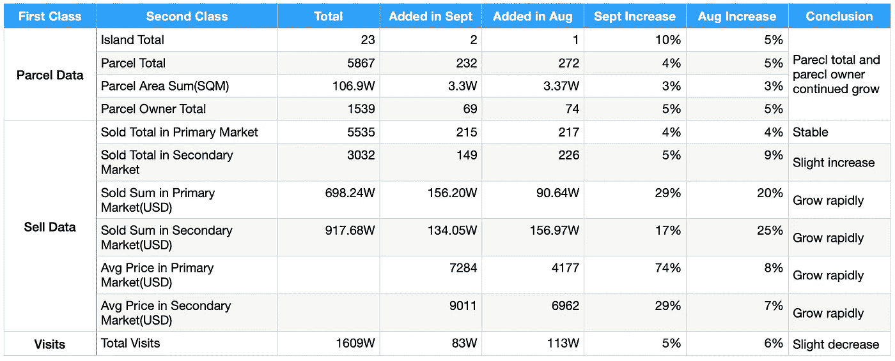

**1.1 包裹薄荷总量**:2021-09 年新增包裹 232 个，过去三个月稳步增长。

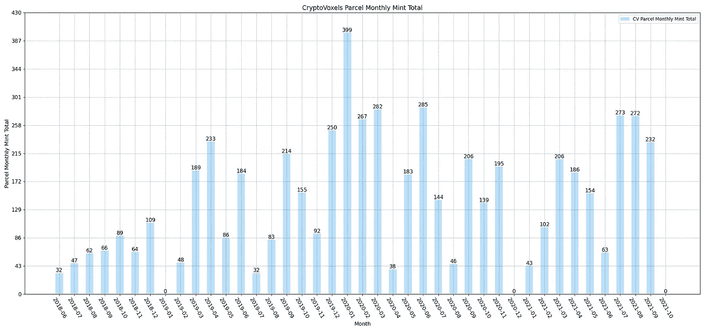

**1.2 宗地所有者总数**:宗地所有者地址总数持续增加。

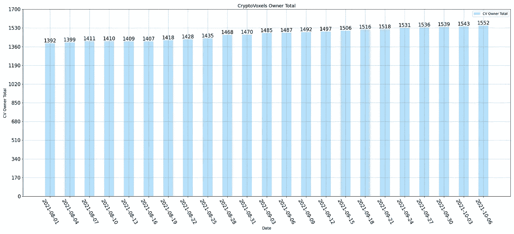

**2.1 宗地成交总量**:一级市场与上月(2021–08)持平，二级市场略有下降。

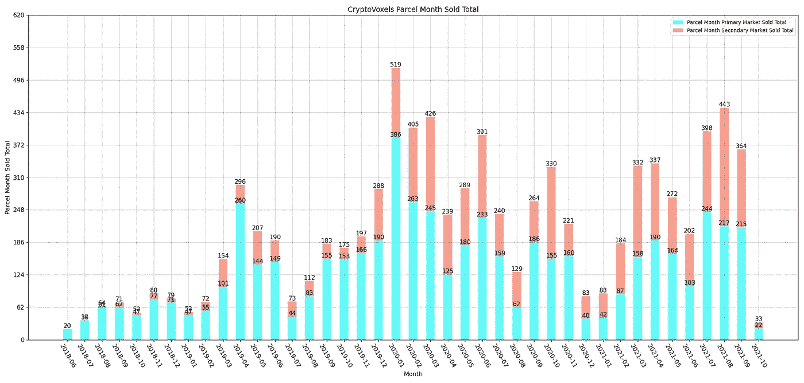

**2.2 包裹销售量(美元)**:一级市场大幅增长，二级市场与上月(2021–08)持平。

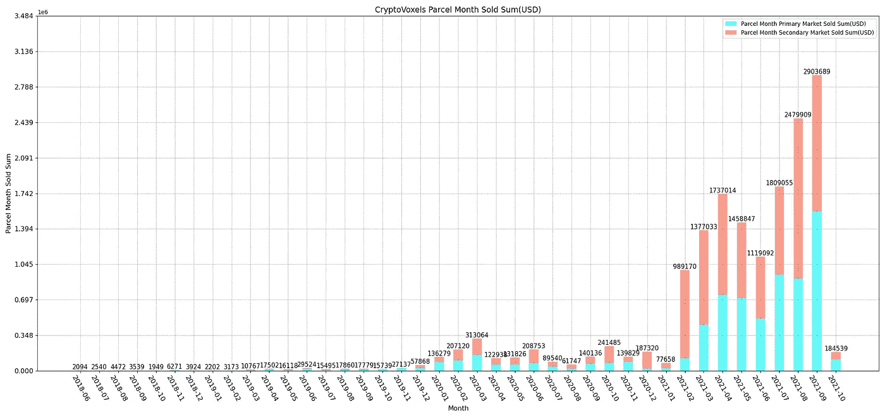

**2.3 包裹售出量(ETH)** :一级市场小幅上升，二级市场小幅下降。

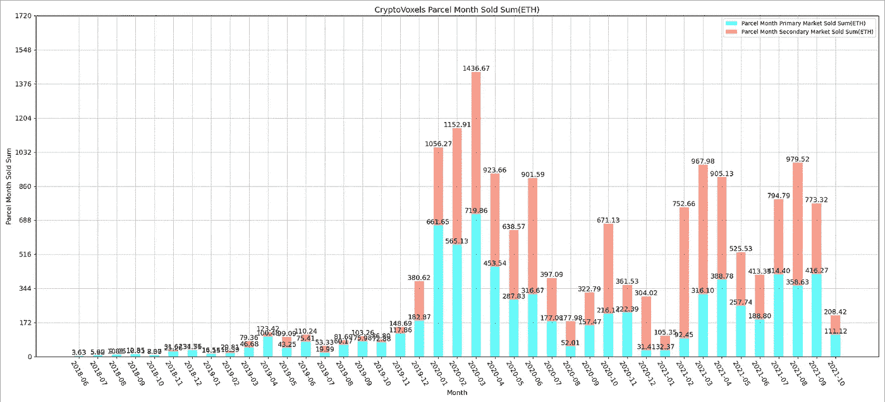

**2.4 成交宗地均价(美元)**:一二级市场均价大幅上涨。

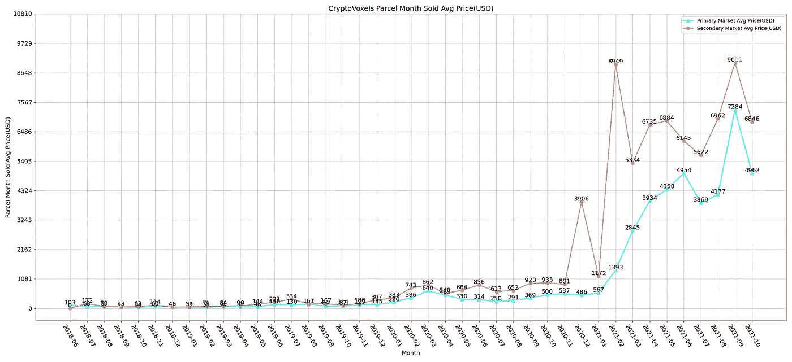

**2.5 成交宗地均价(ETH)** :一级市场微涨，二级市场微跌。

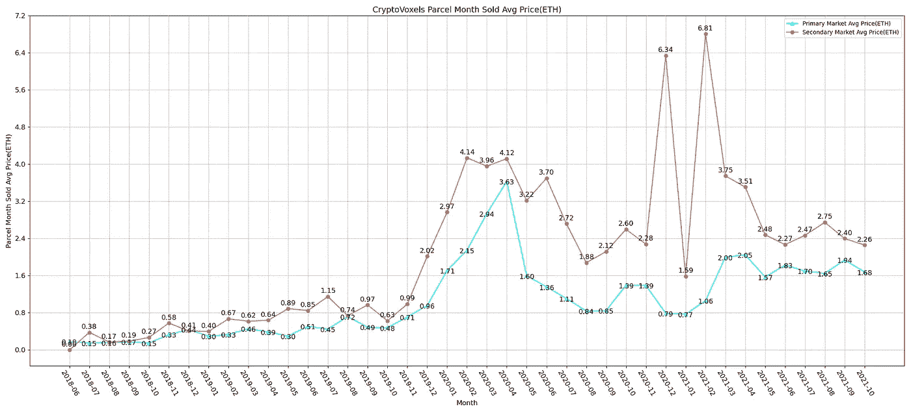

**3.1 总访问量**:9 月的访问量比 8 月(2021–08)略有下降。

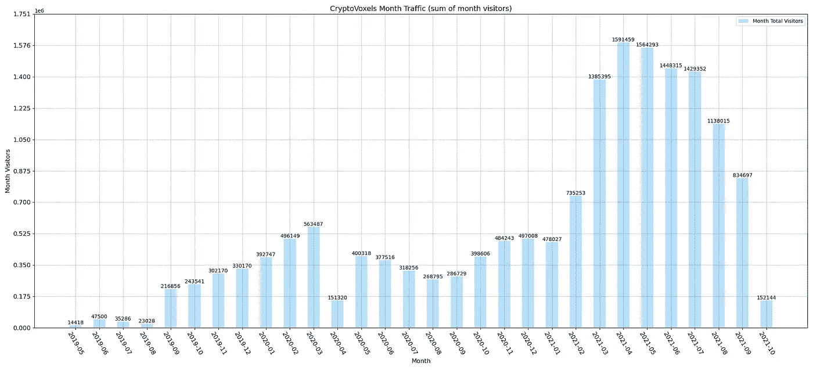

**3.2 热门包裹 1** : [调色板图库](https://www.cryptovoxels.com/parcels/3674)(包裹 Id: 3674)

**月访问量** : 2736，9 月 8/9 日由于游客量大
**地点**:欧陆岛
**中层特色**:内部感觉像地狱般的感觉；楼上街区的缆车很不错。

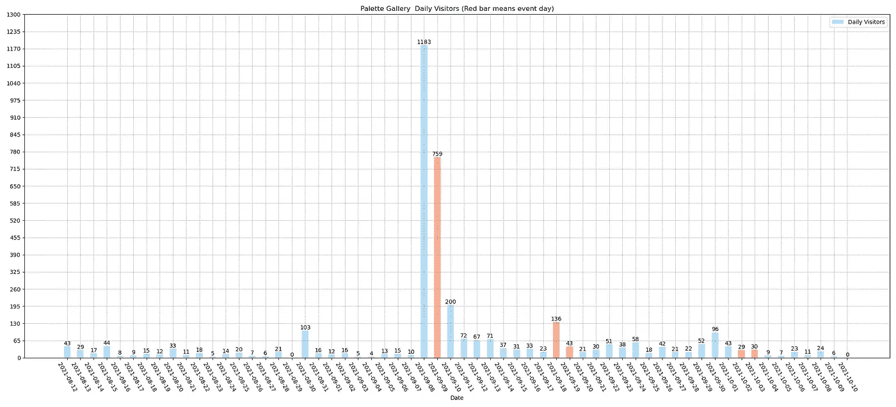

**3.2 热门包裹 2** : [IWAB 米兰](https://www.cryptovoxels.com/parcels/4425)(包裹 Id:44254390)

**月访问量** : 2600，访问量集中在 9 月中旬。
**地点**:米兰岛
**特色**:海边四层灰色建筑；每层客厅精致装修；没有其他内部装饰(如 NFT 等。)

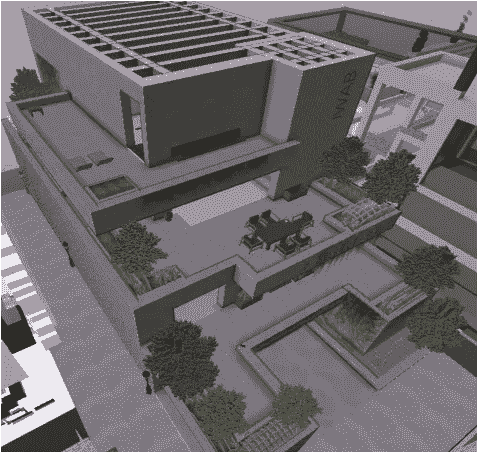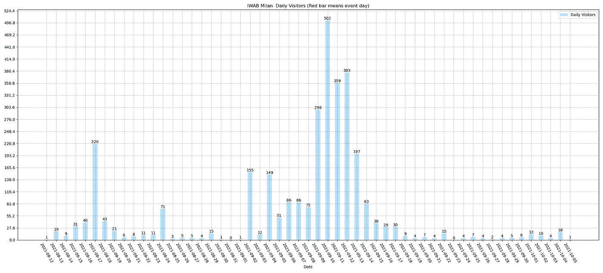

**3.3 热门包裹 3**:[imnotArt Chicago](https://www.cryptovoxels.com/parcels/4927)(包裹 Id: 4927)

**月访问量** : 2509，橙事件日访问量较高
**地点**:盛传岛
**特色**:木质场地，独特的外部装修，小院小吃不错；室内艺术品装饰。

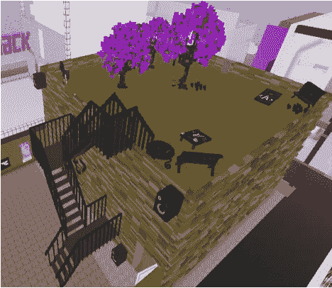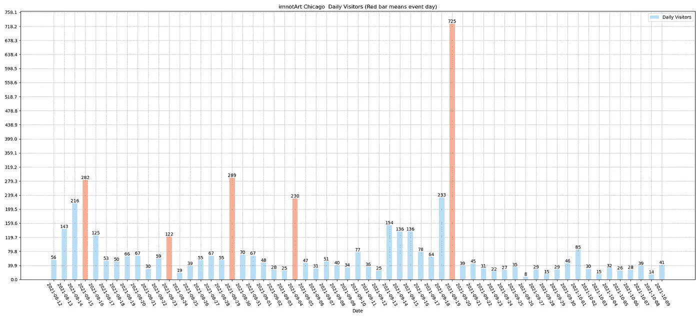

**联系我们**

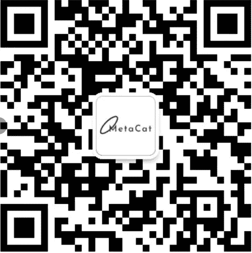

WeChat Official Account：@metacat234

Twitter：@Metacat007

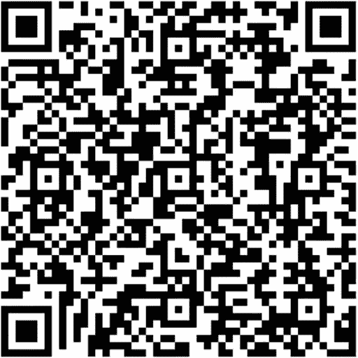

WeChat group: Ting DAO-CV research

> 订阅 [**Coinmonks Youtube 频道**](https://www.youtube.com/c/coinmonks/videos) 获取每日加密新闻。