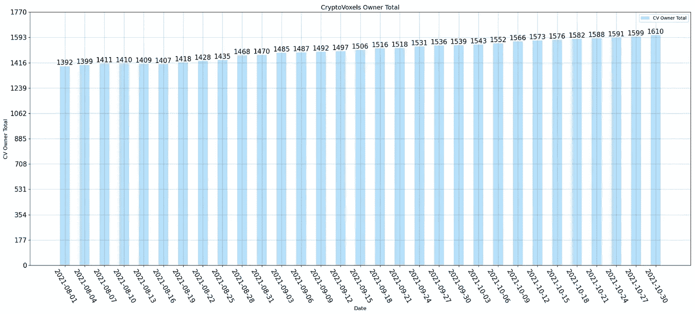
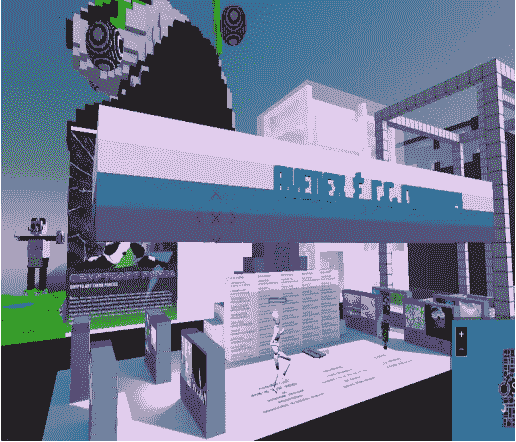

# 隐体素每月总结 2021–2010

> 原文：<https://medium.com/coinmonks/cryptovoxels-monthly-summary-2021-10-be31ae4a53a2?source=collection_archive---------5----------------------->

作者:[元卡特](https://twitter.com/Metacat007) [会郎](https://twitter.com/FinanceYF3)听道

**概述**(数据截止日期 2021-10-31)

**1.1 包裹薄荷总量**:2021-10 年新增包裹 233 个，过去三个月稳步增长。

**1.2 宗地所有者总数**:宗地所有者地址总数持续增加。

**2.1 宗地成交总量**:小幅减少，一级市场 38 宗，二级市场 21 宗。

**2.2 宗地成交金额(美元)**:一级市场交易量大幅下降，二级市场交易量小幅上升。

**2.3 宗地成交数量(ETH)** :一级市场成交减少 143ETH，二级市场成交增加 12ETH。

**2.4 成交宗地均价(美元)**:一级市场成交均价小幅下跌，二级市场成交均价大幅上涨。

**2.5 成交宗地均价(ETH)** :一级市场成交均价下跌较多，二级市场成交均价上涨较多。

**3.1 总访问量**:10 月访问量较 9 月有所回升。

**3.2 热门地块 1** : [公牛大道 31 号](https://www.cryptovoxels.com/parcels/5346)(地块编号:5346)

**月访问量** : 37346，流量集中在 10 月上旬。
**地点**:索托什岛
**特色**:Avedex&C . C 项目组进行了一次超宇宙空投活动，吸引人气。

**3.2 热门包裹 2** : [无双艺术飞地](https://www.cryptovoxels.com/parcels/4129)(包裹 Id: 4129)

**月访问量** : 11006，10 月 8 日活动当天访问量为 8676。
**地点**:太阳神岛
**特色**:博物馆主推 NFT 交易网站 [https://app.unique.one](https://app.unique.one) 。

**3.2 热门包裹 3** : [比特电子实验室/拉德兹城](https://www.cryptovoxels.com/parcels/359)(包裹 Id: 359)

**月访问量** : 6343，活动日访问量高。
**地点**:产地
**特色**:场地风格:万圣节主题，整体南瓜色。

**3.2 热门包裹 4** :穹顶猫步(包裹 Id: 3296)

**月访问量** : 3535，活动日访问量高。
**地点**:布朗克斯城
**特色**:梦幻的海边圆顶时装秀场地。

**联系我们**

WeChat Official Account：@metacat234

Twitter：@Metacat007

WeChat group: Ting DAO-CV research

> 加入 Coinmonks [电报频道](https://t.me/coincodecap)和 [Youtube 频道](https://www.youtube.com/c/coinmonks/videos)了解加密交易和投资

## 也阅读

 [## 最佳加密交易所| 2021 年十大加密货币交易所

### ICON _ PLACEHOLDEREstimated 预计阅读时间:28 分钟加密货币交易所的加密交易需要知识…

blog.coincodecap.com](https://blog.coincodecap.com/crypto-exchange)  [## 2021 年 10 大最佳加密贷款平台| CoinCodeCap

### 当谈到加密货币贷款时，大量因素等同于良好的收入状况。此外，借款的一部分…

blog.coincodecap.com](https://blog.coincodecap.com/crypto-lending)  [## 2021 年最佳免费加密交易机器人

### 2021 年币安、比特币基地、库币和其他密码交易所的最佳密码交易机器人。四进制，位间隙…

medium.com](/coinmonks/crypto-trading-bot-c2ffce8acb2a)  [## 最佳 4 个加密交易信号电报通道

### 这是乏味的找到正确的加密交易信号提供商。因此，在本文中，我们将讨论最好的…

medium.com](/coinmonks/best-crypto-signals-telegram-5785cdbc4b2b)  [## BlockFi 评论 2021:利弊和利率| CoinCodeCap

### 今天，我们提出了一个全面的 BlockFi 评论，这是一个成立于 2017 年的加密贷款平台，拥有其…

blog.coincodecap.com](https://blog.coincodecap.com/blockfi-review)  [## 如何在印度购买比特币？2021 年购买比特币的 7 款最佳应用[手机版]

### 如何使用移动应用程序购买比特币印度

medium.com](/coinmonks/buy-bitcoin-in-india-feb50ddfef94)  [## 加密税务软件——五大最佳比特币税务计算器[2021]

### 不管你是刚接触加密还是已经在这个领域呆了一段时间，你都需要交税。

medium.com](/coinmonks/best-crypto-tax-tool-for-my-money-72d4b430816b)  [## 存储比特币的最佳加密硬件钱包[2021] | CoinCodeCap

### 保管您的数字资产很容易，但找到正确的存储方式却是一项繁琐的任务。在线钱包有一个风险…

blog.coincodecap.com](https://blog.coincodecap.com/best-hardware-wallet-bitcoin)