# 隐体素每月总结 2021–2011

> 原文：<https://medium.com/coinmonks/cryptovoxels-monthly-summary-2021-11-d1acd54fdb29?source=collection_archive---------6----------------------->

作者:[元卡特](https://twitter.com/Metacat007)

**概述**(数据截止日期 2021 年 11 月 30 日)

**1.1 包裹薄荷总量**:**2021-11 年新增包裹**565 个，**本月新增包裹数量**最高。

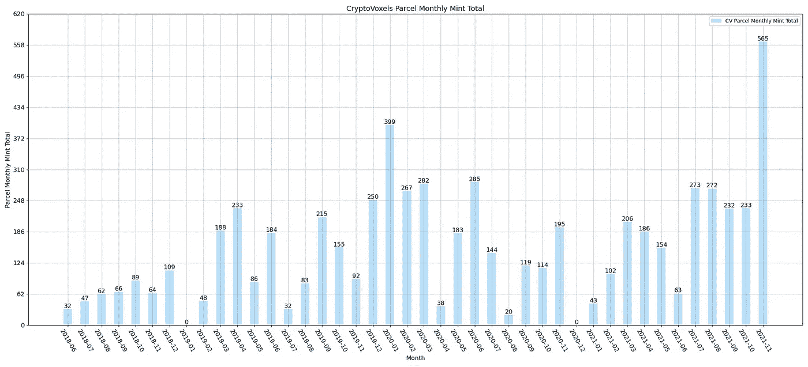

**1.2 宗地所有人总数**:**2021-11 年新增宗地所有人**195 人，增幅较大。

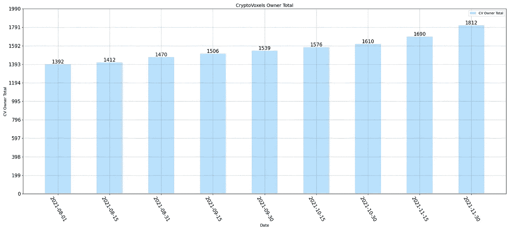

**2.1 成交宗地总数** : **一、二级市场均大幅上涨**，一、二级市场月度成交宗地总数**达到历史最高**。

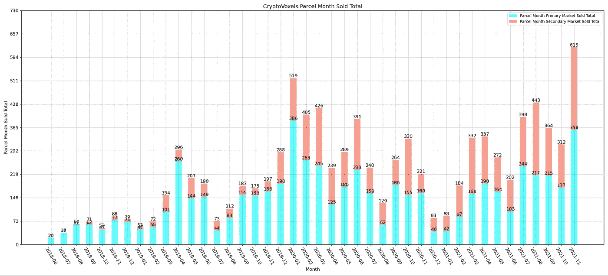

**2.2 成交包裹量(美元)**:一二级市场**大幅上涨**，**达到历史最高**。

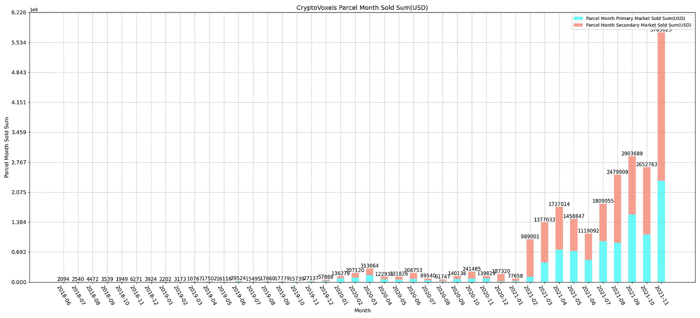

**2.3 包裹售出量(ETH)** : **大幅增长**，月度总成交金额排名**仅次于 2020 年 3 月**。

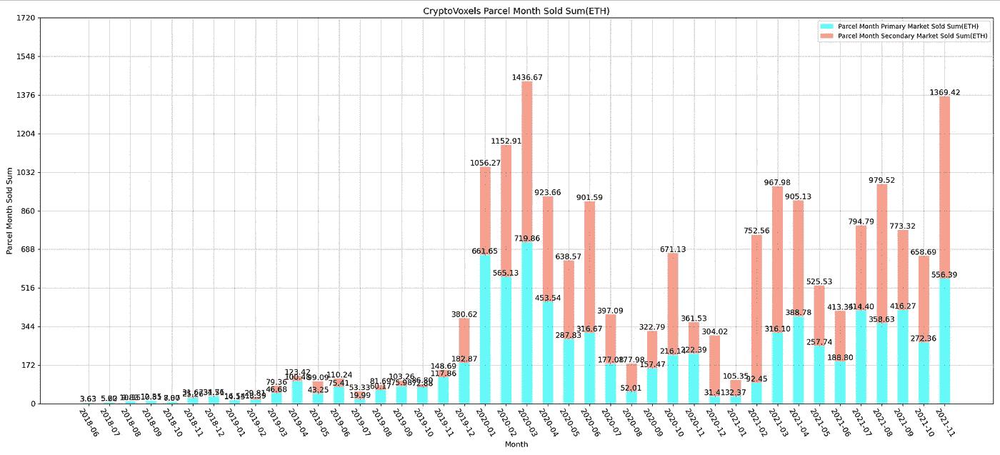

**2.4 成交宗地均价(美元)**:一级市场小幅上涨，二级市场大幅上涨。

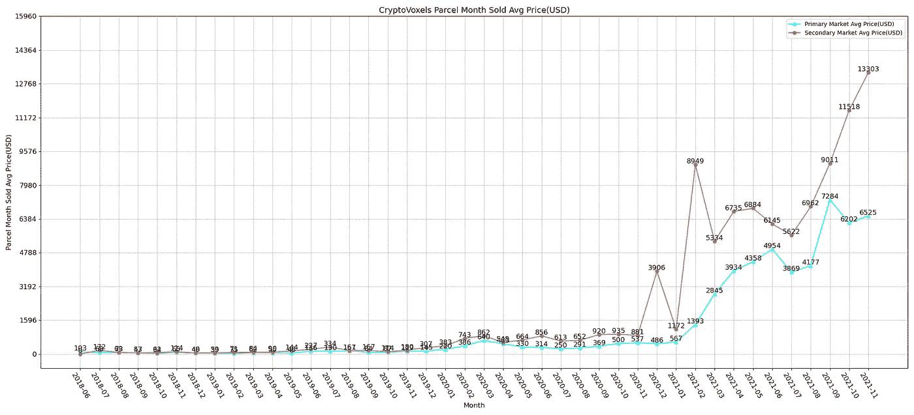

**2.5 成交宗地均价(ETH)** :一级市场稳定，二级市场涨幅较大。

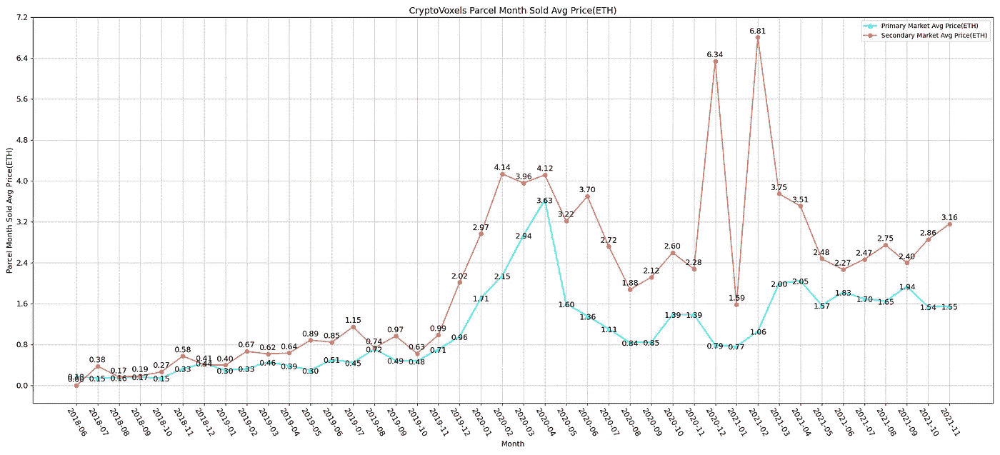

**3.1 总访问量**:11 月**访问量比 10 月**略有增长。

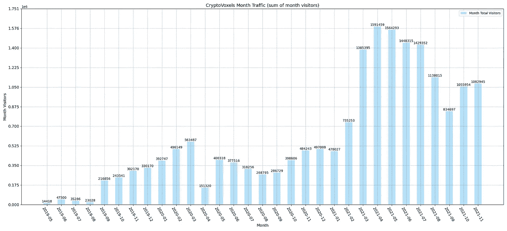

**3.2 Popular Parcel 1**: [小神便利店](https://www.cryptovoxels.com/parcels/1832) (Parcel Id: 1832)

**月访** : 16520
**地点**:产地城市
**特色**:外景五彩缤纷，四周红色城墙。有些元素比较中国风。

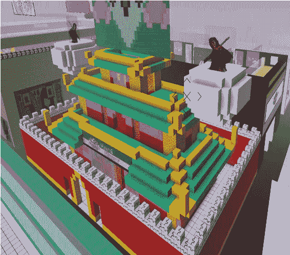

[https://www.cryptovoxels.com/parcels/1832](https://www.cryptovoxels.com/parcels/1832)

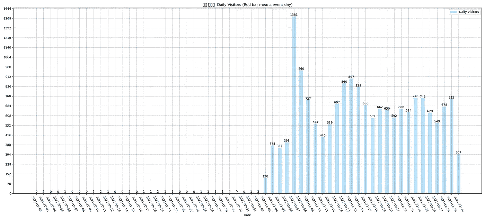

[https://www.k1ic.com/imgs/1832.png](https://www.k1ic.com/imgs/1832.png)

**3.2 热门包裹 2**:[🛒商场](https://www.cryptovoxels.com/parcels/216)(包裹 Id: 216)

**月访问量** : 15111
**地点**:产地城市
**特色**:博物馆主打可穿戴交易，但目前还处于前期宣传阶段。

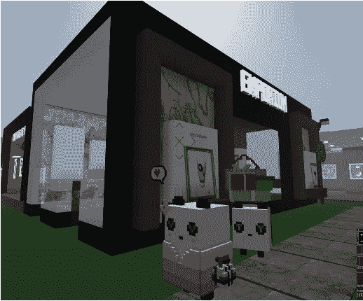

[https://www.cryptovoxels.com/parcels/216](https://www.cryptovoxels.com/parcels/216)

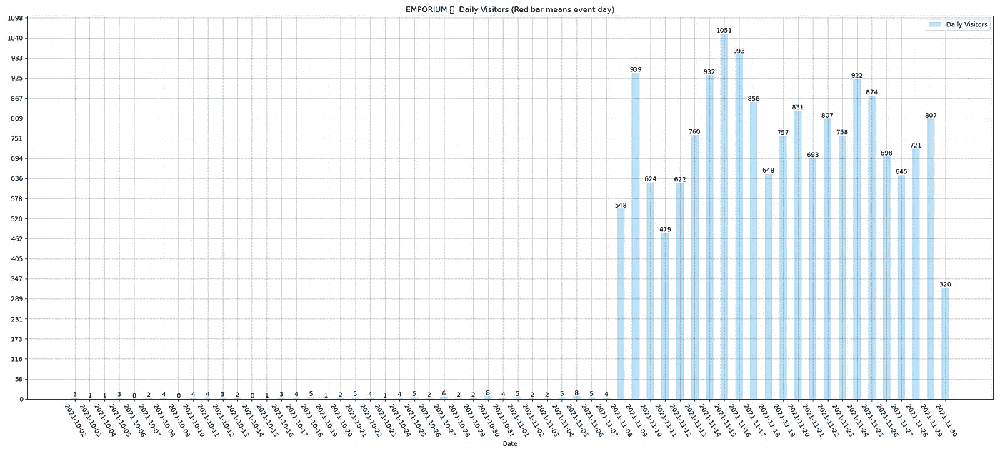

[https://www.k1ic.com/imgs/261.png](https://www.k1ic.com/imgs/261.png)

**3.2 热门包裹 3** : [ME 失落寺](https://www.cryptovoxels.com/parcels/5313)(包裹 Id: 5313)

**月访问量** : 4201
**地点**:索托什岛
**特色**:海上一座宏伟建筑，良心出品，值得一去。

[https://www.cryptovoxels.com/parcels/5313](https://www.cryptovoxels.com/parcels/5313)

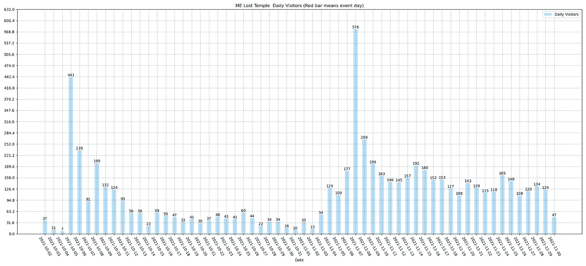

[https://www.k1ic.com/imgs/5313.png](https://www.k1ic.com/imgs/5313.png)

**联系我们**

WeChat Official Account: @metacat234

Twitter: @Metacat007

> 加入 Coinmonks [电报频道](https://t.me/coincodecap)和 [Youtube 频道](https://www.youtube.com/c/coinmonks/videos)了解加密交易和投资

## 也阅读

 [## 杠杆代币[多头代币]终极指南

### 杠杆化令牌是具有杠杆化风险敞口的 ERC20 令牌，不考虑保证金、要求、管理…

medium.com](/coinmonks/leveraged-token-3f5257808b22)  [## 最佳加密交易所| 2021 年十大加密货币交易所

### 编辑描述

blog.coincodecap.com](https://blog.coincodecap.com/crypto-exchange)  [## 2021 年最佳加密借贷平台| 6 大比特币借贷平台

### 获得比特币和其他加密货币的最佳贷款利率

medium.com](/coinmonks/top-5-crypto-lending-platforms-in-2020-that-you-need-to-know-a1b675cec3fa)  [## 2021 年最佳免费加密交易机器人

### 2021 年币安、比特币基地、库币和其他密码交易所的最佳密码交易机器人。四进制，位间隙…

medium.com](/coinmonks/crypto-trading-bot-c2ffce8acb2a)  [## 最佳 4 个加密交易信号电报通道

### 这是乏味的找到正确的加密交易信号提供商。因此，在本文中，我们将讨论最好的…

medium.com](/coinmonks/best-crypto-signals-telegram-5785cdbc4b2b)  [## 5 个最佳社交交易平台[2021] | CoinCodeCap

### 编辑描述

blog.coincodecap.com](https://blog.coincodecap.com/best-social-trading-platforms)  [## BlockFi 评论 2021:利弊和利率| CoinCodeCap

### 编辑描述

blog.coincodecap.com](https://blog.coincodecap.com/blockfi-review)  [## 如何在印度购买比特币？2021 年购买比特币的 7 款最佳应用[手机版]

### 如何使用移动应用程序购买比特币印度

medium.com](/coinmonks/buy-bitcoin-in-india-feb50ddfef94)  [## 加密税务软件——五大最佳比特币税务计算器[2021]

### 不管你是刚接触加密还是已经在这个领域呆了一段时间，你都需要交税。

medium.com](/coinmonks/best-crypto-tax-tool-for-my-money-72d4b430816b)  [## 存储比特币的最佳加密硬件钱包[2021] | CoinCodeCap

### 编辑描述

blog.coincodecap.com](https://blog.coincodecap.com/best-hardware-wallet-bitcoin)  [## Pionex 评论 2021 |免费加密交易机器人和交换

### Pionex 是为交易自动化提供工具的后起之秀。Pionex 上提供了 9 个加密交易机器人…

medium.com](/coinmonks/pionex-review-exchange-with-crypto-trading-bot-1e459d0191ea)