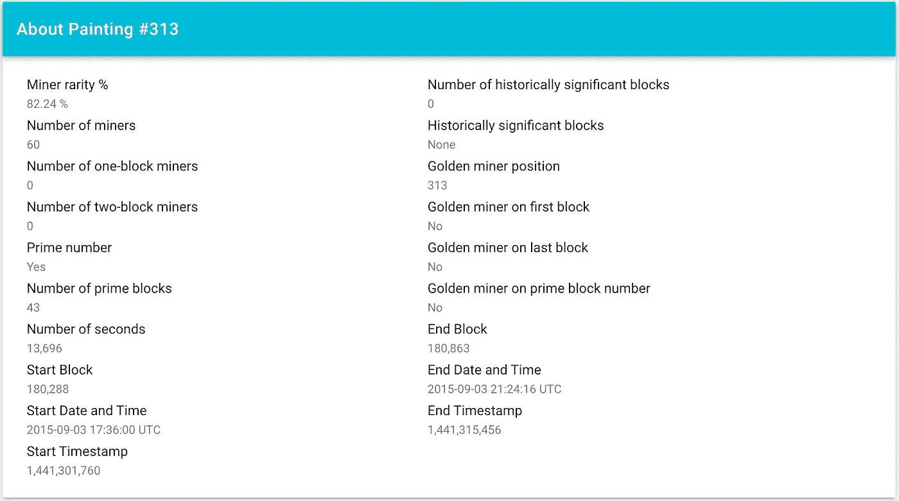
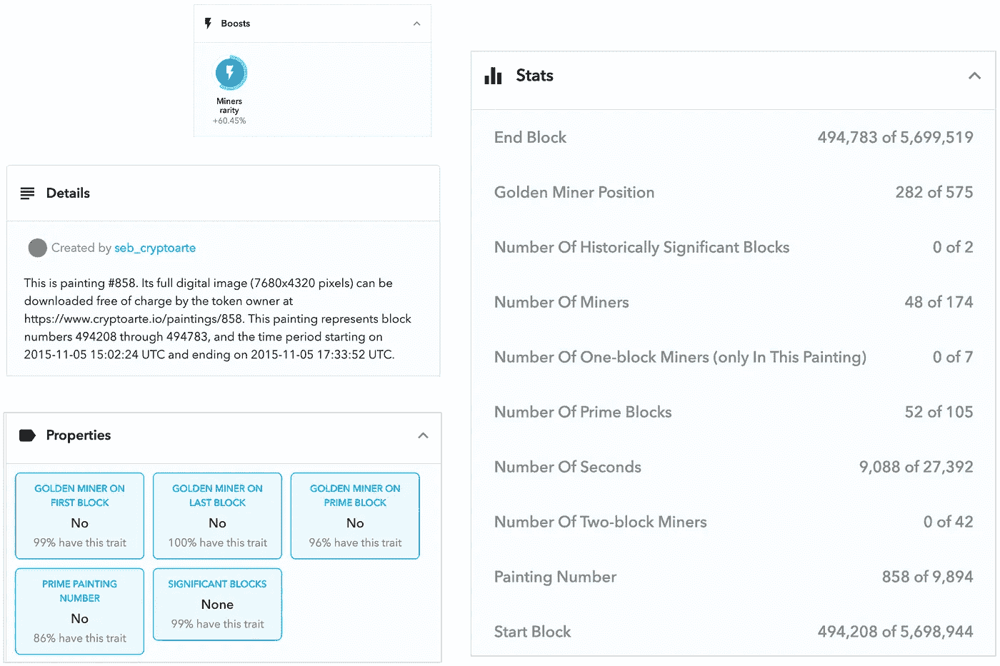
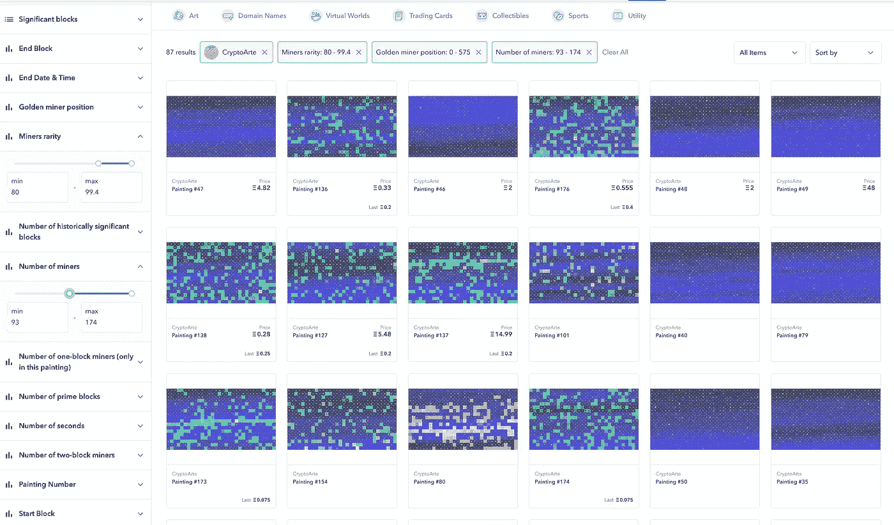

# CrytoArte 公告—2011 年 3 月 26 日

> 原文：<https://medium.com/coinmonks/crytoarte-announcements-3-26-21-e64ebb6f19bc?source=collection_archive---------2----------------------->

## ***TLDR:*** *给早期收藏者的感谢礼物，较低的铸造价格底价，特质和稀有度，OpenSea 的改进，以及全面的艺术指南。*

# **献给早期收藏者的特别感谢礼物**

CryptoArte 卖出了将近 1000 幅画，我感激不尽。从项目开始以来，尤其是在过去的几周里，我收到了所有令人惊叹的支持、购买、善意的话语和鼓励，这让我深感谦卑。

如果没有这种支持，CryptoArte 将永远不会取得今天的成就:一个美丽的社区和艺术项目，正逐步得到更多的关注和赞赏，现在正朝着一个非常光明的未来发展。艺术在真空中没有价值。CryptoArte 的价值取决于它的社区和收藏者，对此我非常感激。

因此，为了表示感谢，今天我谨向迄今为止持有 CryptoArte 令牌的每一位以太坊地址所有者赠送一份个性化礼物。你们一共是 384 个！

要领取免费礼品，请访问:

https://www.cryptoarte.io/gifts/*<your-eth-address>*

# **铸造价格**底价**下调**

当你今天读到这篇文章时，我已经将 [cryptoarte.io](https://www.cryptoarte.io) 网站上铸造画作的底价降至 0.1。我的意图是在短期内让更多的收藏家能够获得这些藏品，这与我最初的使命声明(来自[关于第](https://www.cryptoarte.io/about)页)一致:

> 他希望这个艺术收藏、不可替代的令牌和分散的应用程序将有助于通过以一种可访问和有趣的方式培养对技术的认识来发展以太坊社区。他还希望这些画作能够引发围绕区块链技术的深思熟虑的对话，并让更多人了解以太坊区块链是什么，它是如何工作的，以及如何利用它。

虽然重大的市场波动和其他外部因素可能会发挥作用，但我打算将当前铸造库存(约 585 枚代币)内的绘画价格下限固定为 0.1。一旦这一批卖完，我会再次审查定价。

非铸造的绘画请求将暂时继续以 0.25eth 的价格提供，但随着我设法进一步自动化这一过程，并基于整体需求和其他因素，价格可能会下降或上升。请注意，目前非铸造绘画请求和购买可能需要一段时间来处理。

# **性状和稀有度**

这是我很久以来一直想介绍的东西。关于整个收藏的统计数据不仅有助于从收藏和绘画中提取特征、稀有性和趋势，而且有助于讲述以太坊的故事。

例如，有最多一个区块矿工的绘画(即:在整个收藏中只开采了一个区块的矿工，因此只能在一幅绘画中看到)有 7 个矿工([绘画#93](https://www.cryptoarte.io/paintings/93) )。

我希望在接下来的日子里分享更多关于特征和稀有性的内容，但这里有一个快速摘录。当你阅读这篇文章时，cryptoarte 网站正在展示[画作](https://www.cryptoarte.io/gallery)和[矿工](https://www.cryptoarte.io/miners)的稀有性、统计数据和特征。

在这里，我们有一个在撰写本报告时在一级市场上可获得的铸造画的最低画号，[画#313](https://www.cryptoarte.io/paintings/313) 。

Detailed statistics for [Painting #313](https://www.cryptoarte.io/paintings/313)

如果你对新的特征和稀有性统计有任何问题、评论或反馈，请不要犹豫，通过文章末尾列出的渠道联系我们。

# OpenSea 中的新功能

收藏中所有**的** **铸造的** **绘画**的特征和统计现在也可以在 OpenSea 上获得。检查#858 号喷漆:

A more comprehensive breakdown of [Painting #858](https://opensea.io/assets/0xbace7e22f06554339911a03b8e0ae28203da9598/858)

请记住，OpenSea 只对铸造的绘画进行索引，因此属性百分比是相对于收藏的子集而言的(除了“提升”下的矿工稀有度，它是为整个收藏计算的)。对于统计数据，您会注意到它们是 X/Y 格式的。Y 变量指的是该特征集合中的最大值。

此外，您现在还可以在集合级别通过特征进行过滤。在下面的搜索中，你可以看到具有高矿工稀有度和高矿工数量的绘画是如何定价高于其他绘画的。

[The OpenSea gallery](https://medium.com/r?url=https%3A%2F%2Fopensea.io%2Fassets%2Fcryptoarte%3Fsearch%5BresultModel%5D%3DASSETS)

# **综合艺术指南**

作为此次更新和公告的一部分，我还花了一些时间来收集尽可能多的关于 CryptoArte 绘画的信息，并将其收集在一个地方！有史以来第一次，你可以在这里的媒介上找到对绘画本身的每一个可以想象的细节的深入分析:

[*隐翅虫绘画综合指南*](https://sebinatx.medium.com/a-comprehensive-guide-to-cryptoarte-paintings-724783c87442)

# **临别赠言**

如果你喜欢这篇文章，我邀请你伸出援助之手，在你选择的社交媒体平台上分享它。请记住，您可以随时通过 [Twitter](https://twitter.com/CryptoArte) 直接联系我，或者通过我们的 [Discord 服务器](https://discord.gg/kwbRuwf)联系整个社区。

# **隐花资源**

更多信息可从 [CryptoArte](https://www.cryptoarte.io/) 主页和媒体上发布的文章中获得:

*   [***预发射密码***](/coinmonks/pre-launching-cryptoarte-56c967bcf2e9)
*   [***CryptoArte 预发布更新***](https://sebinatx.medium.com/cryptoarte-pre-launch-update-342414d4a93e)
*   [***CryptoArte 预发布更新#2***](https://sebinatx.medium.com/cryptoarte-pre-launch-update-2-ea8365c93cbd)
*   [***矿工图库:CryptoArte 预发布更新#3***](/coinmonks/the-miners-gallery-cryptoarte-pre-launch-update-3-e1cb3667fd22)

如果你对一个相关的 NFT 项目感兴趣，看看[街区公园](/opensea/block-parks-36340d790850)上的这个帖子。

衷心感谢大家！

— Seb