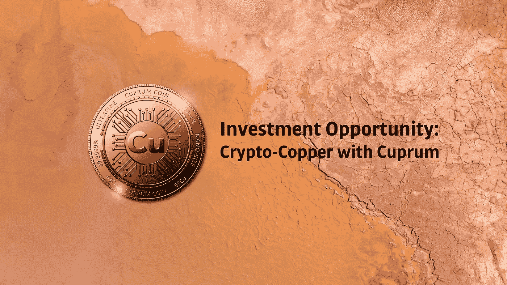

# 铜币:这就是你如何用密码投资商品

> 原文：<https://medium.com/coinmonks/cuprum-coin-this-is-how-you-can-invest-in-commodities-with-crypto-cc312b46e367?source=collection_archive---------5----------------------->

最近，宣布推出加密货币铜币。它的特别之处在于，这枚硬币由一种非常受欢迎的商品支持，即超细铜粉，价值超过 600 亿美元。
该公司表示，一旦所有许可和监管里程碑都得到满足，将于 2022 年上半年全面启动**市场。**

Crypto-Copper — Photo by [Victor](https://unsplash.com/@victor_g?utm_source=unsplash&utm_medium=referral&utm_content=creditCopyText) on [Unsplash](https://unsplash.com/s/photos/copper?utm_source=unsplash&utm_medium=referral&utm_content=creditCopyText), edited by the author