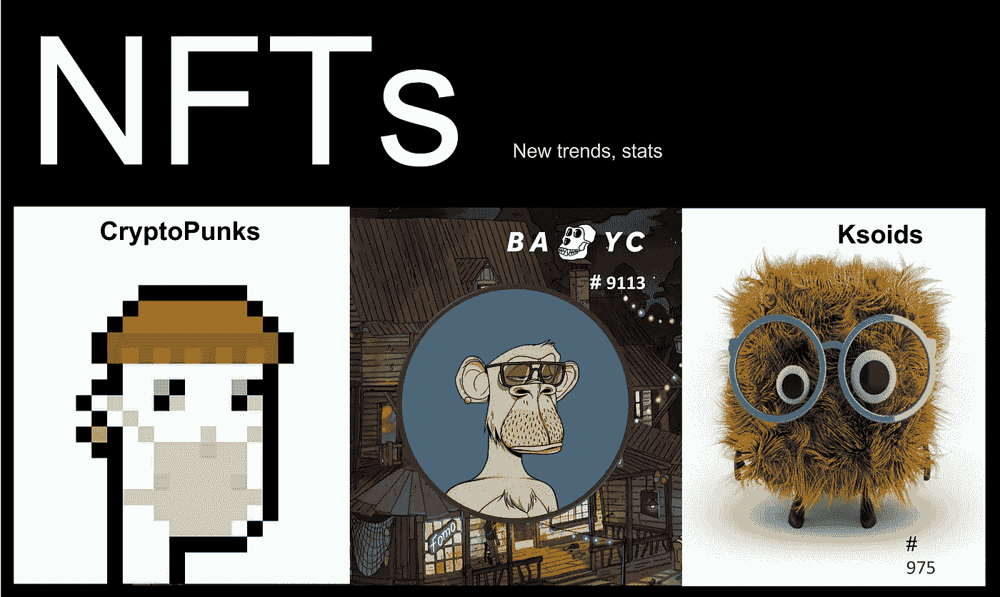

# 当前 NFT 项目市场动向—关键数据

> 原文：<https://medium.com/coinmonks/current-nft-projects-market-movement-key-stats-dcf0fe33300c?source=collection_archive---------3----------------------->

以太坊上的 NFT 之旅开始( [Yr 2015](https://en.wikipedia.org/wiki/Non-fungible_token) )远早于密码朋克的诞生。直到 2017 年底，随着 Cryptokitties 的推出，公众对 NFT 的认识才开始兴奋起来。Cryptokitties 游戏的整个范围围绕着收集、繁殖和拍卖小猫。从那时起，NFT 的用例已经从收藏品扩展到现实世界资产的令牌化。

# **#什么是 NFT:**

就像在现实世界中，没有两项资产可以表现出相似的特征或价值，同样，区块链上的每项令牌化资产都有独特的特征。由于这些数字资产彼此不同，它们不可互换，因此被称为不可替代的令牌。就像有所有权证书的真实资产一样，NFT 代币在区块链上维护所有权记录和真实性证明。

# **# 2021 年 NFT 人气:**

Source: nft-stats.com

自从今年年初 NFTs 开始流行以来，销售量一直居高不下。

*   6 月份，OpenSea 的月销售额创下历史新高(1.5 亿美元)。,
*   NFTs 市场在第二季度飙升至新高，迄今为止销售额为 25 亿美元，高于 2020 年上半年的 1370 万美元。

NFT 爱好者将它们视为具有内在价值的收藏品，因为他们的个人喜好，或者是对 NFT 稀有特征的投机。NFTs 的受欢迎程度并没有被名人所掩盖，比如著名音乐家 Jay-Z 在苏富比拍卖行举办了他的第一场 NFT 拍卖会，他将自己的 Twitter 个人资料照片改成了一名隐密朋克。

# **#热门 NFT(按交易量):**

Status as of 10th Aug 2021

# **#1 —《一鸣惊人》**

## [**隐朋克**](https://www.larvalabs.com/cryptopunks)

CryptoPunks 是当前 NFT 市场繁荣的一个典型例子。CryptoPunks 已经成为市场上最受欢迎的 NFT 之一。作为最早的 NFT 之一，CryptoPunks 项目是由幼虫实验室在 2017 年推出的。最初，每一个密码朋克都是免费提供的，但最近许多已经卖到数百万美元。最近，Covid 外星人密码朋克 NFT 在拍卖中以超过 1170 万美元的价格售出。

# **#命中:**

## **BAYC**

如今，越来越多的社交媒体账户将他们的头像换成了猿类卡通，就像下面这位著名的 Twitch 用户和游戏玩家,“OneBlockAway”将他的个人资料图片换成了一只[猿#9113](https://opensea.io/assets/0xbc4ca0eda7647a8ab7c2061c2e118a18a936f13d/9113) 的图片。

我的许多 Twitter 朋友和追随者都有戴着眼镜或用眼睛射出激光束的猿猴头像。这群新生的猿类正在互相聊天，互相扶持。这些头像来自于 4 月 30 日正式上线的 Bored Ape 游艇俱乐部，该俱乐部提供了 10，000 个以猿为主题的不可替代的代币，每个代币都有一个独特的特征。

一天之内，所有 10，000 个无聊的 Ape 游艇俱乐部 NFT 都卖光了。现在在二级市场 OpenSea 的定价是基于稀有性或个人重要性，就像上面的图片一样，有一个干净或体面的 ape 代表——“类似于我在海滩上的样子:)”。

Last 90 days NFT trading volume in the secondary market OpenSea

# **#上升:**

## **矮胖企鹅**

[矮胖企鹅](https://www.pudgypenguins.io/#/)是 8888 只可爱的胖乎乎的矮胖企鹅的集合，它们在冰冻的区块链联邦理工学院滑行。7 月下旬售出。自 2021 年 7 月 22 日以来，NFT 目前在 OpenSea 上的底价为 1.35 ETH，交易量为 10，800+ ETH，并且还在继续增长。

在 [CoinGecko 在他们最近的推文中展示了](https://www.trendsmap.com/twitter/tweet/1424732195974000644)矮胖企鹅之后，矮胖企鹅的受欢迎程度上升了。

Pudgy Penguins NFT trading volume in the secondary market — OpenSea since launch.

# **#新发布和‘上升’:**

## [**VOX——定义了**](https://www.collectvox.com/) 的头像

VOX 是多功能的伴侣，可以制作动画、3D 打印、用于增强现实等等。由 Gala Games 构建，每个 VOX 还将通过以各种方式与 Gala Games 生态系统互动来产生未来的游戏赚取奖励。

8888 VOX 的第一个系列在 2021 年 8 月 10 日不到 10 分钟内售罄，并在[二级市场——open sea](https://opensea.io/assets/0xad9fd7cb4fc7a0fbce08d64068f60cbde22ed34c/1226)以超过 0.7 ETH 的均价销售，单日交易量**超过 3000 ETH**。可以肯定地说，VOX 肯定会很快坐上头把交椅。鉴于团队在建设盛会和元宇宙方面的经验，社区对 VOX NFTs 的未来效用感到兴奋。

我相信元宇宙有一天会成为一个巨大的经济体。根据那些必须知道未来会发生什么的人所说，“元宇宙”是互联网未来的新迷因。

马克·扎克伯格对脸书的愿景是元宇宙，在那里它是“一个具体化的互联网，在那里你不仅仅是观看内容，而是置身其中。你会感觉和其他人在一起，就好像你在其他地方，有不同的体验，这些体验在 2D 的应用程序或网页上不一定能做到。

# **#新发布**

## **垃圾场的狗**

垃圾场狗是一个生殖项目，由 8008 个独特的化身狗令牌组成，显示随机特征。该项目的目标是游戏开发和启动育种，以及准备一个复杂的元宇宙生态系统。

最终，[垃圾场狗](https://opensea.io/assets/0x91673149ffae3274b32997288395d07a8213e41f/671)俱乐部成员将连接到元宇宙，扩展视觉、听觉和触觉，将数字物品融入物理世界，或者在我们需要的任何时候突然进入完全沉浸式 3D 环境。该团队于 2021 年 8 月 10 日启动了 1888 NFTs 的社区发布，随后于 2021 年 8 月 11 日启动了主发布。在这两个时间表中，JYD NFT 在不到 10 分钟的时间内就销售一空。在社区造币厂之后不久，该项目在二级市场上享有健康的交易水平。

# **#流派—“独特”:**

## [**Ksoids**](https://ksoids.com/)**—“3D AR 就绪”**

虽然它处于流行的早期阶段，但我选择它是因为它独特的、独一无二的概念。动作设计师兼创意总监 Danil Krivoruchko 在 2013 年制作了第一个 Ksoids。当时，Ksoids 是一个个人项目，吸引了他对程序设计和野生动物的热爱。令他惊讶的是，Ksoids 大受欢迎，吸引了世界各地的关注，并成为第一批在网上找到生活的生成式 3D 角色之一。八年后的今天，Danil 已经将 1000 个 Ksoids 转化成了 NFT。

该团队正在构建一套独特的 3D AR 形式的 1000 个机器人。所有的[机器人](https://ksoids.com/)都将有一个动画循环，这个循环与它们所拥有的属性相关，以提供一个完全装配好的动画角色。据我所知，以前没有人在 NFT 收藏品空间这样做过(甚至 Meebits 也只提供了 T 型姿势，没有任何装配工作)。

任何熟悉 3d 动画技术方面的人都会同意，制作一个包含 1000 个不同体型/眼睛形状/腿长等角色的装备是一个巨大的挑战。基本上，考虑从 jpeg 到 Unity 或 UE 的游戏就绪资产。

# **#即将到来:**

## [**殖民者**](https://www.colony.online/) **(殖民地。在线):**

殖民者(殖民地。在线)是一个 NFT 收集了 25，000 个独特的，通过编程生成的太空动物，这些动物可以在即将到来的区块链 MMO 中兑换他们在游戏中的角色和装饰物品。它们有 5 个不同的种类，每个种类的供应上限为 5000 英镑。每一种都被一个接一个的丢弃，并且只有在先前丢弃的种类卖完之后才可用于造币厂。第一批 5000 人将于 2021 年 9 月初下降。

游戏发生在一个替代现实的月球殖民地，在那里随机产生的太空动物(称为殖民者)的社会已经殖民了月球，并将其变成了他们自己的社交游乐场，用于时髦的物质主义，派对生活方式和月球采矿。

殖民者的独特之处在于，如果主人不喜欢某个特征，他们可以用 0.0125 [ETH](https://cryptopurview.com/live-ethereum-usd-price/) 的价格在他们的殖民者身上重掷一个特征，并且每个殖民者最多可以重掷 3 次。

每一次重新掷骰都导致拥有者选择重新随机化的单一特征，以及与该特征相关的特定元数据也随之改变。一旦你达到最大再掷次数，你(以及你的 NFT 的任何其他未来持有者)将不能再这样做。

据我所知，殖民者是第一个将这一功能引入到一个生成项目中的团队——这让我们非常兴奋，在我们开始全面开发我们的游戏之前，为你们的殖民者添加一个新的定制层。

# **#结束语:**

NFT 为区块链技术开辟了全新的道路。通过在数字世界中代表实物资产，NFT 不仅有潜力成为区块链生态系统的重要组成部分，而且有潜力成为更广泛的经济的重要组成部分。

> 加入 [Coinmonks 电报频道](https://t.me/coincodecap)，了解加密交易和投资

## 也阅读

 [## 最佳加密交易所| 2021 年十大加密货币交易所

### 加密货币交易所的加密交易需要了解市场，这可以帮助你获得利润…

blog.coincodecap.com](https://blog.coincodecap.com/crypto-exchange)  [## 2021 年 9 大最佳加密借贷平台

### 当谈到加密货币贷款时，大量因素等同于良好的收入状况。此外，借款的一部分…

blog.coincodecap.com](https://blog.coincodecap.com/crypto-lending)  [## 2021 年最佳加密交易机器人(免费和付费)

### 2021 年币安、比特币基地、库币和其他密码交易所的最佳密码交易机器人。四进制，位间隙…

medium.com](/coinmonks/crypto-trading-bot-c2ffce8acb2a)  [## 最佳 4 个加密交易信号电报通道

### 这是乏味的找到正确的加密交易信号提供商。因此，在本文中，我们将讨论最好的…

medium.com](/coinmonks/best-crypto-signals-telegram-5785cdbc4b2b)  [## BlockFi 评论 2021:利弊和利率

### 今天，我们提出了一个全面的 BlockFi 评论，这是一个成立于 2017 年的加密贷款平台，拥有其…

blog.coincodecap.com](https://blog.coincodecap.com/blockfi-review)  [## 如何在印度购买比特币？2021 年购买比特币的 7 款最佳应用[手机版]

### 如何使用移动应用程序购买比特币印度

medium.com](/coinmonks/buy-bitcoin-in-india-feb50ddfef94)  [## 加密税务软件——五大最佳比特币税务计算器[2021]

### 不管你是刚接触加密还是已经在这个领域呆了一段时间，你都需要交税。

medium.com](/coinmonks/best-crypto-tax-tool-for-my-money-72d4b430816b)  [## Pionex 评论 2021 |免费加密交易机器人和交换

### Pionex 是为交易自动化提供工具的后起之秀。Pionex 上提供了 9 个加密交易机器人…

medium.com](/coinmonks/pionex-review-exchange-with-crypto-trading-bot-1e459d0191ea)  [## 存储比特币的最佳加密硬件钱包[2021]

### 保管您的数字资产很容易，但找到正确的存储方式却是一项繁琐的任务。在线钱包有一个风险…

blog.coincodecap.com](https://blog.coincodecap.com/best-hardware-wallet-bitcoin)