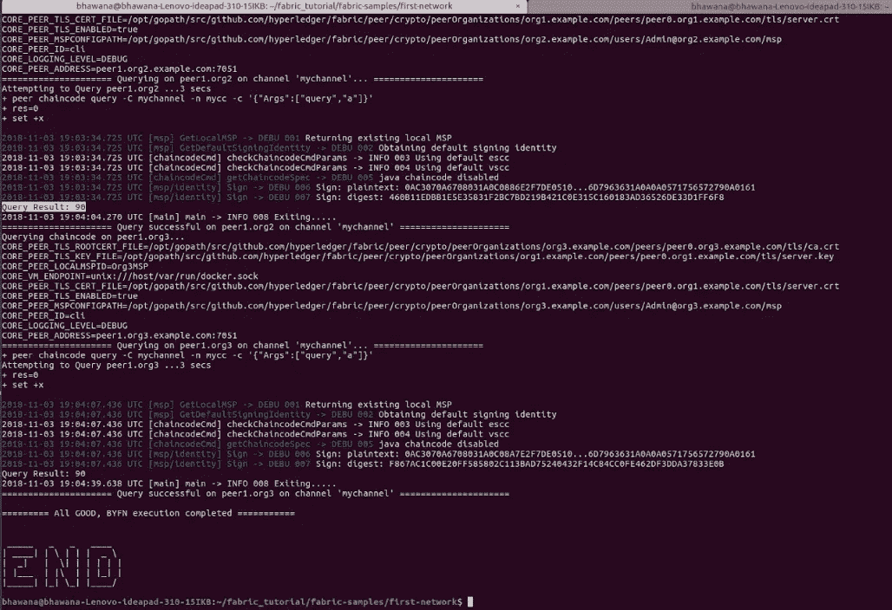

# 根据公司要求定制 Hyperledger 结构配置

> 原文：<https://medium.com/coinmonks/customize-the-hyperledger-fabric-configurations-as-per-the-company-requirements-a1ca8dd7fac9?source=collection_archive---------0----------------------->

正如我们所知，区块链技术正在发展，人们很想了解更多，并试图用这项新技术做实验。Hyperledger 是由 Linux 基金会主持的开源领先项目之一，支持如此多的框架，但人们大多选择在 Hyperledger Fabric 上工作。在本教程中，我们将探索 Hyperledger Fabric 以及如何自定义初始网络设置所需的配置文件，我们还将了解如何在现有网络中添加更多组织。我们开始吧！！！！！

在潜入超级账本之前。使用以下先决条件设置您的本地计算机:

```
**Operating Systems:** Ubuntu Linux 14.04 / 16.04 LTS (both 64-bit), or Mac OS 10.12
**Docker Engine:** Version 17.03 or higher
**Docker-Compose:** Version 1.8 or higher
**Node:** 8.9 or higher (note version 9 is not supported)
**npm:** v5.x
**git:** 2.9.x or higher
**Python:** 2.7.x
```

如果您运行的是 Ubuntu，您可以使用下面的命令下载这些必备软件。请记住，在运行以下命令之前，不要使用 sudo 或以 root 用户身份登录:

```
curl -O [https://ibm-blockchain.github.io/develop//develop/prereqs-ubuntu.sh](https://ibm-blockchain.github.io/develop//develop/prereqs-ubuntu.sh)
chmod u+x prereqs-ubuntu.sh
```

接下来，运行脚本，因为在执行过程中会短暂地使用 sudo，所以会提示您输入密码。

```
./prereqs-ubuntu.sh
```

除此之外，你还需要安装 go 语言包来运行 go 语言的 chaincode。使用以下命令:

```
sudo apt install golang-go
```

查看和编辑代码也需要您选择的代码编辑器，我推荐 *VSCode* 编辑器。

## **安装总账面料样品**

在本教程中，我将使用 Hyperledger Fabric 示例，并在不同的配置文件中进行更改，以便在现有网络中添加一个新组织。确定您的计算机上要放置 Hyperledger Fabric 样本存储库的位置，并在终端窗口中打开它。然后，执行以下命令:

在我的例子中，我创建了一个名为 fabric_tutorial 的目录。

```
mkdir fabric_tutorial
cd fabric_tutorial
git clone -b master [https://github.com/hyperledger/fabric-samples.git](https://github.com/hyperledger/fabric-samples.git)
cd fabric-samples
```

## **下载特定平台的二进制文件**

接下来，我们将安装特定于 Hyperledger Fabric 平台的二进制文件。该工艺旨在补充上述 Hyperledger 面料样品。请在 fabric-sample 目录中执行以下命令。

```
curl -sSL [https://goo.gl/6wtTN5](https://goo.gl/6wtTN5) | bash -s 1.1.0 1.1.0 0.4.6
```


执行上述命令后，它将开始获取平台特定的二进制文件，并将在 fabric-samples 中创建一个 bin 文件夹。


您将会注意到，在 fabric-samples 存储库中包含了许多样本。我们将使用第一个网络样本。现在让我们打开子目录。

```
cd fabric-samples/first-network
```

Hyperledger Fabric 提供了完全带注释的脚本`byfn.sh`,该脚本利用这些 Docker 映像来快速引导 Hyperledger Fabric 网络，该网络由代表两个不同组织的 4 个对等点和一个订购者节点组成。它还将启动一个容器来运行一个脚本执行，该脚本执行将对等体加入到一个通道中，部署和实例化链代码，并根据部署的链代码驱动事务的执行。但我们不只是运行这些`byfn.sh`脚本，我们将向现有网络添加一个新组织，然后运行这些脚本文件，以便它能够反映这些变化。

## 密码生成器

`cryptogen`工具用于为各种网络实体生成加密材料(x509 证书和签名密钥)。Cryptogen 使用一个包含网络拓扑的文件`crypo-config.yaml`，并允许我们为所有组织和属于这些组织的组件生成一组证书和密钥。打开第一个网络下的`crypto-config.yaml`文件，通过在现有网络中添加新的末端组织分别进行更改。


crypto-config.yaml

## 创建网络工件

类似地，Configtxgen 使用一个文件`configtx.yaml`,该文件包含示例网络的定义。有四个成员——一个订购者组织(order Org)和三个对等组织(Org1，Org2 & Org3 ),每个组织管理和维护两个对等节点。这个文件指定了一个联合体——sample consortium——由我们的三个对等组织组成。请特别注意该文件顶部的“*配置文件*部分。您会注意到我们有两个独特的标题。一个用于订购者生成模块*三个订购者生成模块*，一个用于我们的频道*三个订购者频道*。


configtx.yaml

## Docker 组合拓扑

完成这两个步骤后，进入`docker-compose-cli.yaml`文件，通过添加 Org3 的服务来做相应的修改。


docker-compose-cli.yaml


docker-compose-cli.yaml

打开 first-network 下的基本文件夹，转到`docker-composer-base.yaml`文件。为 Org3 的两个具有不同端口号的对等体添加新容器。


docker-compose-base.yaml

`docker-compose-e2e-template.yaml`被构建为使用 Node.js SDK 运行端到端测试。除了与 SDK 一起工作之外，它的主要用途是向组织 ca 发送 REST 调用，用于用户注册和登记。打开`docker-composer-e2e-templete.yaml`并定义 CA(认证机构)配置。


docker-composer-e2e-template.yaml


docker-composer-e2e-template.yaml

## CouchDB

现在是时候为不同的对等体处理 CouchDB 数据库了。`docker-compose-couch.yaml`文件包含为组织对等体定义的存储。通过添加新的 CouchDB 容器为 Org3 配置数据库。


docker-composer-couch.yaml

呼呼！！！！我认为在不同的配置文件中已经做了很多改变，现在是时候生成不同的证书了。分别在加密配置和信道伪像下发送。通过运行以下命令:

```
./byfn.sh generate
```


运行上面的命令后。它将反映新的文件和文件夹下的加密配置如下。


在生成这些网络工件后，现在它们会转向不同的文件，如`byfn.sh`和`script.sh`。我们在这些文件下分别做了修改，允许不同的组织加入渠道，安装链码，发起链码，查询链码。


byfn.sh

在`utils.sh`中加入新的组织以达成共识。


utils.sh

我们通过添加 Org3 对 wrt `script.sh`文件做了一些修改，并获取查询以获得结果。


script.sh

在不同的配置文件中完成所有这些更改之后。运行命令:

```
./byfn.sh up 
```

它将成功运行代码并在最后显示“END”。如果你没有收到这个“结束”消息，这意味着你在不同的配置文件中做修改时犯了一些错误。



耶！！！！我们成功地将新组织(Org3)添加到 *mychannel* ，安装并初始化 chaincode 并查询结果。

您可以从下面的链接获得完整的定制代码:

[](https://github.com/bhawanaSingh/hyperledger_fabric_multi_org_network) [## bhawanasing/hyperledger _ fabric _ multi _ org _ network

### 根据公司要求定制 Hyperledger 结构配置。…

github.com](https://github.com/bhawanaSingh/hyperledger_fabric_multi_org_network) 

> [直接在您的收件箱中获得最佳软件交易](https://coincodecap.com/?utm_source=coinmonks)

[](https://coincodecap.com/?utm_source=coinmonks)