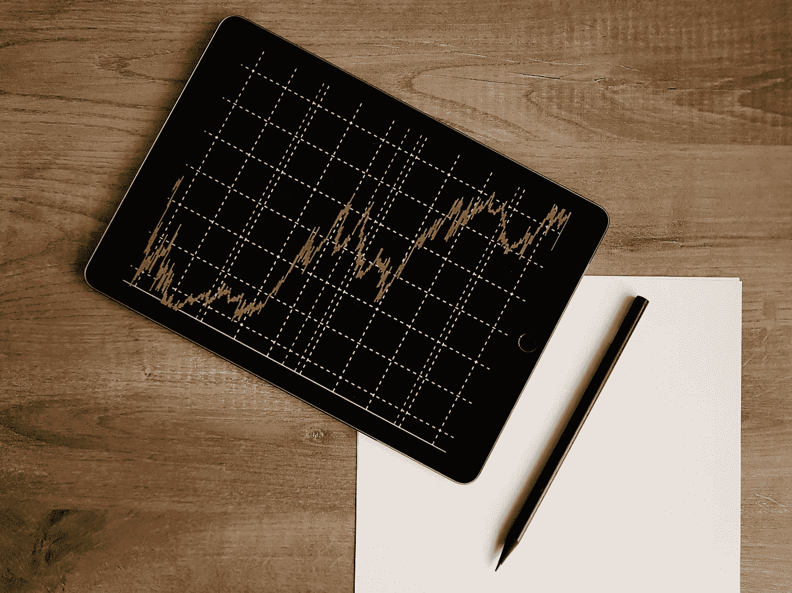
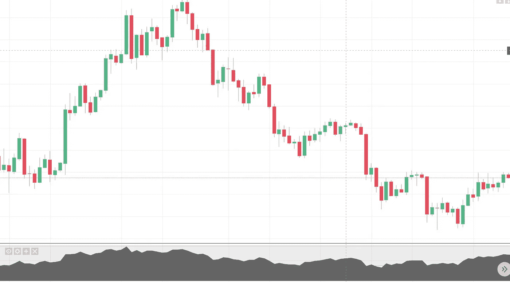
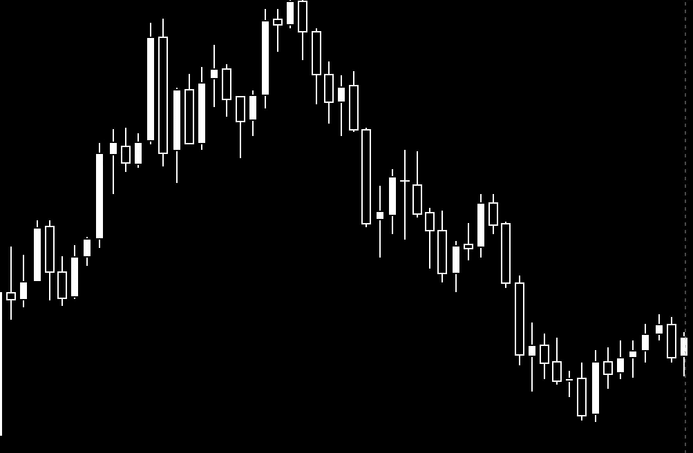
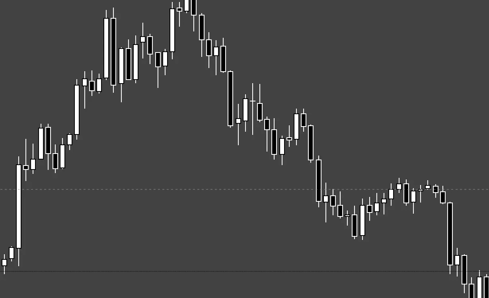
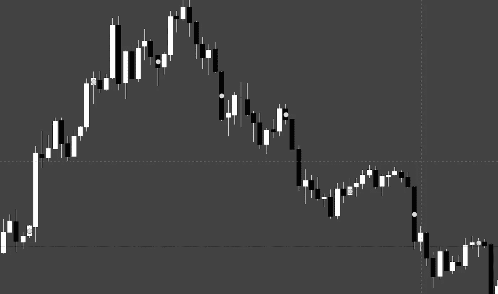

# 定制加密图表:用于可读性和设计的创意图表

> 原文：<https://medium.com/coinmonks/customized-crypto-charts-creative-charts-for-readability-design-fe9a5a951d41?source=collection_archive---------4----------------------->

## 有一些技巧和窍门可以帮助您的图表在实际可读性方面更突出。

> 在您阅读之前，请简要提及，本文比预期的要长得多。因此，我为 TLDR 制作了一个迷你目录。原谅我的长篇大论。
> 
> 此外，第四部分展示了加密推特的图表例子，如果你想特别了解这些，这些图表有很好的主题。

## _ _ _ _ _ _ _ _ _ _ _ _ _ _ _ _ _ _ _ _ _ _ _ _ _ _ _ _ _ _ _ _ _ _ _ _ 目录

> 第一部分:设计的概念
> 
> 第二部分:实用图表设计模式
> 
> 第三部分:设计的双重性
> 
> 第四部分:加密推特设计示例

如果你曾在密码货币交易领域呆过很长时间，用图表解读价格走势已经成为你习惯的一个整体部分。在这条线上的某个地方，你可能质疑过自己用默认颜色交易的模式，或者见过有人使用不同主题的自己的颜色。本文包含一些信息，说明为什么为主题和定制设计重新设计图表对可读性很有帮助(如果不是必要的话),既便于他人阅读，也便于您自己思考。

我在这里的目标是解释图表设计的重要性，好的图表样本(在我看来)和帮助你的图表有更好的可读性和潜在增加用户参与的技巧/窍门。

# _ _ _ _ _ _ _ _ _ _ _ _ _ _ _ _ _ _ _ _ _ _ _ _ _ _ _ _ _ _ _ 第一部分:设计的内容和概念

## 内容才是最重要的

在我开始之前，我真的想给我自己的文章投上阴影。 ***归根结底，定制是一种可选的艺术形式，内容才是最重要的。*** 我看过一些凌乱的图表，我非常喜欢，因为它们有太多深刻的内容。本文只是提出了一种清理的方法，如果可能的话，但也不是必须的，因为看到你的图表的人必须解释他们自己的信息来进行他们自己的研究。

> 这是我平时文章的一个小迂回，但我觉得它值得一看。这也是远离交易严肃性的一个有趣的方面。它对您的眼睛也有好处(我们将很快阅读)。

我们开始吧。

## 设计理念

设计的概念非常简单，但却经常被忽视。我们有设计奇妙的大脑，能够区分形状、颜色和图案。当我们把所有这些放在一起时，我们可以创建出色的主题，帮助我们记录更多的信息或简单地提供增强的情绪。由于对比和关联的概念，设计在存在中是强制性的。如果我能区分圆和正方形，我会注意到它们存在的不同，尽管它们都是一种形状。因此，我发现了设计。然后我可以放置五个不同颜色的圆圈，创造出类似奥林匹克标志的东西。这很吸引人，但是设计和色彩的哲学在这篇文章中涉及太多了(并且超出了它的范围)。

# _ _ _ _ _ _ _ _ _ _ _ _ _ _ _ _ _ _ _ _ _ _ _ _ _ _ _ _ _ _ _ _ 第二部分:什么样的设计对你的图表有实际影响

## 为什么设计很重要

设计很重要，因为为某样东西创建不同的模式和主题，在这种情况下主要是加密的图表，可以帮助沟通的有效性。从现在开始，我将在本文的其余部分具体介绍加密图的设计概念。

图表中的设计很重要，因为:

*   如果将颜色放在主题或图案中，可以帮助观察者根据通常与图表相关的模式来理解您的图表。 ***例如，绿色和红色的烛台被恭敬地与上下价格运动*** 联系在一起
*   颜色可以用来创造阅读寿命。在黑色背景上阅读白色文本(阅读:夜间模式)比在黑色背景上阅读红色文本更容易阅读(这会产生令人讨厌的弹出感觉)。
*   颜色，可以在图案中用来联想心情。较冷的颜色，如蓝色和绿色，比红色和黄色更让人感觉平静。这就是为什么像苹果和沃尔玛这样的公司选择白色和蓝色。
*   颜色可以创造出熟悉的禁欲主题。颜色组合可能比其他颜色组合更令人愉快，因为它们在颜色图表上有关联的配对。绿色和红色烛台可以工作，因为它们在色轮上是对立的(象征着停止和前进信号灯)，就像蓝色/橙色和黄色/紫色的对比一样。黑白也是一个很好的对比选择。这也适用于色调、阴影和光泽，如哑光色组、大胆的颜色或柔和的颜色。
*   形状也有助于情绪。如果读者对那些设计模式很敏感，任何有边的东西都会妨碍你的思考，但是正方形和长方形也有助于提高逻辑可读性。直线有助于在图表上找到合理的结果，创建指标，并解读价格走势。
*   间距也有助于可读性和情绪。这是斐波那契回撤线和江恩线如此吸引人的原因之一，除了它们在逻辑上有用的事实。

## 颜色和配色

最终，您将决定选择您希望图表使用的颜色。你会比其他人更关注自己的图表。也就是说，如果你已经读到这里，你可能会对一些想法感兴趣。总的来说，最好的想法之一是创建一个配色方案。匹配互补色，或者至少在相同的功能中使用一致的颜色，将会使你的内容可读性提高十倍。

例如:

*   如果你把支撑线和阻力线做成同样的颜色，我会知道，在大多数情况下，这些线通常是 S&R 线。我在 CT 上见过的一些人用一种颜色表示支持，用另一种颜色表示抵抗( [DonAlt](https://medium.com/u/71684def3b7d?source=post_page-----fe9a5a951d41--------------------------------) 想到)。这总是有助于快速有效地了解价格走势。
*   有些人，比如我，对 S&R 使用相同的颜色，但对更长的时间框架使用不同的颜色。我用洋红色代表每月，白色代表每周，深灰代表每天——这些颜色在各自的时间范围内以相同的字母开始。这是有意的，因此用户可以习惯性地将颜色与内容联系起来。

适合搭配的颜色有:

*   **黑色和白色:**这些颜色提供了最高的对比度，因为它们是任何颜色的最对立面(白色反射光谱上的所有颜色，而黑色吸收所有颜色)。
*   **黑灰色和深褐色**:深褐色的优势在于，在我们的高分辨率屏幕上，它是一种非常容易在眼睛上看到的颜色。
*   **红色/绿色、蓝色/橙色和黄色/紫色**:这是色轮上的对立色。
*   黄色/橙色和蓝色/紫色:这些是原色和二次色的混合，但它们在棱镜光谱上是近亲(罗伊 G. BIV)。
*   **黑白加单色**:例如红色可以搭配黑白
*   **一种颜色有不同的深浅**:蓝色、深蓝色、天蓝色和蓝灰色都是同一种颜色的一部分，但可以区分。

同样重要的是要记住，100%的白色或黑色可能太亮或太暗。实际上可以考虑将**降低一个色度或者将其 alpha 级别(透明度)降低到 80%或者更低**。20%适用于非常细微的着色。深褐色也是一个不错的选择，因为这种颜色对眼睛非常好(看起来像一本旧书)。

## 背景、乐队和 Ichimoku

颜色和主题也很重要，当使用背景和屏幕填充指标，如布林线和一云。一般来说，背景、背景和云的最佳经验法则取决于你想让人们看到什么。

作为一个背景，目的很好…在后面。一个好的背景是不引人注意的，因为它的颜色是为了引起对前景的注意。白色、黑色、灰色和深褐色通常是最佳选择，但并不总是如此。哑光外观的任何颜色都可以。最不可能的候选者是 bolds 和 neons。

布林线和一氧化二氮云是相似的，但如果这是你的重点，可以更加突出。就个人而言，价格行为、蜡烛图和水平线是主要内容，所以在波段上，它们越微妙，你的蜡烛图和价格行为就越有可能被关注。给你的乐队一两个高一点或低一点的色调是很好的赞美。对于 Ichi 云，它们通常有不止一种颜色。远离烛台颜色一两个阴影是一个很好的选择，远离 neons 可以将注意力转移到其他地方(除非你真的希望它被带到云上)。

## 烛台

这通常是图表上的主要内容。上面第二部分中的许多颜色匹配将有助于一些想法。这里真的没有什么不好的选择。我唯一要避免的是红色和黑色的搭配:这会让你的眼睛看起来很奇怪，而且会很快产生压力。

我唯一会考虑的是蜡烛的边框和灯芯。您可以让烛台在 TradingView 上看起来更厚，方法是给它们加上与蜡烛本身相同的边框，以引起人们的注意。您也可以将边框设为与背景相同的颜色，使蜡烛看起来光滑而纤细。

对于灯芯，我唯一觉得不好看的是与蜡烛相比，给它们太多的颜色。灯芯通常是对蜡烛的补充，所以你可能不想给它们比蜡烛本身更多的关注。

我也举了一些例子:

*   这是你典型的红色和绿色烛台，有网格线，但没有标签和阴影 RSI 卷，以保持对蜡烛的注意。

*   这些白色的蜡烛代表价格上涨，黑色的代表价格下跌。为了可读性，包含白色边框是合乎逻辑的。白色蜡烛可以有白色边框来突出，但是可以被移除，因为白色蜡烛无论如何都是突出的。

*   这是一只灰色背景的虫子。请注意，它对眼睛来说更容易，但黑色蜡烛在白色边框的衬托下显得很有趣。

*   这里和上面一样，但是没有边框。

你可以有上千种组合。尝试你的偏好是什么，以及它是如何读的，真的可以帮助你找到一个好的选择。

# _ _ _ _ _ _ _ _ _ _ _ _ _ _ _ _ _ _ _ _ _ _ _ _ _ _ _ _ _ _ _ _ 第三部分:设计双重性

## 内置可读性

很多情况下，你的颜色和设计选择可以反映多种方式来表达信息。例如，在默认的绿色和红色烛台中，我们通常可以假设红色是向下的运动——但在某种意义上，我们可以完全去掉颜色，让所有的烛台都是白色背景的黑色。换句话说，方向也包含可读性，因此颜色并不决定设计。

支撑线和阻力线也是如此。你不需要在支撑线上涂颜色——它们可以被理解为当前价格行为的一部分。

请注意，像 EMAs 这样的移动指标通常不能很好地做到这一点。他们可以移动足够多，所以他们变得混杂在一起，不能在较低的时间框架内区分。在任何不止一种颜色的折线图指示器中使用颜色是很好的(除了 Guppy)。

## 不必要的设计

如果你想稍微清理一下你的图表，最好的考虑是删除那些可以自我解释或者与其他设计模式相结合的东西。我前面提到过 S&R 线和烛台可以用颜色编码或假定方向，但宽带和其他指标也可以。

# _ _ _ _ _ _ _ _ _ _ _ _ _ _ _ _ _ _ _ _ _ _ _ _ _ _ _ _ _ _ _ _ 第四部分:加密 Twitter 中的好主题

## 例子

在 Crypto Twitter 上有一些很好的图表设计的例子，在这一部分， ***我想强调一些看起来很好，有助于可读性，并提供很好的内容*** 。

*   **交易室**:一个非常古典的外观，两个人会喜欢他们提供的内容。深色背景是一个很好的图案，可以让人们注意到传统的绿色和红色蜡烛，并提供大量信息。这非常符合他们的主题——提供有价值的内容。有时传统的颜色有助于让读者忘记主题，进入主题。交易室可以在 Twitter @tradingroomapp 上找到
*   Hsaka 提供的伟大内容在我看来与蓝色和白色相得益彰(这两种颜色有助于支持更平静的颜色/醒目的颜色设计范例)。较暗的背景是微妙的，而不是压倒性的，这有助于将更多的内容带到表面。可以在 Twitter @HsakaTrades 上找到 Hsaka
*   这是一个在白色背景上展现价格行为的黑白主题的很好的例子。Trooper 做得很好，使其保持简单并与他的客户主题相关。这有助于关注 Trooper 提供的精彩内容。可以在 Twitter @CryptoTrooper 上找到 Trooper_
*   **Altcoin Psycho** :一个令人惊叹的追随者，内容精彩，但也有提到的棕褐色背景和彩色平板外观的主题。真的很好看，它有助于更清楚地显示内容。《惊魂记》可以在推特@AltcoinPsycho 找到
*   除了粉色之外，紫色和靛蓝色也是使用暖色的一个很好的例子。保持内容简单易懂。可以在推特@CryptoPrincessa 上找到她
*   **树须**:黑色和白色，但也配有横向颜色和粗体字体。这是一个很好的例子，说明了烛台的重要性，但是颜色显示了蜡烛的重要性。可以在 Twitter @TreebeardTrades 上找到 Treebeard

## 你不可能取悦每个人

如果你试图为别人定制你的图表，你不会让每个人都满意(我不建议只为他们改变主题)。归根结底，设计是一种非常主观的艺术形式，所以它可以归结为你喜欢的主题。不同的颜色和色调很适合你阅读，而其他的就不那么适合了。

继续尝试。

你能做的最好的事情就是关注内容。这将帮助你成为更好的交易者。只要确保颜色和设计能让交易变得容易，而不是让事情变得复杂，或者花太多时间去弄乱。最棒的是，我们可以选择定制或保持原样。

请随时在 Twitter @ hodltalk 上联系我