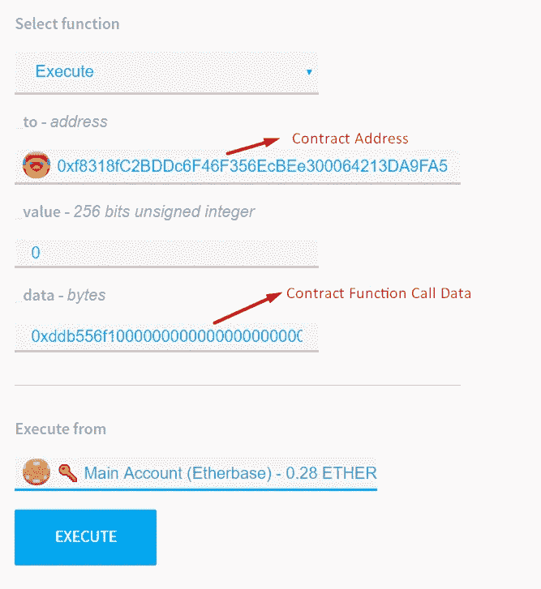

# 为合同执行定制和使用 Multisig 合同

> 原文：<https://medium.com/coinmonks/customizing-and-using-multisig-contracts-for-other-contract-executions-9698fbb6950f?source=collection_archive---------2----------------------->

加密货币被认为是最安全的资产存储方式。但是大部分的使用都是针对由私钥保护的单个地址设计的。丢失此私钥意味着您将永远无法到达您的帐户。或者你的私人钥匙被盗意味着有人现在是你的帐户和财富的所有者。一个更好的解决方案可能是由许多人拥有的多 Sig 合同(钱包合同),并且该合同的所有权需要预定义的最小帐户密钥。所以它既能提供安全感，又能提供依赖。


在传统方法中，您将您合伙企业余额转移到已创建 MultiSig 合同，每当您决定从该余额中支出时，您和您合伙人确认该交易，指定金额将被转移。所以你只能用乙醚转移。因为它是一个智能契约，所以我们可以修改它并将其用于契约执行，如令牌传输或其他自定义函数执行。在本文中，我们将把它用于一个简单的合同执行，但是正如我所说的，你可以把它用于你自己的项目。


Solidity for Smart Contract Developments

首先，我们从修改基本的多重契约开始。在这一个中，我们将更改的主要功能是“*执行*功能，该功能用于保存我们的确认请求并通知合同的其他所有者的第一笔交易。它使用预定义的每日限额来指定所有者的支出限额。因为我们不会在交易中使用以太作为价值(价值将为“0”)，所以我们的合约中不需要每日限制。我方多信号合同的*执行*功能的最终状态如下:


在我们的 MultiSig 事务中，我们将定义“*_ 到*”作为我们的最终契约地址，在确认后执行，“ *_value* ”将为“0”，因为我们不想在我们的事务中使用 Ether，“ *_data* ”将作为我们的最终契约函数的调用输入数据。在最终确认时，MultiSig contract 将使用此“*数据*调用我们的示例最终合同，此数据将确定在此合同中使用哪个参数执行哪个功能。


修改我们的 MultiSig 合同后，我们可以使用在线 solidity IDE " [Remix](https://remix.ethereum.org) "或通过以太坊钱包部署它。我将为这个部署使用 remix。当您部署契约时，它会询问您一些信息，如“谁是所有者？”以及“执行的最低批准限制是多少？”，我们将在合同构造函数中定义这些参数。在这些示例中，将有四个所有者，而所需确认将是三个。作为本合同的创建者，我将确定另外三个地址。以下是我在示例中使用的构造函数值；

```
["0xE771e5B197C8211fa4EB3fB442E97199630C2cf2", "0x8570FC52E708534A25408Ac67A4d570D82c5f031", "0x5903A8584526656E5F644292f2A0069a77CEc220"], 3, 0
```

这是部署合同。


部署后，我们将获得新创建的 MultiSig 合同的地址。在我的例子中是“[*0x1f 271047 cc 3f 971d 8 B2 d 226 a 1 af 0b 5 e 7 dee 5 af 20*](https://ropsten.etherscan.io/address/0x1F271047cC3F971D8B2D226A1Af0B5e7DEE5aF20)”。我们将使用钱包中的这个地址来导入此合同。这是我们合同的导入过程；


如你所见，它发现我是这份合同的拥有者之一。我们将为该合同的其他所有者重复这一过程。之后我们可以在钱包里看到这个钱包合同；


下一步是在我们的 MultiSig 契约中执行我们的示例契约函数。这个示例契约和中的一样简单，只包含一个函数，并且只更改了这个契约中的一个 uint 变量；


本合同的部署地址如下“[*0x f 8318 fc 2 BD DC 6 f 46 f 356 ecbee 300064213 da 9 fa 5*](https://ropsten.etherscan.io/address/0xf8318fc2bddc6f46f356ecbee300064213da9fa5)”。为了在我们的 MultiSig 契约中执行此契约，我们需要调用此示例函数的输入数据。你可以通过以太坊的. Net 集成库 [Nethereum](https://nethereum.com/) 获得。对于这个过程，您需要合同地址和合同 ABI，这是示例代码；

```
var web3 = new Web3("http://localhost:8545");var exampleContractAddress = "0xf8318fC2BDDc6F46F356EcBEe300064213DA9FA5";
var exampleContract = web3.Eth.GetContract(MultiSigExample.Properties.Resources.ExampleContractABI, exampleContractAddress);var exampleExecuteFunction = exampleContract.GetFunction("Execute");
var data = exampleExecuteFunction.CreateCallInput(20).Data;
```

在这段代码中，我们使用值“ *20* ”获取示例契约的“ *Execute* ”函数的 callinput 数据。为此 is 生成的呼叫输入数据；*0x DDB 556 f 100000000000000000000000000000000000000000000000014*。确认后，我们将在我们的 MultiSig 合同中使用该数据来执行该合同。您可以通过选择我们的钱包合同并选择 MultiSig 合同的“执行”功能，通过以太坊钱包使用它。



或者使用 Nethereum，您可以通过以下代码创建多签名合同交易:

```
var account = new Account("privatekey");
var web3 = new Web3(account, "http://localhost:8545");var exampleContractAddress = "0xf8318fC2BDDc6F46F356EcBEe300064213DA9FA5";
var exampleContract = web3.Eth.GetContract(MultiSigExample.Properties.Resources.ExampleContractABI, exampleContractAddress);
var exampleExecuteFunction = exampleContract.GetFunction("Execute");
var data = exampleExecuteFunction.CreateCallInput(20).Data;
var byteData = data.HexToByteArray();var multiSigContractAddress = "0x1F271047cC3F971D8B2D226A1Af0B5e7DEE5aF20";
var multiSigContract = web3.Eth.GetContract(MultiSigExample.Properties.Resources.MultiSigABI, multiSigContractAddress);
var multiSigExecuteFunction = multiSigContract.GetFunction("execute");
var gas = await multiSigExecuteFunction.EstimateGasAsync(exampleContractAddress, 0, byteData);
var transactionHash = await multiSigExecuteFunction.SendTransactionAsync(account.Address, gas, null, exampleContractAddress, 0, byteData);
```

在执行我们的 MultiSig 合同后，您可以在我们的钱包中看到来自钱包合同的通知；


接下来就是等待其他业主的确认了。如下图所示，他们也将从我们的钱包合同中获得通知；


在我们需要作为第三次确认的最后一次确认之后，我们可以看到事务细节和触发的日志事件。其中之一是我们的示例契约的" *Execution* "事件，这意味着该事务也触发了我们的示例契约，并且我们的事件如我们所预期的那样被触发。


甚至我们可以在钱包中看到我们的示例值的新值和触发的事件。“我的价值*现在是 *20* ，这是我们在 MultiSig 合同的数据中指定的。*


本文只描述了一个使用 MultiSig 契约执行另一个契约的简单例子。您可以实现这个透视图的不同变体。比如说；您可以将您的代币转移到 MultiSig 合同，并使用多所有权 MultiSig 合同中的代币余额。您可以从我的 GitHub 中查看和使用本文的参考资料。

[](https://github.com/mrceylan/MultiSig.Contract.Execution) [## mrceylan/MultiSig。合同.执行

### MultiSig。合同.执行-另一个合同执行的多重合同示例

github.com](https://github.com/mrceylan/MultiSig.Contract.Execution)