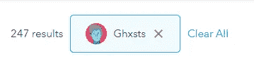

# Cxxl Cxts & GHXSTS Airdrop —开发博客

> 原文：<https://medium.com/coinmonks/cxxl-cxts-ghxsts-airdrop-dev-blog-b99f15cb52ee?source=collection_archive---------0----------------------->

## 比我想象的要难。


## 目录

*   [为什么我们的夏季下降适得其反？](#28af)
*   [GHXST 空投计划](#cfa8)
*   [抓拍酷猫](#cf79)
*   [快照 GHXST](#7b91)
*   [分销方法](#3b51)
*   [为什么我们没有使用现有的服务？](#de56)
*   [让空投开始吧！](#85a5)
*   [双重编码错误修复](#7a00)
*   [继续下降…](#b17b)
*   [清理重复——隐藏的错误](#cd33)
*   [参考文献](#664e)
*   [去哪里找我们](#a6cb)

公平的警告，这篇文章很快就会变得代码过多。

与 GHXST 合作是一件大事。他在 NFT 圈子里是一个如此重要的名字，我们知道我们必须做一些特别的事情。

在 GHXST 投放前一周，我们决定推出一个有趣、惊喜的夏季主题限量版系列，共计 300 枚代币——结果适得其反，但为什么呢？

# 为什么我们的夏季下降适得其反？

我认为简单的答案是新的物品被空投弄糊涂了，然后总会有人对他们没有得到 300 个空投物品中的一个感到愤怒。

从新的角度来看，我完全理解这种困惑。NFTs 和 crypto 充斥着行话。对于这群人来说，困惑是我们的错，因为我们没有通过解释空投来让他们做好准备。

当你把新的飞毛腿和理解空投但本质上对没有得到免费的钱感到愤怒的人联系在一起时，它创造了一个自我延续的回音室。

我们想要一种道歉的方式，让每个人都体验一下空投行动。

# GHXST 空投计划

GHXST 收藏者会知道他的收藏是有限的。他没有一件藏品的规模能与 3300 只酷猫的持有者相提并论。因此，当 GHXST 建议我们向每位时尚弄潮儿和 GHXST 持有者赠送一台 Cxxl Cxt -1 时，我感到非常震惊。

大力支持 GHXST 获得❤奖

就这样，我们有了一个最终的计划——给每个持有时尚弄潮儿或任何 GHXST 系列物品的人。

似乎很简单。

我错了。

# 抓拍酷猫

给酷猫拍张快照很容易。在 eth 上有许多记录良好的方法可以做到这一点。我们选择了一个非常简单的解决方案，在调用它时拍摄快照:

第一步——获取总人口
我们简单地调用我们的契约，并要求它返回 totalSupply()，这是已经铸造的酷猫的数量。

```
const totalSupply = await this.contract.methods.totalSupply().call();
```

**步骤 2 —迭代实时令牌和日志所有者** 我们循环遍历总人口，对于每个令牌，我们要求我们的合同返回当前所有者。

然后主人的地址作为一个键被添加到一个对象中，我们跟踪一个给定的主人有多少只猫。

需要注意的是，使用地址作为对象中的键相当于重复地址过滤器。然而，尽管这是真的，但你们中眼尖的人可能已经发现了一个我很久都没有发现的错误(稍后会有更多的介绍)。

```
const holder = {};
  for(let i = 0; i < totalSupply; i++){
    const ownerAddress = await this.contract.methods.ownerOf(i).call();
    if(!holder[ownerAddress]){
      holder[ownerAddress] = 1;
    } else {
      holder[ownerAddress]++;
    }
  }
```

**第三步—保存快照** 这里不多说了，标准 fs 用法保存 JSON 到文件。

```
***fs***.writeFile('holders.json', ***JSON***.stringify(holder),{ flag: 'wx' },function (err) {
    if (err) return ***console***.log(err);
  });
```

# 快照 GHXST

那么，从哪里开始呢？

Opensea 的某些方面对我来说仍然陌生，我天真地认为他们的 API 将是我收集所有者列表所需要的全部——事实证明，不是那么多。

## 正在收集所有项目 id

第一个障碍是收集每个 GHXST 集合中所有项目的列表:

**ghx STS**:[https://opensea.io/collection/ghxsts](https://opensea.io/collection/ghxsts)

**PxinGxng:**https://opensea.io/collection/pxin-gxng

**Ghxst 文化:**[https://opensea.io/collection/ghxsts-cxlture](https://opensea.io/collection/ghxsts-cxlture)

【https://opensea.io/collection/cxllabs】cxl labs:T23

为了实现这一点，我们使用了部分 [Opensea API](https://docs.opensea.io/reference)

**第一步—分页**
Opensea 一次只允许检索 50 个结果，有些 GHXST 集合可以容纳 250+个条目，所以我们需要一些分页来遍历所有内容。

```
const totalTokens = 50;
const pages = ***Math***.ceil(totalTokens/50);
```

你可以看到这里我们已经放弃了一个神奇的数字 50。这个数字因我们收集数据的集合而异。如果我们看到一个系列有 250 多件，我们相应地改变价值。



[https://opensea.io/assets/ghxsts?search[resultModel]=ASSETS](https://opensea.io/assets/ghxsts?search[resultModel]=ASSETS)

然后我们遍历页面并调用 Opensea，请求集合中所有项目的列表。

```
for(let i = 0; i < pages; i++) {

  offSet = i * 50;

  const response = await fetch(`https://api.opensea.io/api/v1/assets?order_direction=desc&offset=${offSet}&limit=50&collection=cxllabs`);
  const listOfTokens = await response.json();
```

请注意，在上面的截图中，我们正在查询 **Cxllabs** 集合。这个值需要根据您想要查询的集合而改变。

**第二步——把我的头砸在桌子上** 既然我们已经能够抓取一个系列中的所有物品，你可能会认为抓取每一件物品的持有者列表会很容易——不，绝对不会。

除非我非常愚蠢(很有可能)，否则我看不到 Opensea API 中允许我们向所有者查询集合中某个项目的任何内容。如果你知道一条路，请告诉我。当然我不再需要它了，但我还是想知道。

为了解决这个问题，我们开始在 Etherscan 周围嗅来嗅去，但是收集只是大规模 Openseas 合同的一部分。我们需要更好的方法。

幸运的是， [Lynqoid](https://twitter.com/Lynqoid) 很擅长寻找有用的 API，他找到了这个小宝贝，[https://moralis.io/](https://moralis.io/)。我肯定会在❤的很多事情上使用这项服务

```
const url = `https://deep-index.moralis.io/api/nft/contract/0x495f947276749ce646f68ac8c248420045cb7b5e/token/${asset.token_id}/owners?chain=eth&chain_name=mainnet&format=decimal&order=name.DESC`;
const header = { method: 'GET', headers: {
    'X-API-Key': ***process***.env.MORALIS_APIKEY
  }}
const r2 = await fetch(url, header);
const l2 = await r2.json();
```

我知道，这些代码看起来有点吓人，但没关系。我们只是要求 API 服务返回给定令牌 id“$ { asset . token _ id }”的所有所有者，这在大量的 Opensea 合同“0x 495 f 947276749 ce 646 f 68 AC 8c 248420045 CB 7 b 5 e”中可以找到。

要查找某个项目的令牌，您只需单击该项目，您就可以在 URL 中看到它:
[https://open sea . io/assets/0x 495 f 947276749 ce 646 f 68 AC 8 c 248420045 cb7b5e/8049430702452934601805365049012529916739680814777](https://opensea.io/assets/0x495f947276749ce646f68ac8c248420045cb7b5e/80494307024529346018053650490912529916739680814770830097664395582100905918465)

这分为以下几个部分:

*   [https://openseas.io/assets](https://openseas.io/assets)=网站，这个我们可以忽略
*   [0x 495 f 947276749 ce 646 f 68 ac8c 248420045 cb7b5e](https://opensea.io/assets/0x495f947276749ce646f68ac8c248420045cb7b5e/80494307024529346018053650490912529916739680814770830097664395582100905918465)= open sea 合同地址
*   [80494307024529346018053650490912529916739680814770830097664395582100905918465](https://opensea.io/assets/0x495f947276749ce646f68ac8c248420045cb7b5e/80494307024529346018053650490912529916739680814770830097664395582100905918465)=令牌 id

我们将 API 键作为一个头来传递，嘿，很快，我们就有了一个持有人列表。

**步骤 3 —过滤持有人** GHXST 有许多项目，我们需要为所有 GHXST 集合的所有持有人拍摄快照。因为我们的计划是选择独特的钱包，而不是每个项目，所以我们必须过滤掉重复的钱包。

```
// iterate through results
for(const result of l2.result){
  if(!holderAddresses[result.owner_of]){
    holderAddresses[result.owner_of] = 1;
  }else{
    holderAddresses[result.owner_of] ++;
  }
}
```

这段代码可能看起来很熟悉。我们在过滤酷猫的时候也用过。

**步骤 4——保存并检查** 一旦所有的所有者都被过滤掉，我们需要保存他们。

```
***console***.log('total GY tokens:', totalGYTokens);
***console***.log('total owned:', totalOwned);
***console***.log('total holders', ***Object***.keys(holderAddresses).length);

***fs***.writeFile('cxllabsHolders.json', ***JSON***.stringify(holderAddresses),{ flag: 'wx' },function (err) {
  if (err) return ***console***.log(err);
});
```

我们还输出一些控制台检查。这使我们能够将快照值与 Opensea 上显示的值进行比较。请将此视为安全检查，以确保我们的计数匹配。


**第 5 步—为所有集合重复快照** 我们只需改变一些变量，依次指向每个集合，然后启动快照。

最终结果是一个 JSON 文件，包含每个集合的所有持有者。

# 分配方法

最初的计划是花整整一周时间创建一个自动空投系统。七天可以让我们有足够的时间来构建、测试、测试、测试。

由于各种原因，时间表发生了变化。

现在我们只有不到两天的时间来建造它——啊啊啊！！！！

抱歉，我们不会分享 airdropper 代码，因为它仍然是 WIP，目前正在进行大规模升级。

## 最初的计划

在理想情况下，我们应该添加快照列表，点击一个绿色的“GO”按钮，所有令牌都将被空投下来，不会出现任何问题。

## 残酷现实

通过 web3 或 ether 传递大量交易显然会出现一些错误:

*   超时设定
*   404s
*   一般事务失败
*   谁知道还有什么

我想创建一个健壮的系统，跟踪每笔交易的成功或失败，并将数据存储在不同地址的数据库中。很简单，只有很少的活动部分，但是需要测试，错误处理有时会比你预期的要长——队列计划 b。

## 计划 B——半自动下降系统

人类非常擅长处理错误，当然我们会疲劳和犯错，但在如此短的开发时间内，我们的劣等大脑就是答案。

我们创建了一个简单的 React 应用程序，允许团队成员连接到 metamask 并填写一个简单的表单，我们在其中放入 10 个地址，点击一个大的“GO”按钮并处理这 10 个地址。

是的，我们确实以 10 个为一组处理了所有 3500 多个 Cxxl Cxts。

我们使用 10 个地址的块来简化错误处理。所有的区块都列在一个巨大的谷歌文档表中，并细分为选项卡，每个团队成员都有一个选项卡。如果在阻塞期间发生错误，我们将不得不手动检查我们在 Opensea 上的个人活动，以验证我们上次成功的交易。这将允许我们修剪该块，刷新应用程序，并粘贴在该块的剩余地址。

低技术，我知道，但它工作得很好。

# 为什么我们没有使用现有的服务？

我们发现的大多数服务，或者人们与我们分享的服务，都是围绕 ETH 的，我们选择了 POLY (MATIC)以降低费用。

确实存在一些 MATIC 解决方案，但即使在与它们的所有者交谈后，我们得到的结果也是极不一致的。事实上，三分之一的测试液都失败了，所以我们不可能使用它们。

一家相当大的公司确实提供投递服务，但它背后有一堵“联系我们”的墙，我相信我们仍在等待突破那堵墙。

# 让空投开始！

我们进行了 5 分钟，一切都很顺利，至少我们是这么认为的。然后 [Adam](https://twitter.com/Grampa_Bacon) 掉落到我的 DMs 里，让我知道有两个人刚刚收到了双掉落。

我们停止下降，回到那个代码。

# 双重编码错误修复

疲惫不堪，而且非常清楚成千上万的人在等待他们的-1 CXXL CXT 被丢弃，团队滑入黑暗中。

我们很快意识到了这个错误(稍后解释),并开始着手解决问题。

## 不同语言的并行编码

知道我们非常累并且可能会出错，我们决定 Adam 用 Python 编写解决方案，Tom 用 javascript 编写解决方案。彼此独立。

计划是，每个编码员会产生一个非常不同的解决方案，但最终结果需要是相同的，然后我们才会有信心继续进行。

在代码修复期间，团队的其他成员验证任何错误，并向编码人员提供所有成功丢弃的列表。

从空投列表中修剪成功空投的列表，并且使用并行编码方法最终处理结果列表。大约一个小时后，Tom 和 Adam 创建了两个独立的方法，令人惊讶地产生了两个相同的列表(甚至连地址排序都一样)——找到了一个解决方案。

# 继续下降…

## 人为错误和失误

如果我不完全诚实地告诉你错误是由我造成的，那我就是在伤害你。

即使在代码修复后，我还是非常累，并且不小心将猫发送到 10 个地址的同一个街区，两次。

其他人到处都会犯一些小错误，但总的来说，我们的错误率非常低。

# 清除重复项—隐藏的错误

如您所料，所有集合中都有重复的地址，我们需要将它们过滤掉:

**第一步——收集地址** 抓取所有奇异的快照并保存到一个变量中。然后，所有变量都被放入一个数组中。

**第 2 步——合并和过滤** 我们迭代数组和数组中的每个 JSON。像我们在整个过程中所做的那样过滤所有的地址

**步骤 3 —保存最终快照** 标准 fs 方法保存文件。

## 错误

我相信你们中的一些人已经知道发生了什么，但是对于那些没有注意到的人，这里有一个简短的分析。

使用地址作为对象中的键是过滤重复项的一种非常简单的方法。这是事实，直到不同的快照方法以稍微不同的格式返回相同的地址。我们忘了解释这种差异。

> 考虑以下:
> 0 C5 A8 d 47 a 2129d 95 f1 DCF 0 f 49 a4 B3 daea 50 fa 78 b 4
> 0 C5 A8 d 47 a 2129d 95 f1 DCF 0 f 49 a4 B3 daea 50 fa 78 b 4

相同的地址，两个都可以，但是一个是大写字母，一个是小写字母。两者都将在跟踪对象中创建一个惟一的键条目:(

最终结果是同一个地址有多个条目，这意味着当快照被处理为丢弃时，违规的地址将得到两次丢弃。

## 解决方案

解决方案非常简单。在上面的代码中，我们简单地将其改为:

```
for(const obj of arr) {
  const keys = ***Object***.keys(obj);
  for (let key of keys) {
    key = key.toLowerCase();
    if (!allHolders[key]) {
      allHolders[key] = 1;
    } else {
      allHolders[key]++;
    }
  }
}
```

请注意，我们只是添加了一个将所有键规范化为小写的方法。

在理想的情况下，我们应该在拍摄快照时就这样做。但是由于每个快照都需要一段时间，尤其是酷猫快照，我们选择在合并阶段对地址进行规范化。

## 为什么修复花了我们一个小时？

一旦我们发现问题，我们需要:

*   过滤掉所有重复的地址
*   清理地址块——一旦我们注意到错误，我们就中途停止。这些需要清理
*   过滤掉已经成功空投的地址
*   重建组合快照列表
*   将汤姆的结果与亚当的结果进行比较
*   检查，复查，三次检查所有的东西

我们需要非常彻底，我们讨厌任何人错过他们的-1 CXXL CXT。

# 参考

当然，我们包括了一些回复:

【https://github.com/CoolCatsNFTPublic/CoolCatsSimpleSnapShot 

[https://github . com/coolcatsnftppublic/CoolCatsOpenseaCollectionSnapshotting](https://github.com/CoolCatsNFTPublic/CoolCatsOpenseaCollectionSnapshotting)

# 在哪里可以找到我们:

推特:[https://twitter.com/xtremetom](https://twitter.com/xtremetom)

酷猫战队:[https://twitter.com/coolcatsnft](https://twitter.com/coolcatsnft)

酷猫不和:[discord.gg/coolcatsnft](https://t.co/xE2y1NFkKG?amp=1)

**注:**我觉得这么说很傻，但我想节省人们的时间。我不能在其他项目上帮忙。我很高兴与人交谈，我只是不能投入任何时间来实际编码你的项目——抱歉。

[](https://blog.coincodecap.com/best-hardware-wallet-bitcoin) [## 存储比特币的最佳加密硬件钱包[2021]

### 保管您的数字资产很容易，但找到正确的存储方式却是一项繁琐的任务。在线钱包有一个风险…

blog.coincodecap.com](https://blog.coincodecap.com/best-hardware-wallet-bitcoin)