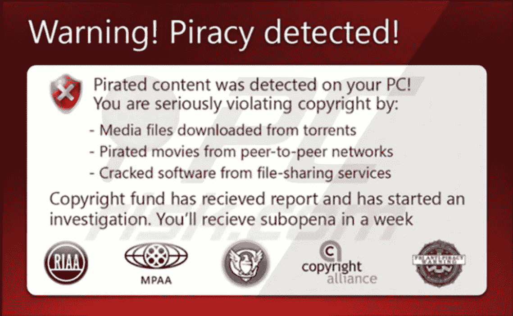

# 网络版# 2——替代

> 原文：<https://medium.com/coinmonks/cybered-2-alternativeto-a20f52a97f39?source=collection_archive---------14----------------------->

Bait! Bait! Bait!

这与其说是典型的网络安全内容，不如说是软件发现内容。然而，由于重要的原因，这是 CyberEd 系列的一部分。

每天检测到超过 500，000 种新型恶意软件。近 80%的恶意软件感染是由不卫生的用户下载行为造成的。在谷歌上搜索带有“免费下载”后缀的项目的习惯实际上是一个非常有利的结果…