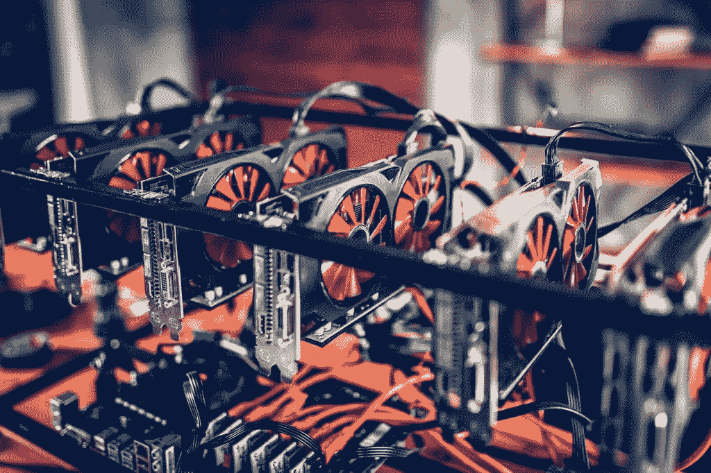
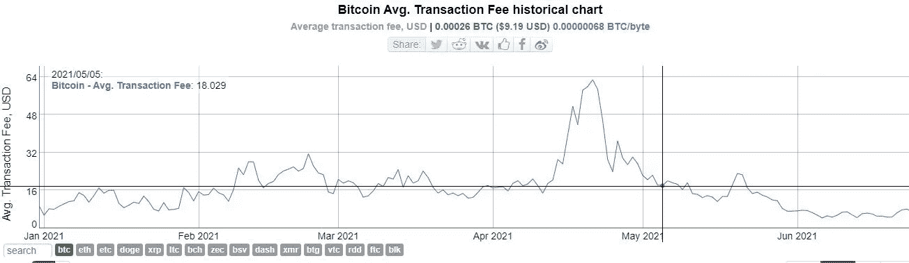
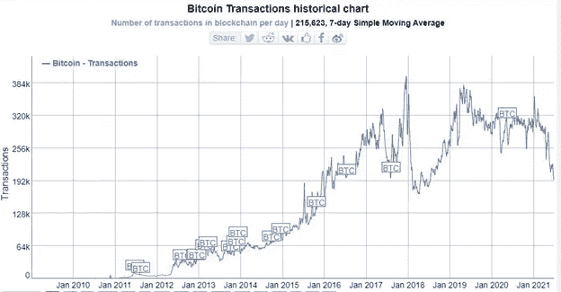
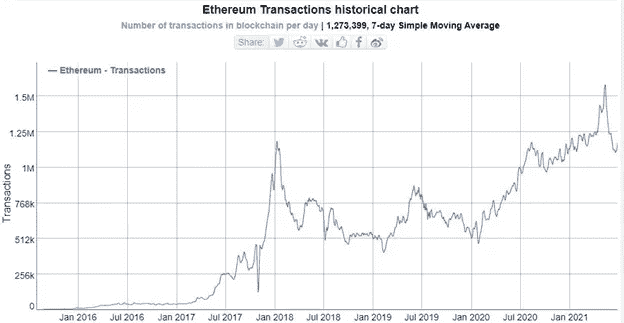

# 比特币区块链上的日常交易降温

> 原文：<https://medium.com/coinmonks/daily-transactions-on-the-bitcoin-blockchain-cools-93b35cf9d83e?source=collection_archive---------9----------------------->

比特币日均交易量降至约 348 亿美元。根据 CoinDesk 的研究，这与 5 月份创纪录的 670 亿美元相比大幅下降，是自去年 12 月以来的最低水平。与 4 月份的高点相比，我们可以肯定地看到，炒作已经离开了加密货币市场。此外，比特币区块链的散列率大幅下降。

Bitcoin Average Transaction Fees

## 对中国矿工镇压的回应

这主要是为了应对中国决定停止所有比特币挖矿活动所带来的压力。新疆当局指示准东经济技术开发区的发电厂关闭他们的采矿设施。这些地区在历史上一直是中国主要的比特币开采中心，因为它们拥有丰富的化石燃料和水电能源。

中国主要的比特币矿池受到了该指令的冲击。矿工们更喜欢电费低的地区，因为这让他们的采矿活动更有利可图。电费占采矿活动成本的主要部分。

在这张图表中，我们将看到比特币区块链的日均交易量已经下降到自加密冬天最黑暗的日子以来从未见过的水平。

Bitcoin transactions per day

有一些积极因素。例如，在最近周期的高峰期，发送比特币的平均交易费[达到 62 美元。目前，它已经回到 8 美元左右的可控水平。](https://bitinfocharts.com/comparison/bitcoin-transactionfees.html#6m)

经常使用主链的人会非常感谢折扣。尽管这意味着他们的股票价值被大幅削减，但没有人喜欢支付高额费用。希望在我们到达下一个高峰时，主根升级将有助于降低价格。

随着炒作泡沫的破灭，我们开始看到一个最受欢迎的放松期，这在传统上对网络的开发者和建设者来说是一个好消息，可以让他们着手发展这个行业。例如，在 2015 年和 2018 年，类似的情况发生了。当时价格的下降赶走了对加密没有信心的怀疑论者，开发者们能够建造网络。

## 以太坊网络

不过意大利的网络有点不同。平均交易数量也在下降，但水平不像今年其他时候那么糟糕。

Transactions on Ethereum blockchain

在燃气费方面，以太坊区块链已经完全降温。5 月份每笔交易的汽油费约为 45 美元，现在约为 4 美元。就像有些人说的，向下，向下但不出来。

虽然发展中国家的一些人可能认为支付 4 美元是一笔很高的费用，但它肯定会让大多数人参与各种分散的金融解决方案，而不必担心汽油费。

## 如何吸引机构参与 DeFi 项目

为了让人们对他们的密码产生兴趣，大多数人都在使用 Celsius、BlockFi 和 Nexo 等服务。这没有什么不好，尤其是对于零售客户来说，他们可以从用户友好的界面中受益，并且不必处理智能合同就可以高枕无忧。然而，对于那些管理着数十亿美元手机的机构来说，将这些资金转移到 DeFi 是很困难的。

首先，需要进行审计，以便一名熟练的区块链审计员能够了解资金的安全性和风险水平。他们还需要知道收益率是如何得出的。此外，我们需要看到更多的项目涉及 defy 保险。保险是一个关键的方面，要在大火开始吸引这种类型的手机之前到位，这种手机将真正有意义，价值数十亿或数万亿美元。当这样做时，债券市场、商品市场和其他市场的投资者将被鼓励把他们的资金转移到 DeFi。

## 你知道吗？

Club Swan-It’s your money, your lifestyle.

使用天鹅俱乐部会员提升您的生活方式。有了 Club Swan，您可以轻松地无缝地从 Crypto 迁移到 Fiat。天鹅俱乐部账户有多种货币，在全球超过 38 个国家接受。更多信息，请点击此链接:[https://clubswan.com/](https://clubswan.com/)

在瑞士金融和技术协会**的帮助下，你可以免费了解区块链和人工智能等新的数字技术。**从 AI 到区块链，从 Challenger Banks 到 DeFi，我们将为您带来 Fintech 的持续学习，一年 365 天。[https://launch think . cfte . education？kid=1KGDSY](https://launchthink.cfte.education/?kid=1KGDSY)

**披露—包括附属链接**

> 加入 [Coinmonks 电报频道](https://t.me/coincodecap)，了解加密交易和投资

## 另外，阅读

*   [尤霍德勒 vs 科恩洛 vs 霍德诺特](/coinmonks/youhodler-vs-coinloan-vs-hodlnaut-b1050acde55a) | [Cryptohopper vs 哈斯博特](https://blog.coincodecap.com/cryptohopper-vs-haasbot)
*   [币安 vs 北海巨妖](https://blog.coincodecap.com/binance-vs-kraken) | [美元成本平均交易机器人](https://blog.coincodecap.com/pionex-dca-bot)
*   [如何在印度购买比特币？](/coinmonks/buy-bitcoin-in-india-feb50ddfef94) | [WazirX 评论](/coinmonks/wazirx-review-5c811b074f5b) | [BitMEX 评论](https://blog.coincodecap.com/bitmex-review)
*   [比特币主根](https://blog.coincodecap.com/bitcoin-taproot) | [Bitso 回顾](https://blog.coincodecap.com/bitso-review) | [排名前 6 的比特币信用卡](/coinmonks/bitcoin-credit-card-bc8ab6f377c6)
*   [双子座 vs 比特币基地](https://blog.coincodecap.com/gemini-vs-coinbase) | [比特币基地 vs 北海巨妖](https://blog.coincodecap.com/kraken-vs-coinbase)|[coin jar vs coin spot](https://blog.coincodecap.com/coinspot-vs-coinjar)
*   [印度加密交易所](/coinmonks/bitcoin-exchange-in-india-7f1fe79715c9) | [比特币储蓄账户](/coinmonks/bitcoin-savings-account-e65b13f92451) | [Paxful 审核](/coinmonks/paxful-review-4daf2354ab70)
*   [杠杆令牌](/coinmonks/leveraged-token-3f5257808b22) | [最佳密码交易所](/coinmonks/crypto-exchange-dd2f9d6f3769) | [密码交易机器人](https://blog.coincodecap.com/best-crypto-trading-bots)
*   [Godex.io 审核](/coinmonks/godex-io-review-7366086519fb) | [邀请审核](/coinmonks/invity-review-70f3030c0502) | [BitForex 审核](/coinmonks/bitforex-review-c4bb28d9e271) | [HitBTC 审核](/coinmonks/hitbtc-review-c5143c5d53c2)
*   [Crypto.com 费用](/coinmonks/binance-fees-8588ec17965) | [僵尸加密审查](/coinmonks/botcrypto-review-2021-build-your-own-trading-bot-coincodecap-6b8332d736c7) | [替代品](https://blog.coincodecap.com/crypto-com-alternatives)
*   [MXC 交易所评论](/coinmonks/mxc-exchange-review-3af0ec1cba8c) | [Pionex vs 币安](https://blog.coincodecap.com/pionex-vs-binance) | [Pionex 套利机器人](https://blog.coincodecap.com/pionex-arbitrage-bot)
*   [我的加密副本交易经历](/coinmonks/my-experience-with-crypto-copy-trading-d6feb2ce3ac5) | [比特币基地评论](/coinmonks/coinbase-review-6ef4e0f56064)
*   [加密货币储蓄账户](/coinmonks/cryptocurrency-savings-accounts-be3bc0feffbf) | [赌注加密](https://blog.coincodecap.com/staking-crypto) | [StealthEX 评论](/coinmonks/stealthex-review-396c67309988)
*   [BigONE 交易所评论](/coinmonks/bigone-exchange-review-64705d85a1d4) | [CEX。IO 审查](https://blog.coincodecap.com/cex-io-review) | [交换区审查](/coinmonks/swapzone-review-crypto-exchange-data-aggregator-e0ad78e55ed7)
*   [最佳比特币保证金交易](/coinmonks/bitcoin-margin-trading-exchange-bcbfcbf7b8e3) | [比特币保证金交易](https://blog.coincodecap.com/bityard-margin-trading) | [Prokey 点评](/coinmonks/prokey-review-26611173c13c)
*   [加密保证金交易交易所](/coinmonks/crypto-margin-trading-exchanges-428b1f7ad108) | [赚取比特币](/coinmonks/earn-bitcoin-6e8bd3c592d9) | [Mudrex 投资](https://blog.coincodecap.com/mudrex-invest-review-the-best-way-to-invest-in-crypto)
*   [WazirX vs CoinDCX vs bit bns](/coinmonks/wazirx-vs-coindcx-vs-bitbns-149f4f19a2f1)|[block fi vs coin loan vs Nexo](/coinmonks/blockfi-vs-coinloan-vs-nexo-cb624635230d)
*   [BlockFi 信用卡](https://blog.coincodecap.com/blockfi-credit-card) | [如何在币安购买比特币](https://blog.coincodecap.com/buy-bitcoin-binance) | [网格交易机器人](https://blog.coincodecap.com/grid-trading)
*   [加密副本交易平台](/coinmonks/top-10-crypto-copy-trading-platforms-for-beginners-d0c37c7d698c) | [五大 BlockFi 替代方案](https://blog.coincodecap.com/blockfi-alternatives)
*   [CoinLoan 点评](/coinmonks/coinloan-review-18128b9badc4)|【Crypto.com】点评 | [火币保证金交易](/coinmonks/huobi-margin-trading-b3b06cdc1519)
*   [顶级付费加密货币和区块链课程](https://blog.coincodecap.com/blockchain-courses) | [币安评论](/coinmonks/binance-review-ee10d3bf3b6e)
*   [在美国如何使用 BitMEX？](https://blog.coincodecap.com/use-bitmex-in-usa) | [BitMEX 回顾](https://blog.coincodecap.com/bitmex-review) | [币安 vs Bittrex](https://blog.coincodecap.com/binance-vs-bittrex)
*   [最佳免费加密信号](https://blog.coincodecap.com/free-crypto-signals) | [YoBit 评论](/coinmonks/yobit-review-175464162c62) | [Bitbns 评论](/coinmonks/bitbns-review-38256a07e161)
*   [OKEx 回顾](/coinmonks/okex-review-6b369304110f) | [Kucoin 交易机器人](/coinmonks/kucoin-trading-bot-automate-your-trades-8cf0ca2138e0) | [期货交易机器人](/coinmonks/futures-trading-bots-5a282ccee3f5)
*   [比特币基地跑马圈地](https://blog.coincodecap.com/coinbase-staking) | [Hotbit 评论](/coinmonks/hotbit-review-cd5bec41dafb) | [KuCoin 评论](https://blog.coincodecap.com/kucoin-review)
*   [最佳加密交易信号电报](/coinmonks/best-crypto-signals-telegram-5785cdbc4b2b) | [MoonXBT 评论](/coinmonks/moonxbt-review-6e4ab26d037)