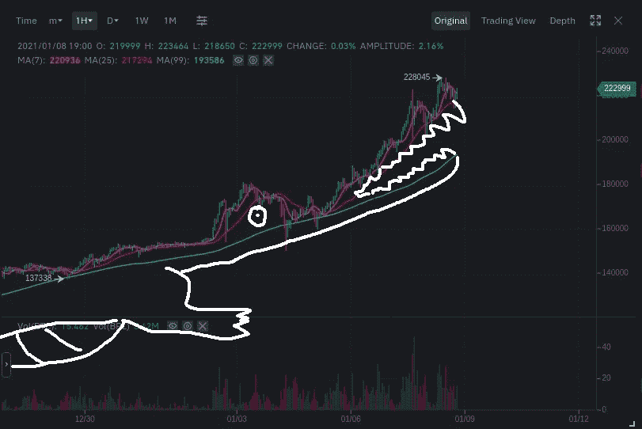
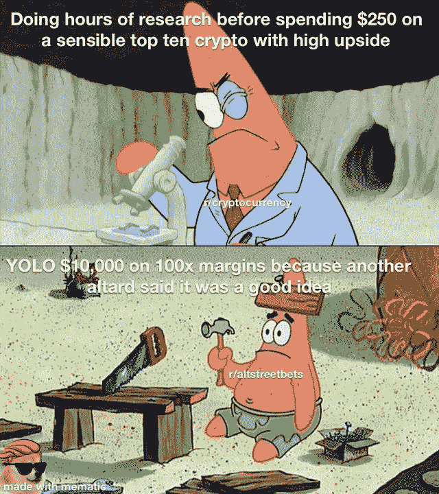
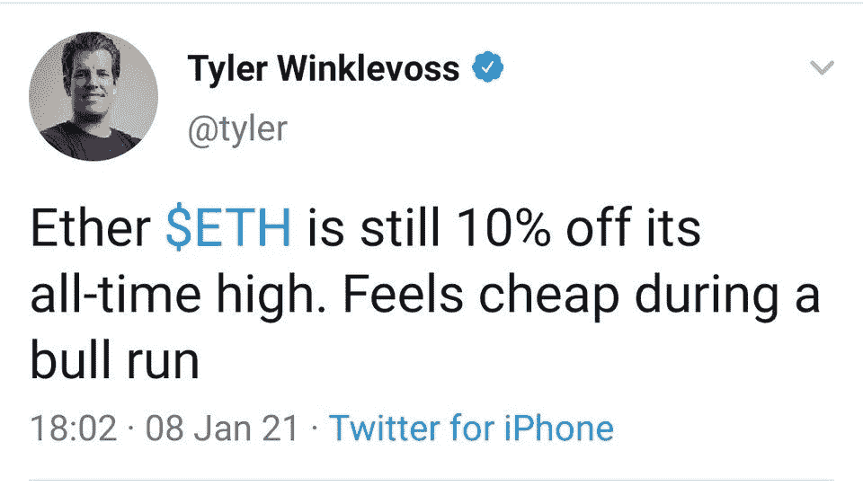

# 丹尼尔·拉里默退出 EOS | DeFi 清算高峰在市场暴跌

> 原文：<https://medium.com/coinmonks/daniel-larimer-exits-eos-defi-liquidations-spike-amid-market-slump-6c1dd50a6462?source=collection_archive---------7----------------------->

[HODLigator](https://www.reddit.com/r/Bitcoin/comments/ktey09/this_is_hodligator/)

## Ripple 联合创始人杰德·麦卡勒在 2020 年出售了价值 4 亿美元的 XRP

*   加密项目 Block.one 的首席技术官丹尼尔·拉里默(Daniel Larimer)周日宣布辞职。EOS 是拉里默的第四个退出骗局。
*   ShapeShift 宣布，它已经集成了分散式交换协议，并正在结束其 6 年多的客户交易业务。
*   最近审查美国总统特朗普和拒绝向 Parler app 提供服务的事件令人深感关切，并表明大型科技垄断企业可以审查任何人或企业并摧毁它。

> "一个摆脱了所有麻烦制造者的社会是在走下坡路."— **罗伯特·A·海因莱因**

## [皮奥克斯](http://blog.coincodecap.com/go/pionex)

试试 [Pionex](http://blog.coincodecap.com/go/pionex) ，一个专业的加密交易所，有免费的加密交易机器人让你的交易自动化。阅读我们的 [Pionex 评论](/coinmonks/pionex-review-exchange-with-crypto-trading-bot-1e459d0191ea)并查看我们的[最佳加密交易机器人](/coinmonks/crypto-trading-bot-c2ffce8acb2a)列表。

> 如何[在牛市中赚更多的利润](/coinmonks/how-to-make-more-profits-in-the-bull-market-with-leveraged-token-f0e6328dab04)

## 最新消息📰

*   [密码丢失](https://www.nytimes.com/2021/01/12/technology/bitcoin-passwords-wallets-fortunes.html)锁定百万富翁的比特币财富
*   [Block.one 首席技术官](https://www.theblockcrypto.com/linked/90686/block-one-cto-daniel-larimer-announces-resignation)丹尼尔·拉里默宣布辞职
*   Ripple 的联合创始人杰德·麦卡勒在 2020 年出售了价值 4 亿美元的 XRP
*   硅谷如何以垄断的力量摧毁帕勒
*   欧洲央行的克里斯蒂娜·拉加德称“投机”比特币需要全球监管
*   中国 CCP 将把马云的阿里巴巴和蚂蚁集团收归国有——报道
*   [不再有](https://erikvoorhees.medium.com/no-more-kyc-with-shapeshift-6d95a3e63ddf)变形的 KYC
*   [Aragon](https://twitter.com/MyPaoG/status/1347418686857109506) 团队因治理和透明度问题退出
*   总部位于以太坊的 Nexus Mutual [将其分散的](https://www.coindesk.com/nexus-mutual-decentralized-insurance-cover-coinbase-binance-kraken-gemini)“保险”业务扩展至集中的交易所
*   投资加密的财务规划师数量增加了 50%
*   在市场不景气的情况下，破产清算激增
*   费[计划加入](https://thedefiant.io/fei-plans-to-join-algorithmic-stablecoin-party-with-key-difference/)稳定党，钥匙不同
*   [Tether 在 Hermez 上发布](https://www.theblockcrypto.com/post/90738/tether-usdt-hermez-ethereum-layer-2-scaling-solution-zk-rollups),这是一个以太坊第 2 层扩展解决方案，使用 ZK 卷
*   伊朗当局关闭 1620 个非法加密货币采矿农场:报道
*   韩国将于 2023 年对加密交易利润征收 20%的税

> *报税季即将到来，使用最好的* [***加密报税软件***](/coinmonks/best-crypto-tax-tool-for-my-money-72d4b430816b) *来申报你的加密报税吧。*

[Source](https://www.reddit.com/r/CryptoMarkets/comments/kt601i/only_the_best/)

> BlockFi 首次推出加密奖励信用卡。在日常购物中获得 1.5%的比特币奖励。现在加入等候名单。

## 好的读物📑

*   施洛迪格的[被盗的](https://www.rekt.news/schrodingers-stolen-nft/) NFT
*   互联网 3.0 和(科技)历史的开端
*   如何[跟踪加密新闻](/coinmonks/how-to-follow-crypto-news-94a35c06e41c)
*   投资[审核](https://www.ruffer.co.uk/Thinking/Articles/Investment-Review/2020-Q4-Investment-Review)
*   [现实世界区块链](https://www.bitcoinsuisse.com/research/specials/real-world-blockchain-four-examples-of-the-future-of-dlt)—DLT 未来的四个例子
*   [机构](https://www.institutionalinvestor.com/article/b1q2wrt77mv2h4/Institutions-Suck-at-Trading-Crypto)擅长交易密码
*   寄生的
*   [比特币](/coinmonks/bitcoin-and-social-standards-4f4de0f62f8a)和社会标准
*   以太坊售价 1000 美元， [redux](https://www.evanvanness.com/post/639356716421726208/ethereum-at-1000-redux)
*   未来几周，瑞士联邦理工学院的表现会超过 BTC 吗？
*   [1000 比特币](/coinmonks/1000-bitcoin-trading-bot-simulations-e4623189c248)交易机器人模拟
*   以太坊的策略:一个矛盾的证明
*   天秤座耸耸肩:脸书是如何试图接管这笔钱的
*   2021 年的登月计划
*   为什么我们需要广泛采用[社会救助钱包](https://vitalik.ca/general/2021/01/11/recovery.html)
*   [以太坊典当明星](/dedaub/ethereum-pawn-stars-5-7m-in-hard-assets-best-i-can-do-is-2-3m-b93604be503e):“570 万美元的硬资产？我最多只能出 230 万美元。”
*   稳定性、弹性和反身性:对算法稳定性的深入探究
*   [了解赌注池](https://cryptotesters.com/blog/staking-pools)及其令牌组学
*   赌注池的[记号经济学](https://stakewise.medium.com/the-tokenomics-of-staking-pools-what-are-staked-eth-tokens-and-how-do-they-work-2b4084515711)。什么是 staked ETH 令牌，它们是如何工作的？
*   [我们的网络](https://ournetwork.substack.com/p/our-network-issue-53?token=eyJ1c2VyX2lkIjo5NDEwNTY3LCJwb3N0X2lkIjozMTE1Njk2MiwiXyI6IlVadnBYIiwiaWF0IjoxNjEwNTUwMjQ2LCJleHAiOjE2MTA1NTM4NDYsImlzcyI6InB1Yi0yMTM2MiIsInN1YiI6InBvc3QtcmVhY3Rpb24ifQ.Xj9cg6Xe-jp3P8BMLozNmo4NYQ-so4lG1hnER4kDXTE):关于资本流动的报道。
*   [用龙卷风保护以太坊上的](https://powerkee.substack.com/p/protecting-privacy-on-ethereum-with)隐私。现金

> *买个* [***硬件钱包***](/coinmonks/the-best-cryptocurrency-hardware-wallets-of-2020-e28b1c124069) *和* [*保护你的加密货币*](/coinmonks/how-to-prevent-cryptocurrency-hacking-and-theft-from-your-wallet-65c8ff767766) *。*

[Source](https://www.reddit.com/r/Bitcoin/comments/kmof53/the_8_laws_of_bitcoin_updated/)

## 开发商

*   [德菲烂透了的建筑](https://andrecronje.medium.com/building-in-defi-sucks-part-2-75df9ee7871b)(下)
*   [访问](https://learn.namebase.io/starting-from-zero/how-to-access-handshake-sites)握手名称
*   StarkWare 的[开罗游乐场](https://www.cairo-lang.org/playground/)，在线 IDE。
*   使用 tree-sitter 增量解析 Solidity
*   `<Swap/>`与 [Uniswap](https://twitter.com/notifications)
*   如何[在 Etherscan 上验证您的布朗尼项目](https://matnad.medium.com/how-to-verify-your-brownie-project-on-etherscan-82d6086644cf)
*   [你](/coinmonks/6-reasons-why-you-should-become-a-blockchain-engineer-9954e26105dd)应该成为区块链工程师的 6 个理由

> 想成为一名以太网和 **Web3 开发者**？[从这里开始](http://blog.coincodecap.com/go/learn)。

## 多方面的

*   将你所有的代币扫到一个新的地址！
*   [EthBlock.art](https://t.co/xVyrXl7Pwa?amp=1)

## 播客和视频💽

*   [Solidity Dev Group](https://www.youtube.com/watch?v=0vAKP3Y-BLs) —会议 1 —设置您的环境
*   [建立一个真正的](https://www.youtube.com/watch?v=9sbZSxYvESE&feature=youtu.be)分权自治组织

[source](https://www.reddit.com/r/ethtrader/comments/kw029a/its_a_damn_miracle_if_its_during_a_bull_run/)

## 加密交易和折扣🔖

*   注册参加 [**Bybit**](/coinmonks/bybit-exchange-review-dbd570019b71) 兑换，赢取高达 625 美元的奖金。
*   试用 [**Altrady**](http://blog.coincodecap.com/go/altrady) 并使用优惠券代码 **COINMONKS** 获得 40%的折扣(年度计划)和 10%的折扣(月度计划)
*   试用 [**Coinrule**](https://webapp.coinrule.io/coupon/coinmonks-7-25-3-e2bf6c60e795407381edf98d1a174ac2?fp_ref=coincodecap) ，使用 [**此链接**](https://webapp.coinrule.io/coupon/coinmonks-7-25-3-e2bf6c60e795407381edf98d1a174ac2?fp_ref=coincodecap) 可获得 7 天免费试用和 3 个月 25%优惠。

## 产品评论和其他加密软件📙

*   莱杰 vs 特雷佐
*   [区块链审查](/coinmonks/blockfi-review-53096053c097)
*   [AAX 交易所评论](/coinmonks/aax-exchange-review-2021-67c5ea09330c)
*   [bits gap vs 3 commas vs quad ency](/coinmonks/bitsgap-vs-3commas-vs-quadency-must-read-2021-cdc1a40cf31d)
*   [Cryptohopper vs HaasBot](https://blog.coincodecap.com/cryptohopper-vs-haasbot)
*   [Pionex 审查](/coinmonks/pionex-review-exchange-with-crypto-trading-bot-1e459d0191ea)
*   密码复制交易机器人
*   [Stackedinvest 审查](https://blog.coincodecap.com/stackedinvest-review)
*   [Deribit 审查](/coinmonks/deribit-review-options-fees-apis-and-testnet-2ca16c4bbdb2) —选项、费用、API 和 Testnet
*   [总账 vs 平均](https://blog.coincodecap.com/ngrave-vs-ledger)
*   你的密码可以获得 12%的利息

想让我们展示你的产品吗？在 [Twitter @coinmonks](https://twitter.com/coinmonks) 上联系我们

## 比特币永远对商业开放

## 乔布斯👷

*   [DevOps 工程师](https://remoteok.io/remote-jobs/100451-remote-devops-engineer-district0x)，地区 0x，远程
*   [生态系统开发商](https://jobs.lever.co/3box/ec1093c5-ed31-483c-b1b3-49b07bd0bd2e)，3Box，Remote
*   [BD at mStable](https://angel.co/company/mstable/jobs/1096364-business-development-manager)
*   [动作设计师](https://cryptocurrencyjobs.co/design/kraken-digital-asset-exchange-motion-designer/)——北海巨妖
*   [全堆栈工程师](https://cryptocurrencyjobs.co/engineering/zapper-full-stack-engineer/)——Zapper
*   [高级前端工程师](https://cryptocurrencyjobs.co/engineering/uma-senior-front-end-engineer/) — UMA
*   SigmaPrime，[区块链安全工程师](https://blog.sigmaprime.io/blockchain-security-engineer.html)
*   0x 正在寻找各种类型的[开发人员](https://0x.org/about/jobs)和一名[抹茶营销经理](https://boards.greenhouse.io/0x/jobs/4923909002)
*   Nexus Mutual: [在欧元区经历了稳健发展](https://angel.co/company/nexus-mutual-1/jobs/967538-smart-contract-engineer)

## 发表于 Coinmonks 网站

如果你喜欢写有关加密/区块链空间的教育文章，并想发表在 Coinmonks 出版物。只是邮寄我在***gaurav@coincodecap.com***或 DM 我*[***Twitter***](https://twitter.com/coinmonks)*