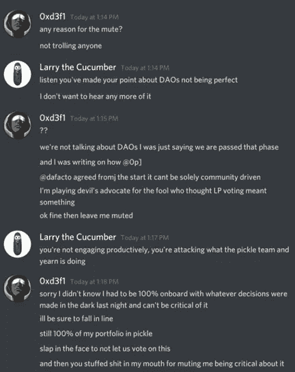
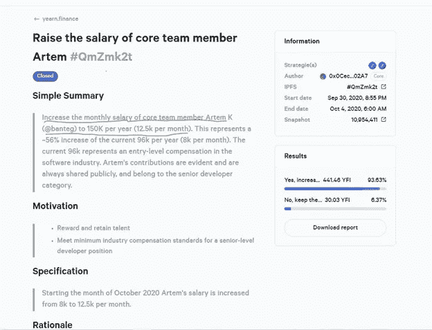

# 道代表开发者独裁

> 原文：<https://medium.com/coinmonks/dao-stands-for-developer-dictatorship-a205b1594437?source=collection_archive---------2----------------------->

在 Pickle 合并之前，是否应咨询过向往社区？

正如 YFI 运营负责人 banteg 在提到 YFI 治理令牌所有者时说的那样，**“【YFI 持有者】现在很清楚【道】代表开发者独裁。”**

#General in Pickle Discord

美国东部时间昨天早上 7:00 左右， [Andre Cronje 在推特上向全世界宣布 Pickle 将与向往](https://twitter.com/AndreCronjeTech/status/1331210466727694338?s=20)合并。

在 Andre 写的 medium post 中，他陈述了 Pickle 的罐子和向往的金库是如何合并的。此外，他提到未来将会进行进一步的整合。

泡菜社区的许多人都为这个消息感到欢欣鼓舞，因为他们看到他们的泡菜立即上涨了 100%以上。YFI 社区的一些人对合并持怀疑态度。然而**所有人都感到惊讶**。

**没有关于合并的群体投票。没有以任何方式咨询机构群体。**除了几个圈内人，泡菜和向往社区都完全被蒙在鼓里。到昨天中午，渴望代表与社区确认泡菜开发者已经被并入渴望战略家团体。

#General in Pickle Discord

向往不是应该是道吗，代表**去中心化**自治组织？去中心化不应该是加密的基石吗？难道去中心化不是 SEC 等监管机构在决定一枚硬币是否为证券时所采用的关键原则吗？这个决策到底是如何以分散的方式做出的？

许多社区成员对所发生的事情不满意。一个名为 0xD3F1 的用户因质疑政治局的决策而在 Pickle Discord 中被审查。当他被问及对这种审查的解释时，他被以最奥威尔式的方式告知，他没有“富有成效地参与进来，而是在攻击 Pickle 团队和渴望正在做的事情。”

Discord DMs that have been shared with us

那么，这些“无效”的信息是什么呢？我们的朋友 0xd3f1 决定在 Pickle Discord 中召唤出渴望和 Pickle 团队，因为他们在没有征求社区意见的情况下单方面合并了项目。

0xd3f1 的推理是完全合理的，**因为即使是我们厌恶的过于独裁的中央集权公司** [**也需要获得股东的批准**](https://www.investor.gov/introduction-investing/investing-basics/glossary/mergers#:~:text=Mergers%20are%20transactions%20involving%20the,shares%20of%20the%20target%20company.) **才能完成合并**。

社区应该在合并中有发言权。执行合并有明显的风险。一个实体的技术可能有缺陷，或者参与交易的不同运营商之间可能存在可疑的利益冲突。考虑到 Pickle 的技术在不到三天前被利用了近 2000 万美元，我认为渴望 DAO 治理令牌的持有者会想就此事发表他们的意见。

然而，班泰格和 Andre——渴望的创始人/独裁者——显然不认为与高风险项目的合并应该由社区成员投票决定。见鬼，他们一定在想谁会关心社区呢？

根据 banteg 的说法，**这个社区是“一群被动的持有者，他们只是免费搭乘开发者的努力，并认为快照投票赋予他们任何权利。”**

#General in Pickle Discord

渴望领导者深深地尊重和欣赏他们的社区。

**当然，banteg 本人目前每年从向往社区获得高达 15 万美元的报酬。**这不禁让人产生疑问，是如何决定给予 banteg 如此巨额的补偿的？**当然，由于社区快照投票，他有权获得此补偿！**

Snapshot approving a $150,000 per annum salary for banteg

**向往和出尽风头的“德”Fi**[**项目对自己的社区毫无尊重**](/coinmonks/why-do-we-tolerate-censorship-in-defi-5582aaa33cd) **。DeFi 团队实际上是由他们的社区支付报酬的，他们在没有社区参与的情况下就最大的问题做出单方面的决定。他们甚至比最集权的公司还要独裁。**

社区什么时候会站出来要求权利？什么时候够了，够了？

你被一群不尊重你的匿名开发者骗了，他们只是想要你的钱。你就像待宰的羔羊一样被牵着走。

就个人而言，我们厌倦了审查制度、中央集权和存在于 DeFi 的过度贪婪。我们需要一些地方，让社区成员能够真正自由地表达自己的意见，而不会受到审查。我们需要所有 DeFi 项目都建立在授权社区而不是剥削社区的基础上。

我们建造了[以太](https://theether.io/)作为一个空间，社区可以在这里表达他们的意见，而不用担心审查。如果你同意，就加入我们。我们将为你的权利而战。

## 另外，阅读

*   最好的[密码交易机器人](/coinmonks/crypto-trading-bot-c2ffce8acb2a)
*   [Deribit 审查](/coinmonks/deribit-review-options-fees-apis-and-testnet-2ca16c4bbdb2) |选项、费用、API 和 Testnet
*   [FTX 密码交易所评论](/coinmonks/ftx-crypto-exchange-review-53664ac1198f)
*   最好的比特币[硬件钱包](/coinmonks/the-best-cryptocurrency-hardware-wallets-of-2020-e28b1c124069?source=friends_link&sk=324dd9ff8556ab578d71e7ad7658ad7c)
*   [密码本交易平台](/coinmonks/top-10-crypto-copy-trading-platforms-for-beginners-d0c37c7d698c)
*   最好的[加密税务软件](/coinmonks/best-crypto-tax-tool-for-my-money-72d4b430816b)
*   [最佳加密交易平台](/coinmonks/the-best-crypto-trading-platforms-in-2020-the-definitive-guide-updated-c72f8b874555)
*   最佳[加密借贷平台](/coinmonks/top-5-crypto-lending-platforms-in-2020-that-you-need-to-know-a1b675cec3fa)
*   莱杰 vs 特雷佐
*   [block fi vs Celsius](/coinmonks/blockfi-vs-celsius-vs-hodlnaut-8a1cc8c26630)vs Hodlnaut
*   Bitsgap 评论——一个轻松赚钱的加密交易机器人
*   为专业人士设计的加密交易机器人
*   [PrimeXBT 审查](/coinmonks/primexbt-review-88e0815be858) |杠杆交易、费用和交易
*   HaasOnline 评论享受九折优惠
*   Bitmex 上的[保证金交易的白痴指南](/coinmonks/the-idiots-guide-to-margin-trading-on-bitmex-dbbd7742c6fc?source=friends_link&sk=7bfa99d2a181142510c8442c8ddb0786)
*   [eToro 评论](/coinmonks/etoro-review-78807ddeb33c) |交易股票、密码、交易所交易基金、差价合约和商品
*   [Bitmex 高级保证金交易指南](/coinmonks/bitmex-advanced-margin-trading-guide-2270c195ce25?source=friends_link&sk=1d986cca731f5084b9a2db4a4bc4a7ad)
*   [开发者最佳加密 API](/coinmonks/best-crypto-apis-for-developers-5efe3a597a9f)
*   [最佳区块链分析工具](https://bitquery.io/blog/best-blockchain-analysis-tools-and-software)
*   [加密套利](/coinmonks/crypto-arbitrage-guide-how-to-make-money-as-a-beginner-62bfe5c868f6)指南:新手如何赚钱
*   顶级[比特币节点](https://blog.coincodecap.com/bitcoin-node-solutions)提供商
*   最佳[加密制图工具](/coinmonks/what-are-the-best-charting-platforms-for-cryptocurrency-trading-85aade584d80)
*   了解比特币最好的[书籍有哪些？](/coinmonks/what-are-the-best-books-to-learn-bitcoin-409aeb9aff4b)

> [直接在您的收件箱中获得最佳软件交易](https://coincodecap.com?utm_source=coinmonks)

