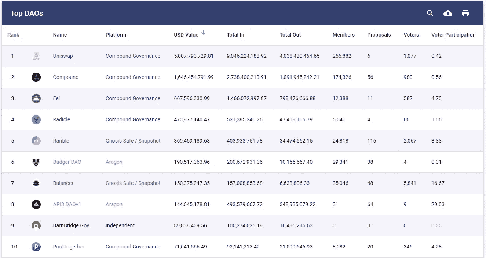

# 道斯:100 万亿美元的机会？

> 原文：<https://medium.com/coinmonks/daos-a-100-trillion-dollar-opportunity-97a03fc3f035?source=collection_archive---------2----------------------->

## 未来的进化会是什么样子

“道”是一个古老的概念，现在已经有了自己的地位。随着开发人员工具的增长和各种各样的治理实验的进行，Dao 是加密领域最令人兴奋的领域之一，并提供了最大的未来潜力。毫无疑问，它们有能力以显著的方式改变我们的商业和社会结构，其应用几乎是无限的。现在，Dao 还处于早期实现阶段，但是随着它们的发展和变得更加复杂，它们有可能完全接管我们当前的经济结构。因此，在所有的加密领域中，他们拥有最大的潜在市场(TAM)。

理论上，世界上所有的股权和不动产都可以作为 Dao 来标记和管理。同样，固定收益市场的很大一部分可以通过 Dao 来运作和管理。这三个资产类别共同代表了价值 **~620 万亿美元**的巨大 TAM，随着 Dao 发展和改善其治理和组织能力，它们有潜力在未来十年占领这一市场的重要份额。(仅仅 16%的总量就能让我们达到 100 万亿)在这篇文章中，我将简要介绍当前的形势，并尝试推测这一演变可能采取的路径。

## **那么，什么是刀呢？**

分散自治组织(DAO)是一个区块链驱动的实体，它的内部工作通过智能契约体现在代码中。它没有集中的权力，其治理和运营都由自动执行智能合同中的规则决定，对每个人都是透明的。A DAO 还向其社区发行令牌，这些令牌提供“所有权”和参与决策的权利(类似于传统商业世界中的股东)。在 DAO 中由代码编写的规则是不可更改的，并且将按预期发挥作用，直到社区(令牌持有者)通过一个设定的过程投票来更改它们。因此，**Dao 是一种新形式的技术支持型组织，它允许人们为了一个共同的目标走到一起，并以一种正式的方式一起工作来实现他们的目标。**

Dao 的范围很广，最小的 Dao 只是希望产生一种社区归属感和共同利益的纽带，而最大的 Dao 控制着数十亿美元的美国国债，旨在为其代币持有者创造利润。

Top 10 DAOs Source: Deepdao.io

## **Dao 有很多优点…**

DAOs 的最大优势是高度的智能合约支持自动化，从而显著提高运营效率。通过技术抽象出耗时的低价值任务将是 DAO 采用向前推进的最大驱动力。

另一大优势是透明度，因为所有的活动和决定都记录在区块链上。社区中的所有参与者(令牌持有者)在决策中都有发言权，并有机会以各种方式做出贡献。这导致通过民主治理和社区赋权实现公平的获取和包容。

Dao 是分散的，因此没有单点故障。与中央集权的传统公司相比，这允许以更好的方式分散责任。他们还具有灵活性优势，因为他们是互联网本地的全球无边界实体，不受某些司法管辖区的限制。目前，监管格局还没有很好的定义，但随着监管的跟上，将会有更大的法律清晰度和有利的法律管辖权的增加。这将为 Dao 变得更加主流提供动力。

## **…还有一些限制**

Dao 最大的优势也可能是他们最大的致命弱点。智能合约中的错误和漏洞可能导致黑客攻击和灾难性损失。第一把名为“刀”的名刀遭遇了[1.5 亿美元的黑客攻击](https://www.gemini.com/cryptopedia/the-dao-hack-makerdao#section-what-is-a-dao)，并对整个行业产生了长久的影响。

目前，Dao 过于简单，无法调度传统公司的所有功能。拥有大量分散股东的治理模式虽然赋予了社区权力，但可能不是最有利于复杂业务决策的模式，因为所有成员都缺乏专业知识。在提案通过投票程序时，也有许多决策延迟的情况。对于不同的业务任务，需要在集中和分散之间保持平衡，治理模型将会发展以实现这种平衡。

## **刀的种类**

根据其指定的目的和功能，有几种类型的 Dao:

1) **协议治理 Dao**:当今业界一些最大的 Dao 都与协议相关联，并作为一种机制来管理它们的运营、收入和其他功能。这些 Dao 发布用于治理的协议令牌。令牌持有者通常会对实施底层网络变更的提案进行投票。例如:MakerDAO、Compound、Uniswap、Aave 等。

2) **投资资金池 Dao:**投资 Dao 是为了从不同的投资机会中获益而创建的集合资金池。比如老挝

3) **收集器池 Dao:**这些 Dao 负责管理和构建 NFT 的集合。请到，火烈鸟

4) **赠款 Dao:**这些是为公共基础设施提供资本而形成的。社区走到一起，汇集资金，根据社区整体的最大效用投票决定不同项目的拨款。大概最有名的就是莫洛赫道了。

5) **社交社区 Dao:**这些都是围绕着共同的目标和理想组织起来的非常有趣的社区实验。与金融资本相比，规则通常更倾向于社会资本和对社区的贡献。例如 FWB

6) **内容监管 Dao:**这些是由想要监管和组织内容的创建和消费的社区组成的。过程可以包括激励贡献和对排名内容质量的投票。Rekt，BanklessDAO

7) **DAO 基础设施:**这些 DAO 提供了创建、运行和管理 DAO 的基础设施和工具包。如阿拉贡，殖民地，道斯塔克，道豪斯等。

8) **其他:**还有各种其他类型的 DAO，很难归入一个单一的类别，但其核心目的是将一个社区团结在一个共同的目标之下，例如 PartyDAO、VitaDAO

## **道和整体景观会如何演变？**

**复杂性挑战的解决方案:**

虽然权力下放赋予了权力，但它也有利弊权衡，并导致决策速度变慢。这篇关于[渐进分散化的文章](https://a16z.com/2020/01/09/progressive-decentralization-crypto-product-management/)概述了如何构建加密应用程序的精彩剧本。核心思想是在需要快速决策和多次迭代以实现产品市场适应的早期阶段保持集中化。一旦产品成熟并找到合适的位置，团队必须逐步将控制权交给社区。这一战略为单一产品***提供了成功的路线图。****然而，传统世界中的公司是多产品公司。为了让 Dao 有机会颠覆传统的公司结构，治理机制需要不断发展，以允许创建更复杂的结构，多个流和优先级一起发挥作用。这可能以两种方式发生:*

***1)** 单一道内的分层治理结构*

*一个刀可以被组织成几层。可能会有一些高度负责整个社区的集中化，但仍然具有灵活性、自由和对足够资源的控制，以执行特定任务，而没有官僚主义的繁文缛节。已经有一些关于[内部治理结构](https://zhang.mirror.xyz/9sRa2kNDUpkWoQkWw67bJ8PczFyTSX8fotf7JOddxew)(小组委员会、工作组等)的有趣实验正在进行，观察起来会很有趣。*

***2)** 道之道*

*第二种方式可能是将更复杂的实体组织成 DAO 中的 DAO。单一功能将被抽象到它们自己的独立单元中，父实体将行使控制权。例如，一家 MLM 公司(多级营销)可能有不同的职能，如销售和营销 DAO、教育 DAO、生产 DAO 等，或者一家加密软件公司可能在不同的 DAO 中有多种产品，而母实体将是控制这些职能的 DAO。当前的结构使得这些企业很难获得去中心化的回报，但是像这样的进步很可能会打开大门并导致创新的爆发。*

***从商品到股权的加密估值转换:***

*大多数加密货币目前等同于商品，因为它们不授予任何资产的所有权，也不提供任何潜在的现金流，因此使用传统的商品指标进行估值，如**库存到流量**。Dao 领先一步，表现得更像股票。它们提供资产池和现金流的所有权，允许使用权益估值指标，如贴现现金流模型(DCF)。*

*随着 Dao 的发展，他们将看到传统金融中现有结构和工具的进一步采用。合乎逻辑的下一步是发行无抵押债券。将会有越来越多的 Dao 开始发行债券来为他们的活动筹集资金。*

*这将对治理产生非常有趣的影响，新的机制将会发展，从链上破产程序开始。与权益持有人相比，债券持有人承担的风险更小(回报更低)，因此在破产事件中，债券持有人对 DAO 的资产拥有优先购买权。但是与传统金融不同的是，他们对项目如何运作也有发言权吗(首先防止破产事件的发生)？那么，治理结构将如何演变？*

*   *是否会有两层投票，在股票代币持有人批准之前需要债券代币持有人的同意？*
*   *还是会有一轮投票，所有代币同时投票，但债券代币持有者的权重更高(因此投票权更多)？*
*   *或者，是否可以单独列出债券持有人拥有管辖权和投票权的问题，并单独列出股权持有人的问题？*

*未来将会非常有趣，我很想看看它会如何发展。*

*就像债券一样，来自 tradfi 的其他构造也将开始出现。如果有债券，为这些债券的违约提供保险的信用违约互换(CDS)也不会太远。*

*既然 Dao 控制了一批资产，它们之间将会有并购(M&A)。我喜欢第一个[polygon 和 hermez](https://twitter.com/Fractal_Monk/status/1428666044873203716?s=20) networks 之间的 crypto M&A 虽然没有 DAO 很难做到。下一步是什么？多边形现在正在[形成一把刀](https://finance.yahoo.com/news/polygon-announces-decentralized-autonomous-organization-050000867.html#:~:text=Polygon%20Announces%20Decentralized%20Autonomous%20Organization%20(DAO)%20for%20the%20Web%203%20Ecosystem,-Thu%2C%20August%2019&text=Polygon%20will%20form%20a%20DAO,industry%20to%20the%20next%20level.):)。(我真的对这一趋势及其如何发展垂涎三尺，因为我在 tradfi 的专长是合并套利)*

*正如我们在技术变革浪潮中所看到的那样，变革起初发生得很慢，然后一下子全部发生。我相信道斯也会如此。首先，来自传统金融的构造将被用于管理和改进加密本地活动的 Dao，然后随着这些模型证明自己，它们将越来越多地被用于取代更广阔世界中的结构。(等待第一家大型现实世界公司将自己转变为 DAO 的那一天)起初缓慢，然后突然一下子，crypto 将吃掉 tradfi 和实体经济财务和组织系统的一大块。像 Ethereum 和 Solana 这样的 L1 将提供底层的基础设施，但是大部分的价值获取将发生在 DAOs 内部，作为一个资产类别。向前到 100 万亿！*

*附录:这里有一些关于 DAO 函数和工具的相关链接和资源*

***刀资源和刀具***

*1) DAO 创建:有几个完整的栈基础提供者帮助从头开始设置 DAO，比如 [Colony](https://colony.io/) 、 [Aragon](https://aragon.org/) 、 [DAOHaus](https://daohaus.club/)*

*2)通信:电报、不和、[话语](https://www.discourse.org/)*

*3)资金管理: [Gnosis 保险箱 Multisig 钱包](https://gnosis-safe.io/)、[羊驼](https://llama.community/#/)、[包裹](https://parcel.money/)*

*4)信息工具:如 [DeepDAO](https://deepdao.io/#/deepdao/dashboard) 等工具*

*5)投票协调:Sybil、[快照](http://snapshot.org/)等工具*

*6)治理:[复合治理](https://compound.finance/docs/governance)、[点检](https://www.withtally.com/)、[董事会](https://www.boardroom.info/)*

*7)贡献协调与奖励:[协调人](https://coordinape.com/)，[来源人](https://sourcecred.io/)*

*8)合并:[合并](https://korporatio.com/)、[醚化](https://www.etherize.io/)、 [Otonomos](https://otonomos.com/)*

*9)令牌门控访问:[collab and](https://collab.land/)*

***更多信息***

*[https://blog . ether eum . org/2014/05/06/daos-DACs-das-and-more-an-complete-terminals-guide/](https://blog.ethereum.org/2014/05/06/daos-dacs-das-and-more-an-incomplete-terminology-guide/)*

*[https://www.notboring.co/p/the-dao-of-daos](https://www.notboring.co/p/the-dao-of-daos)*

*[https://Linda . mirror . XYZ/vh8k 4 lecgeo 06 _ qSGx-vs 5 lvguqhqkcz 9 ut 81 wwc p2o](https://linda.mirror.xyz/Vh8K4leCGEO06_qSGx-vS5lvgUqhqkCz9ut81WwCP2o)[https://defirate.com/daos/](https://defirate.com/daos/)*

> *加入 [Coinmonks 电报频道](https://t.me/coincodecap)，了解加密交易和投资*

## *另外，阅读*

*   *[尤霍德勒 vs 考尼洛 vs 霍德诺特](/coinmonks/youhodler-vs-coinloan-vs-hodlnaut-b1050acde55a) | [Cryptohopper vs 哈斯博特](https://blog.coincodecap.com/cryptohopper-vs-haasbot)*
*   *[币安 vs 北海巨妖](https://blog.coincodecap.com/binance-vs-kraken) | [美元成本平均交易机器人](https://blog.coincodecap.com/pionex-dca-bot)*
*   *[如何在印度购买比特币？](/coinmonks/buy-bitcoin-in-india-feb50ddfef94) | [WazirX 审核](/coinmonks/wazirx-review-5c811b074f5b) | [BitMEX 审核](https://blog.coincodecap.com/bitmex-review)*
*   *[比特币主根](https://blog.coincodecap.com/bitcoin-taproot) | [Bitso 回顾](https://blog.coincodecap.com/bitso-review) | [排名前 6 的比特币信用卡](/coinmonks/bitcoin-credit-card-bc8ab6f377c6)*
*   *[双子座 vs 比特币基地](https://blog.coincodecap.com/gemini-vs-coinbase) | [比特币基地 vs 北海巨妖](https://blog.coincodecap.com/kraken-vs-coinbase) | [硬币罐 vs 硬币点](https://blog.coincodecap.com/coinspot-vs-coinjar)*
*   *[印度加密交易所](/coinmonks/bitcoin-exchange-in-india-7f1fe79715c9) | [比特币储蓄账户](/coinmonks/bitcoin-savings-account-e65b13f92451) | [Paxful 审核](/coinmonks/paxful-review-4daf2354ab70)*
*   *[杠杆令牌](/coinmonks/leveraged-token-3f5257808b22) | [最佳加密交易所](/coinmonks/crypto-exchange-dd2f9d6f3769) | [AscendEX 评论](/coinmonks/ascendex-review-53e829cf75fa)*
*   *[Godex.io 审核](/coinmonks/godex-io-review-7366086519fb) | [邀请审核](/coinmonks/invity-review-70f3030c0502) | [BitForex 审核](https://blog.coincodecap.com/bitforex-review) | [HitBTC 审核](/coinmonks/hitbtc-review-c5143c5d53c2)*