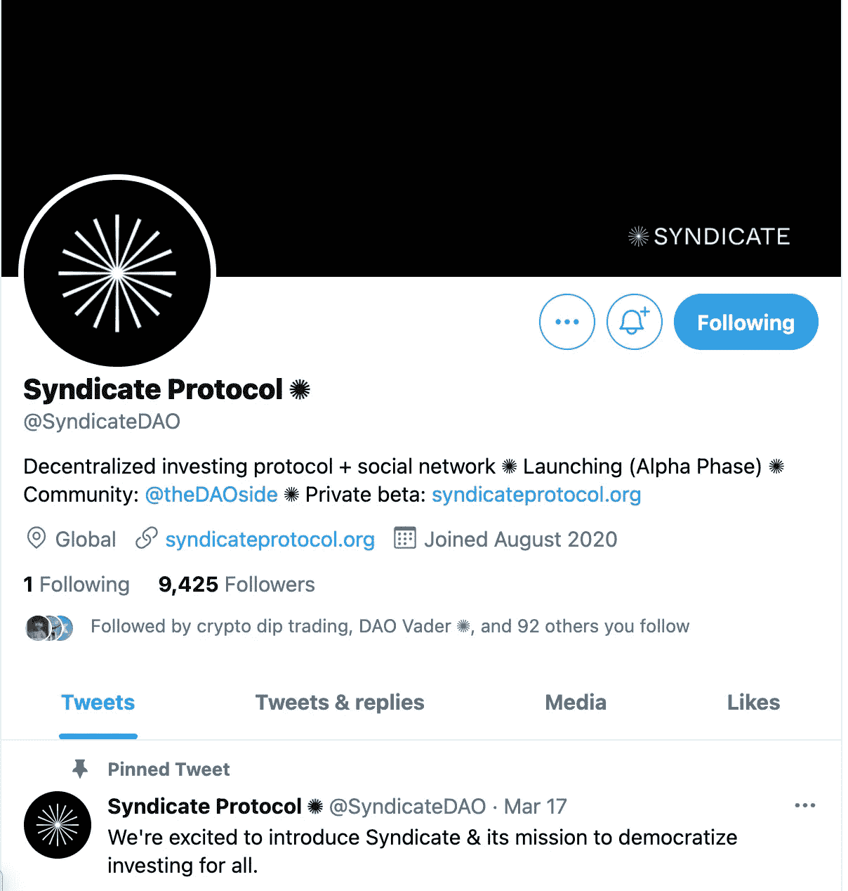

# 道优于公司

> 原文：<https://medium.com/coinmonks/daos-are-better-than-companies-2ab3e6e50a14?source=collection_archive---------2----------------------->

## 为什么 Dao 是优于传统公司的业务和投资

Photo by [Cytonn Photography](https://unsplash.com/@cytonn_photography?utm_source=medium&utm_medium=referral) on [Unsplash](https://unsplash.com?utm_source=medium&utm_medium=referral)

如果你在过去的几个月里一直关注我的博客，你就会知道我非常看好去中心化的自治组织，简称 DAOs。

这些组织由具有共同使命/目标的团体组成，这些团体积极选择受编码到区块链中的逻辑的支配。

因此，DAOs 的规则不像公司章程那样存储在市政当局的文件柜(或者云存储，如果它们是 21 世纪的一部分)中，而是不变地在链上铸造。

我“看好”的不是传统意义上的投资，而是我非常有信心，这种组织结构引入了一种全新的工作方式，比传统公司的结构更好。

虽然我不认为每个公司都会成为 DAO，但我认为许多组织在正式组建时会认真考虑它——他们会考虑是组建传统的 LLC 还是 S-Corp 还是 DAO。

比特币迈阿密真的让我大开眼界道斯的力量。是的，一些 DAO，比如 [$FWB](https://twitter.com/FWBtweets) 举办疯狂的派对，但是真正的魔力来自于与 DAO 成员的交谈，听他们声音中的兴奋，关于他们正在进行的任务和他们一路上建立的社区。

许多 DAO 成员是第一次见面，看到他们之间的联系越来越紧密，真是令人惊讶。

在某种程度上，Dao 是公司、社会团体、行会和使命驱动的社区。这是一个从基本原则建立一个组织的实验，专注于 Web3 的价值观，如开放、去中心化和无权限。

即使我们把 Dao 的混合价值主张放在一边，Dao(尤其是管理 DeFi 协议的 Dao)也是令人难以置信的业务。

示例:

*   Uniswap 处理的数量与比特币基地相同
*   尽管在 2020 年夏季推出，但年度收入超过 1 亿美元

这就是为什么 Uniswap 只用 10%的员工处理与比特币基地相同的工作量…Dao 实现了前所未有的协调，甚至使软件公司的经济效益都相形见绌。

这是为什么呢？

Dao 本质上是去中心化的社区，其中的成员被激励相互协作以推动价值。

因此，操作得到了简化，并且几乎没有管理上的臃肿。SG&A 低是因为没有人事经理；每个人都是高性能 IC，有时工作成本低得令人难以置信。

最疯狂的是，许多 DAO 成员都乐意贡献一点钱，甚至是免费的。这是因为他们已经在两个方面受到激励为道做出贡献:(1)持有道的令牌的经济激励。他们合理地投资时间来改进道，因为它对个人有直接的经济回报。

以及(2)向社区的其他成员发出信号，表明他们是 DAO 的贡献成员。这给了他们影响力，反过来也为道中的个人建立了声誉。

SushiSwap Discord is full of individuals interested in helping the DAO for free (to start)

此外，Dao 做出的决策比公司更好，犯的错误也更少。这是因为它可以利用其分散的劳动力，以扩大决策背后的脑力。

作为一名项目经理，我经常问我的团队，“我们做到详尽无遗了吗？”当找到问题的解决方案时。

“我们有没有想尽一切办法？”

但我的 6 人团队只能做到如此详尽。

在 QA 中，这就是为什么开发团队会提供 bug 奖金——他们会付钱给那些找到核心开发团队找不到的 bug 的人。

Dao 衡量这些活动背后的脑力。有了 DAOs，成千上万的人被雇佣来思考这些决定。最后，当考虑要解决的问题或要做出的决定时，团队可以真正做到详尽无遗。

不是一个产品经理考虑用户需求，而是数百个产品经理想尽一切办法。成千上万的开发者在一个功能上线前做 QA。

结果，产品变得更好——更符合用户需求，因为成百上千的项目经理参与了他们的用户研究，而且错误更少。

DAOs 也可能永久地改变我们看待风险投资的方式。

一个由 40 名“专业”投资者组成的公司，还是一个由数百名主题专家组成的 DAO，哪个更好？

群众的智慧告诉我要赌后者。

更多聪明的人来寻找资源，努力开发项目，并最终部署资本。更少的偏见和错过的机会，因为数百只靴子在地面上倾听用户并看到趋势的发展——而不是在象牙塔里。

因此，更多的女性创始人。资助了更多项目，使代表性不足的社区受益。分散投资可能会成为更好的投资工具。

Syndicate DAO is a DAO focused on democratized deployment of venture capital

*感谢阅读！如果你喜欢这篇文章，请关注我的* [*推特*](http://twitter.com/0xjim) *以了解更多关于加密的实时想法。*

如果你认为这篇博文值得你花 5 分钟来阅读，请帮我鼓掌(最多 50 次)并分享给一个会从这篇内容中受益的朋友。非常感谢！

> 加入 [Coinmonks 电报频道](https://t.me/coincodecap)，了解加密交易和投资

## 另外，阅读

*   [电网交易机器人](https://blog.coincodecap.com/grid-trading) | [加密交易机器人](/coinmonks/cryptohopper-review-a388ff5bae88) | [加密交易机器人](https://blog.coincodecap.com/best-crypto-trading-bots)
*   [加密复制交易平台](/coinmonks/top-10-crypto-copy-trading-platforms-for-beginners-d0c37c7d698c) | [如何在 WazirX 上购买比特币](/coinmonks/buy-bitcoin-on-wazirx-2d12b7989af1)
*   [CoinLoan 点评](/coinmonks/coinloan-review-18128b9badc4)|[Crypto.com 点评](/coinmonks/crypto-com-review-f143dca1f74c) | [火币保证金交易](/coinmonks/huobi-margin-trading-b3b06cdc1519)
*   [尤霍德勒 vs 科恩洛 vs 霍德诺特](/coinmonks/youhodler-vs-coinloan-vs-hodlnaut-b1050acde55a) | [Cryptohopper vs 哈斯博特](https://blog.coincodecap.com/cryptohopper-vs-haasbot)
*   [顶级付费加密货币和区块链课程](https://blog.coincodecap.com/blockchain-courses) | [币安评论](/coinmonks/binance-review-ee10d3bf3b6e)
*   [MXC 交易所评论](/coinmonks/mxc-exchange-review-3af0ec1cba8c) | [Pionex vs 币安](https://blog.coincodecap.com/pionex-vs-binance) | [Pionex 套利机器人](https://blog.coincodecap.com/pionex-arbitrage-bot)
*   [如何在印度购买比特币？](/coinmonks/buy-bitcoin-in-india-feb50ddfef94) | [WazirX 评论](/coinmonks/wazirx-review-5c811b074f5b) | [BitMEX 评论](https://blog.coincodecap.com/bitmex-review)
*   [印度比特币交易所](/coinmonks/bitcoin-exchange-in-india-7f1fe79715c9) | [比特币储蓄账户](/coinmonks/bitcoin-savings-account-e65b13f92451)
*   [币安收费](/coinmonks/binance-fees-8588ec17965) | [Botcrypto 审查](/coinmonks/botcrypto-review-2021-build-your-own-trading-bot-coincodecap-6b8332d736c7) | [Hotbit 审查](/coinmonks/hotbit-review-cd5bec41dafb) | [KuCoin 审查](https://blog.coincodecap.com/kucoin-review)
*   [我的加密副本交易经历](/coinmonks/my-experience-with-crypto-copy-trading-d6feb2ce3ac5) | [AAX 交易所评论](/coinmonks/aax-exchange-review-2021-67c5ea09330c)