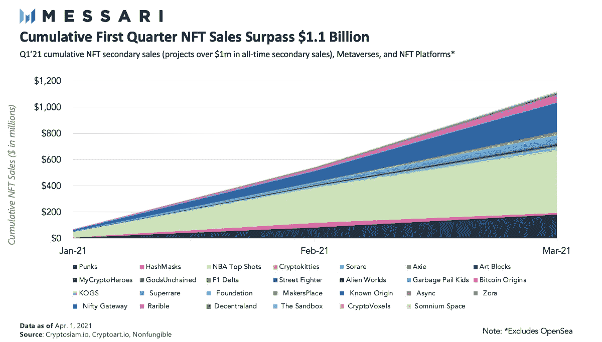

# Dao 是下一件大事

> 原文：<https://medium.com/coinmonks/daos-are-the-next-best-thing-4efaff6662f6?source=collection_archive---------0----------------------->

## 为什么 DAO 是下一个要知道的三个字母的加密缩写词

MakerDAO, one of the most popular DAOs in crypto

*免责声明:本文出于教育目的。希望人们发现这些更新有助于跟上这些天来 crypto 飞速发展的步伐。*

*这不是财务建议；你总是对硬币进行尽职调查吗:)*

加密以闪电般的速度发展，随之而来的是一系列缩写词和速记术语，甚至让一个资深兽医都感到困惑，更不用说一个加密新手了。

DeFi、CEX、DEX、AMM、TradFi、CeFi、CeDeFi、NFTs、ERC20、PoW、PoS。这并不涉及抽象的技术术语，如随机数、气体极限、SHA-256…

> 交易新手？试试[密码交易机器人](/coinmonks/crypto-trading-bot-c2ffce8acb2a)或[复制交易](/coinmonks/top-10-crypto-copy-trading-platforms-for-beginners-d0c37c7d698c)

NFTs(不可替代的代币)是最近获得主流关注的首字母缩略词，绝对已经爆炸式增长——累计销量超过 11 亿美元。

Source: Messari Research

我在这里教你另一个三个字母的首字母缩略词:DAOs。

# **刀之道**

那么什么是道呢？

道是一个去中心化的自治组织。一个简单、通俗易懂的类比是，Dao 本质上是用代码编写其章程的公司，而不是写在某个市政当局档案柜中的一张纸上。

就像 DeFi 是可编程的钱，NFT 是可编程的媒体一样，**Dao 是可编程的组织。**

DAO 的治理和运营写在智能契约中，确保其目标和使命是不变的——由 DAO 成员社区决定。

它们不像传统的公司治理那样不透明，也不能像 HBO 剧集《继承者》中臭名昭著的董事会场景那样随风而逝(下面链接的视频中有该剧的剧透)。

相反，DAO 治理结构对任何有互联网连接的人都是完全透明和可审计的，其程序是绝对的法律——直到 DAO 投票修改它们。

# **道教的历史**

DAO 始于臭名昭著的第一个 DAO，名为“the DAO ”,它的创建是为了以分散的方式投资新兴的加密项目。

不幸的是，DAO 在 2016 年 6 月遭到黑客攻击，导致 360 万 ETH(按今天的价格计算接近 90 亿美元)的损失。

这一事件迫使以太坊社区决定[硬分叉](https://en.wikipedia.org/wiki/Hard_fork)区块链，以退还道社区成员——导致目前兑现退款的以太坊区块链和仍然保持道黑客记录的[以太坊经典](https://en.wikipedia.org/wiki/Ethereum_Classic) ($ETC)区块链之间的分裂。

从那以后，道斯暂时保持低调，直到梅克出现。

[MakerDAO](http://makerdao.com) 是一个管理 Dai 的开源社区，Dai 是 DeFi 中最受欢迎的加密抵押稳定币和借贷协议，该协议锁定了近 100 亿美元。

他们重新推广了 DAO 结构，以通过管理层投票，并与协议的路线图保持一致。这些投票涵盖了从调整 DSR 利率到改变协议稳定性费用的所有范围。

Top DeFi protocols. Source: DeFi Pulse

现在，Dao 已经成为治理开源项目和协议的合法形式，并迅速成为加密项目社区成员之间协调的首选方式。

PieDAO 专注于创建指数产品，将多种货币捆绑在各种风险缓解型 ETF 中。

[Aragon](https://twitter.com/AragonProject) 是一个为其他 DAO 构建工具的 DAO，用于跨成员组织和协作。

# **为什么 Dao 如此重要**

Dao 之所以强大，是因为它们为成千上万的人创造了激励机制和健全的框架，让他们无需正式的角色或等级就能组织起来。

因此，像加密货币这样的开源项目能够比传统的治理组织(如基金会/非营利组织或公司)更快地扩大运营规模。

例如，Uniswap 能够处理几乎与比特币基地相同的交易量，尽管它的员工数量比比特币基地少一个数量级。

这是可能的，因为 Uniswap 是由 DAO 操作的——核心开发团队和任何$UNI 持有者可以共同决定他们希望如何推进该协议。

由于 UNI 持有人在 Uniswap 的未来中拥有经济利益，他们也更有动力参与项目的管理。

**这种一致性允许 UNI 持有者同时成为协议的投资者、运营商和用户。**

除了人力资本效率之外，Dao 本质上是互联网固有的管理项目的方式——完全建立在 Web3 原则之上，如开放、无许可和去中心化。

因此，Dao 比传统的私营公司更加民主，因为任何人都可以在协议的路线图中拥有发言权，而在私营公司中只有董事会拥有这种权力。

> Dao 允许持有者同时成为协议的投资者、运营商和用户。

有史以来第一次，完全陌生的人可以协调数亿美元，建立一个服务于数百万用户的产品，而不必亲自见面，签署法律文件，甚至诚实地知道彼此的名字(许多 DAO 成员使用假名，如他们的 Twitter 句柄或只是他们的 ETH 地址)。

道防止任何坏的演员。成员没有办法带着 DAO 的钱逃跑——至少不像我们在传统的创业公司结构中看到的那样。

因为法典就是法律。

# **下一步是什么**

加密 Dao 最近受到了很多关注，因为它们拥有大量资产负债表(称为国债)，这些资产负债表来自于持有项目的一部分本地令牌。

这些 Dao 中的一些拥有数十亿美元的闲置资本，等待被部署以产生最佳收益。

Source: [DeFi Weekly](https://defiweekly.substack.com/p/the-state-of-protocols?token=eyJ1c2VyX2lkIjo1NDE1NTA1LCJwb3N0X2lkIjozNDgxMzEzMywiXyI6IkZ5QzFDIiwiaWF0IjoxNjE5MDM5ODU0LCJleHAiOjE2MTkwNDM0NTQsImlzcyI6InB1Yi01NDAyIiwic3ViIjoicG9zdC1yZWFjdGlvbiJ9.6MZOZ4kO1r8ySfXqxm4H3H2Q_d2bW2eSuoJUo04QJ4c)

DAOs 的美妙之处在于，社区成员——而不仅仅是核心开发团队——有权以他们希望的任何方式部署其资本。

Dao 正在使用国库来雇用更多的开发人员和开发更多的产品，部署一个强大的流动性挖掘计划来获得更多的用户，或者通过将令牌交换为 stablecoins 或其他协议令牌来进行对冲。

这完全取决于社区。

虽然 Dao 主要用于管理加密项目，但理论上，它们可以用于任何想要激励和利用社区参与的组织。

再次出现的一个有趣的 Dao 用例是使用它来部署风险投资(是的，我们已经从 DAO 时代回到了起点)。

[老挝](https://www.thelao.io/)已经部署了价值近 4000 万美元的 ETH 来改善以太坊生态系统。

Moloch DAO 向申请资助的以太坊开发者提供资助——类似于政府资助系统。

MetaCartel 是一个专注于加速 dApp 开发的 DAO，尤其是围绕在黑客马拉松中创建的项目。

同样，与传统风险投资不同，DAO 成员社区民主地决定他们想要资助的项目。

如果你认为这篇博文值得你花 5 分钟来阅读，请在下面鼓掌(最多 50 次)或者与一个会从这篇内容中受益的朋友分享。非常感谢！

> 加入 Coinmonks [电报频道](https://t.me/coincodecap)和 [Youtube 频道](https://www.youtube.com/c/coinmonks/videos)了解加密交易和投资

## 另外，阅读

*   [3 商业评论](/coinmonks/3commas-review-an-excellent-crypto-trading-bot-2020-1313a58bec92) | [Pionex 评论](https://coincodecap.com/pionex-review-exchange-with-crypto-trading-bot) | [Coinrule 评论](/coinmonks/coinrule-review-2021-a-beginner-friendly-crypto-trading-bot-daf0504848ba)
*   [莱杰 vs n rave](/coinmonks/ledger-vs-ngrave-zero-7e40f0c1d694)|[莱杰 nano s vs x](/coinmonks/ledger-nano-s-vs-x-battery-hardware-price-storage-59a6663fe3b0) | [币安评论](/coinmonks/binance-review-ee10d3bf3b6e)
*   [加密交易机器人](/coinmonks/crypto-trading-bot-c2ffce8acb2a) | [Bingbon 评论](https://coincodecap.com/bingbon-review)
*   [Bybit Exchange 审查](/coinmonks/bybit-exchange-review-dbd570019b71) | [Bityard 审查](https://coincodecap.com/bityard-reivew) | [Jet-Bot 审查](https://coincodecap.com/jet-bot-review)
*   [3 commas vs crypto hopper](/coinmonks/3commas-vs-pionex-vs-cryptohopper-best-crypto-bot-6a98d2baa203)|[赚取加密利息](/coinmonks/earn-crypto-interest-b10b810fdda3)
*   最好的比特币[硬件钱包](/coinmonks/hardware-wallets-dfa1211730c6) | [BitBox02 回顾](/coinmonks/bitbox02-review-your-swiss-bitcoin-hardware-wallet-c36c88fff29)
*   [BlockFi vs 摄氏度](/coinmonks/blockfi-vs-celsius-vs-hodlnaut-8a1cc8c26630) | [Hodlnaut 审核](/coinmonks/hodlnaut-review-best-way-to-hodl-is-to-earn-interest-on-your-bitcoin-6658a8c19edf) | [KuCoin 审核](https://coincodecap.com/kucoin-review)
*   [Bitsgap 评审](/coinmonks/bitsgap-review-a-crypto-trading-bot-that-makes-easy-money-a5d88a336df2) | [Quadency 评审](/coinmonks/quadency-review-a-crypto-trading-automation-platform-3068eaa374e1) | [Bitbns 评审](/coinmonks/bitbns-review-38256a07e161)