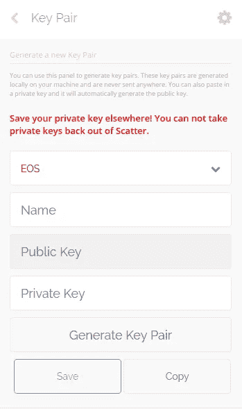

# 使用 eosjs 和 scatter 在 EOS 区块链上进行 DApp 开发

> 原文：<https://medium.com/coinmonks/dapp-development-on-eos-blockchain-using-eosjs-and-scatter-557f1b5b65d0?source=collection_archive---------4----------------------->


由于我一直在深入研究 eos DApp 的开发，所以我看到了很多好文章。在这里，我汇总了我做了所有研究后得到的所有知识。在这篇文章中，我将解释如何一起使用 eosjs 和 scatter。我假设您对智能合同以及如何在 EOS 区块链上部署智能合同有基本的了解，因为在本文中我将跳过这一部分。

## 我们在建造什么？

我们正在构建一个简单的 DApp。我们将为 CRUD 操作编写一个智能合同，并将使用 **eosjs** 和 **scatter** 与部署的合同进行交互。CRUD 操作包括创建、完成、删除和获取 todos。我们将使用“丛林测试网”来部署我们的智能合同。

## 必备知识

1.  [EOS](https://github.com/EOS/eos)
2.  [Eosjs](https://github.com/EOSIO/eosjs)
3.  [散布](https://github.com/GetScatter/ScatterWebExtension)

## 散布设置

[Scatter](https://github.com/GetScatter/ScatterWebExtension) 用于为区块链签署交易，并向应用程序提供个人信息，而不会暴露您的密钥。要设置您的分散钱包，请观看此[视频](https://www.youtube.com/watch?v=QcbCf5mm_Ek)。在散布设置中，您必须将[丛林测试网](http://jungle.cryptolions.io/#home)添加到网络中，详情如下:

```
Name: Jungle Testnet
Domain or IP: [dev.cryptolions.io](http://dev.cryptolions.io:38888) // It might be changed, so check for the latest one
Port: 38888
chainId:038f4b0fc8ff18a4f0842a8f0564611f6e96e8535901dd45e43ac8691a1c4dca
```

添加网络配置后，现在通过进入密钥对部分将您的私钥导入到钱包中，然后单击新建。根据如下所示的表格填写信息。



现在，您应该使用您的密钥对添加一个身份。身份保存您的帐户详细信息。转到“身份”部分并添加一个新身份，或者编辑现有身份(如果没有用)。在“身份”部分，选择网络，然后选择密钥对，它会要求您在链网上添加与该密钥相关联的帐户。您应该添加具有**活动权限的账户。**

您的分散已全部设置好，并准备在我们的 DApp 中使用。


## 智能合同

要部署 todo 智能合约，请遵循本文的[并将其部署在 jungle testnet 上。确保您能够像文章中提到的那样从命令行与 testnet 交互。](https://steemit.com/eos/@eos-asia/part-2-building-a-to-do-list-with-eos-or-working-with-persistent-data-in-eos)

## 与测试网互动

我在前端部分使用 Reactjs。完整的逻辑和流程在一个名为 *index.jsx* 的文件中，该文件位于 *src* 文件夹中。以下是配置对象:

```
// Config for scatter and eosjs
const EOS_CONFIG = {
  contractName: "xyz", *// Contract name* contractSender: "xyz", *// User executing the contract (should be paired with private key)* network: {
    protocol: "http",
    blockchain: "eos",
    host: "dev.cryptolions.io",
    port: 38888,
    chainId: "038f4b0fc8ff18a4f0842a8f0564611f6e96e8535901dd45e43ac8691a1c4dca"  // get this using [http://dev.cryptolions.io:38888/v1/chain/get_info](http://dev.cryptolions.io:38888/v1/chain/get_info)
  },
  eosOptions: {}
};
```

与散点互动:

```
import EOS from 'eosjs';document.addEventListener(`scatterLoaded`, *this*.onScatterLoad);onScatterLoad = () => {
  const scatter = window.scatter;
  window.scatter = null;// Here, we are connecting scatter with eosjs so that the transactions can be signed using keys present in scatter
  *this*.eosClient = scatter.eos(
    EOS_CONFIG.network,
    EOS,
    EOS_CONFIG.eosOptions,
    EOS_CONFIG.network.protocol
  );// scatter object to collect the information present in wallet like accounts or public key  
  *this*.scatter = scatter;// to load the data present in our table *this*.loadTodos();
};
```

现在，在*这个*对象中，我们有两个引用 *eosClient* 和 *scatter* ，我们将用它们分别与 EOS 区块链和 wallet 交互。

下面是使用 *eosClient 获取存储数据(所有待办事项)的代码，*其余功能可以在 src/ *index.jsx* 中查看

```
loadTodos() {
  *this*.eosClient.getTableRows({
    code: EOS_CONFIG.contractName,
    scope: EOS_CONFIG.contractName,
    table: "todos",
    json: true
  }).then(data => {
    *this*.setState({ todos: data.rows });
  }).catch(e => {
    console.error(e);
  });
}
```

要获得帐户，请使用散点对象的 *getIdentity()* :

```
const { accounts } = await scatter.getIdentity({
     accounts: [config.EOS_CONFIG.network]
});
```

就是这样。

## 结论

这样做的最大好处之一是你不必在你的机器上维护一个钱包，scatter 为你管理一切。也有其他方法来托管钱包，但是 scatter 将责任交给了最终用户，开发者不需要处理任何私有内容。

## 资源和参考资料

1.  做合同部署
2.  [散点设置](https://www.youtube.com/watch?v=QcbCf5mm_Ek)
3.  [没有分散集成的待办事项合同](https://github.com/eosasia/eos-todo)
4.  [EOS 堆栈交换](https://eosio.stackexchange.com/)
5.  [EOS 开发者](https://developers.eos.io/)

**原文发表** [**此处**](https://www.innoplexus.com/blog/dapp-development-on-eos-blockchain-using-eosjs-and-scatter/) **。Innoplexus AG 保留所有权利。**

> [直接在您的收件箱中获得最佳软件交易](https://coincodecap.com/?utm_source=coinmonks)

[](https://coincodecap.com/?utm_source=coinmonks)