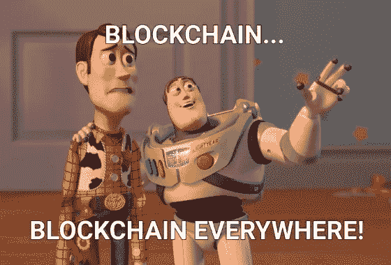

# 如何在私有以太网上构建 dapp:第 1 部分

> 原文：<https://medium.com/coinmonks/dapp-on-a-private-ethereum-network-1-c8b80695e049?source=collection_archive---------2----------------------->

> 我收到许多开发伙伴的请求，分享我如何在 2 个私有以太坊节点的网络上开发分散式应用程序(dapp ),而不使用任何第三方 API 或应用程序(如 Infura、MetaMask 等)的文档。).由于我的工作是 CSIR-CEERI 研究项目的一部分，还没有发表，我不能明确地分享它的代码。
> 
> 然而，我也从网上资源中学到了很多，我想为社区的发展做出贡献。因此，我决定发布开发过程的基本部分。



在这 5 篇系列文章中，我解释了如何在上面提到的分布式基础设施上构建一个简单的 HelloWorld dapp。它将执行以下操作:

1.  输入用户的名称(字符串),并使用智能合约将其存储在私有以太坊区块链中
2.  dapp 将能够从链中读取输入的名称值，并将其显示给用户

> **最近上映——《**[**第五部:第八-九节**](/@themadhackerOI/how-to-build-a-dapp-on-a-private-ethereum-network-part-5-84177d5717be)

# **目录**

**在这里，您可以找到我将本教程分成的部分和子部分的列表:**

****→一、创建项目****

****→二。安装先决条件****

****→三。配置网络****

**四。设计智能合同**

**动词 （verb 的缩写）建立松露项目**

**不及物动词启动网络**

**七。构建 web 应用程序**

**八。测试 dapp**

**九。修改 dapp**

**如果您想跳到某一部分，您可以向下滚动到本文末尾的**所有系列链接**部分。**

**在本系列的第 1 部分中，我将讨论第 1-3 节。这展示了如何安装成功构建 dapp 所需的包(带有特定版本)。**

*****亲提示:*** 我建议你自己打代码，避免复制粘贴骗局。这是一种更好的学习方式。**

# **一.创建项目**

**要创建并移入 dapp 的专用存储库，请在新的终端窗口中运行:**

```
$ mkdir TruffleDapp
$ cd ./TruffleDapp
```

## **请阅读以下内容:**

1.  **除非另有说明，此后提到的所有命令和步骤都应在`TruffleDapp`库中执行**
2.  **我正在使用 Ubuntu 16.04，使用的浏览器是 Chromium**

# **二。安装先决条件**

**本节详细介绍了设置开发 dapp 的先决条件的步骤。下面列出了所需的版本:**

*   **NVM v8.11.3**
*   **NPM 版本 5.6.0**
*   **GoLang(又名 go)1 . 10 . 3 版**
*   **geth v 1 . 8 . 27-稳定**

## **a)安装 Golang**

*   **从[这里](https://golang.org/doc/install?download=go1.10.3.linux-amd64.tar.gz)下载`go1.10.3.linux-amd64.tar.gz`包到`~/Downloads`。**
*   **使用以下命令提取下载的包:**

```
$ tar xzvf ~/Downloads/go1.10.3.linux-amd64.tar.gz
```

*   **添加到`~/.profile`和`~/.bashrc`文件:**

```
# set GO variables to config go env
export GOROOT=$HOME/go
export GOPATH=$HOME/go
export PATH=$GOPATH/bin:$GOROOT/bin:$PATH
```

*   **为了编译`~/.profile`和`~/.bashrc`，在终端中运行:**

```
$ source ~/.profile && source ~/.bashrc
```

*   **关闭当前终端窗口。要验证安装，打开新终端并运行`$ go version`**

## **b)安装 geth**

*   **向下滚动到此页面的底部。在“*资产”*部分，点击“*源代码(tar . gz)”*将`go-ethereum-1.8.27.tar.gz`下载到`~/Downloads`中**
*   **使用以下命令提取下载的包:**

```
$ tar xzvf ~/Downloads/go-ethereum-1.8.27.tar.gz
```

*****注意:*** 如果 make 和其他需要的软件包没有安装，在终端运行:**

```
$ sudo apt install make
$ sudo apt install make-guile
$ sudo apt-get install -y build-essential
```

*   **要安装 geth 代码:**

```
$ cd go-ethereum-1.8.27
$ make geth
```

*   **添加到`~/.bashrc`(对于您的系统，`PATH`可能不同，从属性中复制路径作为`geth`可执行文件的位置) :**

```
# set path for geth permanently
export PATH="/home/ethereum/go-ethereum-1.8.27/build/bin/:$PATH"
```

*   **要编译该文件，请在终端中运行:**

```
$ source ~/.bashrc
```

*   **要进行验证，请打开一个新的终端窗口并运行:`$ geth version`**

## **c)安装节点**

**这里，NodeJS 将用于开发 dapp 的后端组件。遵循以下给出的步骤:**

****(一)安装** `**nvm**` **包:****

*   **从 Ubuntu 库获取软件包，允许构建源码包。在`TruffleDapp` (T1)中运行一个端子开路:**

```
$ sudo apt-get update
$ sudo apt-get install build-essential libssl-dev
```

*   **一旦安装了必备包，就可以从项目的 GitHub 页面获取`nvm`安装脚本。**

```
$ curl -sL [https://raw.githubusercontent.com/creationix/nvm/v0.34.0/install.sh](https://raw.githubusercontent.com/creationix/nvm/v0.34.0/install.sh) -o install_nvm.sh
```

*   **用 bash 运行脚本:**

```
$ bash install_nvm.sh
```

*   **然后，或者退出 Ubuntu 系统并再次登录，或者在 T1:**

```
$ source ~/.profile
```

*   **为了验证安装，在`TruffleDapp` (T2)中打开一个新的终端并运行:`$ nvm --version`**

****(二)安装** `**node v8.11.3**` **和** `**npm v5.6.0**` **:****

*   **在`TruffleDapp` (T1)中运行一个端子开路:**

```
$ nvm install 8.11.3
```

*   **要使用上面安装的`node`和`npm`包，运行 T1:**

```
$ nvm use 8.11.3
$ nvm alias default 8.11.3
```

*   **要验证安装，请在`TruffleDapp` (T2)打开一个新的终端并运行:**

```
$ node -v
$ npm -v
```

## **d)安装块菌**

**它是以太坊的开发框架。它为您提供了项目结构、文件和目录，使部署和测试变得更加容易，并允许脚本化的部署和迁移。**

**我使用 Truffle v4.x，而不是新发布的 v5.x，因为前者有在线信息(博客、文章、教程)，特别是与将 Truffle 部署的合同链接到私有以太网有关的信息。打开终端窗口并运行:**

```
$ npm install -g truffle@4.1.16
```

****

**你已经迈出了第一步(嗯，差不多了)。你现在不要懈怠！放聪明点。你不会想被扔出窗外吧？**

# **三。配置网络**

**该项目需要使用私人以太坊区块链。为此，需要设置“节点”来运行 EVM 并存储[区块链](https://blog.coincodecap.com/tag/blockchain/)数据。这是在之前使用`geth`关键字安装的`go-ethereum`包的帮助下完成的。**

**创世纪区块是区块链的第一个区块。genesis 模块几乎总是被硬编码到软件中。这是一个特例，因为它不引用前一个块。**

**一个`customGenesis.json`文件为以太坊网络的起源块定义了各种参数，节点将成为以太坊网络的一部分。在编辑器中打开`customGenesis.json`并键入:**

```
{
    "nonce": "0x0000000000000042",
    "timestamp": "0x0",
    "parentHash": "0x0000000000000000000000000000000000000000000000000000000000000000",
    "extraData": "0x00",
    "gasLimit": "0x8000000",
    "difficulty": "0x400",
    "mixhash": "0x0000000000000000000000000000000000000000000000000000000000000000",
    "coinbase": "0x3333333333333333333333333333333333333333",
    "alloc": { },
    "config": {
        "chainId": 111,
        "homesteadBlock": 0,
        "eip155Block": 0,
        "eip158Block": 0
    }
}
```

**下面解释了一些重要术语。详细信息可在“genesis 文件说明”部分的中找到。**

*   ***gasLimit* :建立执行智能合约的上限**
*   ***难度*:控制挖掘谜题的复杂程度，数值越低，挖掘速度越快**
*   ***alloc* :允许将醚分配给特定的地址**
*   ***chainId* :新的私有区块链的唯一标识**
*   ***Homestead block*:Homestead 是[以太坊](https://blog.coincodecap.com/tag/ethereum/)的第一个生产版本，由于开发者已经在使用这个版本，这个参数的值可以保留为‘0’**
*   ***EIP 155 block/EIP 158 block*:EIP 代表“以太坊改善提案”，实施这些提案是为了释放家园。在私有区块链开发中，不需要硬分叉，因此参数值应该保留为“0”**

**本教程的第一至第三节到此结束。在下一篇文章(第 2 部分)中，我将讨论第四部分。点击此链接继续构建:[如何在私有以太网上构建 dapp:第二部分](/coinmonks/dapp-on-a-private-ethereum-network-2-a0b282586558)**

***附:如果你喜欢这篇文章，请鼓掌 10 次！请在下面评论，让我知道你的想法，或者如果你想分享一些技巧。***

***我很快会发表更多这样有趣的文章。在* [*中*](/@themadhackerOI) *上关注我或者在*[*Twitter*](https://twitter.com/TheMadHacker01)*上跟踪我，敬请关注。***

# **所有系列链接**

**如果你想跳过某一部分，你可以参考下面的链接。请参考下面的**目录**将一节与其对应的主题进行匹配。**

**[第一部分:第一至第三节](/coinmonks/dapp-on-a-private-ethereum-network-1-c8b80695e049)**

**[第二部分:第四节](/coinmonks/dapp-on-a-private-ethereum-network-2-a0b282586558)**

**[第三部分:第五至第六节](/@themadhackerOI/how-to-build-a-dapp-on-a-private-ethereum-network-part-3-31066fedf7a1)**

**第四部分:第七节**

**[第 5 部分:第八至第九节](/@themadhackerOI/how-to-build-a-dapp-on-a-private-ethereum-network-part-5-84177d5717be)**

> **[直接在您的收件箱中获得最佳软件交易](https://coincodecap.com/?utm_source=coinmonks)**

**[](https://coincodecap.com/?utm_source=coinmonks)******