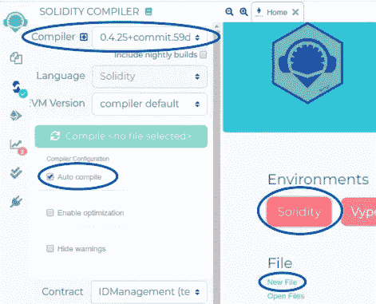
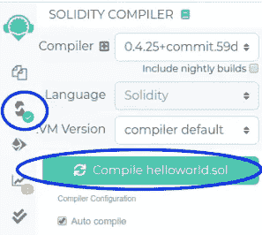
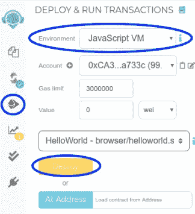
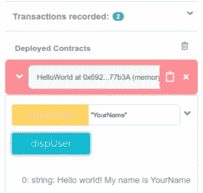
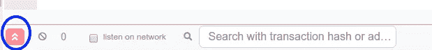
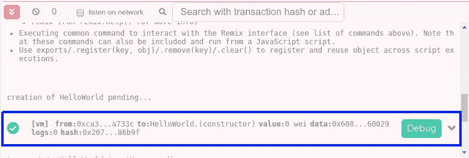
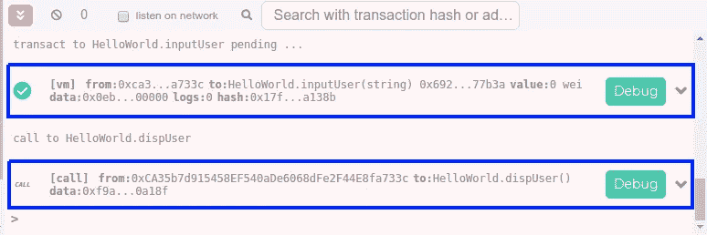

# 如何在私有以太网上构建 dapp:第 2 部分

> 原文：<https://medium.com/coinmonks/dapp-on-a-private-ethereum-network-2-a0b282586558?source=collection_archive---------1----------------------->

> 这是一个由 5 篇文章组成的系列，介绍如何在 2 个私有以太坊节点的网络上开发一个去中心化的应用程序(dapp ),而无需使用任何第三方 API 或应用程序(如 Infura、MetaMask 等)。).本教程涵盖了我在 CSIR-CEERI 的研究项目中所学到的基本要素。
> 
> 在前一篇文章(第 1 部分)中，我介绍了下面给出的目录中的第 1-3 节。

如果你想跳到某一部分，你可以向下滚动到本文末尾的**所有系列链接**部分。

> 最近发布——“[第五部分:第八至九节](/@themadhackerOI/how-to-build-a-dapp-on-a-private-ethereum-network-part-5-84177d5717be)”

# 目录

在这里，您可以找到我将本教程分成的部分和子部分的列表:

一.创建项目

二。安装先决条件

三。配置网络

**→四。设计智能合同**

动词 （verb 的缩写）建立松露项目

不及物动词启动网络

七。构建 web 应用程序

八。测试 dapp

九。修改 dapp


“智能合同”和“区块链”这两个术语已经广为流传。最流行的词汇之一。每个人都听说过，但很少有人知道它们到底是什么。不要再害怕了，你最多只需要 20 分钟就能成为其中的一员。

在第 2 部分中，我将解释为我们的应用程序设计和测试智能契约的最简单的方法(第四节)。你可以参考下面提到的目录来了解这个开发过程的流程。

# 四。设计智能合同

构建和测试[智能契约](https://blog.coincodecap.com/tag/smart-contact/)的最佳方式是在线混合 IDE。它有一个交互式界面，并且装备精良，可以模拟一个真实的以太坊环境。有关更多信息，请参考 [Remix IDE 文档](https://remix-ide.readthedocs.io/en/stable/)。

## a)合同代码



The sections circled correspond to the 3 steps mentioned below

*   打开 [Remix IDE](https://remix.ethereum.org/) 并点击“Home”选项卡中“环境”标题下的“Solidity”按钮。
*   在“坚固性编译器”菜单下，从“编译器”下拉列表中选择`0.4.25+commit.59dbf8f1`选项，并选择“自动编译”勾选框。
*   从“主页”选项卡中单击“新建文件”。键入`helloworld.sol`作为文件名。一个新的选项卡以编辑器窗口的形式打开。键入以下代码:

***专业提示:*** 要增大输入代码的编辑器的字体大小，请在此区域内单击，并按下键盘上的 Ctrl 和“+”。

```
pragma solidity ^0.4.25;contract HelloWorld {

    // Define a string variable
    string name;

    // Modifies the value of string variable (name)
    function inputUser(string _name) public {
        name = _name;
    }

    // Validated that the string variable (name) holds the updated value
    function dispUser() public view returns(string){
        return (append("Hello world! My name is ", name));
    }

    // Appends 2 strings a, b
    function append(string a, string b) internal pure returns (string) {
        return string(abi.encodePacked(a, b));
    }
}
```

*   合同应自动编译。你也可以点击“Solidity 编译器”菜单下的“编译 helloworld.sol”按钮或者点击 Ctrl + S (s *ee 图下面的*)。



The symbol circled on the left panel is the “Solidity compiler” menu

上面使用的契约是不言自明的。此外，注释也被用来帮助理解它的工作。

除了前面提到的 3 个关键功能的函数和变量(就在标题 [Dapp](https://blog.coincodecap.com/tag/dapps) Development 下)，一些额外的函数需要显式编程，因为 Solidity 没有预定义的库或模块(这里，*追加*)。

*   *substring :* 这使得程序员能够将两个字符串附加(连接)在一起。

## b)测试合同

构建契约后，有必要进行测试以确保它没有错误，因为智能契约是实现和简化`geth`控制台(即用户)和区块链之间通信的核心组件。

*   在“部署和运行事务”菜单下，从“环境”部分选择“JavaScript VM”选项。JS VM 将在 web 浏览器的沙盒区块链中执行所有事务。当您重新加载页面时，会启动一个新的区块链，而旧的不会被保存，即信息不会持续存在(见图)。



The symbol circled on the left panel is the “Deploy and Run Transactions” menu

*   然后单击“部署”按钮，生成智能合同的 API。该实例的下拉箭头显示与智能合约的每个公共函数和变量相对应的按钮，通过单击这些按钮可以调用相应的函数/变量。



Observe the input parameter and output used for this instance

要测试合同是否按预期工作，请执行以下操作:

1.  在 string _name `string _name`字段中用双引号(`“YourName”`)输入您的姓名，然后点击“输入用户”按钮。
2.  点击“dispUser”按钮并验证功能输出。



The actions performed above can also be cross-checked by using the console window that opens after you click on the circled button

***提示:*** 点击下面显示的任何一个矩形，都会显示相应动作的详细信息。去试试吧！



This shows the confirmation for the transaction that deployed the smart contract



This shows the transactions that : (1) Changed the value of the “`name”` variable when “inputUser” button is clicked, and (2) Displayed the output as “My name is…” when “dispUser” button is clicked

本教程的第四部分到此结束。当你阅读这篇文章的时候，其他的部分正在被输入。

在下一部分中，我们将学习如何使用 geth 建立一个包含两个节点的私有以太网:如何在私有以太网上构建 dapp:第 3 部分

*附:如果你喜欢这篇文章，请鼓掌 10 次！请在下面评论，让我知道你的想法，或者如果你想分享一些技巧。*

我很快会发表更多这样有趣的文章。在 [*上关注我*](/@themadhackerOI) *或者在* [*上跟踪我*](https://twitter.com/TheMadHacker01) *敬请关注。*

# 所有系列链接

如果你想跳过某一部分，你可以参考下面的链接。请参考下面的**目录**将一节与其对应的主题匹配起来。

[第一部分:第一至第三节](/coinmonks/dapp-on-a-private-ethereum-network-1-c8b80695e049)

[第二部分:第四节](/coinmonks/dapp-on-a-private-ethereum-network-2-a0b282586558)

[第三部分:第五至第六节](/@themadhackerOI/how-to-build-a-dapp-on-a-private-ethereum-network-part-3-31066fedf7a1)

[第 4 部分:第七节](/@themadhackerOI/how-to-build-a-dapp-on-a-private-ethereum-network-part-4-ea28b6de5cf8)

[第 5 部分:第八至第九节](/@themadhackerOI/how-to-build-a-dapp-on-a-private-ethereum-network-part-5-84177d5717be)

> [直接在您的收件箱中获得最佳软件交易](https://coincodecap.com/?utm_source=coinmonks)

[](https://coincodecap.com/?utm_source=coinmonks)