# 星云 Dapp 教程

> 原文：<https://medium.com/coinmonks/dapp-tutorial-72f0ae39f538?source=collection_archive---------6----------------------->

**第一部分**

目前每个在 Nebulas 上提交的 Dapp 将会收到 100 NAS == $1000 [在这里注册](https://incentive.nebulas.io/signup.html?invite=NyKec)。

今天我们将展示 Dapp 是如何作用于星云的。

这是我建造的。播放 [Dapp](https://ottokafka.github.io/iQuote/)

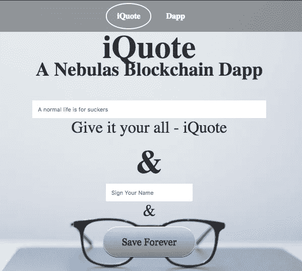

source code [Here](https://github.com/ottokafka/iQuote)

**第一步**

在 TestNet 上创建 NAS 钱包——查看我以前的[教程](/nebulasio/creating-a-nas-wallet-9d01b5fa2df6)

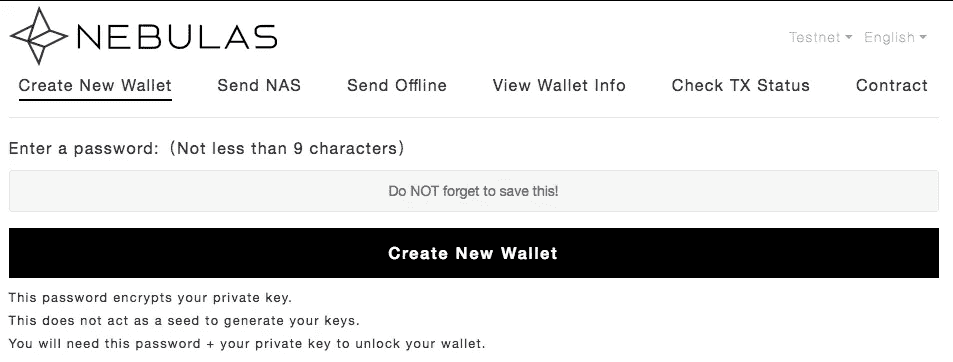

**第二步**

我们需要 TestNet 为我们的 NAS 钱包提供测试令牌，所以现在就去那里:[申领令牌](https://testnet.nebulas.io/claim/)

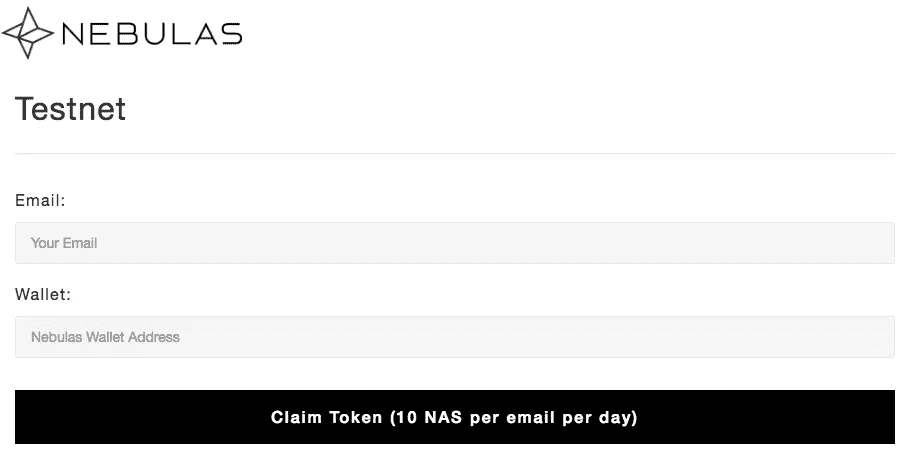

**第三步**

为了使用智能合约功能，我们需要安装 Web [扩展](https://github.com/ChengOrangeJu/WebExtensionWallet) [钱包](https://github.com/ChengOrangeJu/WebExtensionWallet)。

终端 git 克隆[https://github.com/ChengOrangeJu/WebExtensionWallet.git](https://github.com/ChengOrangeJu/WebExtensionWallet.git)

**第四步**

在 **Chrome** 浏览器中:**更多工具** / **扩展**

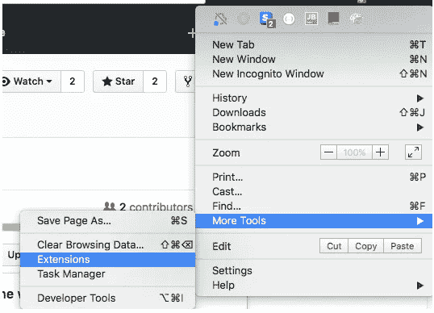

单击启用开发者，然后单击加载解包&

选择 WebExtensionWallet 文件夹，然后单击选择

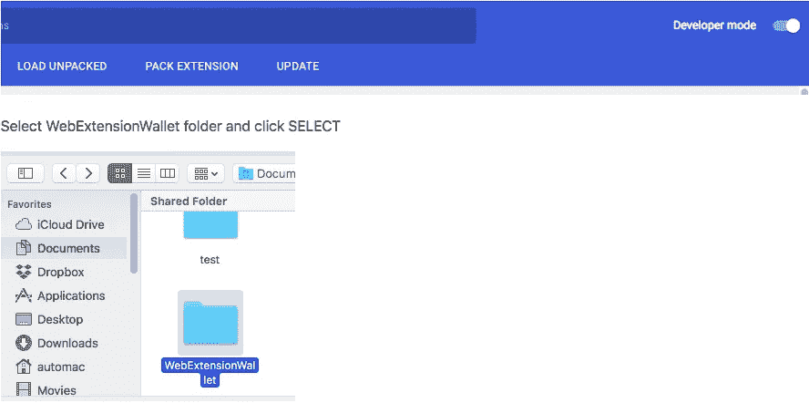

你会在下面看到这个

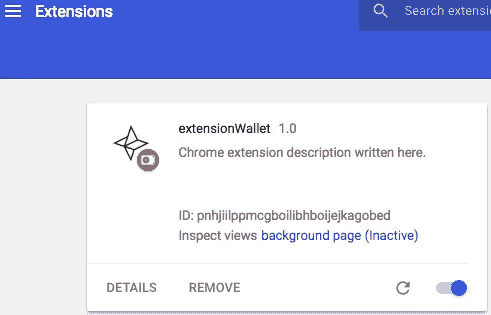

注意:注意:如果你在 chrome 上找不到 web 扩展，它可能被隐藏了，所以只需点击 I 图标所在的隐藏字段。它为我工作，或者为扩展创建一个快捷键。

打开扩展并选择 testnet。

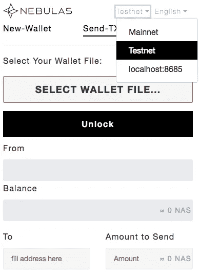

解锁您的钱包并将 NAS 发送给您自己

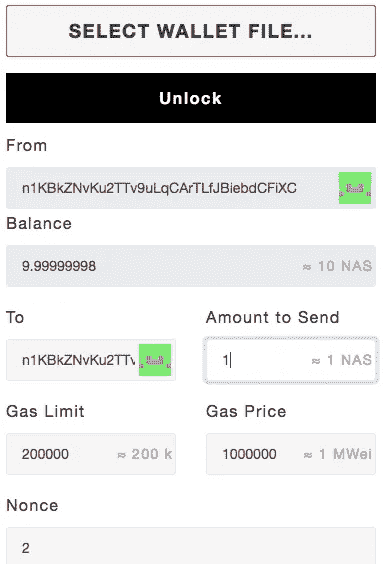

在您向自己提交 NAS 后，您将会看到这一点。只需等待 1 分钟，直到 TxReceipt 状态显示成功。

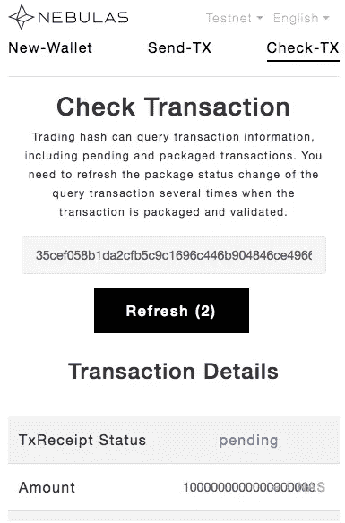

现在回到主 [Dapp](https://ottokafka.github.io/iQuote/) 或者 github 代码 index.html 文件，刷新页面。你现在可以继续使用这个 [Dapp](https://ottokafka.github.io/iQuote/) 。

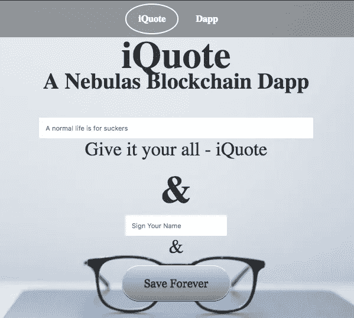

创建一个这样的例子，并签署你的名字。点击**永久保存**，这将保存到区块链星云

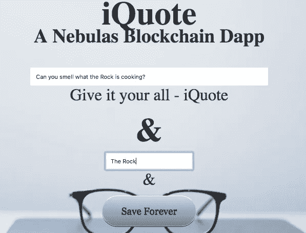

弹出窗口将显示如下。查看合同参数:你可以看到**岩石&你能闻到岩石在煮什么吗？**点击**确认**

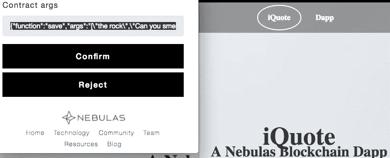

这会带你到这里。看到了吗 **TxReceipt Status == Success。**这对区块链来说意味着交易成功。让我们测试一下。

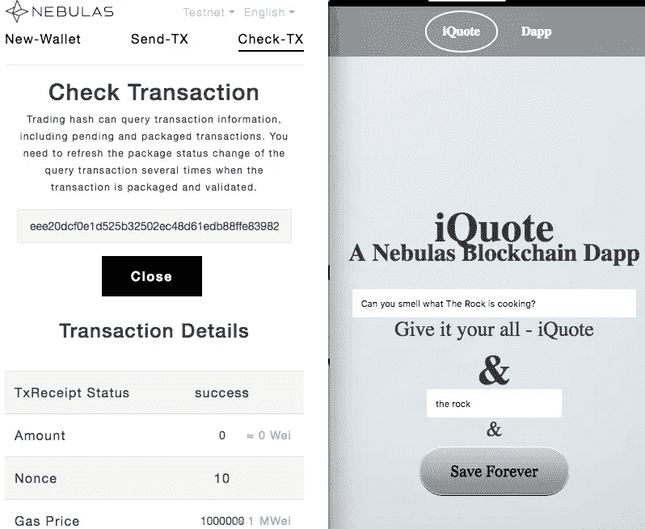

向下滚动进入搜索部分，输入**岩石**

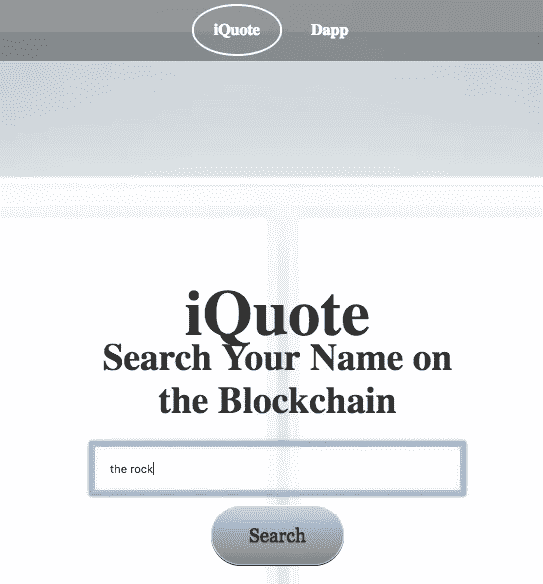

你应该看看这个

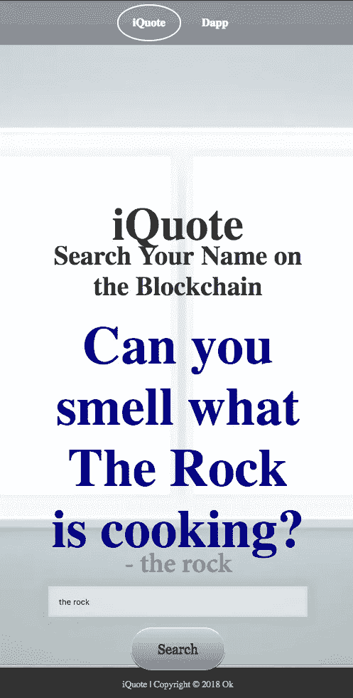

该文本被保存到区块链。去中心化 app。那是星云上的 Dapp。

接下来是如何为 Dapp 制定**智能合同—** 即将推出

旁注:我是一个崭露头角的初级开发人员，为花生工作。报名参加 Nebulas Dapp [竞赛](https://incentive.nebulas.io/signup.html?invite=vQ9hs)，给我一点甜头。

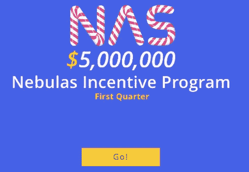

星云 Dapp [竞赛](https://incentive.nebulas.io/signup.html?invite=vQ9hs)。我会推荐你，我们都得到额外的 NAS。

在我接下来的教程中，我会教你如何从头开始构建 Dapp。

通过创建并提交 Dapp，您将获得 100 个 NAS，相当于今天的 1000 美元。如果你使用我的链接，我们都得到了额外的 10 NAS。