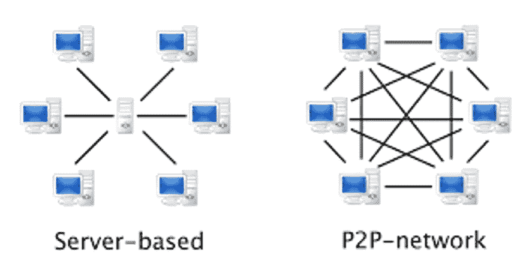
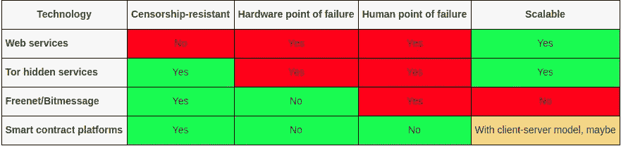

# Dapps 只是信任最小化的云计算

> 原文：<https://medium.com/coinmonks/dapps-are-just-censorship-resistant-cloud-computing-a44aad777ab7?source=collection_archive---------2----------------------->

## 如何不浪费 130 亿美元

# 介绍

你可以说，对 dapps 性质的误解导致了 2017 年至 2018 年间约 130 亿美元的挪用。虽然这些 ico 中的一些可能有一天会导致值得初始资本投资的东西，但很难说这将是许多(如果有的话)的情况。该技术被不恰当地利用和过度投资(不成功地)以试图克服基本的限制。在这里，我解释了 dapps 与当代 web 服务相比的优缺点，以展示如何成功地利用 dapps。

# Dapps 提供了与可伸缩 web 服务不同的架构

考虑到 dapps 将很难与 web 服务竞争，所提供的替代架构给了 dapps 找到用例的希望。

## 可扩展的 web 服务架构

Web 服务使用带有集中计算的客户机-服务器体系结构。客户端-服务器架构意味着最终用户将利用远程计算机来使用服务。这样做通常有很多原因，但主要是因为它是可伸缩的。这允许单个实体利用规模经济，并与用户免费共享计算能力/数据存储(通常是为了交换他们的数据或向他们展示广告)。添加新用户很容易，因为访问该服务所需的只是一个轻量级的、连接互联网的计算设备，而大多数人已经拥有个人电脑和手机。你可以说这种体系结构是用安全来换取更高的效率。通常情况下，无论如何，安全在很大程度上是外包给政府的(例如普通法)，因此这些架构可以严格关注效率。

## 区块链/dapp 架构

区块链使用对等网络，每个用户验证整个区块链。验证通常需要下载整个区块链，并检查每个事务是否符合协议，以计算最终状态。添加新用户更加困难，因为它要求用户拥有能够在合理的时间内验证整个区块链的硬件。拥有个人电脑很常见，但需要数百 GB 的数据和数天的同步是 UX 的反模式。高度分布式的区块链数据使网络更能抵御攻击。你可以说这种架构用效率换取了更好的安全性。与网络服务不同，区块链网络不外包任何安全服务，甚至不外包给政府。更多情况下，政府被视为威胁模型中的对手。

# 关于区块链/dapp 架构的更多信息

## 区块链是一个永远无法关闭的云平台

云服务只是作为产品出租的服务器硬件。基本上是虚拟主机。在当今的集中式云服务中，服务提供商可以自行决定撤销访问权限。相比之下，任何上传到区块链的代码必须无限期地保留在那里。这是因为区块链验证的性质要求所有数据都存在，因此不良或政治敏感的数据不能被删除而不妨碍执行完全验证的能力。只要充分验证是优先事项，区块链上的数据就不会受到审查。

## 完整节点就像服务器

所有完整节点包含当前状态以及整个区块链。这也意味着他们有每个 dapp 和合同代码的副本。如果有人愿意，他们可以提供访问区块链数据的服务。换句话说，用户有两种访问 dapps 的选择:

1.  运行您自己的完整节点。硬件要求很高，验证所有状态的时间也很长。这是一个 UX 反模式，但是允许任何人以信任最小化、私有的方式运行 dapp 代码。
2.  完整节点即服务。这里，客户端将请求节点数据(例如，与给定公钥相关联的 dapp 的所有账户信息)并通过浏览器进行交互。对他们来说，就好像他们在运行一个完整的节点，而且硬件要求非常低。这是一种比较可信的、不太私密的访问 dapp 的方式。它也是可扩展的。

## 低效是抵制审查的结果

区块链网络只是抵制审查，因为区块链的副本高度分布。然而，高水平的分布意味着密集的链上计算或高容量数据存储是被禁止的。这是因为硬件要求必须保持合理的低水平，以使完整节点数保持合理的高水平。抵抗审查所需的完整节点的确切数量还不清楚，但目前任何希望保留该属性的服务都应该是保守的。一旦服务被集中，就没有回头路了。这意味着:

*   必须限制事务吞吐量。交易需要数据存储和计算来验证。如果验证一个块中的所有事务所花费的时间超过了平均块时间，则实际上阻止了您进行完全验证。
*   只有最少的部分应该持久地存储在链上。数据是永恒的。
*   收费市场是必要的，以抑制垃圾邮件，提高任何类型的运作成本。没有最低经济价值的微交易或应用可能没有意义。

# Dapps 为现有的防审查服务提供了新的平衡功能

今天的防审查服务以两种方式之一提供这一重要功能:

1.  通过隐藏中央服务的位置。(例如 Tor 隐藏服务)
2.  通过保持数据高度分布，没有单点故障。(免费网，Bitmessage)

智能合约平台不言而喻的事实是[它们是采用高度分布式数据存储和添加可扩展业务逻辑功能的结果](/@noahruderman/smart-contract-platforms-vs-tor-bitcoin-for-censorship-resistant-online-services-545bd1f7a789)。也就是说，如果我们嵌入用户创建的 API(智能合约)，一个虚拟机，一种触发这些 API 调用(交易)的正式方法，以及一种在高度分布式数据存储中订购交易的方法(区块链)，我们就可以获得一个智能合约平台。

这是个好消息。这意味着 dapps 提供了一些引人注目的独特的东西，这是网络服务和现有的抵制审查的服务都无法提供的。

dapps 提供的最大特征差异是它们缺少人和机器的故障点。最大的问题在于它们的可扩展性如何。对于客户机-服务器模型，这是一种真正的可能性。

# 以太坊“不可阻挡的世界计算机”叙事为何失败

Dapps 作为抗审查的云计算或多或少与其在 2014 年作为不可阻挡(阅读:抗审查)的世界计算机(阅读:云计算机)的概念相同。那么，如果他们第一次做对了，会发生什么呢？

## 他们未能瞄准正确的市场

[赌博、成人分类广告和匿名市场是三个最赚钱的类别，需要一定程度的审查阻力。](/coinmonks/the-search-for-the-killer-dapp-fda1971d38d6)只有在第一种情况下，才有人试图在以太坊平台上寻找能够提供某些东西的产品。公平地说，以太坊团队是由技术专家组成的，他们对产品与市场的契合度没有任何清晰的认识。

相反，以太坊社区瞄准的是不合适的应用程序，这些应用程序根本不需要抵制审查。看起来他们的主要目标是使用一些可信中介的服务，而现实是可信中介强加的额外租金与分散式体系结构产生的额外成本相差甚远。产品通常看到的最大加价是 50 倍左右(例如药品)，但 dapps 的低效率(至少在以太坊上)在大多数(所有？)度量。

## 他们从未评估过成本

从一开始就很清楚，相对于传统的云计算平台，如亚马逊网络服务，区块链不会提供任何有成本效益的东西。考虑到他们瞄准的是错误的(或者最多是次优的)市场，他们真的应该更加关注他们的解决方案的成本效益。

## 他们把技术放在产品市场适应性之前

以太坊不是一个从现实世界问题开始的解决方案。这是一种技术的概括，它本身正在解决一个非常特殊的问题(信任最小化的财富转移)。考虑到这一点，他们从来没有优化架构来解决任何特定的问题，当他们发现以太坊对于他们瞄准的每个问题领域来说都太低效和昂贵时，他们措手不及。

# 结论

Dapps 只是不变的云(区块链)上的代码。高度分布的区块链数据使得这种代码可以抵抗审查。Dapps 没有硬件和人为故障点，这是一个独特的功能集，在其他抗审查技术中不存在。任何不需要这种审查阻力的事情，使用完全集中的替代方案可能会更好。以太坊被称为不可阻挡的世界计算机是正确的，但他们未能正确分析成本或瞄准正确的市场。

> [在您的收件箱中直接获得最佳软件交易](https://coincodecap.com/?utm_source=coinmonks)

