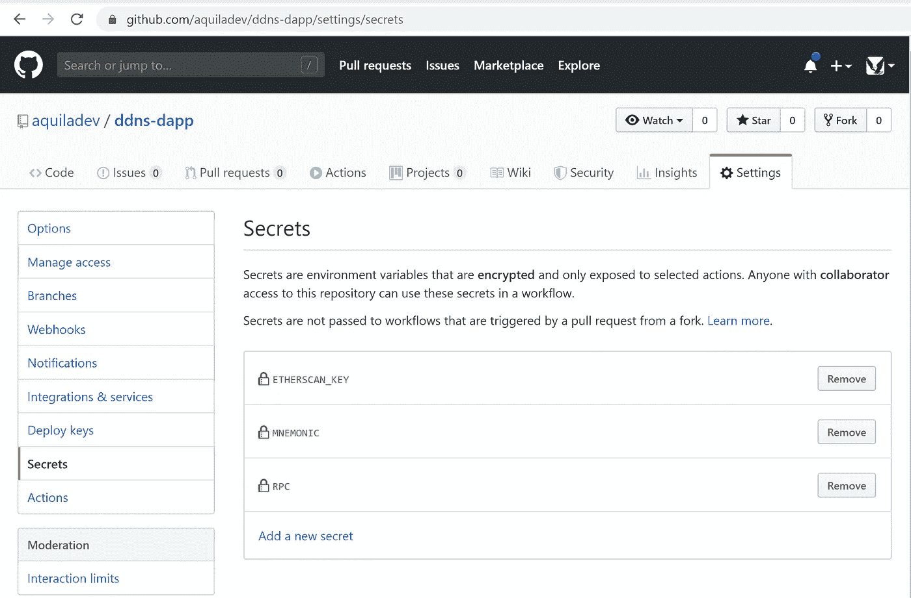

# DApp 的管道(IPFS + ENS)

> 原文：<https://medium.com/coinmonks/dapps-pipeline-ipfs-ens-cbb4f2de15c2?source=collection_archive---------3----------------------->


很多[dapp](https://en.wikipedia.org/wiki/Decentralized_application)都是开源的，大部分托管在 GitHub(我的假设)。这就是为什么拥有合适的工具来交付[dapp](https://blog.coincodecap.com/tag/dapps/)是很重要的。

在这篇文章中，我将介绍当您需要将一个 [DApp](https://blog.coincodecap.com/tag/dapps/) 部署到 IPFS 并更新 DApp 的 ENS 名称时的设置。


# 工具

1.  [**GitHub 动作**](https://github.com/features/actions) **。**因为 GitHub 引入了动作，所以只需要一次提交就可以为 DApp 创建一个管道。您不再需要为此使用第三方服务。
2.  [**星际文件系统** ( **IPFS** )](https://en.wikipedia.org/wiki/InterPlanetary_File_System) 是在分布式文件系统中存储和共享数据的协议和对等网络。IPFS 使用内容寻址来唯一标识连接所有计算设备的全局命名空间中的每个文件。
3.  [**以太坊名称服务(ENS)**](https://docs.ens.domains/) ，基于[以太坊](https://blog.coincodecap.com/tag/ethereum/) [区块链](https://blog.coincodecap.com/tag/blockchain/)的分布式、开放、可扩展的命名系统。它将人类可读的名称如`alice.eth`映射到机器可读的标识符，如以太坊地址、内容散列和元数据。

# 预备

1.  GitHub 仓库中有一个 [DApp](https://blog.coincodecap.com/tag/dapps/) 。
2.  ENS 名称。看看这个[一步一步的教程](/the-ethereum-name-service/step-by-step-guide-to-registering-a-eth-name-on-the-new-ens-registrar-c07d3ab9d6a6)就知道了。**注**:ENS 名称应该被配置，它应该有一个解析器。

# 设置

*   打开 GitHub 资源库->操作-> T2`New Workflow`->


*   修改`main.yml`文件:

定义管道的触发器(例如，仅在`master`分支上)

```
on:
  push:
    branches:
    - master
```

离开作业和运行环境的定义:

```
jobs:
  build:
    runs-on: ubuntu-latest
```

定义准备步骤:

```
steps:
  - uses: actions/checkout@v2- name: Setup Node
    uses: actions/setup-node@v1
    with:
      node-version: '10.x' - run: npm ci- run: npm run build
```

在这些步骤之后，在一个运行器上将会有一个构建工件(通常在目录`build`或者`dist`中)。现在，您可以定义上传到 IPFS 的步骤。

市场[https://github.com/marketplace/actions/upload-to-ipfs](https://github.com/marketplace/actions/upload-to-ipfs)上有一个自定义的上传到 IPFS 的操作

为了使用它，你需要添加步骤到`main.yml`

```
- uses: aquiladev/ipfs-action@v0.1.1
  id: upload
  with:
    path: ./build
```

该步骤将有输出`hash`——这是以后需要使用的。为了使用它，您需要添加一个令牌`${{ steps.upload.outputs.hash }}`，其中`upload`是步骤的 id。

最后一步是 ENS 更新。在市场[https://github.com/marketplace/actions/upload-to-ipfs](https://github.com/marketplace/actions/update-ddns)上有一个自定义操作

```
- uses: aquiladev/ddns-action@v0.1.1
  with:
    mnemonic: ${{ secrets.MNEMONIC }}
    rpc: ${{ secrets.RPC }}
    name: ddns-action.eth
    contentHash: ${{ steps.upload.outputs.hash }}
```

**在**名称**参数中拥有 ENS 名称的账户的钱包恢复需要助记符**短语。它也可以是帐户的私钥。 **Rpc** 是[以太坊](https://blog.coincodecap.com/tag/ethereum/) Mainnet 节点的 URL。

这一步需要助记符和 RPC 秘笈。您需要将秘密添加到您的存储库中。为此，打开设置- >秘密，然后添加那些。



你的`main.yml`准备好了。它应该看起来像:

```
name: CIon:
  push:
    branches:
    - masterjobs:
  build:runs-on: ubuntu-lateststeps:
    - uses: actions/checkout@v2

    - name: Setup Node
      uses: actions/setup-node@v1
      with:
        node-version: '10.x'- run: npm ci- run: npm run build

    - name: Upload to IPFS
      uses: aquiladev/ipfs-action@v0.1.2-alpha
      id: upload
      with:
        path: ./build

    - name: Update ENS
      uses: aquiladev/ddns-action@v0.1.1
      with:
        mnemonic: ${{ secrets.MNEMONIC }}
        rpc: ${{ secrets.RPC }}
        name: ddns-action.eth
        contentHash: ${{ steps.upload.outputs.hash }}
```

然后你需要按下`Start commit`按钮提交你的`main.yml`。

管道将立即运行(如果您提交到主分支)


您可以打开所有管线并检查输出


也可以生成 badge 并将其放入 README 中


# 检查结果

成功运行后，您将能够访问更新后的 DApp，但 IPFS 方面需要一些时间来解析新上传的内容。

为了在 ENS 中检查更新 IPFS 哈希，你可以打开[https://app . ENS . domains](https://app.ens.domains/)


最后，用 [http://eth.link](http://eth.link/) 访问你的 DApp


> [直接在您的收件箱中获得最佳软件交易](https://coincodecap.com/?utm_source=coinmonks)

[](https://coincodecap.com/?utm_source=coinmonks)