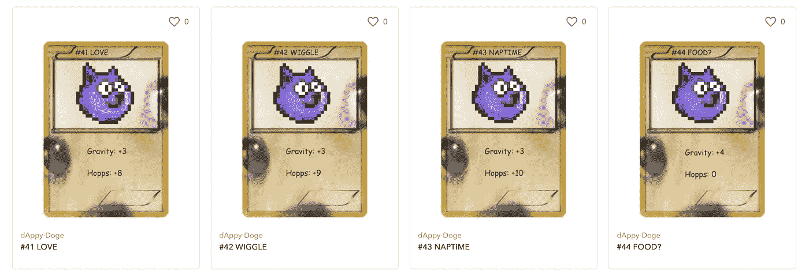

# dAppy Doge 是首批可玩的移动 NFT 游戏之一

> 原文：<https://medium.com/coinmonks/dappy-doge-is-one-of-the-first-playable-mobile-nft-games-dce8743a53?source=collection_archive---------8----------------------->

Available now for Web & Android

不可替代代币是 2021 年最热门的趋势之一。创作者和影响者每天都在放弃新形式的数字收藏品，而非加密世界的婴儿潮一代仍在问:这有什么意义？

除了“因为它们是可收藏的”之外，大多数答案都依赖于对未来效用的承诺，但 [dAppy Doge](https://dappydoge.com) 作为首批手机 NFT 游戏之一创造了历史，在这些游戏中，NFT 作为游戏中的角色拥有切实的效用。

dAppy Doge 是为演示 uToken 而开发的，这是一个新兴平台，使开发人员能够将 Unity 项目连接到任何 ERC-20、ERC-721 或 ERC-1155 令牌，对于急于进入爆炸式增长的 NFT 游戏社区的移动游戏开发人员来说，这是一个分水岭时刻。

**是什么让 dAppy doge 的 NFTs“可玩？”**

这个游戏是免费的，任何人都可以作为默认角色来玩，但是获得了一个敏捷的多吉·NFT 的收藏家可以作为这个基本上独一无二的角色来玩，只需要对他们的重力和跳跃能力进行显著的修改。

Snapshot: 4 of the 80 total 1-of-1 NFT’s that will be available via OpenSea starting April 18

**Web3 登录&钱包授权**

dAppy Doge 采用了不可信的登录和钱包授权。典型的 web2 登录需要存储在中央数据库中的用户名和密码来验证用户。dAppy Doge 使用签名来验证用户的真实性，而不会泄露私钥。用户在其加密钱包中签署一条消息(登录代码),这条消息的有效期为 5 分钟，用作您拥有该帐户的证明。

How to authorize your wallet and load your NFT’s

**文 NFTs？**

为了在 Web3 技术的最前沿启动这个实验，我们只铸造了 80 个创世纪 NFT，每个都有独特的颜色和能力修饰。继续关注推特[和加入电报](https://twitter.com/dAppyDoge)[来发现 dAppy doge genesis 何时坠落。](https://t.me/dappydoge)

在[dAppydoge.com](http://dappydoge.com)玩网络游戏，或者在 [Google Play](https://play.google.com/store/apps/details?id=com.dAppy.dAppy.Doge) 下载安卓游戏。苹果目前待定。

