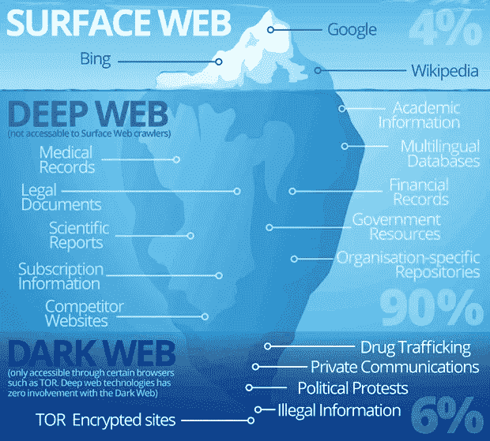
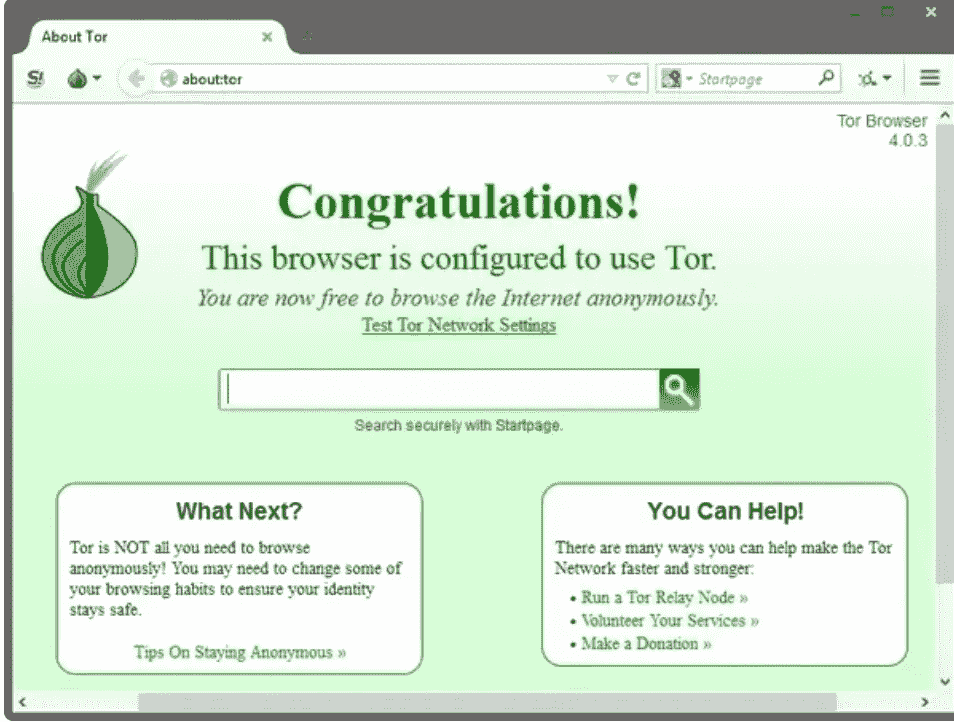
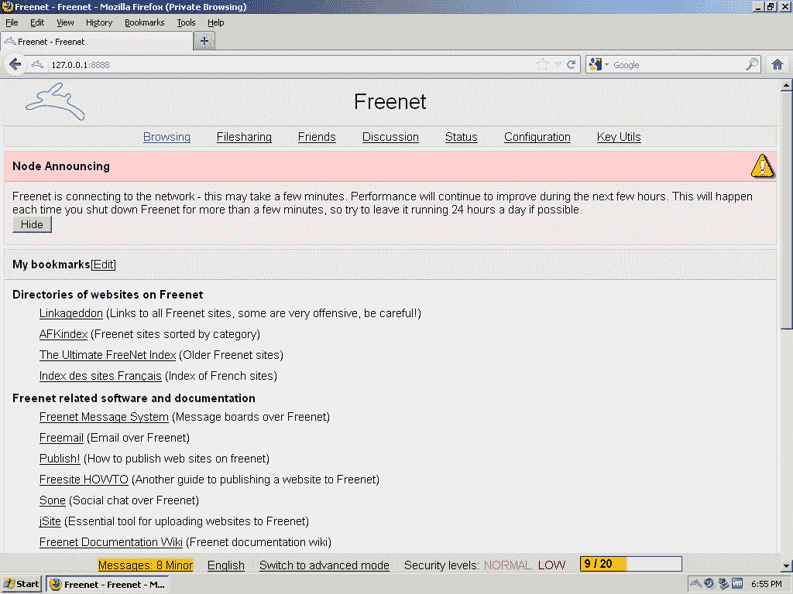
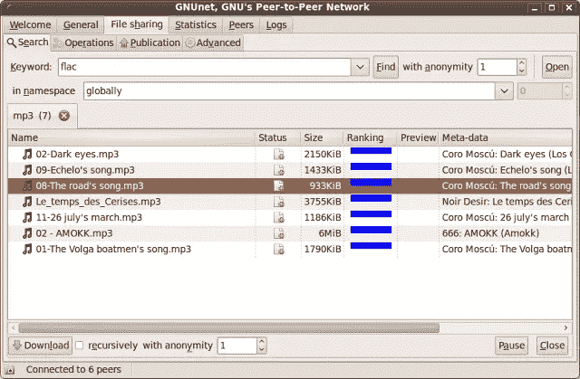
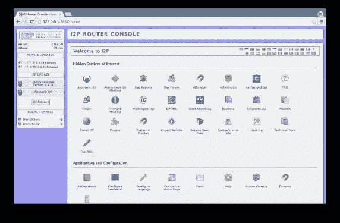
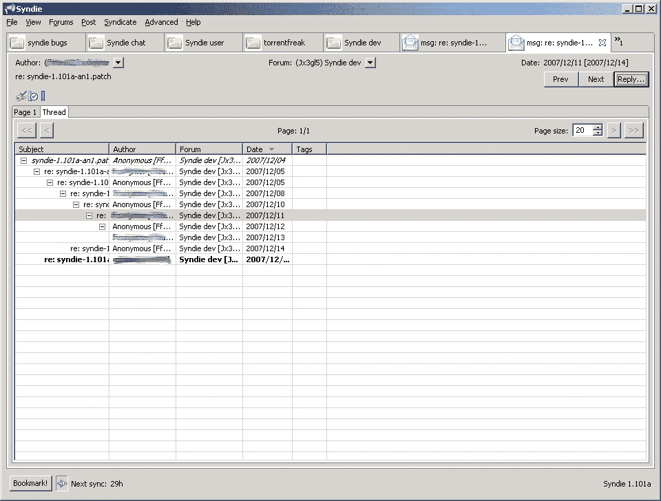
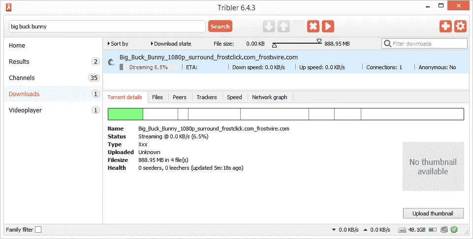
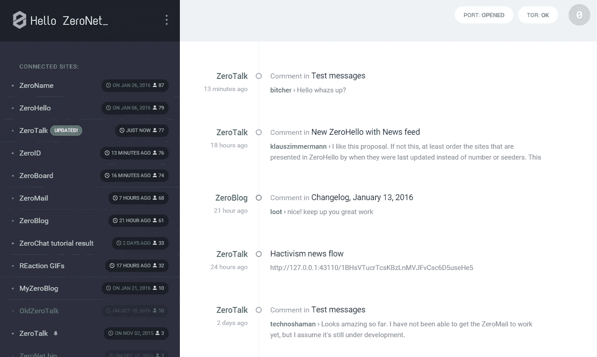

# 黑暗网络——未经探索的网络空间

> 原文：<https://medium.com/coinmonks/dark-web-the-unexplored-cyberspace-5009ca0ecd87?source=collection_archive---------0----------------------->

我们每天都在互联网上访问数百个网页。但是你有没有想过互联网的极限是什么？互联网有多大？我们对整个互联网了解多少？或者至少，到目前为止你访问了多少？我们小小的谷歌搜索最终会在社交媒体上给我们类似的建议、添加和弹出窗口，有时这变得相当烦人。让我担心的是，当涉及到存储在互联网上的个人数据时，隐私的保护程度。现在想象一下使用一个完全没有隐私问题的网络。这种实现被称为暗网。

Approximate mapping of the World Wide Web

方舟网络是一个由节点组成的底层网络，这些节点是完全隔离的，但与开放的互联网相连。简而言之，它是一个建立在互联网上的覆盖网络，所有现有节点通过逻辑链路连接在一起。它也可以解释为在互联网上创建的专用网络，只能通过使用独特的软件/配置/授权或协议来访问。

它最初只用于一个目的，即*匿名通信*。然而，随着时间的推移，网络罪犯找到了多种方法来滥用它。在当前的世界中，暗网被用于多种目的，如网络犯罪、文件共享、毒品和受限商品的销售、新闻泄露和许多其他非法活动。

## ***如何接入暗网？***

以下是可以用来连接暗网的项目列表。每个项目都有自己的网络，只有使用它才能访问。不可能跨平台访问。

1.  突岩
2.  免费网
3.  GNUnet
4.  I2P
5.  浅滩
6.  辛迪埃
7.  特里布勒
8.  零网
9.  OneSwarm
10.  分散网络 42
11.  追加股份

## ***Tor***

Tor 是一个免费的匿名软件，它通过使用一种被称为*洋葱路由*的特殊路由方法来隐藏用户的身份。这是通过在形成覆盖网络的多个节点上中继分组来实现的。默认情况下，连接到 TOR 的每个节点都自愿加入覆盖网络。洋葱路由以类似洋葱层的方式对应用层数据进行加密。我们可以确定一个人是否在使用 TOR，但是很可能不知道他在浏览什么或者在使用什么服务。

参赛:https://www.torproject.org

## ***FreeNet***

FreeNet 是一个分散式服务托管系统的实现。通过 FreeNet 托管的网站被称为免费网站。FreeNet 网络中的每个节点存储所有其他节点使用的数据。在我们正常的互联网中，没有像 web 服务器那样的单点故障。FreeNet 网络的每个用户都愿意贡献一部分带宽和本地存储，用于存储 *freesite* 的数据。在节点之间传输的流量是加密的，并且通常通过各种其他节点进行路由，这使得检测信息的原始请求者是谁以及正在传输的数据是什么成为一场噩梦。

参赛:https://FreeNetproject.org/

## ***GNUnet***

GNUnet 是一个基于 C 框架的免费、开源和去中心化的网络，致力于对等网络。它允许对等点发现和端到端加密通信。利用 P2P 算法实现网络路由、组播和网络规模估计。节点到节点的通信是加密的，未经授权不能访问。这样的特征是可能的，因为数据被封装并通过 *TCP* 、 *UDP* 、 *HTTP* 、 *HTTPS* 、 *WLAN* 甚至蓝牙协议发送。GNUnet 构建在一个网状架构中，该架构包括一个用于跟踪其他节点的*分布式哈希表*(分布式哈希表)。用户可以与任何人共享/托管资源和服务，而无需直接访问他们的 IP 地址。网络和资源发现通过使用*统一资源标识符*来实现。

参赛:https://gnunet.org/

## ***I2P***

一个基于 java 的开源实现，I2P 代表隐形互联网项目。它提供匿名点对点连接和服务托管。数据传输总是在端到端的基础上进行加密。托管在 I2P 的网站被称为*电子站点*。它支持一般的网络，使用 IRC 频道的匿名聊天实现，也支持文件共享，如 torrent 应用程序，其对等点不能被跟踪。也被多种加密货币使用，如 *Monero、Verge、BATA、Anon coin* 和 *Lux coin* 等。

参赛作品:[https://geti2p.net/en/](https://geti2p.net/en/)

## ***重复***

一种概念模型网络，提供服务的有效托管，而不损害匿名性，同时涉及低带宽消耗。它的开发是为了克服可以用来影响典型 TOR 网络的恶意节点泛滥机制。Riffle 试图通过使用一个叫做*混合网络*或*混合网络*的概念来克服这些问题。在将每条消息发送给原始接收者之前，它在网络中存在的各种节点之间被混洗。这使得单个目标节点的泛滥对于攻击者来说是无价的。每个接收者可以再次通过认证加密来反验证消息的合法性，其中唯一的私有密钥与消息一起生成，并且将被网络中的所有节点用来验证消息。然而，它仍然处于研究模式，我们还没有一个可实现的模型。

参赛:http://people.csail.mit.edu/devadas/pubs/riffle.pdf

## ***辛迪埃***

一个单一的平台可以同时共享一个或所有匿名网络上的任何资源，如 TOR、I2P、FreeNet。在一个类似论坛的架构上运行，它就像一个可以在所有可能的私有网络上工作的发布应用程序。在一个节点上托管的任何数据的单个副本意味着它将可供其他所有用户使用。一个用户可以拥有多个身份，可以用来托管或发布任何资源，同时控制操作条件，如发布评论或帖子等选项。对于数据共享来说，它是一个非常有用的平台，它高度重视资源的营销和安全，同时消除了数据损坏或任何停机的可能性。

ref:[https://www . syndie . de](https://www.syndie.de)

## ***Tribler***

另一个令人印象深刻的匿名网络的实现是受 Tor 的洋葱路由的启发。Tribler 的唯一目的是在媒体共享平台上为其用户提供完全匿名的服务。任何资源都可以从一个可用的节点上同时进行流式传输和下载，同时保持匿名和相当快的下载速度。这是一个开源的应用程序，有着不错的用户界面，拥有相当多的用户。

参考:https://www.tribler.org

## ***零网***

这是唯一一个利用了*比特币加密货币*中使用的加密算法的分散式网络。基于 Python 构建，由对等节点组成，它不使用 IP 地址，而是使用独立分配给每个节点的公钥进行路由。Bit Torrent 网络中的追踪器用于在对等点之间建立连接。由节点播种的资源可以被它访问，即使没有连接到因特网。P2P DAT 文件用于在没有服务器基础设施的情况下创建、托管和提供服务。由于 ZeroNet 的分散和播种架构，实际上没有一种有效的方法可以关闭 zero net 上的任何资源。

参赛:https://zeronet.io/

***one sword****和 ***Retro share*** 是类似的文件共享应用，提供匿名和选择性共享功能。鉴于 ***分散式网络 42*** 是建立在 VPN 和边界网关协议上的分散式 P2P 网络，参与者使用网络隧道(IPSec、OpenVPN 等)相互连接。)*

> *[直接在您的收件箱中获得最佳软件交易](https://coincodecap.com/?utm_source=coinmonks)*

**