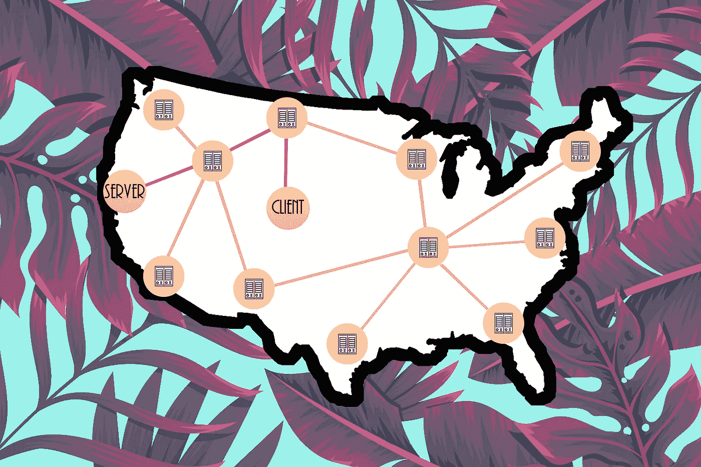

# 🏄‍♀️的网络:使用 Beaker + Dat 在分散的网络上冲浪和发布！

> 原文：<https://medium.com/coinmonks/dat-decentralized-web-tutorial-5ece6238bc84?source=collection_archive---------1----------------------->

互联网是美丽的垃圾箱火。它是我们这个时代意义深远的发明之一，旨在通过使信息变得容易获得来解放和增强地球上数十亿人的能力。然而，在这个过程中的某个地方，权力发生了转移，信息在到达你我面前之前，正通过精选的几个玩家传递。这种设计变化的后果已经在人类生活的几乎所有因素中产生了负面的连锁反应，甚至连万维网的发明者蒂姆·伯纳斯·李爵士也公开反对这种趋势。去中心化的网络被预测为我们的救星。这篇文章旨在教你如何进入下一代互联网。

**虽然有时我们可能会一头扎进杂草中，进入一些技术概念，但这篇文章是为所有人准备的……就像最初的互联网一样*😉

# 首先，一些历史

互联网建立在去中心化的概念上。信息将通过由独立运行的节点组成的容错网络来分发。如果一个节点出现故障或变得不安全，信息可以通过一系列相邻节点重新路由，以到达其最终目的地。这一点直到今天依然如此。

当人们抱怨互联网已经变得集中化时，他们要么是指这些节点的所有权已经集中到少数几个主要参与者手中(如谷歌、脸书、亚马逊等)。)或者对这些节点的独家访问被限制在几个占主导地位的公司(即你的互联网服务提供商:康卡斯特、威瑞森、美国电话电报公司等。).

这种权力集中打开了[大规模审查](https://en.wikipedia.org/wiki/Great_Firewall)、大范围 [传播](https://www.buzzfeednews.com/article/daveyalba/facebook-philippines-dutertes-drug-war)[假新闻](https://www.npr.org/tags/502124007/fake-news)、以及[网络中立](https://www.vox.com/cards/network-neutrality) *的大门。随着营利性公司加强对互联网的控制，我们的将会削弱。

如果你选择一个话题深入研究，选择网络中立。简而言之，一个非中立的互联网允许互联网服务提供商对流量进行优先排序，这意味着一个高付费客户(即一个富有的公司)的网站会以指数级的速度加载。考虑到大多数用户会放弃一个没有在 4 秒钟窗口内加载的页面，这可能对无法负担 ***贿赂****ISP 以获得更快加载时间的公司和个人不利。我要指出的是，我们仍处于后中性网络的早期，所以许多这些反主题预测仍需数年时间。*

# 分散它

如果没有一些 tla(三个字母的首字母缩写词),它就不是一篇科技文章，所以我们开始吧:P2P！

对等网络是一种网络策略，它将工作负载和资源划分给一个巨大的对等网络。我们当前的分发策略是通过轮辐式模型围绕客户端-服务器交互构建的。我(客户端)从一个网站(服务器)请求信息，该网站返回一个信息包，该信息包通过一系列辐条和集线器(我们以前称之为节点)传播。

P2P 模式破坏了客户端-服务器的交互。这些文件将被分割并分布在计算机/电话/服务器的集合中，而不是一个保存网站所有文件的中央数据仓库。我们这些生活在 torrents 怪异世界中的人会记得这种交互:你可以从一群对等点下载文件，同时“播种”该文件(即让其他人可以下载)。

然而，尽管如此辉煌，P2P 网络仍然面临一些相当大的隐私、安全和社会障碍…

# 这是为了胜利

Dat 是 P2P 领域为数不多的令人印象深刻的解决方案之一。Dat 是一个协议，它加入了一些可爱的特性来解决 P2P 架构的一些问题。它是为研究小组之间的文件共享而设计的，但它也适用于整个互联网。让我们深入探讨这些问题和解决方案:

## 完整性和版本控制

诚信问题有两种形式:

*   **链接腐烂:**网站会更改网址，所以过期的网址会把用户引向 404“啊哈”页面。
*   **内容漂移:**网站更新了页面的内容，但是 URL 并没有反映出变化。

Dat 通过为每个项目创建一个 [Merkle 树](https://brilliant.org/wiki/merkle-tree/)来解决这些问题。为了简洁和可读性，Merkle 树是一种复杂和安全的数据结构，它加密和组织大量的文件。Merkle 树在版本控制工具(如 Git 和 Subversion)和区块链理工大学中很常见。Dat 的 Merkle 树包含两个部分:

*   元数据:这是关于项目的信息，比如名称、作者、大小、最后修改日期等等。
*   **内容:**这是项目数据/内容所在的地方。数据被分割成易于传输的数据包，这些数据包被表示为 Merkle 树上的树叶。

有了这个架构，如果我更新了我的[神话般的/令人神往的网站](https://www.blakenetzeband.com)，而客户不喜欢我的改变，他们可以要求查看网站的以前版本*。也许更重要的是，每个分布式叶子使用一个顶部散列来将自己与树相关联；也就是说，当一个项目被分成一系列的包时，每个包通过某种加密魔法链接回项目的根。

我承认这个过程听起来不太用户友好，但是请记住 Dat 只是一个协议。在某种程度上，浏览器会接管所有繁重的 UI/UX 工作。

## 隐私和安全

我们现在把每个网站分成许多小数据包，通过对等网络分布在世界各地。当我尝试通过 Dat 协议访问您的网站时，我将首先在一个名为 **Source Discovery 的过程中寻找拥有您网站数据的对等方。一旦我得到了一个同伴列表，我就可以和他们建立连接并开始下载。这个下载和播种数据的共生群体被称为**群。**由于 Dat 的端到端加密，我确信我接收的数据不会被拦截或操纵，并且由于 Merkle tree 的一些漂亮的加密功能，我确信我接收的数据就是我期望的数据。**

## 走进杂草中

*(如果你对技术不感兴趣，可以跳过这一部分)*

还有两个额外的定制级别，使 Dat 协议更加迷人。源发现阶段使用 3 个网络的任意组合，如果需要，可以添加网络:

*   **DNS:** 用于命名和识别互联网实体(网站、电子邮件服务器等)的最流行的网络。).它本质上是互联网的电话簿。
*   **多播 DNS:** 对本地网络有用的零配置 DNS 扩展。
*   **主线分布式哈希表:**基于 Kademlia 的分布式哈希表😳。简单来说，这是一个由 BitTorrent 设计和使用的去中心化网络，用于管理他们的同行。

然后，在群集阶段，客户机可以选择定制自己的传输层:TCP、UTP 或 HTTP (Dat 的默认协议)。

本文没有足够的篇幅来阐述每个网络和协议的优缺点，重要的是 Dat 协议使客户能够定制他们的发现网络和通信协议，以满足他们的隐私需求。

# 挂十个🤙

## 网上冲浪

浏览 Dweb 最快的方法是使用[烧杯浏览器](https://beakerbrowser.com)。烧杯是由铬制成的，所以摸起来和看起来都像铬合金。最大的不同是，它支持 **dat://** 协议。要下载烧杯浏览器，前往他们的[安装页面](https://beakerbrowser.com/install/)。

一旦你在烧杯里…冲浪！你可以访问任何一个 ol' centralized 网站(包括这个！)，但真正神奇的是 **dat://** 站点——这里有几个让你入门的:

*   **我整洁的艺术网站** **:** 我承认这里没什么。每个随机生成的 3D 形状代表一个 dat 下载。它使用 WebGL，非常简洁。
*   **几乎什么都没有** **:** 一个经过深思熟虑的网站，让你定制一个 feed 联想到垃圾少的 Tumblr。
*   **Fritter** **:** 一个 Twitter 的克隆体。
*   **爆炸器** **:** 一个简单的游戏。
*   **5 分钟电脑冷静** **:** 我喜欢这个。关于如何休息的指导。

现在没什么可看的，但这就是你的用武之地！

# 在 Dweb 上发布

选择自己的冒险！对于 Dweb，您有两种选择:命令行方式或浏览器方式。我会带你经历这两个。

## 选项 1: Cool Techy 命令行方式

*(以下部分是为 mac 用户准备的，一般的工作流程对非 mac 用户来说应该是一样的，但是你必须不时地修改一下流程才能通过)*

已经有一个你想发布的网站？太好了！如果没有，就去这里的，点击右键，选择“将页面另存为……”，然后将其命名为**index.html**或者你喜欢的更性感的名字。

在您的终端中，使用 npm 下载 Dat(没有 npm？[搞定](https://www.npmjs.com/get-npm)):

> $ npm install -g dat

现在把你的 html 文件放到一个新的目录中并更新它:

> $ mkdir ~/Sites/dweb
> $ mv ~/Downloads/index . html ~/Sites/dweb
> $ CD ~/Sites/dweb
> $ dat 共享。

如果你正在使用一个包管理器，并且已经有了一个项目构建，请随意在本地下载 dat。

*同样，如果你已经发布了一个先前创建的网站，那么跳过前两行，运行****dat share<path-to-directory>***

酷！您已经成功地对 Dweb 做出了贡献！但是到底发生了什么？我们来分解一下。

## 的。dat 目录

在您的项目目录中应该会弹出一个新创建的目录。如果我们深入研究，我们会看到一些以*内容*或*元数据*开头的二进制文件。因为你是一个观察力敏锐的读者，当我们分解 Merkle 树时，你会记得这两个关键字…我们已经兜了一圈了！

如果你是某种巫师，你可以将这些文件重新编码成人类语言，并进一步检查它们，但现在，你应该高兴地知道，这是你的网站变成了一个漂亮的新 Merkle 树。整洁！

## Dat 统计

终端的最后 3 行是关于你的站点的一般统计数据。截至目前，您的网站已经发布，但遗憾的是，您的 dat 没有观众😞…还没有！这可以理解为:

> 共享 Dat: 1 个文件(x.x KB)
> 0 个连接|下载 0 个每秒连接 0 个每秒

## Dat URL

在您的终端中，您会看到一个奇怪的 URL，大概是这样的: **dat:// < 64 字符十六进制编码的 Ed25519 hash >** 。这是你在 Dweb 上的地址！让我们来看看:复制并粘贴到烧杯浏览器。

## 后续步骤

太棒了，成功了！现在回到您的终端，见证更新。您应该会看到类似这样的内容:

> 1 连接|下载 0 B/S 上传 0 B/S

再次:neato！现在我们来做一个更新。在一些很酷的 IDE 中打开你的 html 文件(可能位于 *~/Sites/dweb* )，比如 Sublime、WebStorm 等，或者只是一个文本编辑器，比如 TextEdit。做一些奇怪的事情(我用笔记块包装了一个部分，给你一个好的起点)。省省吧。然后回到终端:

> $ dat 同步

威米。她就写了这么多。还有一些更简洁的东西，比如…

克隆别人的(即我的！)dat 项目:

> $ dat clone dat://dat-web GL . hash base . io<path-to-directory></path-to-directory>

篡改*一个糟糕的项目:

> $ dat 医生

获得一些帮助:

> $ dat 状态(显示关于当前 dat 项目的信息)
> $ dat 帮助(关于 dat 命令行工具的一般信息)

**dat 医生运行两个测试:
1。通过公共服务器验证对等连接。
2。返回允许您测试直接对等连接的链接*

## 选项 2:烧杯路线

点燃烧杯，点击汉堡，然后点击**创建新的**。选择自己的冒险！从这里，选择:

*   **网站:**为你创建一个相当无聊的“Hello World”网站，里面包括你的花园综艺文件:【index.html】、script.js、和 **styles.css** 。加上一些 dat 特有的文件:**。datignore** 和 **dat.json，**
*   **空项目:**创建一个只有**的项目。datignore** 和 **dat.json** 文件。您可以添加自己的网站资产。
*   **从文件夹:**导入一个现有的 dat 项目，并自动与您的本地目录同步。

Red arrows point to some fun features: add files to a project, change sync location, and add a favicon image

# 保持热情

拍拍自己的背；你成功地推动了分布式网络的封装和开发。但是不要现在就停下来，用一些简洁的托管选项来确保你的网站长寿。

如果你喜欢这篇文章，在这里看看我的其他东西[，或者和我一起参加一些](/@blakeface/)[有趣的项目](https://github.com/blakeface/)，帮助我成为一名更好的程序员。

再见🤙

# 资源

## 🖇链接文章

*   [根据其发明者](https://webfoundation.org/2017/03/web-turns-28-letter/) *万维网基金会*的说法，网络面临三大挑战
*   [防火长城](https://en.wikipedia.org/wiki/Great_Firewall)维基百科
*   [联合国:脸书在罗辛亚种族灭绝中扮演了“角色”](https://www.aljazeera.com/news/2018/03/facebook-role-rohingya-genocide-180313161609822.html) *半岛电视台*
*   [杜特尔特如何利用脸书助长菲律宾毒品战争](https://www.buzzfeednews.com/article/daveyalba/facebook-philippines-dutertes-drug-war) *BuzzFeed*
*   [网络中立，](https://www.vox.com/cards/network-neutrality)T42【Vox】解释
*   [Dat 项目](https://datproject.org)Dat*项目*
*   [默克尔树](https://brilliant.org/wiki/merkle-tree/)辉煌

## 📖进一步阅读

*   [Dat 白皮书](https://github.com/datprotocol/whitepaper/blob/master/dat-paper.pdf)Dat
*   [我的 Dat 网站的代码库，带有 WebGL](https://github.com/blakeface/dat-webgl) *GitHub*
*   [扎实](https://solid.inrupt.com/) *蒂姆·伯纳斯·李爵士+麻省理工的 Dweb 解决方案*
*   [Dweb 文章](https://hacks.mozilla.org/category/dweb) *Mozilla*
*   [烧杯常见问题](https://beakerbrowser.com/docs/faq/) *烧杯浏览器*

## 🛠工具

*   [烧杯](https://beakerbrowser.com)

> [直接在您的收件箱中获得最佳软件交易](https://coincodecap.com/?utm_source=coinmonks)

