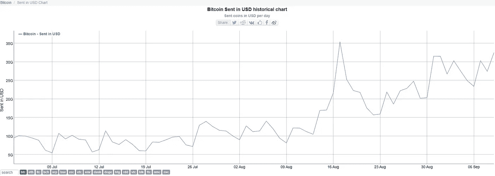

# 数据警报-1:比特币日发送量(美元)正在增加

> 原文：<https://medium.com/coinmonks/data-alert-1-bitcoin-daily-sent-volume-usd-is-increasing-5f8c781ca805?source=collection_archive---------4----------------------->

Photo by [Hulki Okan Tabak](https://unsplash.com/@hulkiokantabak?utm_source=medium&utm_medium=referral) on [Unsplash](https://unsplash.com?utm_source=medium&utm_medium=referral)

这是我用一篇非常短的文章的形式来分享一个想法的第一种形式。这一个处理加密货币。所以，如果你感兴趣的话，请继续读下去。

**总结:**
自 8 月 14 日起，比特币在链上的发送量出现了显著增长。这可能是 9 月初大幅调整之后主要价格变动的早期指标。

**详情:**
发送金额数字代表一天内发送的链上比特币，单位为美元。并不是所有的钱都被花掉了，不同的网站报告了不同的或调整过的数字。这不是一个每日的好指标，因为主要的价格变动已经发生，而这个数字没有显著变化。然而，在两次大的价格变动中，它是一个非常可靠的指标。请注意，自 2017 年以来(即在大约 3.5 年内)，只有三次机会，最近一次正在建立。

从 2019 年 9 月到 2020 年 8 月，发送金额平均保持在 50 亿至 100 亿美元左右。

此前，在 2017 年年中及 2019 年 7 月期间，这一数字出现了大幅增长。

**在前一种情况下，随着发送量的增加，会出现一次大的反弹。在后一种情况下，随着发送量的增加，出现了一次大的调整。**

因此，这个数字可能有助于表明情绪的转变或朝着一个方向的重大运动。数据点有限，但在前两个场合；当汇款额持续上升时，价格也会随之波动。请注意，价格的变动与该指标的变化无关。然而，这一指标的变化(很少在大范围内发生)可能是重大变动的早期迹象。

**近期观察:**
8 月 14 日发送量为 169 亿美元，8 月 17 日达到 354 亿美元。然后回调 160 亿美元，9 月 11 日达到今年的最高水平，达到 356 亿美元，24 小时数据仍在滚动。

**含义:**
8 月 14 日至 8 月 17 日期间，[比特币](https://blog.coincodecap.com/a-candid-explanation-of-bitcoin)价格从 11600 左右上涨至 12500。随后，价格回落至 9800 英镑左右，而外链发送量仍高于今年早些时候。

随着发送量从 9 月 7 日开始再次回升，比特币价格在 10250 左右保持相对平静。

当前的平静很可能掩盖了一个重大举措——但这可能不会来得太快。参照以前的情况，这样的时期可能需要几个星期才能建立起来。我没有可能性量表，但如果是下行，测试 9000 点应该不会令人惊讶。但是，如果上行测试；那么这可能是一个临时的调整，将看到今年的前期高点被决定性地向上突破。让事情变得更加复杂的是，一个错误的朝一个方向的突破动作也可能转变成朝相反方向的动作。**请注意，价格并没有反映出潜在的链上交易活动的显著增加——不管这可能导致什么。**

**数据和图表来自[www.bitinfocharts.com](https://bitinfocharts.com/comparison/bitcoin-sentinusd.html):**

Bitcoin Sent in USD — Focus on August to September 2020

***免责声明:*** *此内容仅供使用，且必须仅供参考。在根据自己的个人情况进行任何投资之前，做好自己的分析是非常重要的。无论是为了做出投资决策还是其他目的，您都应该听取与您在此找到并希望依赖的任何信息相关的专业人士的独立财务建议，或者独立研究和核实这些信息。*

## 另外，阅读

*   最好的[密码交易机器人](/coinmonks/crypto-trading-bot-c2ffce8acb2a)
*   [密码本交易平台](/coinmonks/top-10-crypto-copy-trading-platforms-for-beginners-d0c37c7d698c)
*   最好的[加密税务软件](/coinmonks/best-crypto-tax-tool-for-my-money-72d4b430816b)
*   [最佳加密交易平台](/coinmonks/the-best-crypto-trading-platforms-in-2020-the-definitive-guide-updated-c72f8b874555)
*   最佳[加密贷款平台](/coinmonks/top-5-crypto-lending-platforms-in-2020-that-you-need-to-know-a1b675cec3fa)
*   [最佳区块链分析工具](https://bitquery.io/blog/best-blockchain-analysis-tools-and-software)
*   [加密套利](/coinmonks/crypto-arbitrage-guide-how-to-make-money-as-a-beginner-62bfe5c868f6)指南:新手如何赚钱
*   最佳[加密制图工具](/coinmonks/what-are-the-best-charting-platforms-for-cryptocurrency-trading-85aade584d80)
*   [莱杰 vs 特雷佐](/coinmonks/ledger-vs-trezor-best-hardware-wallet-to-secure-cryptocurrency-22c7a3fd391e)
*   了解比特币的[最佳书籍有哪些？](/coinmonks/what-are-the-best-books-to-learn-bitcoin-409aeb9aff4b)
*   [3 商业评论](/coinmonks/3commas-review-an-excellent-crypto-trading-bot-2020-1313a58bec92)
*   [AAX 交易所评论](/coinmonks/aax-exchange-review-2021-67c5ea09330c) |推荐代码、交易费用、利弊
*   [Deribit 审查](/coinmonks/deribit-review-options-fees-apis-and-testnet-2ca16c4bbdb2) |选项、费用、API 和 Testnet
*   [FTX 密码交易所评论](/coinmonks/ftx-crypto-exchange-review-53664ac1198f)
*   [n 零审核](/coinmonks/ngrave-zero-review-c465cf8307fc)
*   [Bybit 交换审查](/coinmonks/bybit-exchange-review-dbd570019b71)
*   [3Commas vs Cryptohopper](/coinmonks/cryptohopper-vs-3commas-vs-shrimpy-a2c16095b8fe)
*   最好的比特币[硬件钱包](/coinmonks/the-best-cryptocurrency-hardware-wallets-of-2020-e28b1c124069?source=friends_link&sk=324dd9ff8556ab578d71e7ad7658ad7c)
*   最佳 [monero 钱包](https://blog.coincodecap.com/best-monero-wallets)
*   [莱杰纳诺 s vs x](https://blog.coincodecap.com/ledger-nano-s-vs-x)
*   [bits gap vs 3 commas vs quad ency](https://blog.coincodecap.com/bitsgap-3commas-quadency)
*   [莱杰纳米 S vs 特雷佐 one vs 特雷佐 T vs 莱杰纳米 X](https://blog.coincodecap.com/ledger-nano-s-vs-trezor-one-ledger-nano-x-trezor-t)
*   [block fi vs Celsius](/coinmonks/blockfi-vs-celsius-vs-hodlnaut-8a1cc8c26630)vs Hodlnaut
*   Bitsgap 评论——一个轻松赚钱的加密交易机器人
*   为专业人士设计的加密交易机器人
*   [PrimeXBT 审查](/coinmonks/primexbt-review-88e0815be858) |杠杆交易、费用和交易
*   [埃利帕尔泰坦评论](/coinmonks/ellipal-titan-review-85e9071dd029)
*   [赛克斯·斯通评论](https://blog.coincodecap.com/secux-stone-hardware-wallet-review)
*   [BlockFi 评论](/coinmonks/blockfi-review-53096053c097) |从您的密码中赚取高达 8.6%的利息