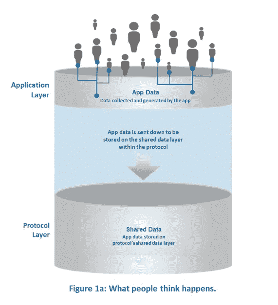
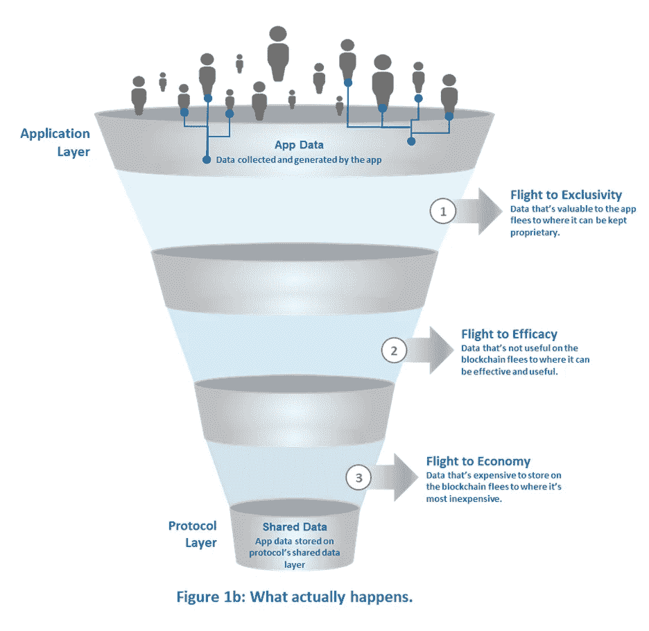
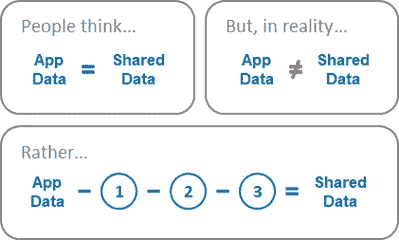
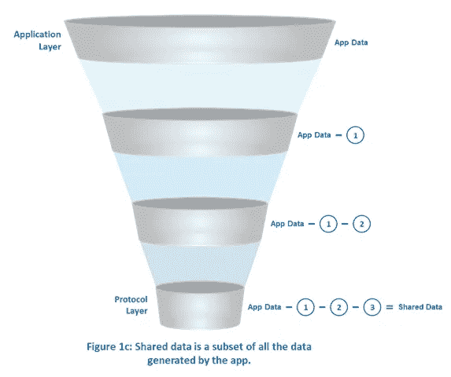

# 数据飞行:为什么“胖协议”没有意义

> 原文：<https://medium.com/coinmonks/data-flight-why-fat-protocol-doesn-t-make-sense-a1cf966ed56b?source=collection_archive---------7----------------------->

## **第一部分| Web 3.0 中的价值获取**

# **论点简述| TL 博士**

理解价值创造和获取对投资者来说至关重要。“Fat 协议”最能代表这方面的共识。我不同意——这个由三部分组成的系列概述了原因。第一部分在这里发表。第二和第三部分即将出版。

**第一部分|数据飞行:为什么 Fat 协议’没有意义**

“Fat 协议”假设数据由应用程序生成，但由协议存储(在共享数据层中)，允许协议获取价值。这不是实际发生的情况。应用数据和共享数据是一回事。共享数据是应用数据的一小部分。这是因为，当应用程序数据向下到达协议层时，其中一些会逃到更适合它的地方。数据外逃有三种类型:逃向独家、逃向功效、逃向经济。总的来说，它们降低了协议获取的价值，并给应用程序提供了建立可防御业务的机会。

**即将出版:第二部分| Web 2.0 与 3.0:为什么这是一个糟糕的比较**

**即将发布:第三部分|集中化&斑点蛋:如何理解价值捕捉**

# **全文论证|**Web 3.0 中的价值获取

**为什么这很重要。**

理解价值创造和获取是理解任何行业的一个重要而复杂的组成部分。投资的时候更是如此。我一直在思考这个问题，因为它与 Web 3.0 或区块链生态系统有关。乔尔·莫内格罗在 USV 的博客文章《肥胖协议》是这个话题最受欢迎的观点之一，也是最接近共识的观点。我不同意这种观点，对于如何在这个领域创造和获取价值，我有不同的看法。这个由三部分组成的系列带你了解我的想法。

**共识所想。**

虽然你们中的大多数人已经很熟悉了，但对于那些不熟悉的人，这里有一个快速入门。s 断言，在 Web 3.0 中，协议——而不是应用程序——将获得最大的价值。Monegro 的[‘Fat Protocols’](https://www.usv.com/blog/fat-protocols)断言，由于区块链应用程序使用一个公共协议，因此共享一个公共数据层，它们可以很容易地互相替换。因此，与 Web 2.0 应用程序不同，Web 3.0 应用程序没有专有数据，这使得它们无法获取自己帮助创造的大部分价值。因此，价值——因为它追逐数据——将主要在协议层积累，使协议“胖”而应用程序“瘦”。'

为什么这没有意义:数据飞行。

这个看似合理的逻辑不太合理的原因是，它假设应用程序共享一个公共数据层。这不完全正确。让我们看看数据如何在区块链生态系统中移动，以便更好地理解原因。

数据进入应用层，由用户生成。用户不关心协议，他们关心的是满足他们的需求。因此，当应用程序满足他们的需求时，他们就会使用它，从而在应用程序中生成数据。由于这些应用程序是由协议“驱动”的，人们认为它们生成的所有数据都被下推到共享数据层并存储在其中。他们认为 app 数据等于共享数据。这在图 1a 中示出。

问题是人们认为会发生的事情实际上并没有发生。应用程序生成的所有数据(应用程序数据)实际上并没有到达共享数据层。如图 1b 所示，在下降的过程中，一部分会“逃离”。我称之为数据飞行。

有三种类型的数据飞行。

1.  **飞向独占:**有些数据对应用程序及其对用户有用的能力来说非常有价值。例如，用户偏好是一种有利于保密的数据类型。偏好数据不需要使用协议，所以它不需要*存储在共享数据层。但是，如果你试图建立一个具有竞争优势的可防御企业，这是你需要的。当这种类型的数据被抽走并存储在区块链生态系统之外时，就会出现排他性，在那里，这些数据可以由应用程序独占。*
2.  **飞行功效:**有些数据存储在区块链上完全没用。由于区块链是非结构化数据库，在共享数据层上存储需要搜索和组织的数据没有任何意义。这是无效的。当在区块链上无用的数据被存储在结构化数据库等中时，就发生了效率转移。所以可以更有用。
3.  飞往经济舱:在区块链储存数据非常昂贵。虽然在区块链上存储非文本文件在技术上是可行的，但它的成本高得惊人。(我的联合创始人乔纳森·中野(Jonhnson Nakano)在这里写道，存储一封平均 75kb 的电子邮件要花费 75 美元。)当存储在区块链上不经济的数据被存储在像 AWS 这样更便宜的选项上时，就出现了“逃到经济”的情况。

这三种不同类型的数据传输有一个非常重要的分支:最终到达协议层的数据是应用层生成的数据的一小部分。这在图 1c 中示出。

这意味着协议层捕获的值将远远小于“Fat 协议”所建议的值另一方面，应用层潜在获取的价值要大得多。

## 脚注

Web 3.0，区块链应用程序有时被称为 dApps，或分散式应用程序，以区别于 Web 2.0 应用程序(脸书、优步、谷歌、Airbnb 等)。).Web 3.0 应用程序不同于我们更熟悉的 Web 2.0 应用程序，因为它们运行在一个类似 P2P 的计算机网络上(使它们分散)，而不是一台计算机上(使它们集中)。它们通常(但不总是)是开源的，并利用由加密算法生成的加密令牌。

*我不把 Web 3.0，区块链应用程序称为“dApps”，因为我觉得这个术语定义不清，令人困惑。Web 3.0 应用程序具有不同程度的集中化——一些是完全开源的，严重依赖底层协议，而另一些是封闭的生态系统，选择性地使用区块链协议。我认为这种变化是重要的，但稍后会详细说明。*

**免责声明。**本文仅供参考。本帖表达的观点不是，也不应被理解为投资建议。这篇文章中的所有观点都是我个人的，不以任何方式代表[deciper Capital Partners](http://decipher.capital/blog.html)或附属公司的观点。

> [直接在您的收件箱中获得最佳软件交易](https://coincodecap.com/?utm_source=coinmonks)

Read more Crypto