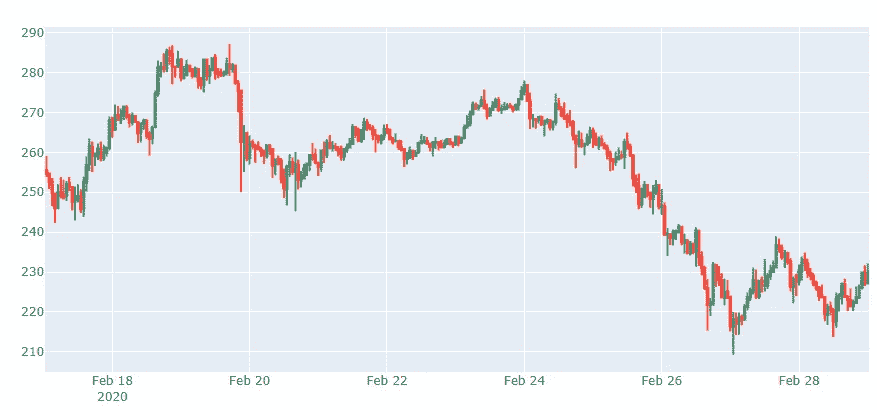
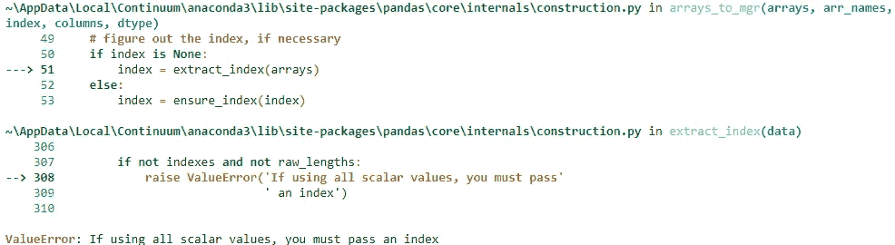
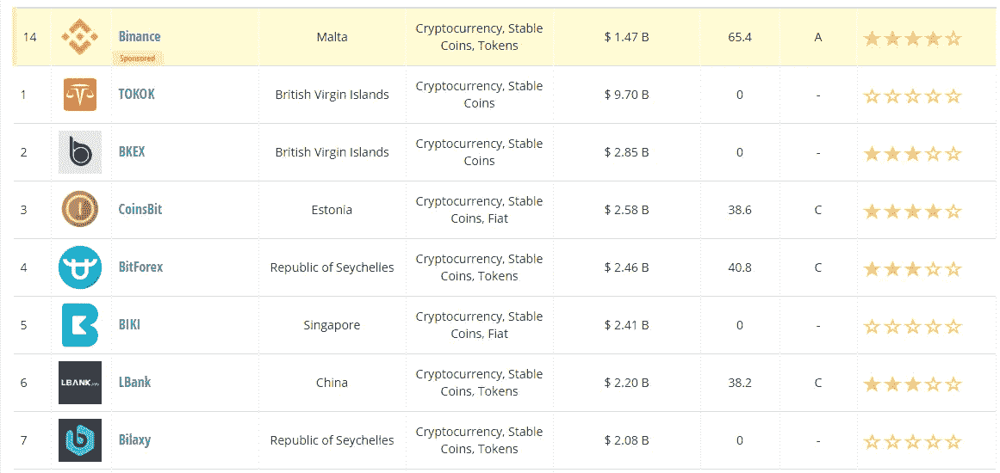

# 数据科学项目:加密货币(第一部分)—动机—

> 原文：<https://medium.com/coinmonks/data-science-project-cryptocurrencies-part-1-8dc1f5778347?source=collection_archive---------0----------------------->

## 在这第一篇文章中，我将尝试回答这个问题:我们为什么在这里？(不是形而上学的那种)，也给你一点我们的第一步的味道。

Photo by [Abigail Faith](https://unsplash.com/@abigailfaith?utm_source=medium&utm_medium=referral) on [Unsplash](https://unsplash.com?utm_source=medium&utm_medium=referral) (i was just wondering if…)

[*加密货币:体量与数据来源(下)。*](/coinmonks/data-science-project-cryptocurrencies-part-2-volume-and-data-source-b42ac1d6ec12)

[*加密货币:成为交易者数据科学家(下)。*](/coinmonks/data-science-project-cryptocurrencies-part-3-becoming-a-trader-data-scientist-ada29ee319a9)

[*成为交易者数据科学家:改造布林线(第四部分)*](/coinmonks/becoming-a-trader-data-scientist-transforming-bollinger-bands-part-4-8aab6fbc2f2d)

# 必要的介绍

有很多文章描述了[加密货币](/datadriveninvestor/an-introduction-to-cryptocurrencies-c0b8673aec30)的所有介绍性脉络，什么是[区块链](/swlh/blockchain-explained-simply-385dad966ce6)，什么是[市场如何运作](/hashingsystems/how-do-cryptocurrencies-and-the-crypto-market-work-8298de896848)，什么是[技术分析](/@cryptocreddy/does-technical-analysis-work-fa90413a8328)等等。鉴于所有这些都有精彩的描述，你可以在嵌入的词语 *—* 和许多其他地方 *—* 中找到极好的资源，我们将跳过这一部分(至少现在是这样)，因为我们将直接分析成千上万种方法中的一种来解决交易涉及的所有问题，比如“我应该买吗？”、“什么时候卖？”等等。

所以，你可能会想，“好吧，但也有很多文章将各种机器学习算法应用于加密货币(主要是 [LSTM](/smileinnovation/how-to-make-profits-in-cryptocurrency-trading-with-machine-learning-edb7ea33cee4) 模型)，如果重点是避免现有内容，你不会做得更好。”预测你在想什么，这是一个很长的镜头，哈！(COVID19 会是更安全的选择)，但万一我是对的，我来给你解释一下。

这一系列文章的讨论将更多地集中在我作为一个新手对这个问题的疑问上，而不是模型本身(不要担心，会有很多关于模型的内容)。我不是说这将是完全原创的，但至少这将是目标之一。我也不假装有最好的答案，因为正如我之前提到的，我是一个新人，因为很难相信存在做任何事情的最佳方式。我将在这里分享的是我解决这个问题的过程。

考虑到所有这些，您应该期待在接下来的文章中看到什么:

*   大量的内心独白(有时直到意识流的地步)。这是因为我想避免这种常见的[第三人称全知叙述视角](/the-book-mechanic/how-to-choose-the-right-point-of-view-for-your-story-e3533528af86)在大多数学术文章中使用，这让我感觉像是“这些东西都是从哪里来的？”“那这就是绝对的事实吗？”。如你所见，我甚至会给你看我读的写这一段的文章。
*   我失败了，错了很多！因为这更多的是过程而不是最后的结果。这意味着我不会跳过一些对你来说显而易见的东西，而且，如果你的目标只是学习最少的页数，那你就没来对地方。
*   此外，这些文章的结构将与《豪斯医生》
    相同。我想说的是:在《豪斯医生》中，每一章都基于一个新的医学案例，所以你可以对电视节目一无所知，但仍然可以了解与该案例相关的一切。但是，也有一些关于角色的背景历史，如果你没有看到前面的章节，你会失去。因此，如果你不想读完整的传奇故事，相反，你更喜欢只读一个特定的主题(医学案例)，你就会失去我们为什么会在那个点上的背景(为什么人物不互相交谈)。
*   如果你担心这看起来更像是一部小说，而不是一个关于加密货币的项目，不要担心！显然，我没有忘记 *—* 然而 *—* 这是一个数据科学项目，讨论将围绕所有常见的数据科学管道展开:数据收集、数据争论、重要功能、功能工程、功能选择、模型选择、回溯测试等等！。
*   对我来说，每两周发表一次是我的个人目标，从今天开始，每周日。我非常希望有时间多做这些事情，但是因为我有一份全职工作，一段感情，家庭，朋友，基本上还有生活，所以我给自己足够的压力去做这个承诺。值得一提的是，今天在做脸书滚动时，我发现了这个[视频](https://www.youtube.com/watch?v=YUiBhaFpF9A&t=)，尽管有宗教争论，但它真的很感人。

做完这个超级不必要的背景，我们终于开始品尝项目的一些肉了(素食者的大豆肉)。

# 我们旅程的第一步:当然是数据收集！

检索数据可能看起来不是一项如此具有挑战性的任务，但是在这个特定的场景中，这绝对是我们必须三思而行的事情。

我的第一个方法是寻找一个可靠的交换，并寻找它的 API 文档。我的第一个谷歌搜索是“加密货币的最佳交易所”，我发现了很多排名，其中有一堆论点，即哪一个最适合每一个不同的具体目标，比特币基地几乎在所有人的名单中。

> [**为开发者检验最佳加密 API**](https://coincodecap.com/category/crypto-api)

Python 的包(是的，除了用 Python 编码之外，我将在一个 Jupyter 笔记本上执行它，所以是原创的！)我发现的 [cbpro](https://github.com/danpaquin/coinbasepro-python) ，对我来说似乎相当不错:易于使用，也带有粒度参数，当我们讨论投资范围时，这将非常有用。在纠结于选择开始和结束日期的参数之后，我查看了 [API 文档](https://docs.pro.coinbase.com/#get-historic-rates)，其中有自然的“开始”和“结束”参数。例如，我们来看一个简单的 ETH-USD 对调用。

我还玩了玩[烛台](/@cryptogrinders/reading-the-candlestick-73b2ecabdf5e) ( [剧情](https://plot.ly/python/candlestick-charts/))。链接到[这里](https://mauricioletelier.github.io/Candlestick-ETH-USD/)。

我选择了一个小时的粒度，烛台反映了这 12 天的价格波动。

这第一步揭示了我们的第一个“等一下”。所以等一下！如果我想以相同的粒度检索上个月的数据，该怎么办？这是在一个月的通话时间内发生的事情。

漂亮！一个可爱的一般性错误。在尝试了不同的东西后，我发现了实际的误差，超过了 300 个数据点的最大值。这意味着，如果我们想收集更多的数据点，我们可能需要开发一种方法。但是当我正在想如何解决这个问题时，砰！等一下！比特币基地只是众多交易所之一，与整个市场相比，其交易量可能非常低。正因为如此，它可能无法代表其它交易所发生的微妙信号。

发了一会儿牢骚，责怪自己有这些想法，这些想法只会让我从头再来，我决定放手一搏。此时正是我发现 [Cryptocompare](https://www.cryptocompare.com/) 的时候。该页面的一个特点是对过去 24 小时内超过 200 家交易所的交易量进行排名。这是按前 7 个市场的交易量排序的兑换表:

Screenshot - Cryptomarket.com

比特币基地甚至没有进入前 20 名(在那个特定的时刻是 29 名)。所以直觉是对的，与一个交易所相比，整个市场的容量是巨大的。出现的问题是，“这在我们的分析中真的很重要吗？”，“我们真的需要所有的数据吗？”。答案是:我们来看看。

但是那个问题，我的朋友(是的，如果你读到这里我宣布你是“我的朋友”)将属于一个全新的故事(中等故事)。我希望你对这里将要发生的事情有一点了解，如果你喜欢，我邀请你在两周后再次与我们会面，就什么是真正可靠的信息来源展开这场超级激动人心的辩论。

如果你喜欢，请在[媒体](/@maletelier)和 [Linkedin](http://www.linkedin.com/in/maletelier) 上关注我。如果你想给我写信，我最近在推特上。我很乐意与你交谈！。

> [直接在您的收件箱中获得最佳软件交易](https://coincodecap.com/?utm_source=coinmonks)

