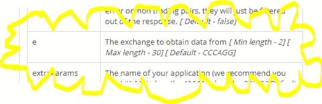
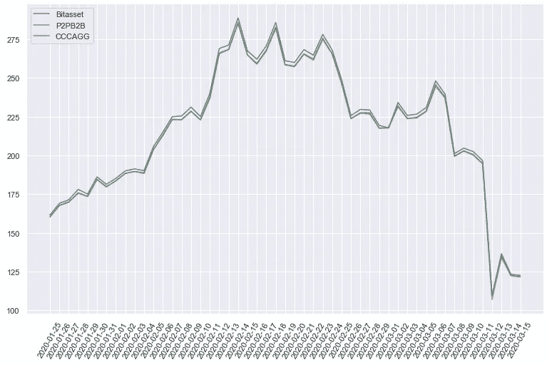
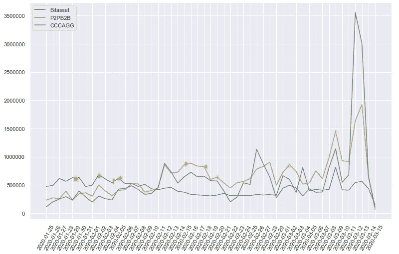
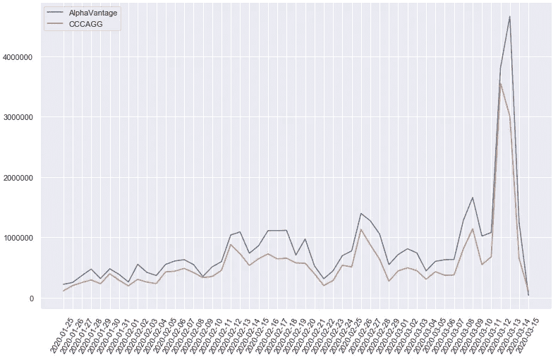

# 数据科学项目:加密货币(第二部分)—数量和数据来源—

> 原文：<https://medium.com/coinmonks/data-science-project-cryptocurrencies-part-2-volume-and-data-source-b42ac1d6ec12?source=collection_archive---------1----------------------->

## 今天，我们将深入探讨不同交易所的交易量，以及如何选择数据源以防止对我们的模型产生负面影响。

Taken from S[mithsonianmag](https://www.smithsonianmag.com/)

[*加密货币:成为交易者数据科学家(第三部分)。*](/coinmonks/data-science-project-cryptocurrencies-part-3-becoming-a-trader-data-scientist-ada29ee319a9)

[*成为交易者数据科学家:改造布林线(第四部分)*](/coinmonks/becoming-a-trader-data-scientist-transforming-bollinger-bands-part-4-8aab6fbc2f2d)

# **成交量、价格和蜻蜓迁徙**

两周前，我发表了这个系列文章的第一部分[。如果你还没有读，我鼓励你去读，因为它会帮助你理解这里发生了什么(从宣传开始？我喜欢我内心的这个作家！).如果你没有，也不想，没关系！也许如果你喜欢这个，你会感到诱惑(马基雅维利式的大笑)。](/coinmonks/data-science-project-cryptocurrencies-part-1-8dc1f5778347)

首先，让我向你介绍交易量对交易者意味着什么，以及为什么训练我们的模型是必不可少的。

[***成交量***](https://en.wikipedia.org/wiki/Volume_(finance))***:****是指一对货币在某一特定时间内在某一特定交易所的交易总量。*

在我试图成为一名真正的教育学家的过程中——我没有——给我一个机会来比较价格和数量的波动与蜻蜓迁徙(什么？！！).一组研究人员分析了这种迁徙现象，目的是了解蜻蜓在美国的旅程。长话短说:[他们测试了每一个翅膀样本的化学代码，这将表明虫子大概是在哪里出生的](https://www.smithsonianmag.com/smart-news/dragonfly-undertakes-epic-multi-generational-migration-each-year-180971190/)，有了这些信息，他们就能追踪它们的路径。

现在让我们假设我们是那一组研究人员(不要试图问我为什么我们应该高兴地同意这样做)。也假设我们对化学或生物学一无所知，正因为如此，我们决定以传统的方式面对这个问题:只是从某个角度看它们。为了与我们的案例联系起来，让我们暂时假设每只蜻蜓都是一个事务:有大的，也有小的。此外，我们还可以将其中的一些群体视为交易所。我们对预测的兴趣在于价格，所以——跟我来——蜻蜓方向将是我们的价格。

好吧…这群昆虫要去某个地方，但是在迁徙的过程中，让它们保持团结并不容易。我们能做些什么来知道他们要去哪里？也许看到了共性:寻找大群体或大蜻蜓，并试图理解它们的方向，如果有很多蜻蜓向南飞，这是一个强烈的信号，表明它们实际上正在向南飞(耐心点，这是这个类比有意义的部分)。

现在想象一下这种情况，一群蜻蜓渴了，拼命寻找水源。最近的河流位于北方，它们真的向相反的方向迁徙也没关系，只要喝一口水，它们就能飞得更远。现在，悲伤的部分来了:在我们探索的最初几分钟，我们刚刚适应地面，突然，这群口渴的人出现在我们怀疑的眼前。我们的第一反应可能是带着自负的表情看着对方，想着“有史以来最简单的工作”。我们大错特错了。

这就是这个例子背后的主要逻辑:事务就像蜻蜓，正因为如此，可能会有一些迷失了方向，其他人认为他们正朝着正确的方向前进，尽管他们不是，其他人只是跟随一个大的或一个群体，等等。正因为如此，寻找一种试图整合所有这些市场信息的工具非常重要，这将让我们避免不完全具有代表性的信号。

# Cryptocompare、AlphaVantage、trading pairs 等等！

我们看到 [Cryptocompare](https://www.cryptocompare.com/exchanges#/overview) 有超过 200 家交易所的大量信息。令人高兴的是，它还有一个 API，所以我们可以用数据回答我们的问题。但是我们如何比较呢？当我正在阅读 [API 文档](https://min-api.cryptocompare.com/documentation)的时候，突然显示器的某个地方开始发黄，我不知道是因为前一天睡了 5 个小时还是天主教教育童年的回忆，也许两者都有，但是，我发誓！一个神秘的黄光包围了一个特殊的参数。这只是我所看到的艺术再现。

Artistic Representation

这是一个神圣的信号吗？…很可能是，因为答案往往藏在森林最阴暗的地方——看起来不像光环。API 有交换参数！这意味着我们可以为每个交易所的交易量和交易价格提供可靠的参考。关于这个文档的另一件事引起了我的注意:这个 CCCAGG 默认参数。当我在搜索它的时候，*瞧！这就像一个梦想变成了现实，整个[方法](https://www.cryptocompare.com/media/12318004/cccagg.pdf)旨在为[密码](https://blog.coincodecap.com/tag/crypto/)交易者展示最佳价格估计，这意味着我们可以为交易总量和价格提供可靠的参考(或者至少我是这么想的)。这包括异常值检测、测试后添加新交易所、基于流动性的交易量调整等功能。CCCAGG 似乎很有前途，但是让我们先做一些理智检查。*

建议的非官方 Python 包是 [cryptocompare](https://pypi.org/project/cryptocompare/) ，但是 get_historical_price 方法不是我想要的可管理的，所以我找到了 [crytomcompy](https://github.com/ttsteiger/cryptocompy) ，它允许我们看到与[对](https://cryptocurrencyfacts.com/what-are-trading-pairs-in-cryptocurrency/)和交换请求相关联的不同指标。在下面的脚本中，您可以看到按交易量排序的 ETH-USD 对的前 5 大交易所。

让我们做同样的练习，但这一次对 USDT 联邦理工学院来说，我们将使用 Tether，一种稳定的替代美元的货币。

有意思！这两对选手之间的音量和主要选手有很大的不同，这告诉我们每对选手都有自己的特点。好吧，但是介绍这一段的句子是:“先做一些理智检查吧”，还是没看到 CCCAGG 相关的。首先，我们将比较 ETH-USD 和 CCCAGG 对中排名前 2 的交易所的价格(为了将数据存储为 CSV，我使用了我在本文[中找到的说明](https://towardsdatascience.com/cryptocurrency-analysis-with-python-macd-452ceb251d7c)，如果您想自己制作一些图表，可以查看我的 [Github](https://gist.github.com/MauricioLetelier/4a034783e1a07c490e09a57b0c5c9751) 中的代码)。

Price for ETH-USD in the last 50 daily periods (“Volumefrom”)

看起来不错，价格没有异常的迹象。我预料到了这一点，因为这种方法是基于 24 小时加权平均来估计价格的。因此，价格合理性检查:已批准**。**现在让我们试试同样的但是有音量的。交易量通常以不同的方式来衡量，但最常用的是“交易量”,这意味着交易以货币对中的第一种货币来衡量(本例中为[以太坊](https://blog.coincodecap.com/tag/ethereum/))。它还存在“volumeto ”,这是相同的，但以货币对中的第二种货币(本例中为美元)来衡量。

Volume for ETH-USD in the last 50 daily periods (“Volumefrom”)

Mmmhhhh 愚蠢的蜻蜓！…在很多情况下，只有一个交易所的交易量高于 CCCAGG(我只标记了其中的一些)，我希望 CCCAGG 能够提供所有交易所的交易量总和。这有点令人失望，但也是有意义的。汇总背后的整个方法是过滤可能是异常值的数据点，也许这个数字不一定是指每笔交易的总和。

所以，要驱散所有的疑惑，必须寻找更多的数据来源，[在这里](https://blog.rmotr.com/top-5-free-apis-to-access-historical-cryptocurrencies-data-2438adc8b62)我找到了包括 Cryptocompare 在内的 5 个。为了进行比较，我选择了另一个来源( [AlphaVantage](https://github.com/RomelTorres/alpha_vantage) )。我选择 AlphaVantage 是因为它是前 3 名中唯一一个我发现 ETH-USD 组合的集合期权。让我们来看看过去的 50 天。

Volume for ETH-USD in the last 50 daily periods (“Volumefrom”)

好吧，它并不完美，但这些线彼此靠近，所以这是一个很好的指标。两个汇总信息的来源说着相似的事情。这是信任的理由。我们现在应该想的是，我们该怎么处理这个体积不确定性，但是，伙计们，现在不会发生了。当我们处理传奇故事的特征选择章节时，我们将再次讨论这个问题。又是怎么做到的？我们将只选择在我们的预测中表现最好的体积。

但是让我们休息一下，我认为我们在一个章节中已经有足够的东西来挖掘，所以，做一些总结，我相信这对我们回顾今天所学的东西是有好处的:

*   交易是蜻蜓。
*   价格和交易量有综合衡量标准。
*   我们能相信总价格吗？我可能会说是！。
*   我们能相信总量吗？还不确定。

那么，我们的下一步是什么？探索性数据分析(终于！)，我们旅程的下一站，将是破译模式，跟踪线索，并获得对这个问题的见解。我希望你和我一样喜欢这个节目，两周后见！。

> [在您的收件箱中直接获得最佳软件交易](https://coincodecap.com/?utm_source=coinmonks)

如果你喜欢，请在[媒体](/@maletelier)和 [Linkedin](http://www.linkedin.com/in/maletelier) 上关注我。如果你想给我写信，我最近在推特上。我很乐意与你交谈！。

