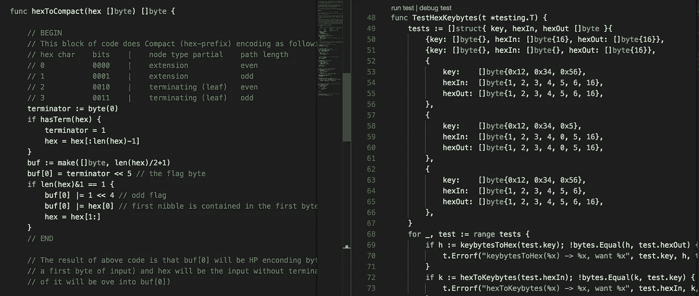

# 以太坊中的数据结构|第 1 集+:紧凑(十六进制前缀)编码。

> 原文：<https://medium.com/coinmonks/data-structure-in-ethereum-episode-1-compact-hex-prefix-encoding-12558ae02791?source=collection_archive---------0----------------------->

HP encoding in Golang.

在[第 1 集](/@phansnt/data-structure-in-ethereum-episode-1-recursive-length-prefix-rlp-encoding-decoding-d1016832f919)中，我们讨论了 RLP 编码/解码，然而以太坊还有另一种编码，称为压缩编码或十六进制前缀(HP)编码。那么，RLP 编码和惠普编码有什么区别呢？惠普编码是如何工作的？这篇文章将帮助我们得到它。

此外，我将解释一些混淆的术语，这些术语对理解这篇文章非常有帮助，也是下一集关于以太坊的特里的内容。

***一些术语***

> 在我们讨论惠普编码之前，我将尝试提前介绍一些术语。然而，这部分与以太坊中的 Trie 有关，也许你并不熟悉。别担心，我会试着跳过这些东西，让我们用一种直觉的方式来接近它。

让我们玩一个游戏。我会给你一张地图和一条路，你必须找到我暗示的动物。

路径是:3–2–3

The map of animals

为了解决这个游戏，我们一步一步地做以下工作:

1.  从根开始，路径中的第一个元素是 3，这意味着我们必须得到根的元素，用数字 3 标记，我们可以看到这个元素的值是 a。
2.  找到节点 A，路径中的下一个元素是 2，所以我们得到节点 A 中的值是 d。
3.  找到节点 D，path 中最后一个元素是 3，显然我们找出的值是‘Whale’。

所以，游戏的动物是鲸鱼。让我们尝试另一条路径:3–1–3–2(结果是“鸡”)。

通过这个游戏，我们熟悉了一些术语:

*   **键**:游戏中的根、A、B、C、D、E 为键
*   **节点**:每行右半部分的键对应的内容。比如:`{1: ‘Dog’, 2: B, 3: A}`。
*   **路径**:路径就像游戏中的 2–2–3。
*   **Value** :你可以看到它在所有节点中都有一些元素，每个元素都是一个键值对。值是元素的右边部分，值可以是一个键或一个动物的名字。
*   **半字节**:4 位的十六进制形式是一个半字节。比如:`0x1`、`0x4`、`0xf` …

***区分 RLD 和惠普的编码***

区分 RLP 和惠普编码真的很容易，RLP 用于编码/解码**值**，惠普编码用于编码/解码**路径**。

***惠普编码目标***

在这一部分中，我们将会遇到另外两个术语`leaf`和`extension`，但是我们可以在第三集里模糊它们并讨论细节。

`Leaf`和`extension`是两种节点，但是`leaf`的路径有`terminator`而`extension`没有。`Terminator`是路径的最后一个字节，十进制的值为`16`或十六进制的值为`0x10`。

正如我们所见，路径可能有奇数长度，但奇数长度对机器不友好。所以我们必须将所有奇数长度的路径转换成偶数长度的路径。

总而言之，惠普编码的目标是:

1.  不用`terminator`区分`leaf`和`extension`。
2.  将路径转换为偶数长度。

***惠普编码规范***

现在，为了方便起见，我们将 HP 编码中输入的路径称为输入。

*   如果输入有`terminator`，从输入中移除`terminator`。
*   在输入中创建前缀，其值如下表所示:

Hex-prefix table

*   如果前缀是`0x0`或`0x2`，在前缀后面加一个填充半字节`0`，所以前缀是`0x00`和`0x20`。这样做的主要原因是我们试图保持路径的偶数长度属性。说服自己:)。
*   给路径添加前缀。

例如:

Examples of HP encoding

***结论***

现在，我相信我们已经得到了在以太坊与特里战斗的所有武器。在下一集，我们将深入探讨这是我等不及要和你讨论的最激动人心的部分。

***参考文献***

维基以太坊

 [## 以太坊/维基

### 维基-以太坊维基-

github.com](https://github.com/ethereum/wiki/wiki/Patricia-Tree#specification-compact-encoding-of-hex-sequence-with-optional-terminator) 

原始 Golang 代码上的惠普编码:

 [## 以太坊/围棋以太坊

### 以太坊-以太坊协议的官方 go 实现

github.com](https://github.com/ethereum/go-ethereum/blob/master/trie/encoding.go) 

我的 github 上的 HP 编码和一些注释。

 [## sontuphan/debug-geth

### 在 GitHub 上创建一个帐户，为 debug-geth 开发做贡献。

github.com](https://github.com/sontuphan/debug-geth/blob/master/trie/encoding.go) 

> [直接在您的收件箱中获得最佳软件交易](https://coincodecap.com/?utm_source=coinmonks)

