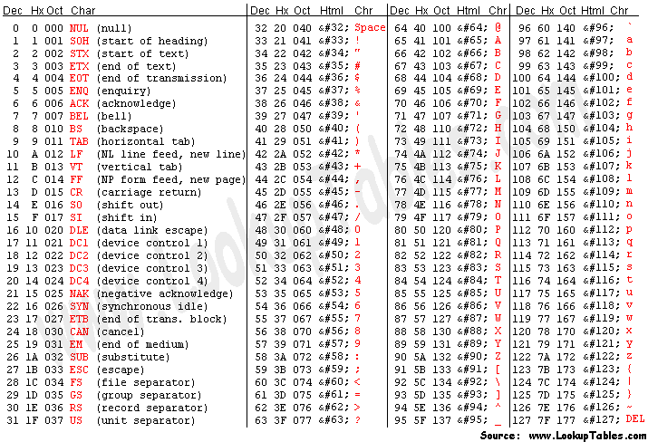

# 以太坊中的数据结构|第 1 集:递归长度前缀(RLP)编码/解码。

> 原文：<https://medium.com/coinmonks/data-structure-in-ethereum-episode-1-recursive-length-prefix-rlp-encoding-decoding-d1016832f919?source=collection_archive---------0----------------------->

Image source: [**www.behance.net**](https://www.behance.net/gallery/36191437/Mini-Machines-02) by [**pixego**](https://www.behance.net/pixego)

有很多论文和博客解释以太坊是如何组织数据的，但是它们看起来都是不连贯的，很难了解全貌。为了帮助你，顺便确认我的理解，本系列将对以太坊中的数据结构问题进行逐一讲解。

> [发现并回顾最佳区块链软件](https://coincodecap.com)

我将把这个主题分成 5 个主要部分和 1 个额外部分(我称之为 1+部分):

1.  递归长度前缀(RLP)编码/解码。和 1+表示十六进制前缀编码。
2.  Trie — Radix 和默克尔。
3.  特里——帕特丽夏。
4.  例子。
5.  状态树修剪。

> 首先，我们要弄清楚 RLP，那么 RLP 在以太坊的目的是什么？

***【递归长度前缀(RLP)***

在计算机科学中，许多复杂的数据形式只能以一种正式格式存储或传输，数据序列化是必要的。因此，RLP 是一种编码/解码算法，可以帮助以太坊序列化数据，并可以快速重建数据。

***RLP 编码***

正如以太坊提到的，RLP 编码函数接收一个项目。项目的定义如下

*   字符串(将被转换为字节数组)是一个项目
*   项目列表是一个项目

例如，以下所有对象都是项目:

*   “狗”
*   []
*   [“狗”]
*   [[]，"狗"，["猫"]，" "]

RLD 编码定义如下:

1.  如果输入的是`[0x00, 0x7f]`范围内的单个字节，那么本身就是 RLP 编码。
2.  如果输入为非值(uint(0)，[]byte{}，string(" ")，空指针…)，RLP 编码为`0x80`。注意`0x00`值字节是**而不是**非值。
3.  如果输入是`[0x80, 0xff]`范围内的特殊字节，RLP 编码会将`0x81`与字节`[0x81, the_byte]`连接起来。
4.  如果输入是一个 2-55 字节长的字符串，RLP 编码由一个值为`0x80`的单字节加上字符串的字节长度以及字符串的十六进制值数组组成。很容易看出第一个字节在`[0x82, 0xb7]`范围内。
    *比如:* `“hello world” = [**0x8b**, 0x68, 0x65, 0x6c, 0x6c, 0x6f, 0x20, 0x77, 0x6f, 0x72, 0x6c, 0x64]` *，因为* `“hello world”` *在 dec 中有* `*11*` *字节或者在 hex 中有* `0x0b` *，所以 RLP 编码的第一个字节是*`0x80 + 0x0b = **0x8b**`**，在这之后我们串接* `“hello word”` *的字节。**
5.  *如果输入的字符串长度超过 55 个字节，RLP 编码从左到右由 3 部分组成。第一部分是单个字节，值为`0xb7`加上第二部分的字节长度。第二部分是字符串长度的十六进制值。最后一个是以字节为单位的字符串。第一个字节的范围是`[0xb8, 0xbf]`。
    *例如:一个字符串有 1024 个“a”字符，所以编码为* `“aaa…” = [**0xb9**, **0x04**, **0x00**, 0x61, 0x61, …]` *。正如我们所看到的，从数组* `0x61` *的第四个元素到最后是以字节为单位的字符串，这是第三部分。第二部分是* `**0x04**, **0x00**` *，它是字符串* `0x0400 = 1024` *的长度。第一部分是* `**0xb9** = 0xb7 + 0x02` *，第二部分的长度是* `0x02` *。**
6.  *如果输入是空数组，RLP 编码是单字节`0xc0`。*
7.  *如果输入是一个总有效载荷长度为 0-55 字节的列表，RLP 编码由一个值为`0xc0`的单字节加上列表的长度，然后是列表中项目的 RLP 编码的串联组成。第一个字节的范围是`[0xc1, 0xf7]`。
    *例如:* `[“hello”, “world”] = [0xcc, 0x85, 0x68, 0x65, 0x6c, 0x6c, 0x6f, 0x85, 0x77, 0x6f, 0x72, 0x6c, 0x64]` *。在这个 RLP 编码中，* `[0x85, 0x68, 0x65, 0x6c, 0x6c, 0x6f]` *是* `“hello”` *的 RLP 编码，* `[0x85, 0x77, 0x6f, 0x72, 0x6c, 0x64]` *是*`“world”`*`0xcc = 0xc0 + 0x0c`*的 RLP 编码，* `0x0c = 0x06 + 0x06` *为总净荷长度。***
8.  **如果输入是总有效载荷长度超过 55 字节的列表，RLP 编码包括 3 个部分。第一个是单个字节，值为`0xf7`加上第二部分的字节长度。第二部分是总有效载荷的长度。最后一部分是列表中项目的 RLP 编码的连接。第一个字节的范围是`[0xf8, 0xff]`。**
9.  **还有一点，wiki 以太坊里没有提到但是 Golang 源代码里有提到。带布尔型，`true = 0x01`和`false = 0x80`。**

*****RLP 解码*****

**当你弄清楚 RLP 编码是如何工作的时候，RLP 解码就容易多了。实际上，RLP 解码只是接收编码输入并解码数据的类型和长度。**

1.  **根据输入的第一个字节，RLP 解码分析数据的类型，实际数据的长度和偏移量。**
2.  **根据数据的类型和偏移量，对数据进行相应的解码。**
3.  **如果可能，继续解码输入的其余部分。**

> **RLP 解码在维基以太坊有完整的解释，我不想浪费我们的时间重复一些不必要的东西。我会把参考资料放在下面。**

****

**When you don’t know something, just skip it by telling that it is easy. Hah.**

*****潜入 RLP*****

> **事实上，以太坊维基已经解释了 RLP 非常容易理解，所以我只是通过我的写作风格提醒他们，我在这篇文章中期望的是潜入 RLP 并获得深入的理解。嗯，又来了*😑。***
> 
> **还有一点，这里所有的想法只是我个人的观点，可能会被误解。所以，你应该重新检查它，说服自己，然后相信它，如果是正确的。**

**正如我从维基以太坊读到的，RLP 只关注字节、字符串和列表。一些额外的数据类型，如大数、布尔型、指针、滑动……是基于我们用来实现 RLP 的编程语言。**

**根据该文件，编码数据的第一个字节决定了数据的类型。**

*   **`[0x00, 0x7f]`:字节**
*   **`[0x80, 0xbf]`:字符串**
*   **`[0xc0, 0xff]`:列表**

****第一个问题**，我们为什么不用固定前缀，而用动态前缀？**

**首先，你可以看到在 RLP 中，有时数据需要一些字节来描述数据的类型和长度，但有时数据本身也显示其类型和长度。**

**主要原因是为了节省内存空间。**

**如果我们尝试使用固定前缀，我们会将它们添加到我们想要编码的每个输入中，在某些情况下，主数据甚至比前缀更短。**

**你可以说它将变得更容易阅读，但它只适用于人类。就计算机而言，它无法区分哪一个更复杂。计算机只是小心地运行代码的计算复杂度，在这种情况下，我很确定 2 个源代码的计算复杂度是一样的。**

**此外，如果它是固定的，那么我们将使用多少字节？我们不确定。所以没必要。**

****第二个问题**，他们为什么选择`0x7f, 0x80, 0xbf, 0xc0`作为检查点？**

**按顺序想想就好了。我们不想使用任何前缀来编码单个字节，因为如果我们像在第一个问题中解释的那样使用固定前缀，存储编码数据将需要两倍(或三倍，或更多)的内存。所以我们需要确定一个范围，在这个范围内，字节由它自己编码。**

****

**ASCII Table.**

**选择`0x7f`可能不是偶然的。ASCII 使用 7 位编码 128 个单个字符，对应`0x7f`。我相信这就是选择`[0x00, 0x7f]`的原因。然而，值为 0x80 的字节的 RLP 编码是什么？
答案是我们加一个前缀，`RLP_encode(0x80) = [0x81, 0x80]`。**

**之后，关于字符串和列表，我们别无选择，必须使用前缀。当他们把剩下的部分分成两半时，这是很明显的。`[0x80, 0xbf]`用于字符串编码，而`[0xc0, 0xff]`用于列表编码。**

****第三个问题**，为什么一定要用一个 range 来描述一个类型而不是 byte 的唯一一个值，我相信 byte 的一个值就够了？**

**是的，一个字节的值足以表示一种类型的数据，但是我们需要知道数据需要多长时间才能得到偏移量。为了做到这一点，如果我们只使用一个字节值来表示数据类型，我们必须添加更多的前缀。**

**现在，你明白我们会遇到两个问题。首先，假设我们对字符串使用`0x80`前缀，对列表使用`0x81`前缀，那么我们浪费了这个字节来存储 2 个值，而它仍然可以做更多的事情。第二，我们似乎试图再次固定前缀(一个字节用于类型，一些字节用于数据长度),正如我在第一个问题中所讨论的，这可能会浪费很多内存。**

**我们选择一个字节范围，不仅对数据类型进行编码，还对数据长度进行编码。**

****第四个问题**，当数据长度超出前缀范围时，我们该怎么办？**

**这是一个可以理解的问题。我们在第一个字节后添加更多的动态前缀来表示数据的长度。例如，对于字符串类型的`[0x80, 0xbf]`范围，根据我们上面所做的策略，我们将这个范围分成两半，一个(`[0x80, 0xb7]`)用于长度在范围内的字符串，另一个(`[0xb8, 0xbf]`)用于长度超出范围的字符串。列表也是如此。**

*****结论*****

**我不确定我上面的解释是否都是正确的，但至少，它给了我们一段关于 RLP 的动机和直觉的知识，所以我们可以部分地理解 RLP 是如何在以太坊工作的。**

*****参考文献*****

**来自维基以太坊的文档:**

** [## 以太坊/维基

### 维基-以太坊维基-

github.com](https://github.com/ethereum/wiki/wiki/RLP) 

RLP 对原始戈兰语码:

 [## 以太坊/围棋以太坊

### 以太坊-以太坊协议的官方 go 实现

github.com](https://github.com/ethereum/go-ethereum/tree/master/rlp) 

我的 github 上的 RLP 带有一些调试行:

 [## sontuphan/debug-geth

### 在 GitHub 上创建一个帐户，为 debug-geth 开发做贡献。

github.com](https://github.com/sontuphan/debug-geth/tree/master/rlp) 

> 加入 Coinmonks [电报频道](https://t.me/coincodecap)和 [Youtube 频道](https://www.youtube.com/c/coinmonks/videos)获取每日[加密新闻](http://coincodecap.com/)

## 另外，阅读

*   [复制交易](/coinmonks/top-10-crypto-copy-trading-platforms-for-beginners-d0c37c7d698c) | [加密税务软件](/coinmonks/crypto-tax-software-ed4b4810e338)
*   [网格交易](https://coincodecap.com/grid-trading) | [加密硬件钱包](/coinmonks/the-best-cryptocurrency-hardware-wallets-of-2020-e28b1c124069)
*   [密码电报信号](http://Top 4 Telegram Channels for Crypto Traders) | [密码交易机器人](/coinmonks/crypto-trading-bot-c2ffce8acb2a)
*   [币安交易机器人](/coinmonks/binance-trading-bots-d0d57bb62c4c) | [OKEx 审查](/coinmonks/okex-review-6b369304110f) | [阿塔尼审查](https://coincodecap.com/atani-review)
*   [最佳加密交易信号电报](/coinmonks/best-crypto-signals-telegram-5785cdbc4b2b) | [MoonXBT 评论](/coinmonks/moonxbt-review-6e4ab26d037)
*   [如何在 Bitbns 上购买柴犬(SHIB)币？](https://coincodecap.com/buy-shiba-bitbns) | [购买 Floki](https://coincodecap.com/buy-floki-inu-token)
*   [CoinFLEX 评论](https://coincodecap.com/coinflex-review) | [AEX 交易所评论](https://coincodecap.com/aex-exchange-review) | [UPbit 评论](https://coincodecap.com/upbit-review)
*   [十大最佳加密货币博客](https://coincodecap.com/best-cryptocurrency-blogs) | [YouHodler 评论](https://coincodecap.com/youhodler-review)
*   [最佳加密交易所](/coinmonks/crypto-exchange-dd2f9d6f3769) | [印度最佳加密交易所](/coinmonks/bitcoin-exchange-in-india-7f1fe79715c9)
*   开发人员的最佳加密 API
*   最佳[密码借贷平台](/coinmonks/top-5-crypto-lending-platforms-in-2020-that-you-need-to-know-a1b675cec3fa)
*   [免费加密信号](/coinmonks/free-crypto-signals-48b25e61a8da) | [加密交易机器人](/coinmonks/crypto-trading-bot-c2ffce8acb2a)
*   [杠杆代币的终极指南](/coinmonks/leveraged-token-3f5257808b22)**